# Agent Architecture — Technical Reference

This document describes the internal architecture and algorithms of the Inqtrix research agent.
It is designed as a working engineering reference: every section maps directly to source code
and contains enough detail to understand, modify, or extend the system deliberately.

> **Module index.** Each section header notes the source file(s) that implement the described concern.
> All paths are relative to `src/inqtrix/`.

---

## Table of Contents

1. [System Overview](#1-system-overview)
2. [Module Dependency Graph](#2-module-dependency-graph)
3. [Public API Layer](#3-public-api-layer)
4. [Configuration System](#4-configuration-system)
5. [Provider Abstractions](#5-provider-abstractions)
6. [Strategy Abstractions](#6-strategy-abstractions)
7. [State Machine and Agent State](#7-state-machine-and-agent-state)
8. [Node 1: CLASSIFY](#8-node-1-classify)
9. [Node 2: PLAN](#9-node-2-plan)
10. [Node 3: SEARCH](#10-node-3-search)
11. [Node 4: EVALUATE](#11-node-4-evaluate)
12. [Node 5: ANSWER](#12-node-5-answer)
13. [Source Tiering](#13-source-tiering)
14. [Claim Extraction and Consolidation](#14-claim-extraction-and-consolidation)
15. [Aspect Derivation and Coverage](#15-aspect-derivation-and-coverage)
16. [Evaluation and Stop Logic](#16-evaluation-and-stop-logic)
17. [Timeout and Error Architecture](#17-timeout-and-error-architecture)
18. [Follow-Ups and Session Reuse](#18-follow-ups-and-session-reuse)
19. [HTTP Server Layer](#19-http-server-layer)
20. [Worked Example](#20-worked-example)
21. [Research Foundations and Related Work](#21-research-foundations-and-related-work)

---

## 1. System Overview

Inqtrix is an iterative research agent that runs a bounded multi-round loop of web search, evidence evaluation, and answer synthesis.

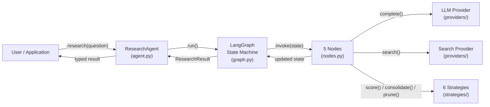

**Core innovation:** Rather than single-pass retrieval + summarisation, the agent implements a bounded multi-round research loop with independent stopping criteria, heuristic aspect coverage tracking, structured claim consolidation, and risk-based model escalation.

### Design Principles

| Principle | Implementation |
|-----------|---------------|
| **Pluggable providers** | Abstract `LLMProvider` and `SearchProvider` classes |
| **Pluggable strategies** | 6 strategy ABCs with default implementations |
| **Declarative graph** | `GraphConfig` dataclass describes topology; `build_graph()` compiles it |
| **Typed results** | Pydantic `ResearchResult` with nested metrics |
| **Lazy initialisation** | `ResearchAgent` creates providers/strategies on first use |
| **Backwards-compatible** | FastAPI server (`server/app.py`) still works alongside library API |

---

## 2. Module Dependency Graph

> Files: all modules

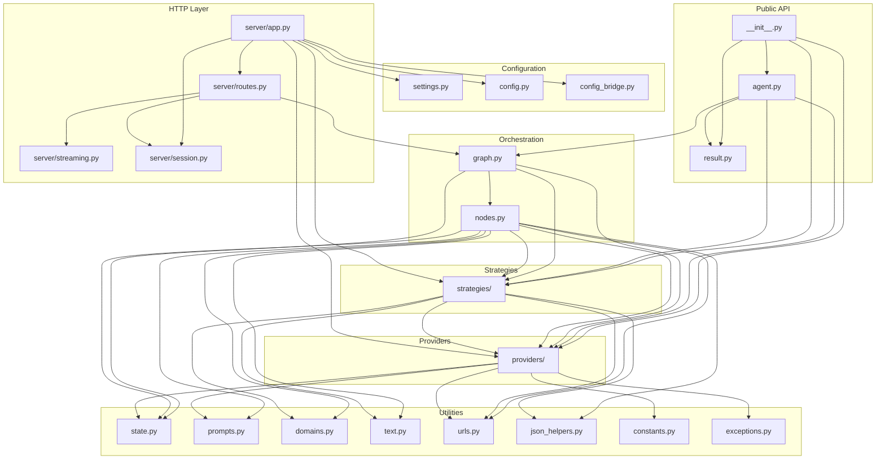

**Key property:** No circular dependencies. The dependency direction flows strictly downward: Public API → Orchestration → Providers/Strategies → Utilities.

---

## 3. Public API Layer

> Files: `agent.py`, `result.py`, `__init__.py`

### ResearchAgent

The main entry point. Wraps the internal `graph.run()` machinery behind a clean interface.

```python
from inqtrix import ResearchAgent, AgentConfig

agent = ResearchAgent(AgentConfig(max_rounds=3))
result = agent.research("Question")
```

**Lifecycle:**

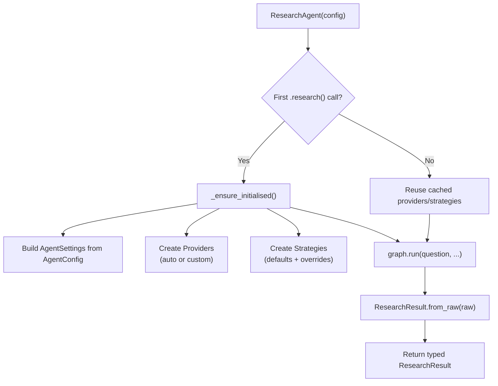

### AgentConfig

Pydantic `BaseModel` with all `ResearchAgent`-relevant configuration fields. It covers agent behaviour, model selection, timeouts, cache settings, and provider connection settings. Server-only deployment settings remain in `ServerSettings` / the HTTP layer. Accepts custom provider and strategy objects directly:

```python
AgentConfig(
    llm=MyCustomLLM(),           # Optional: custom LLM
    search=BingSearch(),         # Optional: custom search
    stop_criteria=FastStop(),    # Optional: custom strategy
    max_rounds=2,                # Behaviour tuning
    reasoning_model="gpt-4o",   # Model selection
)
```

Fields set to `None` (providers, strategies) are auto-created from defaults on first use.

### ResearchResult

Pydantic model returned by `agent.research()`:

| Field | Type | Description |
|-------|------|-------------|
| `answer` | `str` | Markdown-formatted answer |
| `metrics` | `ResearchMetrics` | Aggregated quality + performance metrics |
| `top_sources` | `list[Source]` | Cited sources with quality tiers |
| `top_claims` | `list[Claim]` | Key claims with verification, evidence counts, primary-need flag, and source-tier breakdown |

`ResearchResult.from_raw()` bridges the internal state-dict world to typed Pydantic models.
`ResearchResult.to_export_payload()` projects that same public model into optional downstream views such as parity/test artifacts without introducing parallel result schemas.

---

## 4. Configuration System

> Files: `settings.py`, `config.py`, `config_bridge.py`

The runtime path depends first on whether you use the library API or the HTTP server:

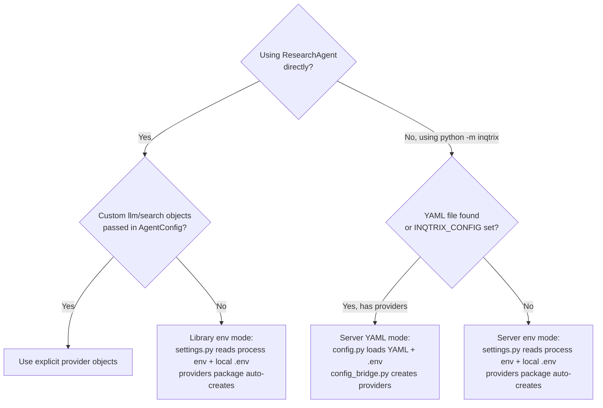

Practical implications:

- `ResearchAgent()` in library mode auto-loads process env vars and a local `.env` via Pydantic Settings.
- `ResearchAgent()` does **not** auto-load `inqtrix.yaml`.
- In library mode, explicit scalar fields in `AgentConfig` override env-derived defaults when providers are auto-created.
- YAML can still be used in library mode, but only by manually bridging through `load_config()`, `config_to_settings()`, and `create_providers_from_config()` before constructing `ResearchAgent`.
- The HTTP server entry point is `python -m inqtrix`; no user-provided `main.py` is required.
- In server mode, `load_config()` checks `INQTRIX_CONFIG` first and otherwise auto-discovers `inqtrix.yaml`, `inqtrix.yml`, or `.inqtrix.yaml` in the current working directory.

### Settings Hierarchy

```
Settings (root)
├── ModelSettings       — model names + effective fallback-to-reasoning accessors
├── AgentSettings       — max_rounds, confidence_stop, timeouts, ...
└── ServerSettings      — litellm_base_url, session_ttl, max_concurrent
```

All fields have Pydantic `Field(alias="ENV_VAR_NAME")` for direct env-var resolution.
Process environment variables take precedence over `.env` values.

### YAML Config

Environment variables are resolved *after* YAML parsing via `${VAR}` syntax:

```yaml
providers:
  openai:
    base_url: "https://api.openai.com/v1"
    api_key: "${OPENAI_API_KEY}"    # Resolved at load time
```

A typical server-side role mapping looks like this:

```yaml
models:
    strong:
        provider: openai
        model_id: "gpt-4o"

    small:
        provider: openai
        model_id: "gpt-4o-mini"

    web:
        provider: perplexity
        model_id: "sonar-pro"

agents:
    default:
        roles:
            reasoning: strong
            classify: small
            summarize: small
            evaluate: small
            search: web
```

Role semantics in the default pipeline:

- `reasoning` — query planning and final answer synthesis
- `classify` — classify + decompose; may escalate to `reasoning` for high-risk questions
- `summarize` — parallel summarization and claim extraction
- `evaluate` — sufficiency evaluation; may escalate to `reasoning` for high-risk questions
- `search` — web search provider/model

If `classify`, `summarize`, or `evaluate` are omitted, they fall back to `reasoning` through `effective_*` accessors in `ModelSettings`.

The optional YAML `fallbacks:` block is part of the schema and is validated, but it is not currently consumed as a runtime retry chain.

The `config_bridge.py` module contains `ModelResolver` (per-model client pooling) and `MultiClientLLMProvider` (routes LLM calls to the correct client based on model name).

---

## 5. Provider Abstractions

> Package: `providers/`

### LLMProvider ABC

```python
class LLMProvider(ABC):
    def complete(self, prompt, *, system=None, model=None,
                 timeout=120.0, state=None, deadline=None) -> str: ...
    def summarize_parallel(self, text, deadline=None) -> tuple[str, int, int]: ...
    def is_available(self) -> bool: ...
```

**Default:** `LiteLLMProvider` — uses any OpenAI-compatible endpoint via the `openai` Python SDK.

### SearchProvider ABC

```python
class SearchProvider(ABC):
    def search(self, query, *, search_context_size="high",
               recency_filter=None, language_filter=None,
               domain_filter=None, search_mode=None,
               return_related=False, deadline=None) -> dict: ...
    def is_available(self) -> bool: ...
```

**Return dict keys:** `answer`, `citations`, `related_questions`, `_prompt_tokens`, `_completion_tokens`.

**Default:** `PerplexitySearch` — calls Perplexity Sonar Pro with TTL-based LRU cache (SHA-256 cache key, default 256 entries, 1h TTL).

### ProviderContext

Frozen dataclass bundling the active providers:

```python
@dataclass(frozen=True)
class ProviderContext:
    llm: LLMProvider
    search: SearchProvider
```

Passed to every node via dependency injection (see [Section 7](#7-state-machine-and-agent-state)).

---

## 6. Strategy Abstractions

> Package: `strategies/`

Six pluggable strategies, each encapsulating a single algorithmic concern:

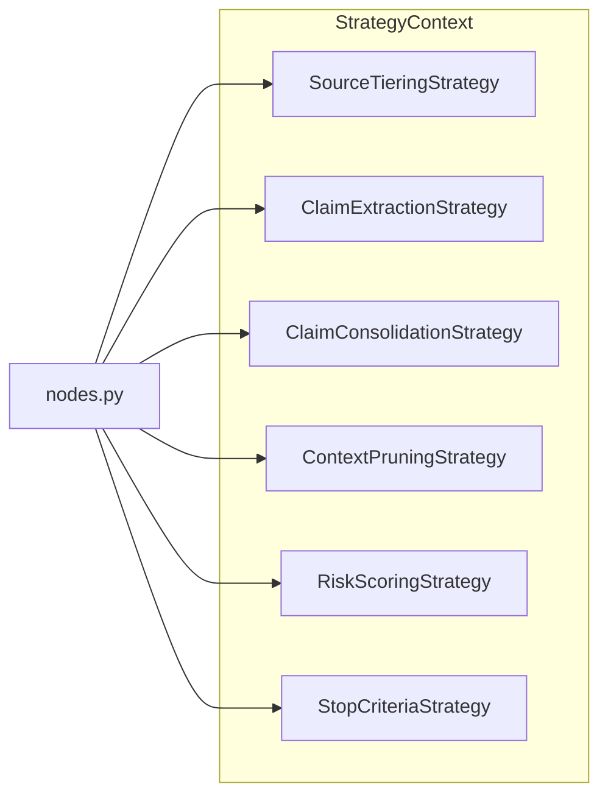

| ABC | Methods | Default | Used By |
|-----|---------|---------|---------|
| `SourceTieringStrategy` | `tier_for_url()`, `quality_from_urls()` | `DefaultSourceTiering` | search, evaluate |
| `ClaimExtractionStrategy` | `extract()` | `LLMClaimExtractor` | search |
| `ClaimConsolidationStrategy` | `consolidate()`, `materialize()`, `select_answer_citations()` | `DefaultClaimConsolidator` | search, evaluate, answer |
| `ContextPruningStrategy` | `prune()` | `RelevanceBasedPruning` | search |
| `RiskScoringStrategy` | `score()`, `derive_required_aspects()`, `estimate_aspect_coverage()`, `inject_quality_site_queries()` | `KeywordRiskScorer` | classify, plan, search |
| `StopCriteriaStrategy` | 10 methods (check_contradictions, check_stagnation, ...) | `MultiSignalStopCriteria` | evaluate |

### StrategyContext

```python
@dataclass
class StrategyContext:
    source_tiering: SourceTieringStrategy
    claim_extraction: ClaimExtractionStrategy
    claim_consolidation: ClaimConsolidationStrategy
    context_pruning: ContextPruningStrategy
    risk_scoring: RiskScoringStrategy
    stop_criteria: StopCriteriaStrategy
```

Created via `create_default_strategies(settings)` or manually composed in `AgentConfig`.

---

## 7. State Machine and Agent State

> Files: `graph.py`, `state.py`

### Graph Topology

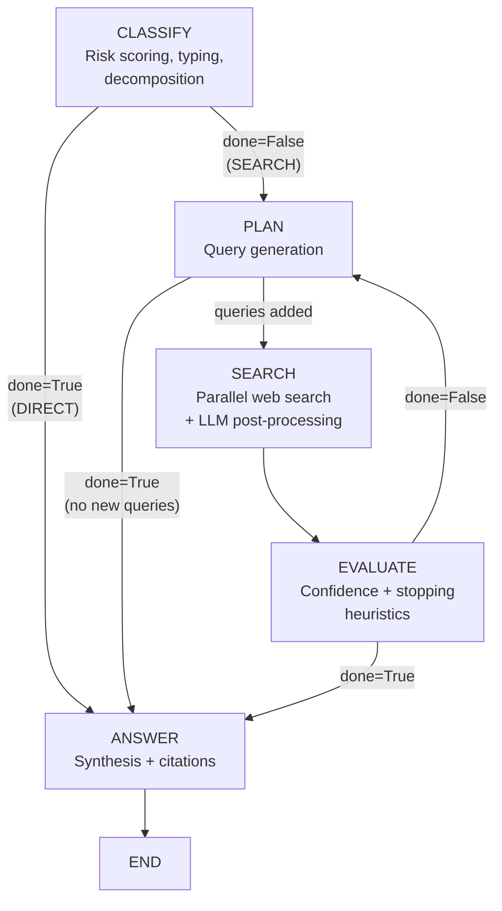

**Key insight:** The loop always goes `EVALUATE -> PLAN`, never directly to SEARCH. This allows planning to adapt based on evaluation findings (e.g., inject disambiguation queries if competing events found).

### Node Wiring

Nodes are plain functions with dependency injection:

```python
def classify(s: dict, *, providers: ProviderContext,
             strategies: StrategyContext, settings: AgentSettings) -> dict:
```

`graph.py` uses `functools.partial` to bind providers/strategies/settings, producing the `(state) -> state` signature that LangGraph expects. The compiled graph is cached per `(providers, strategies, settings)` identity.

### AgentState

`TypedDict` with 48 fields across these categories:

| Category | Fields | Example |
|----------|--------|---------|
| **Input** | `question`, `history` | User question |
| **Classification** | `language`, `search_language`, `recency`, `query_type`, `sub_questions` | `"de"`, `"news"` |
| **Research** | `context`, `queries`, `all_citations`, `related_questions` | Context blocks |
| **Claims** | `claim_ledger`, `consolidated_claims`, `claim_status_counts` | Verified/contested |
| **Aspects** | `required_aspects`, `uncovered_aspects`, `aspect_coverage` | Completeness |
| **Quality** | `source_tier_counts`, `source_quality_score`, `evidence_consistency` | Metrics |
| **Control** | `round`, `done`, `final_confidence`, `gaps`, `falsification_triggered` | Loop state |
| **Follow-up** | `_is_followup`, `_prev_question`, `_prev_answer` | Session context |
| **Tokens** | `total_prompt_tokens`, `total_completion_tokens` | Usage tracking |

---

## 8. Node 1: CLASSIFY

> File: `nodes.py`, function `classify()`

**Purpose:** Analyse the question, decide if web search is needed, detect language, decompose into sub-questions.

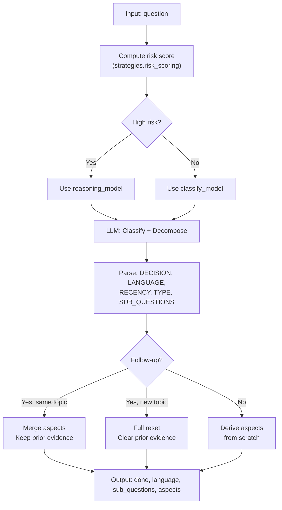

### Risk Scoring

Deterministic, regex-based (no LLM involved):

```
risk(q) = 2*I_policy + I_recency + I_numeric + I_normative + I_long
```

| Family | Points | Triggers |
|--------|--------|----------|
| Policy/Regulation | +2 | `gesetz*`, `recht*`, `verordnung*`, `regulier*`, `politik*`, `koalition*`, `gkv`, `beitrag*`, `haushalt*`, `privatis*` |
| Recency | +1 | `aktuell`, `heute`, `neueste`, `zuletzt`, `diskussion`, `trend`, `ausblick`, `prognose` |
| Numeric | +1 | `prozent`, `mrd`, `mio`, `euro`, or any digit sequence (`\d+[%€]?`) |
| Normative | +1 | `soll`, `sollen`, `geplant`, `durchsetzbar`, `realistisch` |
| Long question | +1 | > 220 characters |

**Escalation:** If `risk_score >= threshold` (default 4), the classify and evaluate nodes use the stronger reasoning model instead of lighter dedicated models. The score is capped at `min(score, 10)`.

### Academic Keyword Override

If the LLM doesn't classify as academic but the text contains keywords like `paper`, `studie`, `preprint`, `doi`, `arxiv`, `peer-review`, the type is forced to `"academic"`.

---

## 9. Node 2: PLAN

> File: `nodes.py`, function `plan()`

**Purpose:** Generate search queries for the next research round, adapting based on gaps and prior findings.

### Query Count

| Round | Count | Rationale |
|-------|-------|-----------|
| 0 (first) | 5-6 | Broad exploration |
| 1+ | 2-3 | Targeted gap-filling |

### Adaptive Strategies

The plan node conditionally injects prompt instructions based on round number, confidence, and state flags. All strategies listed below are additive — multiple can activate simultaneously.

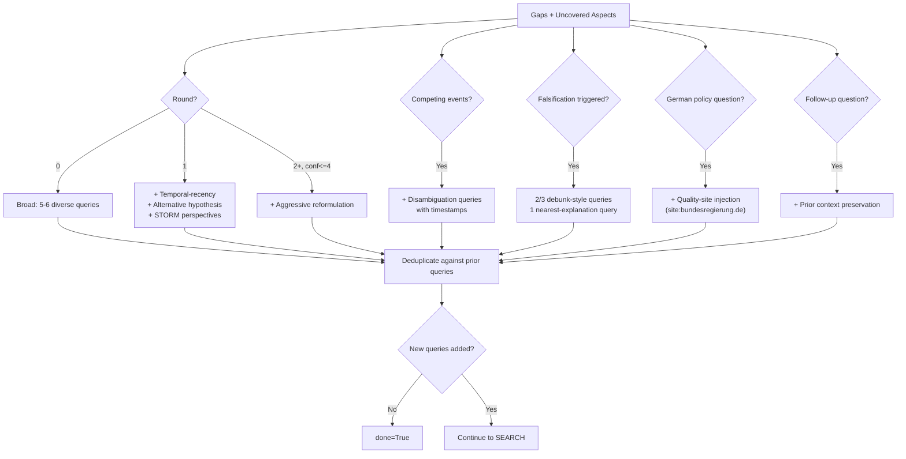

| Strategy | Trigger Condition | Effect |
|----------|-------------------|--------|
| Base diverse queries | Always | 5-6 queries (round 0) or 2-3 queries (round 1+) |
| Temporal-recency | `round == 1` | Forces at least one query to search for the most current matching event |
| Alternative hypothesis | `round == 1` | Forces one query to explore counter-arguments |
| STORM perspective diversity | `round > 0` | Adds instruction to query from multiple stakeholder viewpoints |
| Aggressive reformulation | `round >= 2` AND `conf <= 4` | Completely rephrase using different terminology and framing |
| Competing events disambiguation | `competing_events` is set | Adds comparison instruction with timestamps to differentiate confusions |
| Falsification mode | `falsification_triggered` | 2/3 queries actively seek to disprove the premise; 1 query searches for the actual fact |
| Quality-site injection | German policy question detected | `site:` queries for primary and mainstream German sources |
| Follow-up context | `_prev_question` exists | Preserves prior research context in the prompt |
| Perspective rotation | Round-dependent | Different rounds emphasise different stakeholder angles |

### Quality-Site Injection

For German policy questions (detected via regex: `privatis*|gkv|krankenkass*|gesetz*|verordnung*|beitrag*|kosten|haushalt*`), the plan node injects `site:`-prefixed queries:

- **Primary sources:** `bundesgesundheitsministerium.de`, `bundesregierung.de`, `bundestag.de`, `gkv-spitzenverband.de`, `gesetze-im-internet.de` — injected if `round == 0` OR no primary sources found yet OR claims needing primary verification remain unverified
- **Mainstream sources:** `aerzteblatt.de`, `deutschlandfunk.de`, `zdfheute.de`, `spiegel.de`, `handelsblatt.com`, `tagesschau.de` — injected if `round == 0` OR no mainstream sources found yet OR `claim_quality_score < 0.35`

Query terms are extracted via `quality_terms_for_question()`, which filters out generic terms (`soll`, `werden`, `aktuell`, `diskussion`, ...) and keeps up to 7 domain-specific tokens. Special domain terms are injected for dental (`zahnbehandlung`) and privatisation (`privatisierung`) topics; the `gkv` shorthand is only injected for health-policy questions instead of unrelated German policy topics.

---

## 10. Node 3: SEARCH

> File: `nodes.py`, function `search()`

**Purpose:** Execute search queries in parallel, summarise results, extract claims, assemble context.

### Three-Phase Pipeline

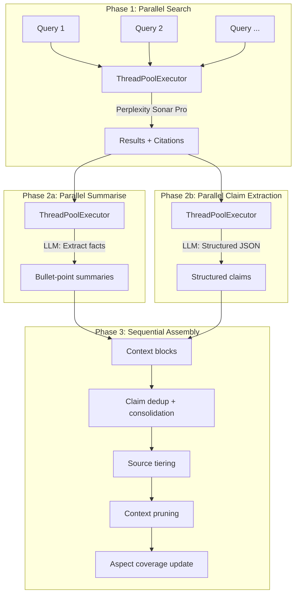

### Search Parameters

Each Perplexity call uses:

| Parameter | Value | Source |
|-----------|-------|--------|
| `search_context_size` | `"high"` | Maximum depth |
| `recency_filter` | from classify | `"day"`, `"week"`, `"month"` |
| `language_filter` | from classify | `["de"]`, `["en"]` |
| `domain_filter` | computed per query | Blocklist low-quality or allowlist `site:` domain |
| `search_mode` | `"academic"` if applicable | For scholarly sources |
| `return_related` | `True` on round 0 | Seeds future queries |

### Domain Filter Logic

- Query contains `site:domain` -> allowlist only that domain
- Otherwise -> blocklist domains from `LOW_QUALITY_DOMAINS` (pinterest, reddit, medium, gutefrage, etc.)

### Search Caching

SHA-256 of `query + params`, TTL 1 hour, max 256 entries. Thread-safe via lock.

### Claim Ledger Cap

The claim ledger grows across rounds. To keep prompt size and RAM stable, it is capped at **400 entries** during research — if exceeded, only the most recent 400 are retained. Per-session storage uses a tighter cap of 50 entries (configurable via `SESSION_MAX_CLAIM_LEDGER`).

---

## 11. Node 4: EVALUATE

> File: `nodes.py`, function `evaluate()`

**Purpose:** Score evidence quality, check stopping criteria, decide if the research loop should continue.

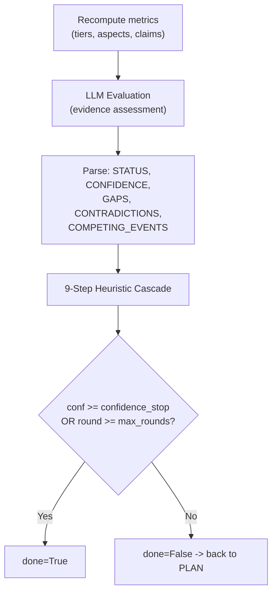

The 9-step heuristic cascade is detailed in [Section 16](#16-evaluation-and-stop-logic).

---

## 12. Node 5: ANSWER

> File: `nodes.py`, function `answer()`

**Purpose:** Synthesise the final answer with citations from accumulated evidence.

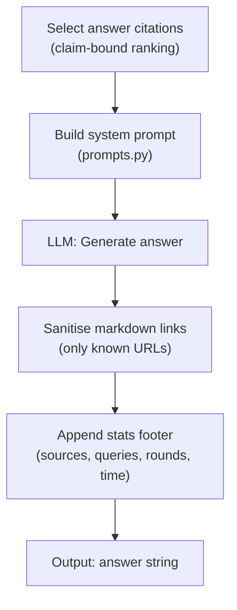

### Citation Selection

1. **Primary:** verified claims with high-tier sources (primary > mainstream > stakeholder)
2. **Secondary:** contested claims (still informative)
3. **Tertiary:** unverified claims from quality sources
4. **Fallback:** if < 15 claim-bound citations, use raw `all_citations` list

Capped at `ANSWER_PROMPT_CITATIONS_MAX` (default 60).

### Answer Format (German)

The system prompt instructs the LLM to produce:

- **Kurzfazit** — Executive summary (2-3 sentences)
- **Kernaussagen** — 5-8 bullet points with citations
- **Detailanalyse** — Subsections with evidence
- **Einordnung / Ausblick** — Context and outlook

Length target: 600-1200 words. Markdown links must reference collected citations only; others are stripped.

---

## 13. Source Tiering

> Files: `strategies/_source_tiering.py` (`DefaultSourceTiering`), `domains.py`

### Tier Classification

| Tier | Weight | Examples |
|------|--------|----------|
| **primary** | 1.0 | `bundesregierung.de`, `bundestag.de`, `ec.europa.eu`, `who.int`, `oecd.org` |
| **mainstream** | 0.8 | `spiegel.de`, `tagesschau.de`, `reuters.com`, `nature.com`, `arxiv.org` |
| **stakeholder** | 0.45 | `kzbv.de`, `vdek.com`, `spd.de`, `gruene.de` (parties, associations) |
| **unknown** | 0.35 | Unrecognised domains |
| **low** | 0.1 | `pinterest.com`, `reddit.com`, `medium.com`, `gutefrage.net` |

### Quality Score

```
q_source = sum(weight[tier(url)] for url in citations) / len(citations)
```

Range: 0.1 (all low) to 1.0 (all primary).

---

## 14. Claim Extraction and Consolidation

> Files: `strategies/_claim_extraction.py` (`LLMClaimExtractor`), `strategies/_claim_consolidation.py` (`DefaultClaimConsolidator`)

### Claim Lifecycle

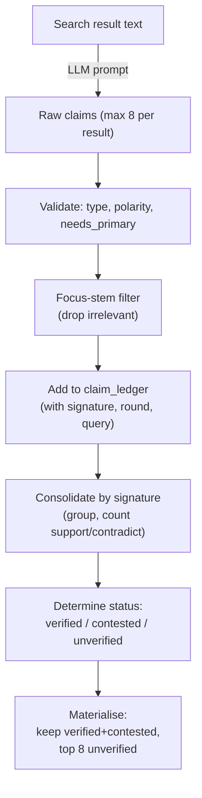

### Claim Schema

```json
{
  "claim_text": "Precise, atomic statement",
  "claim_type": "fact | actor_claim | forecast",
  "polarity": "affirmed | negated",
  "needs_primary": true,
  "source_urls": ["https://..."],
  "published_date": "YYYY-MM-DD or unknown"
}
```

### Signature-Based Deduplication

1. Tokenise claim text via regex (`[a-zA-Z0-9äöüÄÖÜß]+`, lowercase)
2. Remove tokens shorter than 3 characters
3. Remove negation tokens (`kein`, `keine`, `keinen`, `keinem`, `keiner`, `nicht`, `ohne`, `no`, `not`, `never`, `none`, `without`)
4. Remove German/English stopwords (75 unique words)
5. Fallback: if all tokens removed, keep tokens minus negations only
6. Keep first 16 tokens in order, join with spaces -> signature string

Claims with the same signature but different polarity -> detect conflict -> status = `contested`.

### Claim Ledger Cap

The claim ledger grows across rounds. To keep prompt and RAM stable, it is capped at **400 entries** — if exceeded, only the most recent 400 are retained. Per-session storage caps it further at 50 entries (configurable).

### Status Determination

| Condition | Status |
|-----------|--------|
| support > 0 AND contradict > 0 | `contested` |
| needs_primary AND no primary source | `unverified` |
| support >= 2 AND (primary OR mainstream OR stakeholder) | `verified` |
| support >= 1 AND (primary OR mainstream) | `verified` |
| Otherwise | `unverified` |

### Claim Quality Score

```
q_claim = (|verified| + 0.5 * |contested|) / |total|
```

---

## 15. Aspect Derivation and Coverage

> File: `strategies/_risk_scoring.py` (`KeywordRiskScorer`)

### Aspect Generation

Derived once by the classify node from question text and query type:

| Trigger | Aspects |
|---------|---------|
| Type = news/general | Status quo with date, Actor positions, Discussion direction |
| Policy keywords | Political feasibility, Proposal vs enacted distinction |
| Numeric keywords | Numbers with primary source or uncertainty |
| Type = academic | Primary publication + core claim, Methods & limitations |

Maximum 6 aspects; deduplication preserves order.

### Coverage Estimation

After each search round, `estimate_aspect_coverage()` re-evaluates coverage using a regex-based token matching approach (no LLM involved):

1. Extract tokens from each aspect (> 3 chars)
2. Augment with hard-coded domain-specific synonyms:

| Aspect contains | Added synonym tokens |
|-----------------|---------------------|
| "status quo" | `status`, `stand`, `aktuell`, `derzeit` |
| "datum" | `datum`, `stand`, `heute` |
| "position" + "akteur" | `regierung`, `partei`, `verband`, `akteur` |
| "richtung" OR "diskussion" | `trend`, `debatte`, `diskussion`, `entwicklung` |
| "mehrheitslage" OR "umsetzbarkeit" | `mehrheit`, `mehrheitsfaehig`, `durchsetzbar`, `umsetzbar` |

3. Check if any augmented token appears in accumulated context text
4. Aspect is covered if any token matches; uncovered if zero hits
5. Coverage ratio = `aspects_covered / total_aspects` (rounded to 3 decimals)

**Important:** Uncovered aspects block confidence at 8 (guardrail cap in evaluate node) and generate targeted queries in subsequent plan rounds.

---

## 16. Evaluation and Stop Logic

> Files: `strategies/_stop_criteria.py` (`MultiSignalStopCriteria`), `nodes.py` (`evaluate()`)

### Heuristic Cascade

Applied in exact order after the LLM evaluation. The heuristics are **not** a single linear pipeline — they are grouped into three phases with confidence threading between them.

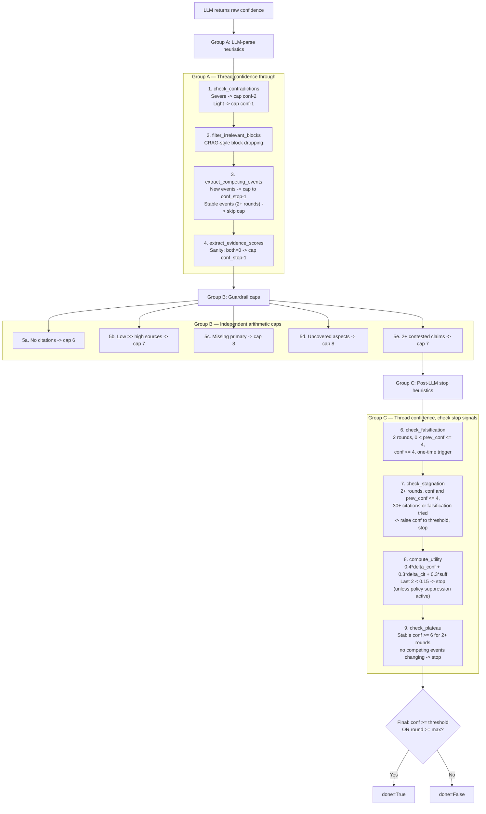

### Key Heuristic Details

**Competing events suppression:** If competing events stay unchanged into round 3+ (same text as the previous round), the confidence cap is skipped. This prevents thrashing on the same competing explanations while still forcing at least one explicit disambiguation round.

**Falsification trigger conditions:** All must be true: `round >= 2`, `0 < prev_conf` (at least one prior round), `prev_conf <= 4`, `conf <= 4`, and NOT already triggered. The flag is set once and never re-triggers — subsequent plan rounds generate debunk-style queries.

**Negative evidence hinting:** Injected into the evaluate prompt when `round >= 2`. If additionally `prev_conf > 0` and `prev_conf <= 4`, a stronger hint is added: after N rounds with 30+ citations and conf still <= 4, absence of evidence is treated as a strong signal the premise is false (suggest confidence 7-9).

**Utility suppression for policy questions:** `should_suppress_utility_stop()` prevents utility-based stopping when the question matches the policy regex AND any of these hold:
- Uncovered aspects remain
- Claims needing primary sources lack primary verification
- No quality sources found AND (unverified > verified OR claim quality < 0.35)

This ensures policy-critical questions are not prematurely abandoned due to low marginal utility.

### Stopping Rules Summary

| Rule | Condition | Effect |
|------|-----------|--------|
| **Confidence** | `conf >= confidence_stop` (default 8) | Stop |
| **Max rounds** | `round >= max_rounds` (default 4) | Stop |
| **Contradictions** | Severe conflicting sources | Cap conf by -1 or -2 |
| **Competing events** | Multiple explanations (new) | Cap to threshold-1, disambiguate |
| **Falsification** | 2+ rounds, `prev_conf` and `conf` both <= 4, one-time | Switch to debunk-style queries |
| **Stagnation** | No improvement + broad search done (30+ citations) | Raise conf to threshold, stop |
| **Utility plateau** | Last 2 rounds both utility < 0.15 | Stop (unless policy suppression) |
| **Confidence plateau** | Same conf >= 6 for 2+ rounds, no competing events changing | Stop |
| **Negative evidence** | Round >= 2, searched broadly, found little | Prompt hint: infer absence as evidence |

### StopCriteriaStrategy ABC — Full Method List

| Method | Signature | Returns |
|--------|-----------|---------|
| `check_contradictions` | `(s, eval_text, conf) -> int` | Modified confidence |
| `filter_irrelevant_blocks` | `(s, eval_text) -> None` | Modifies state in-place |
| `extract_competing_events` | `(s, eval_text, conf) -> int` | Modified confidence |
| `extract_evidence_scores` | `(s, eval_text, conf) -> int` | Modified confidence |
| `check_falsification` | `(s, conf, prev_conf) -> bool` | Triggered flag |
| `check_stagnation` | `(s, conf, prev_conf, n_citations, falsification_just_triggered) -> tuple[int, bool]` | (conf, detected) |
| `should_suppress_utility_stop` | `(s) -> bool` | Suppress flag |
| `compute_utility` | `(s, conf, prev_conf, n_citations) -> tuple[float, bool]` | (utility, stop) |
| `check_plateau` | `(s, conf, prev_conf, stagnation_detected) -> bool` | Stop flag |
| `should_stop` | `(state) -> tuple[bool, str]` | (stop, reason) |

---

## 17. Timeout and Error Architecture

> Files: `providers/base.py`, `providers/*`, `exceptions.py`

### Deadline Model

```
Global: deadline = time.monotonic() + MAX_TOTAL_SECONDS (300s)
Per-call: min(default_timeout, remaining_until_deadline)
```

| Layer | Timeout | Default |
|-------|---------|---------|
| Agent total | `MAX_TOTAL_SECONDS` | 300s |
| LLM reasoning | `REASONING_TIMEOUT` | 120s |
| Perplexity search | `SEARCH_TIMEOUT` | 60s |
| Summarise / claims | `SUMMARIZE_TIMEOUT` | 60s |

### Exception Types

| Exception | Trigger | Behaviour |
|-----------|---------|-----------|
| `AgentTimeout` | `time.monotonic() > deadline` | Graceful: answer with accumulated context |
| `AgentRateLimited` | 429 or daily token limit | Immediate abort with partial token counts |

### Graceful Degradation

- **classify fails:** fallback to heuristic type inference, use question as single sub-question
- **plan fails:** fallback to `[question]` as single query
- **search fails:** skip failed queries, continue with others
- **claim extraction fails for a source:** keep the search result and summary, but continue without structured claims for that source
- **evaluate fails:** keep previous confidence, conservative gaps
- **answer fails:** return raw context without synthesis

---

## 18. Follow-Ups and Session Reuse

> Files: `server/session.py`, `state.py`

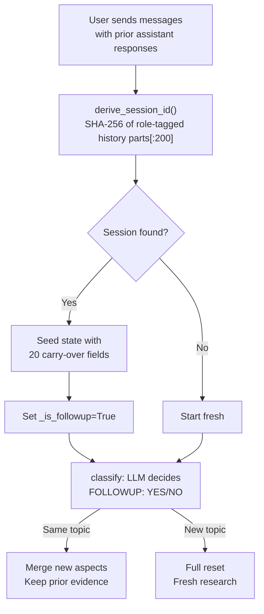

### Session Storage

- **Storage:** In-memory dict with threading lock
- **TTL:** 30 minutes (configurable)
- **Max sessions:** 20 (LRU eviction)
- **Carry-over fields:** 20 fields including citations, context, claims, aspects, quality metrics
- **Capped per session:** max 8 context blocks, max 50 claim ledger entries

### Session ID

```python
SHA-256("|".join(f"{role}:{content[:200]}" for each user/assistant message))[:24]
```

The hash is truncated to **24 hex characters**. Role-tagged user and assistant messages are joined with a `|` separator before hashing, and the current question is excluded when deriving the lookup ID for a follow-up turn.

The `prospective_session_id()` function computes the ID *including* the current answer, enabling save-before-response-complete.

---

## 19. HTTP Server Layer

> Files: `server/app.py`, `server/routes.py`, `server/streaming.py`

The HTTP server is an **optional layer** on top of the library core. It provides an OpenAI-compatible API.

Startup path:

- Entry point: `python -m inqtrix` via `__main__.py`
- No separate application `main.py` is required
- `create_app()` tries YAML mode first and falls back to env-only mode when no YAML config with providers is found

### Endpoints

| Route | Method | Purpose |
|-------|--------|---------|
| `/health` | GET | Health check |
| `/v1/models` | GET | List available models (`research-agent`) |
| `/v1/chat/completions` | POST | Main research endpoint (streaming + non-streaming) |
| `/v1/test/run` | POST | Structured test endpoint (TESTING_MODE only) |

### Streaming

SSE (Server-Sent Events) in OpenAI-compatible format:

1. Progress chunks: `> Research Step: ...`
2. Separator: `---`
3. Answer: word-by-word streaming
4. `data: [DONE]`

### Concurrency

Async semaphore (default max 3 concurrent agent runs). Returns HTTP 429 if all slots busy.

---

## 20. Worked Example

This is an illustrative walkthrough that matches the current heuristics and control flow. Each step lists the sub-methods called in order and shows illustrative LLM outputs.

### Question

```text
Sollen zahnaerztliche Leistungen privatisiert werden, wie laeuft aktuell die Diskussion und was wuerde das fuer den GKV-Beitrag bedeuten?
```

### Step 1: `classify()` — Risk scoring, classification, aspect derivation

**Method call sequence:**

1. `emit_progress(s, "Analysiere Frage...")` — stream progress
2. `strategies.risk_scoring.score(question)` — keyword regex scoring

Possible score breakdown:

- `privatisiert` or `GKV-Beitrag` -> `+2` policy/regulation branch
- `aktuell` -> `+1` recency branch
- `sollen` -> `+1` normative branch

```text
risk_score = 4
high_risk = true    (>= HIGH_RISK_SCORE_THRESHOLD)
```

3. `providers.llm.complete(prompt, ...)` — single LLM call for classification + decomposition. Model is `reasoning_model` because `high_risk=true` and `HIGH_RISK_CLASSIFY_ESCALATE=true`.

Illustrative LLM output parsed:

```json
{
  "decision": "SEARCH",
  "language": "de",
  "search_language": "de",
  "recency": "month",
  "query_type": "general"
}
```

4. `parse_json_string_list(sub_q_text, max_items=3)` — parse SUB_QUESTIONS JSON array from LLM output

```json
[
  "Wie ist der aktuelle politische Status von Vorschlaegen zur Privatisierung zahnaerztlicher Leistungen?",
  "Welche Akteure unterstuetzen oder kritisieren den Vorschlag?",
  "Welche belastbaren Hinweise gibt es auf Auswirkungen fuer den GKV-Beitrag?"
]
```

5. `strategies.risk_scoring.derive_required_aspects(question, query_type)` — produces the mandatory answer checklist

Illustrative aspects:

```json
[
  "Aktueller Stand: Gesetzgebung oder Beschluesse",
  "Positionen relevanter Akteure",
  "Quantitative Auswirkung auf den GKV-Beitrag",
  "Zeitlicher Rahmen und politischer Kontext",
  "Wissenschaftliche oder fachliche Einordnung",
  "Zahlenbasis mit Primaerbeleg oder expliziter Unsicherheit"
]
```

6. `append_iteration_log(s, {...})` — record metrics (testing mode)

**State written:** `risk_score=4`, `high_risk=true`, `done=false`, `language="de"`, `search_language="de"`, `recency="month"`, `query_type="general"`, `sub_questions=[...]`, `required_aspects=[...]`, `uncovered_aspects=[...]`, `aspect_coverage=0.0`

### Step 2: `plan()` — Query generation

**Method call sequence:**

1. `emit_progress(s, "Plane Suchanfragen (Runde 1/4)...")` — stream progress
2. `_check_deadline(s["deadline"])` — deadline guard
3. `providers.llm.complete(prompt, ...)` — generate search queries. Since `round == 0`, the prompt requests "5-6 diverse queries" covering all sub-questions. The prompt includes the required aspects and sub-questions.
4. `parse_json_string_list(q, max_items=FIRST_ROUND_QUERIES)` — parse JSON query array (max 6 for round 0)

Illustrative parsed queries:

```json
[
  "privatisierung zahnaerztliche leistungen gkv aktuelle diskussion",
  "zahnaerztliche leistungen privatisierung positionen parteien verbaende",
  "gkv beitrag auswirkung privatisierung zahnaerztliche leistungen",
  "aktueller status reform zahnaerztliche leistungen gesetz krankenkasse"
]
```

5. Policy detection: regex `\b(privatis\w*|gkv|krankenkass\w*|gesetz\w*|...)\b` matches -> `is_policyish=True`
6. `strategies.risk_scoring.inject_quality_site_queries(new_q, ...)` — because question is German policy:
   - calls `quality_terms_for_question(question, query_type)` which filters out generic terms
   - adds e.g. `"site:bundesgesundheitsministerium.de zahnarzt privat gkv"` and `"site:tagesschau.de zahnarzt privatisierung gkv diskussion"`
7. Deduplication against `s["queries"]` — remove already-searched queries
8. `append_iteration_log(s, {...})` — record metrics

**State written:** `queries` (appended with 6 unique queries)

### Step 3: `search()` — Parallel search, summarise, claim extraction

**Method call sequence:**

1. `emit_progress(s, "Durchsuche 6 Quellen...")` — stream progress
2. `_check_deadline(s["deadline"])` — deadline guard

**Phase 1 — Parallel Perplexity calls:**

3. `providers.search.search(q, ...)` x 6 in parallel via `ThreadPoolExecutor` — each call:
   - checks search cache (keyed by SHA-256 of query + params) for cached response
   - calls domain filter logic: site: queries get allowlist, normal queries get `LOW_QUALITY_DOMAINS` blocklist
   - sends request to Perplexity Sonar via search provider
   - since `round == 0`, sets `return_related=True`

**Phase 2 — Parallel LLM post-processing:**

4. `providers.llm.summarize_parallel(text, deadline)` x M in parallel — one per result with non-empty answer. Returns bullet-point summary.
5. `strategies.claim_extraction.extract(text, citations, question, deadline)` x M in parallel — structured claim extraction:
   - parses JSON claims from LLM output
   - validates each claim against allowed types (`fact`, `actor_claim`, `forecast`) and polarity (`affirmed`, `negated`)
   - applies actor-verb regex to reclassify `"fact"` -> `"actor_claim"` if speech verbs found
   - applies primary-hint regex as fallback for `needs_primary` detection
    - normalizes and allow-lists `source_urls` against the citations already attached to that search result
    - degrades non-fatally on provider errors and keeps the source in the loop even when no structured claims are produced
   - keeps at most 8 claims per result

**Phase 3 — Sequential assembly:**

6. `strategies.claim_consolidation.focus_stems_from_question(question)` — build token stems for claim relevance filter
7. For each result (sequential):
   - `normalize_url(url)` — normalize all citation URLs
   - Append to `s["context"]` with source block and citations (max 8 per block)
   - `strategies.claim_consolidation.claim_matches_focus_stems(claim_text, focus_stems)` — filter each claim for question-relevance
   - `strategies.claim_consolidation.claim_signature(claim_text)` — compute dedup signature
   - Append matching claims to `s["claim_ledger"]`
8. `strategies.source_tiering.quality_from_urls(all_citations)` — compute tier counts + quality score
9. `strategies.claim_consolidation.consolidate(claim_ledger)` — group raw claims by signature, assign verified/contested/unverified status
10. `strategies.claim_consolidation.materialize(consolidated)` — prune noise: cap unverified claims
11. `strategies.claim_consolidation.quality_metrics(consolidated_claims)` — compute counts + aggregate score
12. `strategies.context_pruning.prune(context, question, sub_questions, MAX_CONTEXT, n_new)` — relevance-based pruning: protect newest blocks, score older blocks by normalized token overlap, and prefer newer old blocks on ties
13. `strategies.risk_scoring.estimate_aspect_coverage(required_aspects, context)` — re-calculate coverage after new blocks
14. Claim ledger cap: if `len(claim_ledger) > 400`, keep only last 400 entries
15. `append_iteration_log(s, {...})` — record metrics

Illustrative state after round 0:

```text
round = 1 (incremented)
context = [6 blocks]
claim_ledger = [14 raw claims]
consolidated_claims = {verified: 3, contested: 1, unverified: 5}
source_quality_score = 0.63
aspect_coverage = 0.67
```

### Step 4: `evaluate()` — Quality assessment and stop decision

**Method call sequence:**

1. `emit_progress(s, "Bewerte Informationsqualitaet...")` — stream progress
2. Early return check: `s["done"]` is `false`, so continue
3. `_check_deadline(s["deadline"])` — deadline guard
4. `strategies.source_tiering.quality_from_urls(all_citations)` — recompute source tiers
5. `strategies.risk_scoring.estimate_aspect_coverage(required_aspects, context)` — recompute aspect coverage
6. `strategies.claim_consolidation.consolidate(claim_ledger)` — re-consolidate claims
7. `strategies.claim_consolidation.materialize(consolidated)` — prune noise
8. `strategies.claim_consolidation.quality_metrics(consolidated_claims)` — recompute counts + score
9. `strategies.claim_consolidation.claims_prompt_view(consolidated_claims, max_items=14)` — format claims for eval prompt
10. `providers.llm.complete(eval_prompt, ...)` — LLM evaluation call. Model is `reasoning_model` because `high_risk=true` and `HIGH_RISK_EVALUATE_ESCALATE=true`. Since `round < 2`, the negative-evidence hint is **not** injected.

Illustrative LLM output:

```text
CONFIDENCE: 6
GAPS: Quantitative Belege fuer GKV-Beitragsauswirkung fehlen.
CONTRADICTIONS: none
IRRELEVANT: none
COMPETING_EVENTS: none
EVIDENCE_CONSISTENCY: 7
EVIDENCE_SUFFICIENCY: 5
```

**Group A — LLM-parse heuristics (thread confidence):**

11. `strategies.stop_criteria.check_contradictions(s, answer_text, conf=6)` — parse CONTRADICTIONS -> none found, no cap
12. `strategies.stop_criteria.filter_irrelevant_blocks(s, answer_text)` — parse IRRELEVANT -> none removed
13. `strategies.stop_criteria.extract_competing_events(s, answer_text, conf=6)` — parse COMPETING_EVENTS -> none
14. `strategies.stop_criteria.extract_evidence_scores(s, answer_text, conf=6)` — parse EVIDENCE_CONSISTENCY=7, EVIDENCE_SUFFICIENCY=5. Sanity check: both > 0, so no cap.

**Group B — Guardrail caps (pure arithmetic):**

15. No-citation cap: not triggered (citations exist)
16. Low-quality cap: not triggered (quality sources dominate)
17. Needs-primary cap: possibly triggered -> conf stays <= 8 (already 6)
18. Uncovered-aspects cap: possibly triggered -> conf stays <= 8 (already 6)
19. Contested-claims cap: 1 contested < 2, not triggered

**Group C — Post-LLM stop heuristics:**

20. `strategies.stop_criteria.check_falsification(s, conf=6, prev_conf=0)` — `prev_conf` is 0 (first round), condition requires `0 < prev_conf <= 4`, skipped
21. `strategies.stop_criteria.check_stagnation(s, conf=6, prev_conf=0, ...)` — `prev_conf` is 0, skipped
22. `strategies.stop_criteria.compute_utility(s, conf=6, prev_conf=0, n_citations)` — first round utility is high (delta treated as 0.5)
23. `strategies.stop_criteria.check_plateau(s, conf=6, prev_conf=0, stagnation=false)` — delta too large, no plateau
24. Final stop: `conf=6 < CONFIDENCE_STOP=8` and `round=1 < MAX_ROUNDS=4` -> `done = false`

**Result:** loop continues — confidence still below 8 and 3 required aspects remain uncovered.

### Step 5: Second search cycle — `plan()` at code round 1, then `evaluate()` at code round 2

**`plan()` differences in round 1:**
- prompt asks for "2-3 precise queries" (not 5-6)
- STORM perspective-diversity instruction appended
- temporal-recency instruction added (round 1 specific): forces at least one query to search for the most current event
- alternative hypothesis instruction added: forces one query to explore counter-arguments
- `parse_json_string_list(q, max_items=3)` — max 3 queries
- `inject_quality_site_queries()` may add additional `site:` queries if primary ratio still low

**`search()` differences in round 1:**
- batch size = 3 (not `FIRST_ROUND_QUERIES`)
- `return_related = false` (only in round 0)
- same Phase 1->2->3 pipeline with identical sub-method calls

**`evaluate()` differences after the second search pass:**
- `search()` increments `s["round"]` from `1` to `2`, so `evaluate()` now **does** inject the negative-evidence hint into the prompt (condition: `round >= 2`)
- `check_falsification()` and `check_stagnation()` are now active because `s["round"] >= 2`, but in this illustrative path they still do not fire because confidence remains above 4
- `should_suppress_utility_stop()` may suppress utility-based stopping: if question matches policy regex AND uncovered aspects remain or primary sources are still needed, utility stop is blocked even if last 2 rounds show low utility

Illustrative state after round 1:

```text
round = 2
confidence = 6
claim_quality_score = 0.42
source_quality_score = 0.63
uncovered_aspects = ["Zahlenbasis mit Primaerbeleg oder expliziter Unsicherheit"]
done = false
```

### Step 6: Third search cycle — `plan()` at code round 2, then possible final stop

**`plan()` differences in round 2:**
- `round >= 2` and `final_confidence <= 4` would trigger aggressive reformulation (but conf=6, so not triggered here)
- if `competing_events` were set, competing-events comparison instruction would be added

**`evaluate()` differences after `search()` increments to `s["round"] == 3`:**
- the negative-evidence hint remains active because `s["round"] >= 2`
- `check_falsification(s, conf, prev_conf)` remains active, but does not trigger here because confidence is now well above 4
- `check_stagnation(s, conf, prev_conf, ...)` remains active, but does not trigger because the low-confidence precondition is no longer met
- `check_plateau(s, conf=8, prev_conf=6, ...)` does not trigger because confidence changed between rounds

Illustrative state after round 2, assuming stronger sources found:

```text
round = 3
confidence = 8
aspect_coverage = 1.0
claim_needs_primary_verified = claim_needs_primary_total
done = true   (conf >= CONFIDENCE_STOP)
```

### Step 7: `answer()` — Synthesis

**Method call sequence:**

1. `emit_progress(s, "Formuliere Antwort...")` — stream progress
2. `strategies.claim_consolidation.select_answer_citations(consolidated_claims, all_citations, max_items=ANSWER_PROMPT_CITATIONS_MAX)` — claim-ranked citation selection:
   - priority pass: URLs from `verified` and `contested` claims ranked by support count
   - secondary pass: fill up to `min(20, max_items)` from `unverified` claims with primary/mainstream tier sources
   - fallback: if claim-based URLs sparse, backfill from global `all_citations`
3. `strategies.claim_consolidation.claims_prompt_view(consolidated_claims, max_items=20)` — format claims for answer system prompt
4. `build_answer_system_prompt(state_data)` — system prompt with:
   - structured response template (Kurzfazit / Kernaussagen / Detailanalyse / Einordnung)
   - claim calibration rules
   - uncovered aspects -> "Unsicherheiten / Offene Punkte" section instruction
   - competing events disambiguation (if any)
   - citation rules with allowed URL set
   - research content marked as untrusted (prompt injection guard)
5. `providers.llm.complete(question, system=system_prompt, ...)` — main answer generation
6. `sanitize_answer_links(answer, allowed_citation_urls)` — remove any Markdown links whose URL is not in the allowed citation set. Link text is preserved, only URL is stripped.
7. `count_allowed_links(answer, allowed_citation_urls)` — check if valid links survive
   - if 0 links survive -> append fallback source bar: `**Quellen:** [1](url1) | [2](url2) | ...` with top 5 prompt citations
8. Append stats footer:

```text
---
*18 Quellen · 9 Suchen · 3 Runden · 45s · Confidence 8/10*
```

9. `append_iteration_log(s, {...})` — record metrics
10. `emit_progress(s, "done")` — signal completion

**State written:** `answer` (the final answer text including stats footer)

---

## 21. Research Foundations and Related Work

This section documents which ideas from the research literature and open-source ecosystem influenced specific parts of the implementation. Inqtrix does not claim a single novel contribution — its value lies in the engineering-level integration of multiple established techniques into a coherent, bounded research loop.

### 21.1 Related Open-Source Systems

| Project | Shared Idea | Main Difference |
|---------|-------------|-----------------|
| [GPT Researcher](https://github.com/assafelovic/gpt-researcher) | Iterative search and synthesis with autonomous agent workflow | Broader multi-agent architecture; different retrieval strategy and report generation pipeline |
| [STORM](https://github.com/stanford-oval/storm) | Multi-perspective question expansion and diverse search planning | Oriented toward long-form Wikipedia-style article generation rather than bounded Q&A with confidence tracking |
| [Open Deep Research](https://github.com/dzhng/deep-research) | Recursive search with configurable depth and breadth | Simpler stack; different tradeoff between search breadth and evaluation signals |

The macro pattern — iterative search plus synthesis — is well established. What differs across systems is how they decide *when to stop*, *how to verify claims*, and *how to handle conflicting evidence*.

### 21.2 Literature Anchors

Each row maps a published work to the specific Inqtrix component it influenced.

| Work | Full Title | Relevant Idea | Inqtrix Component |
|------|-----------|---------------|-------------------|
| Self-RAG | *Learning to Retrieve, Generate, and Critique through Self-Reflection* | Retrieve-critique-generate loops with self-assessment | Evaluate node's LLM self-assessment of confidence, gaps, and contradictions |
| CRAG | *Corrective Retrieval Augmented Generation* | Corrective retrieval and retrieval-quality checks | `filter_irrelevant_blocks()` — CRAG-style block dropping based on relevance scoring |
| STORM | *Assisting in Writing Wikipedia-like Articles From Scratch with Large Language Models* | Multi-perspective search planning | Perspective-diversity instruction in plan node (round 1+), stakeholder viewpoint rotation |
| TCR | *Seeing through the Conflict: Transparent Knowledge Conflict Handling in RAG* | Explicit conflict and consistency signals | `check_contradictions()` and `extract_competing_events()` — structured conflict detection with severity grading |
| FVA-RAG | *Falsification-Verification Alignment for Mitigating Sycophantic Hallucinations* | Deliberate falsification and anti-sycophancy retrieval | Falsification mode: after 2+ rounds with low confidence, generate debunk-style queries that actively seek to disprove the premise |
| Over-Searching | *Over-Searching in Search-Augmented Large Language Models* | Search-cost and abstention tradeoffs | `compute_utility()` with marginal-gain formula; `should_suppress_utility_stop()` for policy questions; plateau detection |
| Agentic-R | *Learning to Retrieve for Agentic Search* | Retrieval utility in multi-turn search | Utility score formula (`0.4*delta_conf + 0.3*delta_cit + 0.3*sufficiency`); round-adaptive query count reduction |
| GRACE | *Reinforcement Learning for Grounded Response and Abstention under Contextual Evidence* | Evidence sufficiency and answer-vs-abstain framing | `evidence_sufficiency` score in evaluate node; stagnation detection that treats absence of evidence as a valid high-confidence finding |

### 21.3 What Is Distinctive in This Implementation

The distinctive part of Inqtrix is not a single novel building block. It is the implementation-level combination of:

- A **claim ledger** with explicit consolidation status (verified / contested / unverified) and signature-based deduplication
- **Domain-based source tiering** with weighted quality scores (5 tiers, Germany-focused domain lists)
- **Aspect coverage** as a formal completeness signal that blocks confidence and drives targeted follow-up queries
- **Risk-based model routing** between lightweight and heavyweight models depending on question sensitivity
- A **falsification mode** that fundamentally changes the search strategy when evidence consistently fails to materialise
- **Multiple stopping signals** (9-step heuristic cascade) rather than a single confidence threshold, including utility suppression for policy-critical questions

That combination gives the agent a practical, engineerable notion of *research completeness* instead of treating retrieval as a single opaque step.

### 21.4 References

**Open Source:**

- GPT Researcher: https://github.com/assafelovic/gpt-researcher
- STORM: https://github.com/stanford-oval/storm
- Open Deep Research: https://github.com/dzhng/deep-research

**Papers:**

- Self-RAG: https://arxiv.org/abs/2310.11511
- CRAG: https://arxiv.org/abs/2401.15884
- STORM: https://arxiv.org/abs/2402.14207
- TCR: https://arxiv.org/abs/2601.06842
- FVA-RAG: https://arxiv.org/abs/2512.07015
- Over-Searching in Search-Augmented LLMs: https://arxiv.org/abs/2601.05503
- Agentic-R: https://arxiv.org/abs/2601.11888
- GRACE: https://arxiv.org/abs/2601.04525
