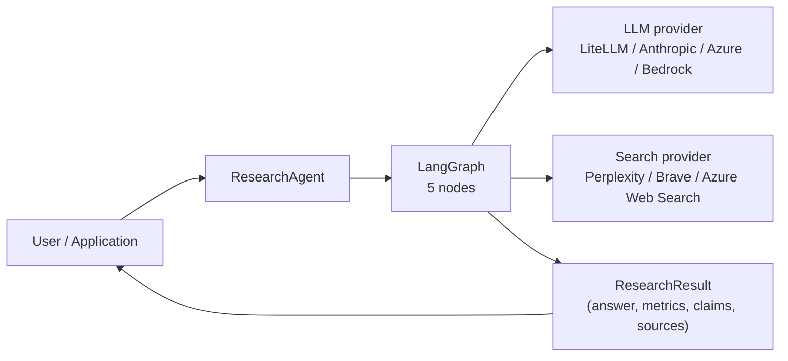

<div align="center">
  
</div>
<p></p>

> [!WARNING]
> **Experimental Software / Reference and Integration Foundation**
> This repository is an experimental codebase and integration foundation for self-hosted or locally operated deployments. It does **not** provide a complete production-ready security configuration, hardened deployment profile, or any assurance that it is suitable for direct use in internet-facing, multi-user, regulated, or otherwise high-risk environments.
>
> Configurations, defaults, example values, example scripts, and helper paths included in this repository may be useful for development, testing, or integration work, but must not be assumed to be secure, complete, or appropriate for production use without independent review and adaptation.
>
> Secure configuration, hardening, deployment architecture, access control, secret handling, logging, monitoring, compliance, and day-to-day operation remain the sole responsibility of the operator. The current test suite covers substantial internal logic, interface behavior, and regression scenarios, but it is **not** evidence of production readiness or fully validated live integrations. Perform your own technical and security review before using this project in integration, staging, test, or production environments.

# Inqtrix

[License: Apache 2.0](LICENSE) [Python: 3.12+](https://www.python.org/)

Self-hostable Python library and HTTP server for an iterative AI research agent with parallel web search, claim verification, and source tiering.

Inqtrix runs a bounded multi-round research loop: it decomposes a question, searches the web in parallel, extracts and verifies claims against multiple sources, and synthesises a cited answer once evidence quality thresholds are met.

## Features

- **Iterative research loop** with configurable confidence threshold and max rounds.
- **Parallel web search** with LLM-based summarisation and structured claim extraction (non-fatal per-source fallback).
- **Claim verification** — claims are consolidated, deduplicated, and classified as `verified`, `contested`, or `unverified`.
- **Source tiering** — URLs are classified into five quality tiers (primary, mainstream, stakeholder, unknown, low).
- **Aspect coverage tracking** ensures all facets of a question get researched before the agent commits to high confidence.
- **9 stop heuristics** — confidence, utility plateau, stagnation, falsification mode, and more.
- **Report profiles** — switch between compact default answers and longer deep-review style reports.
- **Pluggable architecture** — swap LLM providers, search engines, and strategies independently (Baukasten).
- **Pydantic configuration** — type-safe, serialisable, IDE-friendly.
- **OpenAI-compatible HTTP API** — drop-in replacement for `/v1/chat/completions`.

## Architecture at a glance




Full technical reference: `[docs/architecture/overview.md](docs/architecture/overview.md)`.

## Quick start

```bash
git clone https://github.com/BZandi/inqtrix.git
cd inqtrix
uv sync --extra dev
source .venv/bin/activate
cp .env.example .env
# edit .env with your provider credentials
```

```python
# main.py
from inqtrix import ResearchAgent

agent = ResearchAgent()
result = agent.research("Was ist der aktuelle Stand der GKV-Reform?")

print(result.answer)
print(f"Confidence: {result.metrics.confidence}/10  "
      f"Sources: {result.metrics.total_citations}  "
      f"Rounds: {result.metrics.rounds}")
```

```bash
uv run python main.py
```

Offline regression check (no API calls):

```bash
uv run pytest tests/ -v
```

More entry paths (explicit providers, YAML routing, streaming, HTTP): [Library mode](docs/deployment/library-mode.md), [Web server mode](docs/deployment/webserver-mode.md).

### Streamlit UI (`webapp.py`)

The bundled [`webapp.py`](webapp.py) is a production-shaped Streamlit
frontend for the HTTP server. It discovers the available stacks via
`GET /v1/stacks`, streams answers plus progress events over SSE, and
exposes the whitelisted per-request `agent_overrides` (`report_profile`,
`max_rounds`/`min_rounds` via the "Aufwand"-Radio, `confidence_stop`,
`max_total_seconds`, `first_round_queries`) through the composer menus
underneath the chat input.

```bash
# Terminal 1 — multi-stack HTTP server (single-stack examples work too)
uv run python examples/webserver_stacks/multi_stack.py

# Terminal 2 — Streamlit UI
uv sync --extra ui
INQTRIX_WEBAPP_BASE_URL=http://localhost:5100 \
  uv run streamlit run webapp.py
```

When the server has the Bearer gate enabled
(`INQTRIX_SERVER_API_KEY=...`), set `INQTRIX_WEBAPP_API_KEY` to the same
token. No other configuration is read by the UI — it is a pure HTTP
consumer and deliberately does not import the `inqtrix` package.

## Provider matrix


| LLM                        | Search                 | Example (library / server)                                                                                                                                                                                                        |
| -------------------------- | ---------------------- | --------------------------------------------------------------------------------------------------------------------------------------------------------------------------------------------------------------------------------- |
| LiteLLM                    | Perplexity             | `[examples/provider_stacks/litellm_perplexity.py](examples/provider_stacks/litellm_perplexity.py)` / `[examples/webserver_stacks/litellm_perplexity.py](examples/webserver_stacks/litellm_perplexity.py)`                         |
| AnthropicLLM               | Perplexity             | `[examples/provider_stacks/anthropic_perplexity.py](examples/provider_stacks/anthropic_perplexity.py)` / `[examples/webserver_stacks/anthropic_perplexity.py](examples/webserver_stacks/anthropic_perplexity.py)`                 |
| BedrockLLM                 | Perplexity             | `[examples/provider_stacks/bedrock_perplexity.py](examples/provider_stacks/bedrock_perplexity.py)` / `[examples/webserver_stacks/bedrock_perplexity.py](examples/webserver_stacks/bedrock_perplexity.py)`                         |
| AzureOpenAILLM             | Perplexity             | `[examples/provider_stacks/azure_openai_perplexity.py](examples/provider_stacks/azure_openai_perplexity.py)` / `[examples/webserver_stacks/azure_openai_perplexity.py](examples/webserver_stacks/azure_openai_perplexity.py)`     |
| AzureOpenAILLM             | AzureOpenAIWebSearch   | `[examples/provider_stacks/azure_openai_web_search.py](examples/provider_stacks/azure_openai_web_search.py)` / `[examples/webserver_stacks/azure_openai_web_search.py](examples/webserver_stacks/azure_openai_web_search.py)`     |
| AzureOpenAILLM             | AzureFoundryBingSearch | `[examples/provider_stacks/azure_openai_bing.py](examples/provider_stacks/azure_openai_bing.py)` / `[examples/webserver_stacks/azure_openai_bing.py](examples/webserver_stacks/azure_openai_bing.py)`                             |
| AzureOpenAILLM             | AzureFoundryWebSearch  | `[examples/provider_stacks/azure_foundry_web_search.py](examples/provider_stacks/azure_foundry_web_search.py)` / `[examples/webserver_stacks/azure_foundry_web_search.py](examples/webserver_stacks/azure_foundry_web_search.py)` |
| Multi-stack in one process | —                      | `[examples/webserver_stacks/multi_stack.py](examples/webserver_stacks/multi_stack.py)`                                                                                                                                            |


All stacks share the same provider construction byte-for-byte between `provider_stacks/` and `webserver_stacks/` — library vs HTTP is the only difference.

## Documentation


| Area               | Starting point                                                                                                                                                                                                                                                                                                                                                                                                                                                                                                                                             | Good for                                           |
| ------------------ | ---------------------------------------------------------------------------------------------------------------------------------------------------------------------------------------------------------------------------------------------------------------------------------------------------------------------------------------------------------------------------------------------------------------------------------------------------------------------------------------------------------------------------------------------------------- | -------------------------------------------------- |
| Onboarding         | `[docs/getting-started/overview.md](docs/getting-started/overview.md)`, `[docs/getting-started/installation.md](docs/getting-started/installation.md)`, `[docs/getting-started/first-research-run.md](docs/getting-started/first-research-run.md)`                                                                                                                                                                                                                                                                                                         | First-time setup.                                  |
| Architecture       | `[docs/architecture/overview.md](docs/architecture/overview.md)`, `[docs/architecture/nodes.md](docs/architecture/nodes.md)`, `[docs/architecture/state-and-iteration.md](docs/architecture/state-and-iteration.md)`, `[docs/architecture/strategies.md](docs/architecture/strategies.md)`                                                                                                                                                                                                                                                                 | Understanding the agent loop.                      |
| Providers          | `[docs/providers/overview.md](docs/providers/overview.md)` and nine per-provider pages                                                                                                                                                                                                                                                                                                                                                                                                                                                                     | Picking a backend; writing a custom adapter.       |
| Configuration      | `[docs/configuration/agent-config.md](docs/configuration/agent-config.md)`, `[docs/configuration/settings-and-env.md](docs/configuration/settings-and-env.md)`, `[docs/configuration/inqtrix-yaml.md](docs/configuration/inqtrix-yaml.md)`, `[docs/configuration/report-profiles.md](docs/configuration/report-profiles.md)`                                                                                                                                                                                                                               | Env variables, YAML routing, report profiles.      |
| Scoring & stopping | `[docs/scoring-and-stopping/stop-criteria.md](docs/scoring-and-stopping/stop-criteria.md)`, `[docs/scoring-and-stopping/source-tiering.md](docs/scoring-and-stopping/source-tiering.md)`, `[docs/scoring-and-stopping/claims.md](docs/scoring-and-stopping/claims.md)`, `[docs/scoring-and-stopping/aspect-coverage.md](docs/scoring-and-stopping/aspect-coverage.md)`, `[docs/scoring-and-stopping/confidence.md](docs/scoring-and-stopping/confidence.md)`, `[docs/scoring-and-stopping/falsification.md](docs/scoring-and-stopping/falsification.md)`   | Why runs stop.                                     |
| Observability      | `[docs/observability/logging.md](docs/observability/logging.md)`, `[docs/observability/progress-events.md](docs/observability/progress-events.md)`, `[docs/observability/iteration-log.md](docs/observability/iteration-log.md)`, `[docs/observability/timeouts-and-errors.md](docs/observability/timeouts-and-errors.md)`, `[docs/observability/debugging-runs.md](docs/observability/debugging-runs.md)`                                                                                                                                                 | Logs, cancel, debugging.                           |
| Deployment         | `[docs/deployment/library-mode.md](docs/deployment/library-mode.md)`, `[docs/deployment/webserver-mode.md](docs/deployment/webserver-mode.md)`, `[docs/deployment/enterprise-azure.md](docs/deployment/enterprise-azure.md)`, `[docs/deployment/security-hardening.md](docs/deployment/security-hardening.md)`                                                                                                                                                                                                                                             | Running in prod, Azure auth, TLS / API key / CORS. |
| Development        | `[docs/development/contributing.md](docs/development/contributing.md)`, `[docs/development/coding-standards.md](docs/development/coding-standards.md)`, `[docs/development/testing-strategy.md](docs/development/testing-strategy.md)`, `[docs/development/running-tests.md](docs/development/running-tests.md)`, `[docs/development/parity-tooling.md](docs/development/parity-tooling.md)`, `[docs/development/docs-maintenance.md](docs/development/docs-maintenance.md)`, `[docs/development/release-process.md](docs/development/release-process.md)` | Contributing, tests, release.                      |
| Reference          | `[docs/reference/glossary.md](docs/reference/glossary.md)`, `[docs/reference/faq.md](docs/reference/faq.md)`, `[docs/reference/troubleshooting.md](docs/reference/troubleshooting.md)`, `[docs/reference/worked-example.md](docs/reference/worked-example.md)`, `[docs/reference/research-foundations.md](docs/reference/research-foundations.md)`, `[docs/reference/changelog.md](docs/reference/changelog.md)`                                                                                                                                           | Terminology, FAQ, worked example, related work.    |


## Where to go next

- **New to the agent?** [Overview](docs/getting-started/overview.md) → [First research run](docs/getting-started/first-research-run.md).
- **Integrating into your app?** [Library mode](docs/deployment/library-mode.md) and [Providers overview](docs/providers/overview.md).
- **Deploying as a service?** [Web server mode](docs/deployment/webserver-mode.md), [Enterprise Azure](docs/deployment/enterprise-azure.md), [Security hardening](docs/deployment/security-hardening.md).
- **Customising behaviour?** [Strategies](docs/architecture/strategies.md), [Stop criteria](docs/scoring-and-stopping/stop-criteria.md), [Writing a custom provider](docs/providers/writing-a-custom-provider.md).
- **Contributing?** [Contributing](docs/development/contributing.md) and [Coding standards](docs/development/coding-standards.md).

## License

Copyright (c) 2026 Babak Zandi.

This project is licensed under the [Apache License 2.0](LICENSE). See the [LICENSE](LICENSE) file for the full license text, warranty disclaimer, and limitation of liability.

## Acknowledgments

Inqtrix is built on the following open-source libraries:


| Library                                                                                                               | License      | Purpose                               |
| --------------------------------------------------------------------------------------------------------------------- | ------------ | ------------------------------------- |
| [FastAPI](https://github.com/tiangolo/fastapi)                                                                        | MIT          | HTTP server and API endpoints         |
| [Uvicorn](https://github.com/encode/uvicorn)                                                                          | BSD-3-Clause | ASGI server                           |
| [OpenAI Python SDK](https://github.com/openai/openai-python)                                                          | Apache-2.0   | LLM and search provider communication |
| [LangGraph](https://github.com/langchain-ai/langgraph)                                                                | MIT          | State machine orchestration           |
| [Pydantic](https://github.com/pydantic/pydantic) / [Pydantic Settings](https://github.com/pydantic/pydantic-settings) | MIT          | Data validation and configuration     |
| [cachetools](https://github.com/tkem/cachetools)                                                                      | MIT          | TTL-based search result caching       |
| [PyYAML](https://github.com/yaml/pyyaml)                                                                              | MIT          | YAML configuration loading            |


**Dev dependencies:**


| Library                                                                                                       | License    | Purpose                           |
| ------------------------------------------------------------------------------------------------------------- | ---------- | --------------------------------- |
| [pytest](https://github.com/pytest-dev/pytest)                                                                | MIT        | Test framework                    |
| [pytest-asyncio](https://github.com/pytest-dev/pytest-asyncio)                                                | Apache-2.0 | Async test support                |
| [vcrpy](https://github.com/kevin1024/vcrpy) / [pytest-recording](https://github.com/kiwicom/pytest-recording) | MIT / MIT  | HTTP replay testing               |
| [Requests](https://github.com/psf/requests)                                                                   | Apache-2.0 | HTTP client for integration tests |


## Third-Party Services and Output Notice

When configured to use external model, search, or API providers, this project may transmit prompts, context, search queries, and related request data to those third-party services.

Use of third-party services is governed by their respective terms, privacy policies, and data-processing practices. Users and operators are solely responsible for ensuring that their use of this project and any connected services complies with applicable law, contractual obligations, confidentiality requirements, and internal policies. Do not assume that any provider integration, default configuration, or example workflow included in this repository satisfies your legal, security, or data-protection obligations.

Outputs generated by this project or by connected third-party providers are provided for informational purposes only and do not constitute legal, medical, financial, or other professional advice. Independent verification remains the responsibility of the user.

## AI Disclosure

This project was developed with assistance from AI tools:

- **[Claude Code](https://www.anthropic.com/)** (Anthropic)
- **[GitHub Copilot](https://github.com/features/copilot)** (GitHub / Microsoft)
- **[ChatGPT](https://openai.com/chatgpt)** (OpenAI)

This disclosure is provided for transparency only. Use of this project remains subject to the terms of the [Apache License 2.0](LICENSE), including the "as is" disclaimer and limitation of liability.