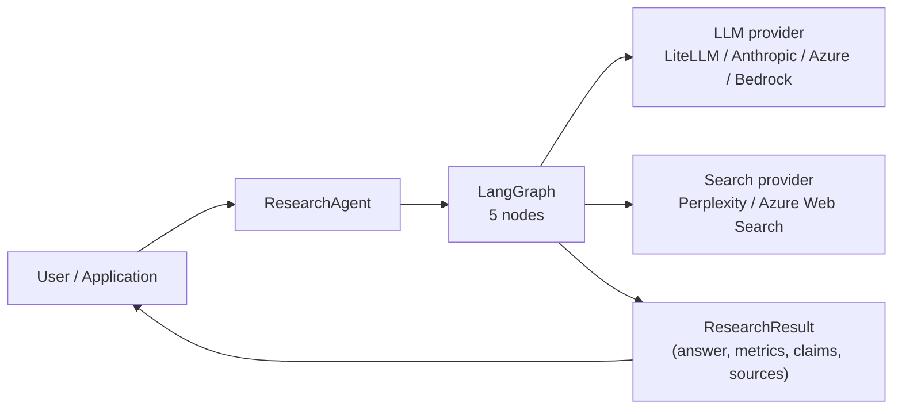

<div align="center">
  
</div>
<p></p>

> [!WARNING]
> **Experimental Software / Reference and Integration Foundation**
> This repository is an experimental codebase and integration foundation for self-hosted or locally operated deployments. It does **not** provide a complete production-ready security configuration, hardened deployment profile, or any assurance that it is suitable for direct use in internet-facing, multi-user, regulated, or otherwise high-risk environments.
>
> Configurations, defaults, example values, example scripts, and helper paths included in this repository may be useful for development, testing, or integration work, but must not be assumed to be secure, complete, or appropriate for production use without independent review and adaptation.
>
> Secure configuration, hardening, deployment architecture, access control, secret handling, logging, monitoring, compliance, and day-to-day operation remain the sole responsibility of the operator. The current test suite covers substantial internal logic, interface behavior, and regression scenarios, but it is **not** evidence of production readiness or fully validated live integrations. Perform your own technical and security review before using this project in integration, staging, test, or production environments.

# Inqtrix
[License: AGPL-3.0-only](LICENSE) [Python: 3.11+](https://www.python.org/)

Inqtrix has two layers:

1. **Inqtrix Backend**: a Python library and HTTP server for iterative web-agent research.
   It decomposes questions, searches the web, verifies claims, ranks sources, and produces cited research results.

2. **Research Desk**: a React-based research workspace built on top of the backend.
   It provides live run monitoring, report views, evidence attachments, chat context, a Prompt Library, and project import/export.
Self-hostable Python library and HTTP server for an iterative AI research agent with parallel web search, claim verification, and source tiering.


## Features

- **Iterative research loop** with configurable confidence threshold and max rounds.
- **Parallel web search** with LLM-based summarisation and structured claim extraction (non-fatal per-source fallback).
- **Claim verification** — claims are consolidated, deduplicated, and classified as `verified`, `contested`, or `unverified`.
- **Source tiering** — URLs are classified into five quality tiers (primary, mainstream, stakeholder, unknown, low).
- **Aspect coverage tracking** ensures all facets of a question get researched before the agent commits to high confidence.
- **9 stop heuristics** — confidence, utility plateau, stagnation, falsification mode, and more.
- **Report profiles** — switch between compact default answers and longer deep-review style reports.
- **Pluggable architecture** — swap LLM providers, search engines, and strategies independently (Baukasten).
- **Pydantic configuration** — type-safe, serialisable, IDE-friendly.
- **OpenAI-compatible HTTP API** — drop-in replacement for `/v1/chat/completions`.
- **Native run API for UIs** — `/v1/runs` adds queueing, structured SSE progress events, cancellation, and short-lived result retrieval for React-style frontends.

## Architecture at a glance


```mermaid
flowchart LR
    U["User / Application"] --> A["ResearchAgent"]
    A --> G["LangGraph<br/>5 nodes"]
    G --> L["LLM provider<br/>LiteLLM / Anthropic / Azure / Bedrock"]
    G --> S["Search provider<br/>Perplexity / Azure Web Search"]
    G --> R["ResearchResult<br/>(answer, metrics, claims, sources)"]
    R --> U
```


Start with the [documentation hub](docs/README.md) for task-oriented navigation. Full technical reference: [docs/architecture/overview.md](docs/architecture/overview.md) and [docs/architecture/graph-topology.md](docs/architecture/graph-topology.md).

## Quick start

Option A — with [`uv`](https://github.com/astral-sh/uv) (recommended):

```bash
git clone https://github.com/BZandi/inqtrix.git
cd inqtrix
uv sync --extra dev
source .venv/bin/activate
cp .env.example .env
# edit .env with your provider credentials
```

Option B — with `pip` (standard library `venv`):

```bash
git clone https://github.com/BZandi/inqtrix.git
cd inqtrix
python3.11 -m venv .venv
source .venv/bin/activate
pip install -e ".[dev]"
cp .env.example .env
# edit .env with your provider credentials
```

> The project uses a `src/` layout, so an editable install (`-e`) is required for `import inqtrix` to work. See [Installation](docs/getting-started/installation.md) for details.

```python
# main.py
from inqtrix import ResearchAgent

agent = ResearchAgent()
result = agent.research("Was ist der aktuelle Stand der GKV-Reform?")

print(result.answer)
print(f"Confidence: {result.metrics.confidence}/10  "
      f"Sources: {result.metrics.total_citations}  "
      f"Rounds: {result.metrics.rounds}")
```

```bash
# uv
uv run python main.py
# pip (with .venv activated)
python main.py
```

Offline regression check (no API calls):

```bash
# uv
uv run pytest tests/ -v
# pip (with .venv activated)
pytest tests/ -v
```

More entry paths (explicit providers, streaming, HTTP): [Library mode](docs/deployment/library-mode.md), [Web server mode](docs/deployment/webserver-mode.md).

Ready-made examples (no `main.py` required): [examples/README.md](examples/README.md).

**HTTP server (OpenAI-compatible API)** — after `.env` is configured, start the default FastAPI app (port **5100** by default, override with `INQTRIX_SERVER_PORT`):

```bash
uv run python -m inqtrix
```

See [Web server mode](docs/deployment/webserver-mode.md) for TLS, API keys, and CORS.

### React UI Preview


In addition to the bundled Streamlit frontend below, Inqtrix contains a dedicated React + Vite + shadcn web interface in [`apps/research-desk`](apps/research-desk). The goal is a more native-feeling research desk for iterative AI research runs, not just another chat screen.

Each submitted question becomes its own research job card. Active jobs continue to stream their current iteration steps directly inside the card while the user can start additional research tasks from the composer. Completed jobs can be opened on demand in a right-side Markdown report viewer, designed to present the final answer as a clean report-style document.

The planned UI focuses on:

- **research job cards** instead of a single linear chat history,
- **live progress streams** for planning, search, evaluation, and answer synthesis,
- **parallel task handling** so new research can be started while earlier runs continue,
- **compact per-run metadata** such as confidence, rounds, sources, and queries,
- **optional Markdown report viewing** for completed research results,
- **shadcn-based enterprise design** with a light, professional interface.

The app talks to the native `/v1/runs` API: submitted questions become queued
run resources, live event snapshots update the cards and agent protocol, and
completed runs fetch `/v1/runs/{run_id}/result` for the Markdown report,
sources, claims, metrics, and usage data. Install with
`corepack pnpm install --frozen-lockfile` or `npm ci`, run locally with
`pnpm run ui:dev` or `npm run ui:dev`, build with `pnpm run ui:build` or
`npm run ui:build`, and preview that production build locally with
`pnpm run ui:prod`; the generated `apps/research-desk/dist/` directory is
intentionally not committed. See [React UI](docs/deployment/react-ui.md) for
setup, API-origin configuration, security, build, and deployment notes. The
Streamlit UI remains available for local operation, demos, and integration
testing.

### Streamlit UI (`webapp.py`)


The bundled [`webapp.py`](webapp.py) is a production-shaped Streamlit
frontend for the HTTP server. It discovers the available stacks via
`GET /v1/stacks`, streams answers plus progress events over SSE, and
exposes the whitelisted per-request `agent_overrides` (`report_profile`,
`max_rounds`/`min_rounds` via the effort selector, `confidence_stop`,
`max_total_seconds`, `first_round_queries`, and
`skip_search` when web search is disabled) through the composer menus
underneath the chat input. See [Streamlit UI](docs/deployment/streamlit-ui.md)
for the full mapping.

```bash
# Terminal 1 — multi-stack HTTP server (single-stack examples work too)
uv run python examples/webserver_stacks/multi_stack.py

# Terminal 2 — Streamlit UI
uv sync --extra ui
INQTRIX_WEBAPP_BASE_URL=http://localhost:5100 \
  uv run streamlit run webapp.py
```

When the server has the Bearer gate enabled
(`INQTRIX_SERVER_API_KEY=...`), set `INQTRIX_WEBAPP_API_KEY` to the same
token. No other configuration is read by the UI — it is a pure HTTP
consumer and deliberately does not import the `inqtrix` package. See
[Authentication and TLS](docs/deployment/webserver-mode.md#authentication-and-tls)
for an end-to-end walkthrough (server-side env vars, curl / `httpx` /
`requests` client snippets).

> **Note on third-party terms of service:** Inqtrix is provider-neutral.
> You bring your own API keys and choose which search and LLM providers
> to wire in. Whether each provider's terms of service permit your
> specific Inqtrix use case is your responsibility to verify. In
> particular, review provider terms before any AI- or agent-style
> deployment.

## Provider matrix


| LLM                        | Search                 | Example (library / server)                                                                                                                                                                                                        |
| -------------------------- | ---------------------- | --------------------------------------------------------------------------------------------------------------------------------------------------------------------------------------------------------------------------------- |
| LiteLLM                    | Perplexity             | [examples/provider_stacks/litellm_perplexity.py](examples/provider_stacks/litellm_perplexity.py) / [examples/webserver_stacks/litellm_perplexity.py](examples/webserver_stacks/litellm_perplexity.py)                         |
| AnthropicLLM               | Perplexity             | [examples/provider_stacks/anthropic_perplexity.py](examples/provider_stacks/anthropic_perplexity.py) / [examples/webserver_stacks/anthropic_perplexity.py](examples/webserver_stacks/anthropic_perplexity.py)                 |
| BedrockLLM                 | Perplexity             | [examples/provider_stacks/bedrock_perplexity.py](examples/provider_stacks/bedrock_perplexity.py) / [examples/webserver_stacks/bedrock_perplexity.py](examples/webserver_stacks/bedrock_perplexity.py)                         |
| AzureOpenAILLM             | Perplexity             | [examples/provider_stacks/azure_openai_perplexity.py](examples/provider_stacks/azure_openai_perplexity.py) / [examples/webserver_stacks/azure_openai_perplexity.py](examples/webserver_stacks/azure_openai_perplexity.py)     |
| AzureOpenAILLM             | AzureFoundryWebSearch  | [examples/provider_stacks/azure_foundry_web_search.py](examples/provider_stacks/azure_foundry_web_search.py) / [examples/webserver_stacks/azure_foundry_web_search.py](examples/webserver_stacks/azure_foundry_web_search.py) |
| Multi-stack in one process | —                      | [examples/webserver_stacks/multi_stack.py](examples/webserver_stacks/multi_stack.py)                                                                                                                                            |


The provider-stack examples share the same provider construction byte-for-byte between `provider_stacks/` and `webserver_stacks/` — library vs HTTP is the only difference. Custom-provider examples show the same constructor-first pattern for ad-hoc combinations.

## Documentation

The full navigation lives in the [documentation hub](docs/README.md). Common entry points:

| Need | Start here |
|------|------------|
| First setup and first live run | [Installation](docs/getting-started/installation.md), [First research run](docs/getting-started/first-research-run.md) |
| Runnable examples | [Examples index](examples/README.md) |
| Library integration | [Library mode](docs/deployment/library-mode.md), [Agent config](docs/configuration/agent-config.md) |
| HTTP server and Streamlit UI | [Web server mode](docs/deployment/webserver-mode.md), [Streamlit UI](docs/deployment/streamlit-ui.md) |
| Provider selection and custom adapters | [Providers overview](docs/providers/overview.md), [Writing a custom provider](docs/providers/writing-a-custom-provider.md) |
| Logs, debugging, and test workflows | [Debugging runs](docs/observability/debugging-runs.md), [Troubleshooting](docs/reference/troubleshooting.md), [Running tests](docs/development/running-tests.md) |

## Where to go next

- **New to the agent?** [Overview](docs/getting-started/overview.md) → [First research run](docs/getting-started/first-research-run.md).
- **Integrating into your app?** [Library mode](docs/deployment/library-mode.md) and [Providers overview](docs/providers/overview.md).
- **Deploying as a service?** [Web server mode](docs/deployment/webserver-mode.md), [Enterprise Azure](docs/deployment/enterprise-azure.md), [Security hardening](docs/deployment/security-hardening.md).
- **Customising behaviour?** [Strategies](docs/architecture/strategies.md), [Stop criteria](docs/scoring-and-stopping/stop-criteria.md), [Writing a custom provider](docs/providers/writing-a-custom-provider.md).
- **Contributing?** [Contributing](docs/development/contributing.md) and [Coding standards](docs/development/coding-standards.md).

## License

Copyright (c) 2026 Babak Zandi.

This project is licensed under the [GNU Affero General Public License v3.0 only](LICENSE) (`AGPL-3.0-only`). See the [LICENSE](LICENSE) file for the full license text, warranty disclaimer, and limitation of liability.

Commercial licensing is available from Babak Zandi for use cases where AGPL compliance is not desired.

Attribution notice:

```text
Inqtrix - Copyright (c) 2026 Babak Zandi - https://github.com/BZandi/inqtrix
```

See [NOTICE](NOTICE) for the project attribution and source notice.

## Acknowledgments

Inqtrix is built on open-source Python and React libraries. The complete
generated dependency inventory is maintained in
[`THIRD_PARTY_NOTICES.md`](THIRD_PARTY_NOTICES.md), with the matching
machine-readable view in [`THIRD_PARTY_NOTICES.json`](THIRD_PARTY_NOTICES.json).

Major direct runtime libraries include:

| Library                                                                                                               | License      | Purpose                               |
| --------------------------------------------------------------------------------------------------------------------- | ------------ | ------------------------------------- |
| [FastAPI](https://github.com/tiangolo/fastapi)                                                                        | MIT          | HTTP server and API endpoints         |
| [Uvicorn](https://github.com/encode/uvicorn)                                                                          | BSD-3-Clause | ASGI server                           |
| [OpenAI Python SDK](https://github.com/openai/openai-python)                                                          | Apache-2.0   | LLM and search provider communication |
| [LangGraph](https://github.com/langchain-ai/langgraph)                                                                | MIT          | State machine orchestration           |
| [Pydantic](https://github.com/pydantic/pydantic) / [Pydantic Settings](https://github.com/pydantic/pydantic-settings) | MIT          | Data validation and configuration     |
| [cachetools](https://github.com/tkem/cachetools)                                                                      | MIT          | TTL-based search result caching       |


## Third-Party Services and Output Notice

When configured to use external model, search, or API providers, this project may transmit prompts, context, search queries, and related request data to those third-party services.

Use of third-party services is governed by their respective terms, privacy policies, and data-processing practices. Users and operators are solely responsible for ensuring that their use of this project and any connected services complies with applicable law, contractual obligations, confidentiality requirements, and internal policies. Do not assume that any provider integration, default configuration, or example workflow included in this repository satisfies your legal, security, or data-protection obligations.

Outputs generated by this project or by connected third-party providers are provided for informational purposes only and do not constitute legal, medical, financial, or other professional advice. Independent verification remains the responsibility of the user.

## AI Disclosure

This project was developed with assistance from AI tools:

- **[Claude Code](https://www.anthropic.com/)** (Anthropic)
- **[GitHub Copilot](https://github.com/features/copilot)** (GitHub / Microsoft)
- **[ChatGPT](https://openai.com/chatgpt)** (OpenAI)

This disclosure is provided for transparency only. Use of this project remains subject to the terms of the [GNU Affero General Public License v3.0 only](LICENSE), including the warranty disclaimer and limitation of liability.
