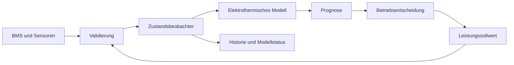
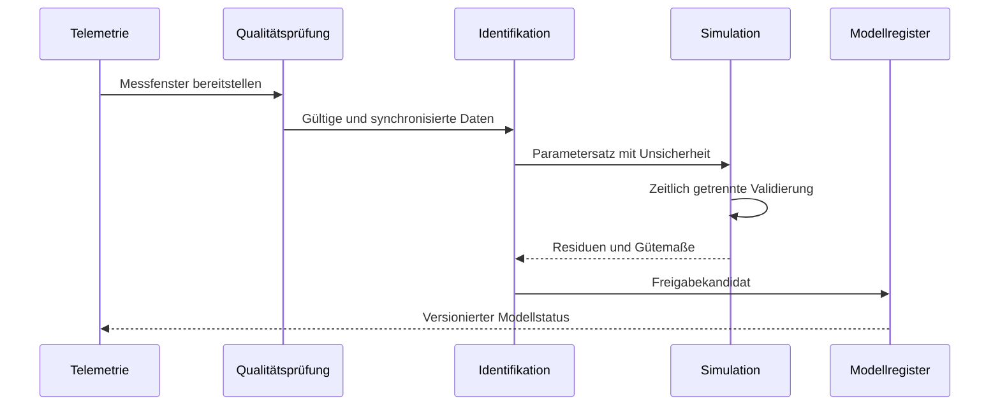
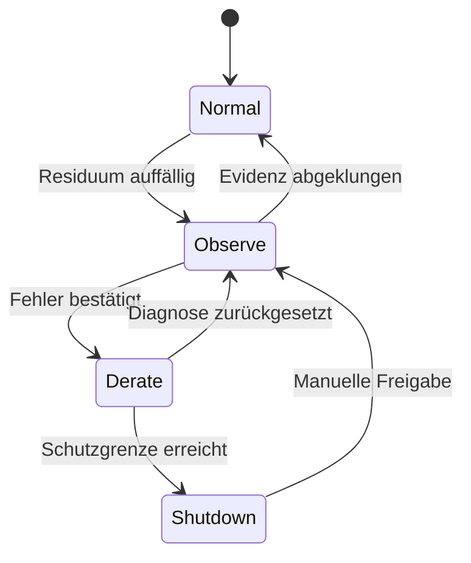

<!-- inqtrix:message id="msg-1779030000000-bess01" role="user" created_at="2026-01-01T14:00:00.000Z" -->
Wir betreiben einen industriellen Batteriespeicher mit etwa 250 kW und 500 kWh. Wie würdest du einen digitalen Zwilling aufbauen, der elektrische, thermische und alterungsbedingte Effekte nachvollziehbar verbindet? Bitte leite ein geeignetes Modell her, nenne realistische Parameter und zeige die Architektur des Datenflusses. Mir ist wichtig, dass das Modell erklärbar bleibt und nicht nur aus einer Blackbox besteht.
<!-- /inqtrix:message -->

<!-- inqtrix:message id="msg-1779030010000-bess02" role="assistant" created_at="2026-01-01T14:04:00.000Z" model="claude-opus-4-8" model_tier="high" model_effort="high" model_requested_tier="high" model_source="demo" model_effort_source="demo" -->
# Digitaler Zwilling für einen industriellen Batteriespeicher
Ein sinnvoller digitaler Zwilling verbindet drei Ebenen: ein **physikalisches Zustandsmodell**, laufende **Messdatenassimilation** und eine **Entscheidungsschicht** für Prognosen und Betriebsgrenzen. Für einen Speicher dieser Größe ist ein elektrothermisches Ersatzschaltbild meist der beste Ausgangspunkt. Es ist deutlich erklärbarer als ein rein neuronales Modell, aber schnell genug für eine sekündliche Online-Auswertung.

> **Hinweis:** Alle folgenden Zahlen sind plausible Demoannahmen für einen fiktiven Speicher. Sie sind weder Produktspezifikationen noch freigegebene Auslegungs- oder Sicherheitsgrenzen.

## 1. Systemgrenze und Annahmen

Wir modellieren den DC-Batteriepack einschließlich Zellverbund und Kühlsystem. Wechselrichter, Netzanschluss und Standortsteuerung liefern Randbedingungen, gehören aber nicht zum inneren Batteriemodell. Positive Leistung bedeutet im Folgenden **Entladen**, positiver Strom fließt aus der Batterie.

| Größe | Symbol | Plausible Demoannahme | Bedeutung |
|---|---:|---:|---|
| Installierte Nennenergie | $E_{\mathrm{nom}}$ | 497,7 kWh | Zellnennwerte bei 25 °C |
| Energie im SOC-Fenster | $E_{10\text{–}90}$ | ca. 398 kWh | 10–90 %, vor Wirkungsgrad und Alterung |
| Nennleistung | $P_{\mathrm{nom}}$ | 250 kW | Dauerleistung am DC-Zwischenkreis |
| Serienschaltung | $N_s$ | 216 Zellen | Bestimmt die Packspannung |
| Parallelschaltung | $N_p$ | 40 Stränge | Bestimmt Kapazität und Stromaufteilung |
| Zellkapazität | $Q_{\mathrm{cell}}$ | 16 Ah | Nominalwert bei 25 °C |
| Nennspannung | $V_{\mathrm{pack}}$ | 777,6 V | $216 \cdot 3{,}6\,\mathrm{V}$ |
| SOC-Betriebsfenster | $z$ | 10–90 % | Reserve für Lebensdauer und Regelung |
| Kühlmitteltemperatur | $T_c$ | 22 °C | Geregelte Randbedingung im Nennfall |

Die nominelle elektrische Energie des Zellverbunds ist näherungsweise
$$
E_{\mathrm{nom}} = N_s N_p V_{\mathrm{cell,nom}} Q_{\mathrm{cell}}.
$$
Mit den Demoannahmen ergibt sich $E_{\mathrm{nom}} \approx 497{,}7\,\mathrm{kWh}$. Im SOC-Fenster von 10–90 % stehen rechnerisch etwa $398{,}1\,\mathrm{kWh}$ zur Verfügung, bevor Wirkungsgrad, Temperatur und Alterung berücksichtigt werden.

## 2. Elektrisches Zwei-RC-Thevenin-Modell

Der interne Zustand sei
$$
\mathbf{x} = \begin{bmatrix} z & v_1 & v_2 & T & q_{\mathrm{loss}} & r_{\mathrm{gain}} \end{bmatrix}^{\mathsf T}.
$$
Dabei bezeichnet $z$ den State of Charge, $v_1$ und $v_2$ die Polarisationsspannungen zweier RC-Zweige, $T$ die gemittelte Zelltemperatur, $q_{\mathrm{loss}}$ den relativen Kapazitätsverlust und $r_{\mathrm{gain}}$ den relativen Widerstandszuwachs.

### Ladezustand

Für positiven Entladestrom $I>0$ gilt die Coulomb-Bilanz
$$
\frac{\mathrm dz}{\mathrm dt} = -\frac{\eta_I(I,T)\,I}{3600\,Q_n}.
$$
wobei $Q_n=N_p Q_{\mathrm{cell}}(1-q_{\mathrm{loss}})$ die aktuelle Packkapazität in Amperestunden ist. Der Faktor 3600 konvertiert Sekunden in Stunden. Für das Demo genügt $\eta_I=1$ beim Entladen und $\eta_I=0{,}995$ beim Laden.

### Dynamische Polarisation

Die beiden RC-Zweige bilden schnelle Aktivierungs- und langsamere Diffusionseffekte ab:
$$
\frac{\mathrm dv_k}{\mathrm dt}=-\frac{v_k}{R_k C_k}+\frac{I}{C_k},\qquad k\in\{1,2\}.
$$
Die Packklemmenspannung folgt aus Leerlaufspannung und Verlustspannungen:
$$
V_{\mathrm{pack}}=N_s\!\left[U_{\mathrm{oc}}(z,T)-\frac{I}{N_p}R_0-v_1-v_2\right].
$$
In dieser Schreibweise sind $R_0$, $R_1$ und $R_2$ Zellparameter; der Packstrom teilt sich ideal auf $N_p$ parallele Zellen auf. Kontakt- und Sammelschienenwiderstände würden in einem realen Projekt als zusätzlicher Packterm identifiziert.

Eine glatte Demo-Kennlinie für die Leerlaufspannung ist beispielsweise
$$
U_{\mathrm{oc}}(z,T)=3{,}15+0{,}65z+0{,}08\tanh\!\left(8(z-0{,}5)\right)+\alpha_T(T-25^\circ\mathrm C).
$$
| Parameter | Einheit | Plausibler Startwert | Spätere Identifikation |
|---|---:|---:|---|
| $R_0$ | mΩ/Zelle | 1,8 | Spannungssprung bei Stromflanke |
| $R_1$ | mΩ/Zelle | 1,2 | kurzer Puls, 1–20 s |
| $C_1$ | F/Zelle | 8.000 | schnelle Relaxation |
| $R_2$ | mΩ/Zelle | 2,5 | längerer Puls, 20–600 s |
| $C_2$ | F/Zelle | 35.000 | langsame Relaxation |
| $\alpha_T$ | mV/K | −0,35 | OCV-Versuch bei mehreren Temperaturen |
| $\eta_I$ | – | 0,995–1,000 | Ladungsbilanz über Vollzyklen |

## 3. Thermisches Modell

Für den Online-Zwilling reicht zunächst ein konzentriertes thermisches Modell. Seine Energiebilanz lautet
$$
C_{\mathrm{th}}\frac{\mathrm dT}{\mathrm dt}=\dot Q_{\mathrm{irr}}+\dot Q_{\mathrm{rev}}-hA(T-T_c).
$$
Die irreversible Joule-Wärme wird über den äquivalenten Packwiderstand berechnet:
$$
\dot Q_{\mathrm{irr}}=I^2\left(\frac{N_s}{N_p}\right)\left[R_0+R_1+R_2\right].
$$
Der reversible Anteil beschreibt die entropische Wärme:
$$
\dot Q_{\mathrm{rev}}=-N_s I T_{\mathrm K}\frac{\partial U_{\mathrm{oc}}}{\partial T}.
$$
Für einen ersten belastbaren Prototyp kann dieser kleinere Anteil gemessen oder konservativ auf null gesetzt werden. Wichtig ist, diese Vereinfachung im Modellstatus sichtbar zu machen und nicht stillschweigend als exakte Physik auszugeben.

| Thermische Größe | Symbol | Demoannahme | Interpretation |
|---|---:|---:|---|
| Wärmekapazität des Packs | $C_{\mathrm{th}}$ | 4,8 MJ/K | Zellen, Gehäuse und Kühlplatten |
| Wärmeübergang | $hA$ | 0,65 kW/K | Effektiver Wert bei aktiver Kühlung |
| Zulässige Modelltemperatur | $T$ | 10–42 °C | Demonstrationsbereich, keine Schutzgrenze |
| OCV-Temperaturkoeffizient | $\partial U_{\mathrm{oc}}/\partial T$ | −0,35 mV/K | Vereinfachter Mittelwert |
| Sensorstreuung | $\sigma_T$ | 0,25 K | Nach Kalibrierung angenommene Standardabweichung |

## 4. Alterungsmodell

Alterung wird zweckmäßig in Kalender- und Zyklenanteile zerlegt. Ein einfaches, identifizierbares Kapazitätsmodell lautet
$$
\frac{\mathrm dq_{\mathrm{loss}}}{\mathrm dt}=k_{\mathrm{cal}}\exp\!\left(-\frac{E_a}{RT_{\mathrm K}}\right)f_{\mathrm{SOC}}(z)+k_{\mathrm{cyc}}\,|I|^{\beta}\exp\!\left(-\frac{E_c}{RT_{\mathrm K}}\right).
$$
Der daraus abgeleitete Capacity State of Health ist
$$
\mathrm{SOH}_Q=1-q_{\mathrm{loss}}.
$$
Für die Leistungsfähigkeit ist zusätzlich der Widerstandsanstieg relevant:
$$
R_0(t)=R_{0,\mathrm{BOL}}\left(1+r_{\mathrm{gain}}(t)\right).
$$
Die Koeffizienten dürfen nicht aus Literaturwerten als vermeintliche Wahrheit übernommen werden. Sie werden aus Flottendaten oder kontrollierten Tests geschätzt und mit Konfidenzintervallen geführt.

## 5. Daten- und Entscheidungsarchitektur



| Telemetriekanal | Rate | Einheit | Verwendung im Zwilling |
|---|---:|---:|---|
| Packstrom | 10 Hz | A | SOC-Bilanz, RC-Anregung, Verluste |
| Packspannung | 10 Hz | V | Zustandskorrektur und Residuum |
| Modulspannungen | 1 Hz | V | Streuung, Ausreißer, Balancing |
| Zelltemperaturen | 1 Hz | °C | thermischer Zustand und Hotspots |
| Kühlmittel ein/aus | 1 Hz | °C | thermische Randbedingung |
| Wechselrichterleistung | 1 Hz | kW | Plausibilisierung von $VI$ |
| Schützzustand | ereignisbasiert | boolesch | Segmentierung gültiger Betriebsphasen |

Der Zwilling speichert neben den Zuständen immer auch **Datenqualität, Parameterversion und Unsicherheit**. Eine Prognose ohne diese Metadaten wäre zwar numerisch bequem, aber betrieblich schwer verantwortbar.
<!-- /inqtrix:message -->

<!-- inqtrix:message id="msg-1779030020000-bess03" role="user" created_at="2026-01-01T14:08:00.000Z" -->
Das Modell ist nachvollziehbar. Wie würdest du es mit realer Telemetrie kalibrieren und den Zustand während des Betriebs korrigieren? Bitte zeige eine ausführbare Simulation mit einem realistischen Lastprofil und anschließend eine reproduzierbare Parameterschätzung. Welche Gütemaße würdest du für eine Modellfreigabe verwenden?
<!-- /inqtrix:message -->

<!-- inqtrix:message id="msg-1779030030000-bess04" role="assistant" created_at="2026-01-01T14:15:00.000Z" model="claude-opus-4-8" model_tier="high" model_effort="high" model_requested_tier="high" model_source="demo" model_effort_source="demo" -->
# Kalibrierung, Simulation und Online-Zustandsschätzung

Ich würde zwischen **Offline-Identifikation** und **Online-Korrektur** trennen. Offline werden langsam veränderliche Parameter aus geeigneten Messfenstern bestimmt. Online schätzt ein Beobachter die dynamischen Zustände $z$, $v_1$, $v_2$ und $T$, ohne bei jedem Messpunkt das ganze Modell neu anzupassen.

## 1. Messfenster auswählen

Nicht jedes Betriebsintervall ist identifizierbar. Geeignet sind Abschnitte mit wechselnden Stromniveaus, belastbaren Zeitstempeln, geschlossenen Schützen und ohne aktive Begrenzung durch unbekannte Nebenregler.

| Prüfschritt | Akzeptanz für die Demo | Grund |
|---|---:|---|
| Zeitlücken | < 2 s | Sonst ist die Stromintegration unzuverlässig |
| Stromanregung | mindestens 3 Stufen | Trennt ohmsche und dynamische Anteile |
| SOC-Spanne | > 8 Prozentpunkte | Stabilisiert OCV- und Kapazitätsschätzung |
| Temperaturänderung | > 1,5 K | Macht thermische Parameter beobachtbar |
| Spannungsausreißer | < 0,2 % | Verhindert verzerrte Zielfunktionen |
| Leistungskonsistenz | $\lvert P-VI\rvert<1{,}5\%$ | Erkennt Kanal- oder Vorzeichenfehler |

Die gewichtete Offline-Zielfunktion kann Spannungs- und Temperaturfehler verbinden:

$$
J(\boldsymbol\theta)
=\sum_{i=1}^{n}\left(\frac{V_i-\hat V_i(\boldsymbol\theta)}{\sigma_V}\right)^2
+\lambda_T\sum_{i=1}^{n}\left(\frac{T_i-\hat T_i(\boldsymbol\theta)}{\sigma_T}\right)^2.
$$

Dabei enthält $\boldsymbol\theta=[R_0,R_1,C_1,R_2,C_2,hA]^{\mathsf T}$ die zu identifizierenden Parameter. Bounds verhindern physikalisch unsinnige Lösungen; sie ersetzen aber keine gute Anregung.

## 2. Deterministische elektrothermische Simulation

Das folgende Programm ist in sich geschlossen. Es nutzt ein reproduzierbares, stückweise konstantes Leistungsprofil, löst SOC, beide RC-Spannungen und Temperatur mit `solve_ivp` und visualisiert die Ergebnisse. Es liest keine Dateien, verwendet kein Netzwerk und erzeugt keine Zufallszahlen.

```python
from dataclasses import dataclass
import matplotlib.pyplot as plt
import numpy as np
from scipy.integrate import solve_ivp
@dataclass(frozen=True)
class BatteryPack:
    series_cells: int = 216
    parallel_cells: int = 40
    cell_capacity_ah: float = 16.0
    r0_cell: float = 1.8e-3
    r1_cell: float = 1.2e-3
    c1_cell: float = 8_000.0
    r2_cell: float = 2.5e-3
    c2_cell: float = 35_000.0
    thermal_capacity: float = 4.8e6
    heat_transfer: float = 0.65e3
    coolant_temperature: float = 22.0
PACK = BatteryPack()
POWER_STOPS = np.array([900.0, 1_800.0, 2_700.0, 3_900.0, 4_800.0, 6_000.0, 7_200.0])
POWER_LEVELS = np.array([40.0, 180.0, -120.0, 240.0, 0.0, -160.0, 100.0])
def ocv_cell(soc: float, temperature: float) -> float:
    """Smooth illustrative OCV curve in volts per cell."""
    z = np.clip(soc, 0.0, 1.0)
    return 3.15 + 0.65 * z + 0.08 * np.tanh(8.0 * (z - 0.5)) - 0.00035 * (temperature - 25.0)
def requested_power_kw(time_s: float) -> float:
    """Positive values discharge the pack; negative values charge it."""
    index = min(np.searchsorted(POWER_STOPS, time_s, side="right"), len(POWER_LEVELS) - 1)
    return float(POWER_LEVELS[index])
def pack_current(power_kw: float, soc: float, temperature: float) -> float:
    """Estimate current from requested power and present OCV."""
    voltage = PACK.series_cells * ocv_cell(soc, temperature)
    return 1_000.0 * power_kw / max(voltage, 1.0)
def battery_rhs(time_s: float, state: np.ndarray) -> np.ndarray:
    soc, v1_cell, v2_cell, temperature = state
    power_kw = requested_power_kw(time_s)
    current_pack = pack_current(power_kw, soc, temperature)
    current_cell = current_pack / PACK.parallel_cells
    efficiency = 1.0 if current_pack >= 0.0 else 0.995
    dsoc = -efficiency * current_pack / (3_600.0 * PACK.parallel_cells * PACK.cell_capacity_ah)
    dv1 = -v1_cell / (PACK.r1_cell * PACK.c1_cell) + current_cell / PACK.c1_cell
    dv2 = -v2_cell / (PACK.r2_cell * PACK.c2_cell) + current_cell / PACK.c2_cell
    pack_resistance = PACK.series_cells * (PACK.r0_cell + PACK.r1_cell + PACK.r2_cell) / PACK.parallel_cells
    irreversible_heat = current_pack**2 * pack_resistance
    cooling = PACK.heat_transfer * (temperature - PACK.coolant_temperature)
    dtemperature = (irreversible_heat - cooling) / PACK.thermal_capacity
    return np.array([dsoc, dv1, dv2, dtemperature])
time = np.linspace(0.0, 7_200.0, 1_201)
initial_state = np.array([0.72, 0.0, 0.0, 24.0])
solution = solve_ivp(
    battery_rhs, (time[0], time[-1]), initial_state,
    t_eval=time, method="RK45", rtol=1e-7, atol=1e-9,
)
if not solution.success:
    raise RuntimeError(solution.message)
soc, v1_cell, v2_cell, temperature = solution.y
power_kw = np.array([requested_power_kw(t) for t in time])
current_pack = np.array([pack_current(p, z, temp) for p, z, temp in zip(power_kw, soc, temperature)])
terminal_voltage = PACK.series_cells * (
    np.array([ocv_cell(z, temp) for z, temp in zip(soc, temperature)])
    - current_pack * PACK.r0_cell / PACK.parallel_cells - v1_cell - v2_cell
)
fig, axes = plt.subplots(4, 1, figsize=(11, 10), sharex=True)
series = ((power_kw, "Power [kW]"), (100.0 * soc, "SOC [%]"),
          (terminal_voltage, "Voltage [V]"), (temperature, "Temperature [°C]"))
for axis, (values, label) in zip(axes, series):
    axis.plot(time / 60.0, values)
    axis.set_ylabel(label)
    axis.grid(alpha=0.3)
axes[3].set_xlabel("Time [min]")
fig.suptitle("Illustrative 250 kW / 500 kWh battery digital twin")
fig.tight_layout()
plt.show()
```

Die Leistungsanforderung wird hier über die momentane OCV in einen Strom übersetzt. Für eine Produktivsimulation würde man die implizite Gleichung $P=VI$ unter Berücksichtigung von $R_0$ lösen und Leistungs-, Strom-, Spannungs- sowie SOC-Grenzen explizit auswerten.

## 3. Online-Korrektur mit Extended Kalman Filter

Für das diskrete Modell $\mathbf{x}_{k+1}=f(\mathbf{x}_k,u_k)+\mathbf{w}_k$ und $\mathbf{y}_k=h(\mathbf{x}_k,u_k)+\mathbf{v}_k$ propagiert der EKF zunächst Zustand und Kovarianz:

$$\hat{\mathbf{x}}^-_k=f(\hat{\mathbf{x}}_{k-1},u_{k-1}),\qquad \mathbf P^-_k=\mathbf F_k\mathbf P_{k-1}\mathbf F_k^{\mathsf T}+\mathbf Q_k.$$

Mit $\mathbf r_k=\mathbf y_k-h(\hat{\mathbf x}^-_k,u_k)$ folgen Kalman-Verstärkung und Korrektur:

$$\mathbf K_k=\mathbf P^-_k\mathbf H_k^{\mathsf T}(\mathbf H_k\mathbf P^-_k\mathbf H_k^{\mathsf T}+\mathbf R_k)^{-1},\qquad \hat{\mathbf x}_k=\hat{\mathbf x}^-_k+\mathbf K_k\mathbf r_k.$$

SOC wird dabei indirekt über die Spannung korrigiert. In flachen Bereichen der OCV-Kurve ist diese Beobachtbarkeit schwach; dort muss die Kovarianz wachsen dürfen, statt eine scheinbar präzise Zahl zu erzwingen.

## 4. Deterministische Parameterschätzung

Das zweite Beispiel erzeugt eine deterministische synthetische Pulsantwort und identifiziert $R_0$, $R_1$ und $C_1$ mit `least_squares`. Die wahren Packwerte folgen aus $R_{\mathrm{pack}}=(N_s/N_p)R_{\mathrm{cell}}$ und $C_{\mathrm{pack}}=(N_p/N_s)C_{\mathrm{cell}}$; die sinusförmige Messabweichung bleibt für jeden Lauf identisch.

```python
import numpy as np
from scipy.optimize import least_squares
def current_profile(time_s: np.ndarray) -> np.ndarray:
    current = np.zeros_like(time_s)
    current[(time_s >= 20.0) & (time_s < 80.0)] = 140.0
    current[(time_s >= 120.0) & (time_s < 210.0)] = -90.0
    current[(time_s >= 260.0) & (time_s < 360.0)] = 190.0
    return current
def voltage_response(parameters, time_s, current_pack, open_circuit_voltage=780.0):
    r0_pack, r1_pack, c1_pack = parameters
    polarization = np.zeros_like(time_s)
    for index in range(1, time_s.size):
        dt = time_s[index] - time_s[index - 1]
        decay = np.exp(-dt / (r1_pack * c1_pack))
        polarization[index] = decay * polarization[index - 1] + r1_pack * (1.0 - decay) * current_pack[index - 1]
    return open_circuit_voltage - r0_pack * current_pack - polarization
time_s = np.arange(0.0, 420.0, 0.5)
current_pack = current_profile(time_s)
true_parameters = np.array([9.72e-3, 6.48e-3, 1_481.48])
clean_voltage = voltage_response(true_parameters, time_s, current_pack)
measurement_error = 0.08 * np.sin(2.0 * np.pi * time_s / 37.0)
measured_voltage = clean_voltage + measurement_error
def residuals(parameters: np.ndarray) -> np.ndarray:
    return voltage_response(parameters, time_s, current_pack) - measured_voltage
fit = least_squares(
    residuals,
    x0=np.array([12.0e-3, 8.0e-3, 2_000.0]),
    bounds=(np.array([3.0e-3, 1.5e-3, 400.0]), np.array([25.0e-3, 20.0e-3, 6_000.0])),
    x_scale="jac", ftol=1e-12, xtol=1e-12, gtol=1e-12,
)
estimated_voltage = voltage_response(fit.x, time_s, current_pack)
rmse = np.sqrt(np.mean((estimated_voltage - measured_voltage) ** 2))
print(f"R0_pack = {1e3 * fit.x[0]:.3f} mΩ")
print(f"R1_pack = {1e3 * fit.x[1]:.3f} mΩ")
print(f"C1_pack = {fit.x[2]:.1f} F")
print(f"Voltage RMSE = {rmse:.4f} V")
print(f"Optimizer success = {fit.success}")
```

Der Parametersatz wird nicht allein anhand des Trainingsfensters freigegeben. Die Identifikation sollte auf einem Fenster erfolgen und auf mehreren zeitlich getrennten Fahrprofilen geprüft werden.

## 5. Freigabeprozess und Gütemaße



| Gütemaß | Definition | Plausibles Demo-Ziel | Aussage |
|---|---|---:|---|
| Spannungs-RMSE | $\sqrt{n^{-1}\sum(V-\hat V)^2}$ | < 1,5 V | globale elektrische Abweichung |
| 95-%-Spannungsfehler | Quantil von $\lvert V-\hat V\rvert$ | < 3,5 V | robuste Grenze für Einzelabweichungen |
| Temperatur-RMSE | $\sqrt{n^{-1}\sum(T-\hat T)^2}$ | < 0,8 K | thermische Prognosegüte |
| SOC-Endfehler | $\lvert z-\hat z\rvert$ | < 2 Prozentpunkte | Drift über einen Fahrzyklus |
| Energiefehler | $\lvert E-\hat E\rvert/E$ | < 1,5 % | Betriebsrelevanz der Gesamtbilanz |
| Residuen-Bias | $\lvert\overline{r_V}\rvert$ | < 0,4 V | systematischer Modellfehler |

Die Demo-Ziele sind bewusst keine Sicherheitsgrenzen. Im echten Projekt müssen sie aus Messunsicherheit, Dispatch-Anforderung und den Folgen einer Fehlprognose abgeleitet werden. Eine Freigabe sollte außerdem fehlschlagen, wenn die Daten außerhalb des kalibrierten Temperatur-, SOC- oder Leistungsbereichs liegen, selbst wenn ein globaler RMSE zufällig klein ist.
<!-- /inqtrix:message -->

<!-- inqtrix:message id="msg-1779030040000-bess05" role="user" created_at="2026-01-01T14:19:00.000Z" -->
Wie wird daraus ein System, das Sensor-Drift und echte Batteriefehler auseinanderhalten kann? Bitte beschreibe Residuen, Alarmzustände und den Einfluss auf konkrete Betriebsentscheidungen. Mich interessiert außerdem, wie Unsicherheit und Restlebensdauer kommuniziert werden, ohne eine falsche Genauigkeit vorzutäuschen.
<!-- /inqtrix:message -->

<!-- inqtrix:message id="msg-1779030050000-bess06" role="assistant" created_at="2026-01-01T14:25:00.000Z" model="claude-opus-4-8" model_tier="high" model_effort="high" model_requested_tier="high" model_source="demo" model_effort_source="demo" -->
# Diagnose, Betriebsentscheidung und glaubwürdige Unsicherheit

Ein digitaler Zwilling darf eine Abweichung nicht sofort als Batteriedefekt interpretieren. Dieselbe Spannungsdifferenz kann aus Sensor-Offset, falschem Stromvorzeichen, unzureichendem OCV-Modell, gealtertem Innenwiderstand oder einem echten Zellproblem entstehen. Die Diagnose braucht daher **mehrere Residuen, zeitliche Muster und voneinander unabhängige Plausibilitäten**.

## 1. Residuen und normierte Innovation

Für Messkanal $j$ ist das rohe Residuum $r_{j,k}=y_{j,k}-\hat y_{j,k}$. Ein Fehler von 1 V hat bei Packspannung und Zellspannung völlig unterschiedliche Bedeutung. Deshalb wird mit der vorhergesagten Innovationsvarianz $S_{j,k}$ normiert; für korrelierte Messungen eignet sich die gemeinsame Mahalanobis-Distanz:

$$\tilde r_{j,k}=\frac{r_{j,k}}{\sqrt{S_{j,k}}},\qquad D_k^2=\mathbf r_k^{\mathsf T}\mathbf S_k^{-1}\mathbf r_k.$$

Ein einzelner hoher Wert kann ein Schalttransient sein. Ein gleitender Nachweis aggregiert deshalb Evidenz, zum Beispiel als CUSUM:

$$g_k=\max\!\left(0,\,g_{k-1}+|\tilde r_k|-\nu\right).$$

$\nu$ definiert die tolerierte Grundabweichung. Erst wenn $g_k$ eine Schwelle überschreitet und Datenqualität sowie Betriebszustand gültig sind, entsteht ein Diagnoseereignis.

## 2. Sensor-Drift von physikalischer Veränderung trennen

Die Richtung und Kopplung der Residuen liefert Hinweise:

| Beobachtung | Wahrscheinliche Ursache | Gegenprüfung | Reaktion |
|---|---|---|---|
| Konstanter Spannungsoffset bei $I\approx0$ | Spannungssensor-Drift | Modulsumme gegen Packkanal | Kanal herabstufen, Wartung planen |
| Fehler proportional zum Strom | $R_0$ gealtert oder Stromskalierung falsch | $VI$ gegen Wechselrichterleistung | Parametervergleich und Stromkalibrierung |
| Temperaturfehler nur unter Last | Kühlmodell oder Durchflussproblem | Vor-/Rücklauf und Pumpensignal | thermische Prognose konservativer setzen |
| Einzelnes Modul driftet | Sensor oder lokales Zellproblem | Nachbarmodule und Balancingdaten | Moduldiagnose, Leistung begrenzen |
| Alle SOC-Schätzer driften gleich | Kapazitätsalterung | Energie über Referenzzyklus | $Q_n$ neu identifizieren |
| Sprunghafter Fehler nach Zeitlücke | Synchronisationsproblem | Zeitstempel und Sequenznummer | Fenster verwerfen, kein Batteriealarm |

Entscheidend ist die **Analytical Redundancy**: Packspannung wird sowohl direkt gemessen als auch aus Modulspannungen summiert; Leistung lässt sich aus $VI$ und unabhängig aus dem Wechselrichterkanal vergleichen. Ein Sensorfehler verletzt typischerweise eine dieser Beziehungen, während eine echte physikalische Veränderung konsistent in mehreren Kanälen erscheint.

## 3. Zustandsautomat für betriebliche Reaktionen



| Zustand | Eintrittskriterium als Demoannahme | Betriebswirkung | Kommunikation |
|---|---|---|---|
| Normal | Residuen innerhalb Modellband | regulärer Dispatch | Prognose mit normalem Konfidenzband |
| Observe | $D_k^2$ erhöht über 30 s | keine harte Begrenzung | Ursache offen, Daten prüfen |
| Derate | bestätigtes Muster über 5 min | Leistung z. B. auf 60 % reduzieren | betroffene Grenze und Evidenz nennen |
| Shutdown | unabhängige Schutzgrenze erreicht | kontrolliertes Abschalten | Schutzereignis, keine Modellvermutung |

Diese Zeiten und Prozentwerte sind ausschließlich plausible Demonstrationswerte. Der reale Schutzpfad bleibt im BMS und darf nicht von einem Cloud- oder Analysezwilling ersetzt werden. Der Zwilling liefert Diagnose, Prognose und konservative Sollwertgrenzen; hardwareseitige Schutzfunktionen behalten Vorrang.

## 4. Von Unsicherheit zu einer Leistungsgrenze

Statt nur einen Punktschätzer für die Spannung zu verwenden, wird eine obere und untere Prognosegrenze berechnet. Für eine angenäherte Normalverteilung kann das Band lauten

$$V_{\mathrm{low/high}}(t)=\hat V(t)\mp 1{,}96\,\sigma_V(t).$$

Ein Entladesollwert ist nur zulässig, wenn selbst die konservative untere Spannung oberhalb der betrieblichen Grenze bleibt:

$$P_{\mathrm{allow}}(t)=\max\left\{P:\,V_{\mathrm{low}}(t;P)\ge V_{\min}\land T_{\mathrm{high}}(t;P)\le T_{\max}\right\}.$$

Wächst die Unsicherheit wegen fehlender Telemetrie oder Betrieb außerhalb des Kalibrierbereichs, sinkt $P_{\mathrm{allow}}$ automatisch. Das ist besser als ein binärer „Modell gültig“-Schalter, weil die Unsicherheit direkt in eine nachvollziehbare Betriebsentscheidung eingeht.

## 5. Restlebensdauer ohne Scheingenauigkeit

Für eine definierte End-of-Life-Grenze $\mathrm{SOH}_{\min}$ kann eine einfache lokale Projektion geschrieben werden als

$$\mathrm{RUL}\approx\frac{\mathrm{SOH}_Q-\mathrm{SOH}_{\min}}{-\mathrm d\mathrm{SOH}_Q/\mathrm dt}.$$

Dieser Quotient ist nur dann sinnvoll, wenn das zukünftige Last- und Temperaturprofil explizit angegeben wird. Statt „noch 4,3 Jahre“ sollte die Oberfläche Szenarien zeigen, beispielsweise:

| Szenario | Zyklen pro Tag | Mittlere Temperatur | RUL-Demoergebnis | Unsicherheitsband |
|---|---:|---:|---:|---:|
| Schonend | 0,6 | 23 °C | 5,8 Jahre | 4,6–7,2 Jahre |
| Erwartet | 1,0 | 27 °C | 4,1 Jahre | 3,1–5,4 Jahre |
| Hochlast | 1,5 | 32 °C | 2,7 Jahre | 1,9–3,8 Jahre |

Auch diese Ergebnisse sind rein illustrative Demoannahmen. Das Band muss Parameterunsicherheit, Streuung der zukünftigen Nutzung und Modellfehler enthalten. Bei neuer Evidenz wird nicht nur der Mittelwert, sondern die gesamte Prognoseverteilung aktualisiert.

## 6. Was Nutzer im Betrieb sehen sollten

Eine gute Oberfläche trennt **Messung**, **Schätzung** und **Entscheidung**:

1. Der aktuelle SOC wird als Schätzwert mit Konfidenzband und Zeit der letzten gültigen Korrektur angezeigt.
2. Eine Leistungsprognose nennt den begrenzenden Faktor, etwa Spannung, Temperatur oder Unsicherheit.
3. Diagnoseereignisse zeigen betroffene Kanäle, Beginn, Evidenz und Gegenprüfungen statt nur eines Fehlercodes.
4. Modellversion und gültiger Betriebsbereich bleiben abrufbar.
5. RUL erscheint als Szenarioband, nicht als scheinbar exaktes Ablaufdatum.

Damit bleibt der digitale Zwilling technisch nützlich und zugleich ehrlich: Er verbindet schnelle Physikmodelle mit realer Telemetrie, behandelt Unsicherheit als Teil des Ergebnisses und überlässt harte Schutzentscheidungen weiterhin den dafür qualifizierten Systemen.
<!-- /inqtrix:message -->
