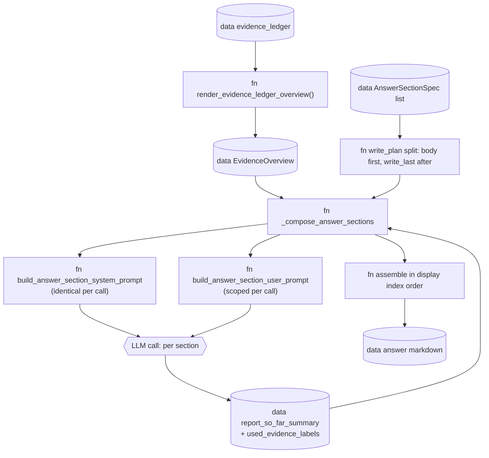

# Answer composition

## Scope

How Inqtrix turns the rendered EvidenceLedger overview into a multi-section
Markdown answer: one LLM call per section, the body sections first and the
write-last sections (Executive Summary / Kurzfazit) afterwards, with two
running memory fields (`report_so_far_summary` and `used_evidence_labels`)
carried between calls. Covers the exact system / user prompt structure, what
context each section receives, and the non-obvious coupling between the
record-ranking penalty for already-used labels and the soft user-prompt
hints.

Does NOT cover: how the evidence overview is built (see
[Evidence pipeline](evidence-pipeline.md)), the stop logic that runs before
the answer node (see [Stop criteria](../scoring-and-stopping/stop-criteria.md)
and [Confidence pipeline](../scoring-and-stopping/confidence.md)), or
provider-side authentication.

## Overview: one LLM call per section

The answer composer is `_compose_answer_sections()` in
`src/inqtrix/nodes.py` (~lines 970-1277). It iterates over the active
`AnswerSectionSpec` list (see
[report-profiles.md](../configuration/report-profiles.md)) and issues
**one `LLMProvider.complete_with_metadata()` call per section**. The final
answer is the per-section bodies joined in display order.



Each section call returns a Markdown body and a `finish_reason`. The
composer accumulates the bodies, tracks which `[E…]` labels were cited
(`used_evidence_labels`), and builds a rolling compaction of the bodies
(`report_so_far_summary`) for the next section.

## Write plan: body sections first, write-last sections last

`_compose_answer_sections()` builds its iteration order from the
`AnswerSectionSpec.write_last` flag (`src/inqtrix/report_profiles.py`):

```python
write_plan: list[tuple[int, AnswerSectionSpec]] = [
    (display_index, section_spec)
    for display_index, section_spec in enumerate(answer_sections, 1)
    if not section_spec.write_last        # body sections first
] + [
    (display_index, section_spec)
    for display_index, section_spec in enumerate(answer_sections, 1)
    if section_spec.write_last            # then write-last sections
]
```

Display order is preserved at assembly time: each rendered body is stored
in `rendered_by_display_index[idx]` and the final answer is
`"\n\n".join(rendered_by_display_index[i] for i in sorted(...))`.

**Worked example — DEEP profile (6 sections):**

| display_index | heading | write_last | LLM-call order |
|---|---|---|---|
| 1 | Executive Summary | True | **6** (last) |
| 2 | Hintergrund / Kontext | False | 1 |
| 3 | Analyse | False | 2 |
| 4 | Perspektiven / Positionen | False | 3 |
| 5 | Risiken / Unsicherheiten | False | 4 |
| 6 | Fazit / Ausblick | False | 5 |

Final answer order in Markdown: Executive Summary first, then sections
2-6 in their natural order. The body sections are written before
"Executive Summary" so that the summary can see them via
`report_so_far_summary`.

**COMPACT profile (4 sections):** "Kurzfazit" is `write_last=True` and
appears at display_index 1; the other three are written first.

## System prompt per section call

The system prompt for every section call is identical except for one
section-specific style block. It is built by
`build_answer_section_system_prompt()` in `src/inqtrix/prompts.py` (~line
398), which delegates to `_build_answer_system_prompt_with_style()` (~lines
405-702) for the bulk of the content. The block order is documented in
detail in [Evidence pipeline — Final answer system prompt](evidence-pipeline.md#final-answer-system-prompt);
in short:

1. **Header** (always): role, language, SICHERHEIT, SELBST-VERIFIKATION,
   PRAEZISION, ZEITLICHE PRAEZISION, FORMATIERUNGS-REGELN.
2. **CLAIM-KALIBRIERUNG** (conditional on non-empty source/claim counts).
3. **ABDECKUNGSREGEL** (conditional on non-empty `required_aspects`).
4. **EVIDENZTIEFE** (conditional on `evidence_depth_gap.active`).
5. **TRANSPARENZPFLICHT** (conditional on weak-evidence signals; in section
   mode further gated by whether the current section heading allows a
   transparency sub-section).
6. **Section style block** from `_build_section_answer_style()` in
   `prompts.py` (~lines 180-201): role line, current section position
   ("Aktueller Abschnitt: 3/6 -- **Analyse**"), section instruction,
   length guidance, format rules.
7. **EVIDENZ-UEBERSICHT** (always): the embedded `evidence_overview.markdown`
   from `render_evidence_ledger_overview()`.
8. **ZITATIONS-REGELN** (always): inline Markdown links labelled `E1`
   whose targets are in the allowlist, no separate "Quellen" list.

The crucial property: **the full evidence overview is in every section's
system prompt**. Sections are not given a scoped sub-overview -- the
record-driven Markdown block (potentially the full 180 KB / 30 KB) appears
in every call. Per-section steering happens in the user prompt via the
`section_focus_labels` advisory.

## User prompt per section call

The user prompt is built fresh per section by
`build_answer_section_user_prompt()` in `prompts.py` (~lines 204-274).
Quoted verbatim, conditionals included:

```python
lines = [
    "Nutzerfrage:",
    question,
    "",
    f"Schreibe jetzt nur den Abschnitt '{heading}'.",
    f"Abschnittsfokus: {instruction}",
]
if completed_headings:
    lines.extend([
        "",
        "Bereits abgeschlossene Abschnitte:",
        *[f"- {title}" for title in completed_headings],
        "Vermeide Wiederholungen und fuehre die Argumentation konsistent fort.",
    ])
if report_so_far_summary:
    lines.extend([
        "",
        "Bisherige Report-Zusammenfassung:",
        report_so_far_summary,
        "Fuehre die Argumentation fort, ohne dieselben Punkte neu aufzubauen.",
    ])
if used_evidence_labels:
    if synthesizing_existing:
        reuse_line = (
            "Stuetze deine Verdichtung auf diese Labels, wenn du Aussagen "
            "aus den geschriebenen Abschnitten zusammenfasst."
        )
    else:
        reuse_line = (
            "Nutze neue Evidence bevorzugt, wenn sie fuer diesen "
            "Abschnitt gleich gut passt."
        )
    lines.extend([
        "",
        "Bereits verwendete Evidence-Labels:",
        ", ".join(used_evidence_labels),
        reuse_line,
    ])
if section_focus_labels:
    lines.extend([
        "",
        "Fuer diesen Abschnitt besonders relevante Quellen (weiche Empfehlung,"
        " du darfst auch andere Quellen aus der Evidenz-Uebersicht zitieren):",
        ", ".join(section_focus_labels),
    ])
lines.extend([
    "",
    f"Gib nur den Abschnittsinhalt ohne die Hauptueberschrift '## {heading}' zurueck.",
])
return "\n".join(lines)
```

### Parameters

| Parameter | Type | What is passed | When |
|---|---|---|---|
| `question` | `str` | Original user question | every section |
| `heading` | `str` | e.g. "Hintergrund / Kontext" | every section |
| `instruction` | `str` | `AnswerSectionSpec.prompt_instruction` | every section |
| `completed_headings` | `list[str]` | Headings of already rendered sections | from section 2 onward |
| `report_so_far_summary` | `str` | Rolling 2400-char compaction of rendered body sections (`_compact_section_summary()`) | from section 2 onward; relevant especially for write-last sections |
| `used_evidence_labels` | `list[str]` | `[E1, E12, ...]` labels already cited in earlier sections | from section 2 onward |
| `section_focus_labels` | `list[str]` | Per-section selected visible-label hint list from `select_section_evidence_records()` | every section |
| `synthesizing_existing` | `bool` | `True` for write-last sections | only Executive Summary / Kurzfazit |

### Hidden coupling

- The full evidence overview is in the **system prompt** of every section
  call; `section_focus_labels` is an advisory bullet in the user prompt,
  not a filter. The LLM may cite any visible source label whose URL is in
  `EvidenceOverview.allowed_urls`.
  This is **intentional**: cross-section argumentation needs the same
  reference pool.
- `select_section_evidence_records()` in `src/inqtrix/evidence.py` (~line
  905) ranks records to pick the focus hints. Records whose label is in
  `used_evidence_labels` receive a **`-16` ranking penalty**, so coverage
  spreads naturally across sections. This is the only place the
  composer's running state mutates the renderer's behaviour.
- `synthesizing_existing=True` only changes the user-prompt wording
  ("Stuetze deine Verdichtung auf diese Labels …" instead of "Nutze neue
  Evidence bevorzugt …"). It does not forbid new citations -- a write-last
  section may still cite a record that no body section touched.

## `report_so_far_summary`: what goes to the summary-LLM

`_compact_section_summary()` in `src/inqtrix/nodes.py` (~lines 798-803):

```python
def _compact_section_summary(heading: str, text: str, max_chars: int = 900) -> str:
    """Return a deterministic compact summary of one rendered section."""
    compact = " ".join((text or "").split())
    if len(compact) > max_chars:
        compact = compact[:max_chars].rstrip() + "..."
    return f"{heading}: {compact}" if compact else ""
```

The composer concatenates one such line per rendered body section. The
result is then truncated from the front to keep at most 2 400 characters:

```python
report_so_far_summary = (f"{report_so_far_summary}\n{section_summary}").strip()
if len(report_so_far_summary) > 2400:
    report_so_far_summary = "..." + report_so_far_summary[-2400:]
```

**Effect on the Executive Summary call:** the write-last section sees two
parallel views:

- in the **system prompt**, the full record-driven evidence overview (every
  citation it could reference);
- in the **user prompt**, a `Heading: 900-char whitespace-normalized body
  ...` compaction of every body section.

That lets the summary either cite directly from a record or fold an
argument that the body already developed. The composition is plain text,
not structured -- no claim IDs, no argument categories. This is a
documented [simplification candidate](../scoring-and-stopping/calculation-overview.md#surfaced-complexity-candidates-for-code-simplification).

### Synthetic example (after 3 rendered body sections)

```text
Bisherige Report-Zusammenfassung:
Hintergrund / Kontext: Die GKV-Reformkommission hat im April 2026 erstmals
einen Vorschlag zur Privatisierung bestimmter Zahnersatzleistungen formuliert
[E3], begruendet ueber die laufenden Beitragsdebatten ... [E7][E12]
Analyse: Drei zentrale Treiber wurden identifiziert: 1) Beitragssatzanstieg
in 2025 [E1], 2) wachsende Demografie-Last [E4], 3) Praezedenzfaelle in NL
und CH [E15] ...
Perspektiven / Positionen: KZBV widerspricht (Pressemitteilung [E3]),
waehrend Patientenschutzverbaende einen Mittelweg vorschlagen [E8] [E20] ...

Fuehre die Argumentation fort, ohne dieselben Punkte neu aufzubauen.

Bereits verwendete Evidence-Labels:
E1, E3, E4, E7, E8, E12, E15, E20

Stuetze deine Verdichtung auf diese Labels, wenn du Aussagen
aus den geschriebenen Abschnitten zusammenfasst.
```

## `used_evidence_labels` tracking

Source: `_extract_evidence_labels()` in `nodes.py` (~lines 768-770).
Regex extracts every `[E\d+]` token from each rendered section body. The
composer accumulates the set across the run:

```python
used_evidence_labels: set[str] = set()
# ... for each section body that renders successfully:
used_evidence_labels.update(_extract_evidence_labels(section_body))
```

The label set is used in **two places**:

1. **Soft hint in the user prompt** (above). Wording depends on
   `synthesizing_existing`.
2. **Hard penalty in the focus ranking** inside
   `select_section_evidence_records()`: records whose label is in
   `used_evidence_labels` receive `score -= 16`. This deliberately spreads
   the source coverage so later body sections do not all keep reaching for
   the same few records.

The two effects compound: the user prompt says "prefer new evidence", and
the focus hint independently surfaces less-used records. The LLM is never
**forbidden** from re-citing a label; it just has to overcome both nudges.

## AnswerSectionSpec reference

File: `src/inqtrix/report_profiles.py` (`class AnswerSectionSpec`, lines
28-65). Fields:

| Field | Type | Meaning |
|---|---|---|
| `heading` | `str` | The Markdown `##` heading rendered for the section. |
| `prompt_instruction` | `str` | Section instruction; goes into both the system style block and the user prompt as "Abschnittsfokus". |
| `length_guidance` | `str` | Qualitative length hint ("3-4 Saetze", "ausfuehrlich, 6-10 Saetze"). |
| `required` | `bool` | When False, the section is skipped if it would not fit time/token budget. |
| `write_last` | `bool` | When True, this section is written **after** all `write_last=False` sections, so it can see the body via `report_so_far_summary`. |

### COMPACT (`_COMPACT_ANSWER_SECTIONS`, report_profiles.py:155)

| display_index | heading | write_last |
|---|---|---|
| 1 | Kurzfazit | **True** |
| 2 | Kernaussagen | False |
| 3 | Detailanalyse | False |
| 4 | Einordnung / Ausblick | False |

### DEEP (`_DEEP_ANSWER_SECTIONS`, report_profiles.py:194)

| display_index | heading | write_last |
|---|---|---|
| 1 | Executive Summary | **True** |
| 2 | Hintergrund / Kontext | False |
| 3 | Analyse | False |
| 4 | Perspektiven / Positionen | False |
| 5 | Risiken / Unsicherheiten | False |
| 6 | Fazit / Ausblick | False |

## Concrete walkthrough: one DEEP run

Setup: question about GKV / Privatisierung Zahnleistungen, `evidence_ledger`
has 18 report-eligible records, depth-gap is active (3 verified, 1
cross-checked, 2 single-source-quality), `evidence_overview.markdown` is
40 KB. The composer runs in write order **1 → 2 → 3 → 4 → 5 → 6 in
display order is 2 → 3 → 4 → 5 → 6 → 1**.

### Call 1 — Hintergrund / Kontext (display 2/6)

System prompt: Header + CLAIM-KALIBRIERUNG + ABDECKUNGSREGEL +
EVIDENZTIEFE (active) + section style ("Aktueller Abschnitt: 2/6 --
**Hintergrund / Kontext** ...") + EVIDENZ-UEBERSICHT + ZITATIONS-REGELN.

User prompt: `question`, "Schreibe jetzt nur den Abschnitt 'Hintergrund /
Kontext'", `completed_headings=[]`, empty `report_so_far_summary`, empty
`used_evidence_labels`, `section_focus_labels=[E3, E7, E12]`,
`synthesizing_existing=False`.

LLM output (synthetic): "Die GKV-Reformkommission hat im April 2026 ..."
with inline citations labelled `E3` and `E12` at their allowlisted source URLs.
→ `used_evidence_labels={E3, E7, E12}` after `_extract_evidence_labels`.

### Call 2 — Analyse (display 3/6)

User prompt now carries:
- `completed_headings=["Hintergrund / Kontext"]`
- `report_so_far_summary="Hintergrund / Kontext: Die GKV-Reformkommission hat ..."`
- `used_evidence_labels=[E3, E7, E12]` with the "Nutze neue Evidence
  bevorzugt" line
- `section_focus_labels=[E1, E4, E15]` (the focus ranker assigned `-16` to
  E3/E7/E12 so they did not surface again)

LLM output cites E1, E4, E15 (and maybe E12 again if the argument needs
it).

### Calls 3, 4, 5 — Perspektiven / Positionen, Risiken, Fazit

Each call sees the accumulated state. By the end of call 5, the composer
has `used_evidence_labels={E1, E3, E4, E7, E8, E12, E15, E20}` and a
`report_so_far_summary` near 2400 chars (older summary lines start dropping
from the front).

### Call 6 — Executive Summary (display 1/6, write_last)

System prompt: same as call 1 except the section style is now
"Aktueller Abschnitt: 1/6 -- **Executive Summary**".

User prompt:
- `completed_headings=["Hintergrund / Kontext", "Analyse", "Perspektiven /
  Positionen", "Risiken / Unsicherheiten", "Fazit / Ausblick"]`
- `report_so_far_summary` = the full body compaction (last 2400 chars)
- `used_evidence_labels=[E1, E3, E4, E7, E8, E12, E15, E20]` with the
  "Stuetze deine Verdichtung auf diese Labels …" line
- `synthesizing_existing=True`
- `section_focus_labels=[E1, E3, E4]` (top-ranked overall)

LLM output (synthetic, ~600 chars): a concentrated summary that mostly
re-cites the labels the body already used.

### Final assembly

`rendered_by_display_index[1]` = Executive Summary, `[2]` = Hintergrund,
…, `[6]` = Fazit / Ausblick. Sorted: 1, 2, 3, 4, 5, 6. The final answer
reads with the Executive Summary on top, exactly as if it had been written
first.

## Surfaced complexity: section composer

| Item | Status |
|---|---|
| Full evidence overview in every section's system prompt; `section_focus_labels` is only an advisory hint in the user prompt | **documented** (intentional design — cross-section argumentation needs the same reference pool) |
| `used_evidence_labels` has two effects: soft hint in the user prompt AND `-16` hard penalty in `select_section_evidence_records()` | **documented** (intentional spreading mechanism) |
| `report_so_far_summary` is plain-text compaction with `Heading: 900-char body`, no structured claim IDs or argument categories | **simplification candidate** -- a structured summary with claim IDs would let the write-last section avoid drift; see [calculation-overview.md](../scoring-and-stopping/calculation-overview.md#surfaced-complexity-candidates-for-code-simplification) |
| `synthesizing_existing=True` only changes user-prompt wording, does not forbid new citations | **documented** (intentional softness) |
| Write order ≠ display order: write-last sections run last but appear at their declared display index | **documented** here and in [nodes.md](nodes.md) |

## Related docs

- [Nodes](nodes.md) -- the answer node at a glance, plus citation allowlist.
- [Evidence pipeline](evidence-pipeline.md) -- how `EvidenceOverview` and the system-prompt blocks are built.
- [Knowledge retrieval](knowledge-retrieval.md) -- the single quote-then-answer prompt for `mode=knowledge`, contrasted with this per-section composer.
- [Confidence pipeline](../scoring-and-stopping/confidence.md) -- triggers for the conditional CLAIM-KALIBRIERUNG / EVIDENZTIEFE / TRANSPARENZPFLICHT blocks.
- [Report profiles](../configuration/report-profiles.md) -- where `AnswerSectionSpec` lists and char budgets live.
- [Worked example](../reference/worked-example.md) -- one concrete run end-to-end, including all six section LLM calls.
