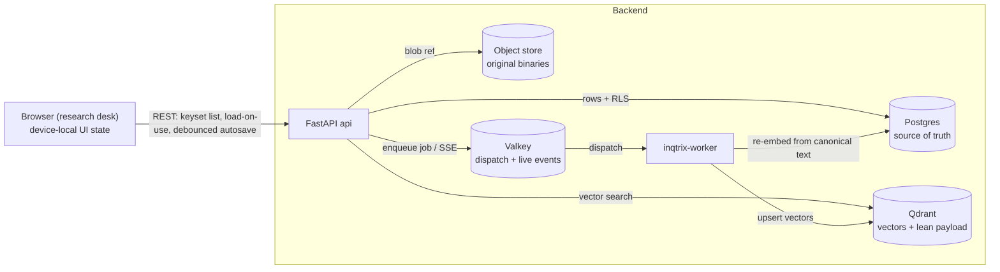

# Data architecture

This page is the map of **where each kind of data lives, why it lives there,
and how it is loaded**. It covers the platform (HTTP serving) deployments, not
the library mode (a single `research()` call holds everything in memory). Read
it when you need to reason about persistence, latency, sharing, or the
local-first vs server-persistent split.

The guiding rule, applied everywhere below:

> **Postgres is the relational source of truth. Qdrant holds only vectors +
> a lean payload. The object store holds original binaries. Valkey is a
> dispatch/live-event channel, never a system of record. The browser keeps
> only device-local UI state.**

Latency comes from **keyset pagination + a client cache + load-on-use**, not
from a server read-cache.

## The five stores and why

| Store | Role | Why here |
|---|---|---|
| **Postgres** (one database, many tables) | Relational source of truth: identity / workspaces / shares / quota, runs + run events, files registry, prompt templates, knowledge collections / documents / chunk text, indexing-job rows, and the M6 project tier (chat, editor, file-asset records, knowledge-session records, vector-index records, account preferences). | One transactional, joinable, backup-able store. Sharing, ownership, and cross-entity queries are plain SQL. Row-level security (RLS) enforces tenant isolation in the database itself. |
| **Qdrant** | Vectors + a lean payload only (document id, chunk id, collection id, tenant, filter metadata — under ~1 KB). | A vector index is a read index, not a record store. Keeping full text or metadata in the payload is the anti-pattern M2 removed; the canonical text is relational in Postgres, so a re-embed always has an authoritative source. |
| **Object store** (S3 / SeaweedFS / local volume) | Original binaries (PDF, DOCX, …) via the files registry. | Binaries do not belong in Postgres rows. Postgres keeps a reference (`server_file_id`); the bytes stay external. |
| **Valkey** | Job dispatch + live SSE buffering for runs and indexing jobs. | Durability lives in the Postgres job rows; Valkey only fans work out to the worker and carries live progress. Losing Valkey loses no committed state. |
| **Browser `localStorage`** | Device-local UI state only: theme/contrast/preset/user bubble tone (when offline), editor panel widths, scroll, drafts (`editorUi` / `ui`). | Per-device, sub-millisecond, never a server round-trip. Note: when a real session is active, theme/locale/contrast/user bubble tone are promoted to the account tier (see below) and `localStorage` becomes a fallback. |

## The storage matrix

Every row: where it lives, how the client loads it, what caches it, and the
latency note. This is the reference; the prose above explains the *why*.

| Data | Store | Loading | Cache | Note |
|---|---|---|---|---|
| Original files (PDF/DOCX) | Object store + Postgres reference | lazy (download/preview) | browser HTTP | never a Postgres BLOB above ~5 MB |
| Extracted / chunk text (RAG source) | **Postgres TEXT** (canonical) | first page eager, rest lazy | client | full text in the Qdrant payload is an anti-pattern |
| Embeddings / vectors | **Qdrant only** | at search time | Qdrant internal | no Postgres duplication |
| Chat threads (list) | Postgres, keyset | eager first page (metadata) | client | thread metadata only on the list |
| Chat messages | Postgres, keyset | eager on thread open | client | composite PK `(thread_id, id)` isolates threads |
| Knowledge session groups | Postgres | eager (metadata) | client | folder records; deleting a group orphans sessions |
| Knowledge sessions | Postgres | metadata eager, items load-on-open | client | list/get include `group_id`; `items_json` excluded from list |
| Editor documents (body) | **Postgres TEXT** | **load-on-open** | client | debounced autosave; body excluded from the list |
| Editor comments | Postgres (idx `document_id`) | lazy (on open) | client | composite PK `(document_id, id)`; cascade on doc delete |
| Editor suggestions | **not persisted** (transient) | — | — | regenerable from an AI run |
| File-asset records (+ extracted text) | Postgres (binary in object store) | metadata eager, **body load-on-use** | client | record relational, blob external |
| Vector-index records (file↔collection) | Postgres (full record) | eager (small) | client | members + capped history travel with the record |
| Account preferences | Postgres (per user) | eager on login | React state | theme, locale, contrast, and user bubble tone follow the user, not the workspace |
| Device UI state (panels, scroll, drafts) | Browser `localStorage` | eager (mount) | localStorage | no server round-trip |
| Auth sessions | Postgres | eager (init) | memory | cookie session |
| Job / progress state | Postgres job rows (durable) / in-memory (M1 fallback) | status poll / SSE | — | `FOR UPDATE SKIP LOCKED` |
| Job event stream | Postgres `*_events` + Valkey | SSE live | Valkey buffer | durability in Postgres |

## Two deployment realities

The same frontend runs in two modes, and the **capability flag** decides which:

- **Plain (`.env`, no Docker)** — no Postgres, no Qdrant, no object store. The
  research desk is **local-first**: the project lives in a local markdown
  directory / zip the user picks, and nothing syncs to a server. Indexing and
  RAG do not exist here.
- **Full stack (`docker compose`)** — Postgres + (optionally Qdrant + Valkey +
  `inqtrix-worker` + object store). Here everything above can become
  **server-persistent**.

The switch is **capability-gated**. The server advertises
`features.project_persistence` (true only when the durable backend is on:
`INQTRIX_STORAGE_BACKEND=postgres`). How sync turns on then depends on the auth tier:

- **Authenticated cookie session (`local`/`oidc`/`ldap`) — automatic, server-first.**
  The desk derives `serverSyncEnabled` from the live session, so the project
  auto-hydrates from the server on every boot/reload and autosaves with **no button**.
  Data is scoped to a per-user namespace (below), so it survives reload + re-login and
  follows the user across devices. The server-first boot starts from an empty state and
  hydrates, so it does **not** re-push on boot. There is no import button in this tier.
- **`apikey` / local-first — manual opt-in.** The desk shows an explicit "move this
  project to the server" import (the button appears iff
  `canPersistProject && !serverSyncEnabled`); once a user opts in (`serverSyncEnabled`),
  the per-entity sync hooks hydrate the just-pushed data and take over autosave.

Without the capability, the desk stays local-first. No data is migrated behind the
user's back, and the local project is never mutated by the import.

**Per-user namespace.** `workspace_id` is a free-form UI namespace, never an auth
input (authorization is `created_by_sub`). A fresh browser mints a random `ws_…`; on
the first authenticated boot the server **adopts** that id as the user's canonical
`users.default_workspace_id` (idempotent, atomic set-only-when-NULL) and returns it as
`project_namespace` from `/api/auth/session`. Every device then resolves the same
namespace from the session, so an authenticated user's project follows them with **zero
migration** — the originating browser's id IS the adopted namespace, so the data
reappears at once. The desk computes `effectiveWorkspaceId` (the namespace when
authenticated + capable, else the browser-local id) and scopes every project-data and
run call to it from a single source of truth. The flip to the namespace is in lockstep
with the desk becoming usable, so the sync lifecycle keys on the namespace from its
first hydrate and never re-keys off the browser id. The server-side
`workspaces`/`workspace_members` tables are a separate sharing/collab concept and are
not touched.

## The project-persistence tier (M6)

Each project entity follows the same faithful pattern: an ORM table → a linear
Alembic migration (with RLS + GRANT + CHECK boilerplate) → a port → a memory
implementation (offline/test) + a Postgres implementation → a service (scoping
+ validation) → a thin per-surface router → capability-gated frontend hooks.

**Scoping.** Every project row is scoped `(tenant_id, created_by_sub,
workspace_id)` — "this user's data in the current workspace", the
one-project-per-`(user, workspace)` model. `created_by_sub` is the principal's
subject for real sessions (`oidc_session` / `pat`) and `None` for
anonymous/static deployments. RLS enforces tenant isolation in the database;
per-user scoping is applied in the service layer.

**Autosave.** A shared `syncCollection` diff loop pushes entities whose
fingerprint (usually `updatedAt`) changed and deletes those the local project
no longer has, against an in-memory "what the server holds" map. On hydration
that map is seeded to the **server's** `updatedAt` so a local-newer entity is
pushed up rather than stranded. Server upserts are idempotent
(`on_conflict_do_update`) and never reassign `created_at` or ownership.

These behaviours are worth calling out because they are where data-loss bugs
hide:

- **Re-arm on project identity, not just on the sync toggle.** The project-scoped
  hooks (chat, editor, file assets, knowledge sessions, vector indexes) key their reset+hydrate
  lifecycle on a project identity — `${workspaceId}:${projectEpoch}`, where
  `projectEpoch` is an ephemeral counter bumped on every wholesale project-state
  replace — via the shared `useProjectSyncLifecycle`. Switching to a *different*
  project that is also server-synced keeps the sync gate true but changes the
  identity, so each project re-hydrates from its **own** server state instead of
  inheriting the previous project's "what the server holds" map and deleting that
  project's rows on the next autosave. (Account preferences are account-scoped
  and deliberately re-arm on login instead — see below.) As defense-in-depth, the
  owner-only DELETE endpoints also refuse a request whose workspace namespace
  differs from the resource's (symmetric with how list filters `workspace_id`);
  edit-level deletes such as comments are exempt so shared collaborators still
  work.
- **Load-on-use for heavy bodies.** An editor document's `content_markdown` and
  a file asset's `extractedText` are excluded from the list (metadata-first)
  and fetched on demand. The invariant: a body is *authoritative locally* once
  loaded or once present at hydrate, and a metadata-only edit on an
  unloaded server entity must fetch the server body **before** a full-record
  PUT, or the empty local body would erase it. Editor documents load on open
  (the selected document); file assets have no per-asset "open" event, so their
  body loads **on use** — prefetched when a chip is attached to chat and awaited
  before send / before an index build / before an editor AI run, so a freshly
  hydrated body is never sent empty.
- **Knowledge sessions mirror Chat folders but keep item bodies lazy.**
  `knowledge_session_groups` are server records, and
  `knowledge_sessions.group_id` is a nullable membership FK. The frontend
  hydrates groups before sessions, saves groups before sessions, and includes
  `group_id` in the session fingerprint so moving a session into a folder is
  an autosaved metadata change. The heavy `items_json` body loads only through
  single-session GET. Deleting a group sets member sessions back to ungrouped
  (`ON DELETE SET NULL` in Postgres, explicit orphaning in the memory store).
  The untouched bootstrap placeholder remains local; a renamed or user-created
  empty session is persisted as real user state.
- **Defer-while-indexing for vector indexes.** A vector-index record carries
  its members and a capped run history with it (replaced wholesale on upsert).
  Live reindex progress lives in a separate, **non-serialized** map, so the
  autosave never fires on a progress tick. The autosave also defers the push
  while `status === 'indexing'`, so the server only ever holds a terminal
  status — a second device never sees a frozen spinner, and a crashed run never
  strands one. A persisted `indexing` status is reconciled to the pre-run
  status on load (no run survives a reload).
- **Account preferences follow the user.** Theme / locale / contrast / user
  bubble tone are an
  account tier (one row per `(tenant, sub)`), not project data, and are
  deliberately excluded from the project import. On a real per-user session the
  saved row is applied over the device's preferences on login ("account wins");
  a project file's embedded preferences are ignored while a session drives the
  account tier, so loading a file never overwrites the account. Anonymous /
  apikey sessions do not sync preferences (a single shared subject would let one
  visitor clobber another).

**Suggestions are not persisted.** Editor AI suggestions are transient — they
are regenerable from an AI run, and only acceptance/rejection mutates the
document. Persisting them as their own entity is a deliberate non-goal.

## Tenant isolation

Every Postgres table that holds tenant data is protected by two layers:

1. **Row-level security (RLS), fail-closed.** Each request resolves to a
   `Principal` carrying a `tenant_id`. The store opens its work inside a
   `tenant_session` wrapper that runs under a restricted role
   (`inqtrix_app`, `NOBYPASSRLS`) and sets a transaction-local GUC; the RLS
   policy on every table is `tenant_id = (SELECT inqtrix_current_tenant_id())`,
   `ENABLE`d **and** `FORCE`d. With no tenant set the resolver returns a value
   that matches nothing, so a missing tenant denies rather than leaks.
2. **Explicit query predicates.** The stores also filter `tenant_id` (and, for
   project rows, `created_by_sub` / `workspace_id`) in the SQL itself, so
   per-user scoping is enforced in the service/store layer on top of the
   database-level tenant boundary.

The shared lifecycle for the project tier lives in
`src/inqtrix/project/base_session_store.py` (the dedicated NullPool engine +
`tenant_session`); the policy/GRANT boilerplate is applied uniformly in each
Alembic migration.

## Durable jobs and concurrency

Runs and indexing jobs are durable Postgres rows claimed with
`FOR UPDATE SKIP LOCKED`, with Valkey used only to dispatch work to the
`inqtrix-worker` and to fan out live SSE. This is the right design while worker
concurrency stays modest (order ~100 workers). Beyond that, move the *dispatch*
onto Valkey / Redis Streams (Postgres still owning the durable rows) before
reaching for a dedicated broker. The reindex tier is low-concurrency, so this
is a documented operating regime, not a current divergence.

## List loading and pagination contract

Lists are split by how they grow:

- **Keyset-paginated** (opaque `(created_at, id)` cursor): the per-document
  knowledge list (`/v1/knowledge/collections/{id}/documents`) and every M6
  project-tier list endpoint (chat threads/messages, editor documents/comments,
  file assets, vector indexes). These can grow per user, so the API exposes
  `cursor`/`limit`.
- **Intentionally NOT paginated** (carved out, by design):
  - **`/v1/runs`** lists native-run status plus completed reports. In the
    **in-memory** store it is a *transient* surface — a short replay TTL
    (`run_completed_ttl_seconds`, default 300s) bounds the per-run event buffer. In
    the **durable (Postgres)** store, terminal runs are retained for a generous
    window (`run_durable_retention_seconds`, default 90 days), so a user's completed
    research **reports survive reloads, re-logins, and other devices** — scoped to
    the per-user namespace like the project tier. Either way the list is age-bounded
    and cannot grow without bound, so `/v1/runs` stays deliberately exempt from keyset
    pagination unless a deployment shows pressure. Runs pruned before they were made
    durable (or past the retention window) are gone — there is no un-prune.
  - **`/v1/prompt-templates`** is a small per-user library (chat rules + saved
    prompts); it is fetched whole today and only graduates to keyset pagination
    if a real deployment shows it growing materially.
  - **`/v1/knowledge/collections`** and **`/v1/shares/shared-with-me`** are
    list-all today, an **intentional scale ceiling, not an accidental omission**.
    Realistic cardinalities are small (collections are heavyweight, hand-curated
    sets — single-to-low-double digits per workspace; shared-with-me is a
    selective grant list, tens per user), the Desk UI does not even render the
    collections list (it derives collections from the local vector-index records),
    and keyset pagination for both is disproportionately complex: collections are
    an owned-plus-shared-in **union** and shared-with-me is a union over the
    caller's user-subject **and every group** they belong to (with the
    highest-grant reduction done in application code), neither of which keysets as
    a single-table scan. They graduate to keyset pagination only above concrete
    thresholds — roughly **>500 collections** or **>1000 shared resources** per
    user — or once the Desk UI starts consuming these lists heavily. Removing the
    unbounded query without a cursor is not an option (it would silently hide
    rows — a No-Silent-Fallbacks violation), so the choice is genuinely
    list-all-now vs. full-keyset-later, and full keyset is deferred until the data
    warrants it.

### Frontend loading policy (and the reference-map constraint)

The frontend loads a list incrementally **only when its entities are not
resolved by id from elsewhere**:

- **Chat threads** have no incoming cross-references (only their own order
  arrays + the selected id), so they load **truly on-demand**: page one first,
  then cursor-based load-more / infinite scroll. The autosave stays safe because
  its delete-detection only diffs *loaded* entities against the synced map — and
  you can only delete what is displayed, so an un-loaded entity is never mistaken
  for a local deletion.
- **Editor documents** already load their heavy data lazily — the list returns
  metadata only (`content_markdown=""`) and the body loads on open. The metadata
  tree itself is **not** lazily loaded on expand (deferred — see the limitation
  below); instead the editor offers a **client-side title search** that filters
  the already-loaded metadata across all folders (instant, no round-trip, works
  in the local-first tier too).
- **File assets** and **vector indexes** must keep their **metadata resident**:
  `fileAssets` is resolved by id from vector-index members, chat attachments,
  chat-rule context, and group expansion, so a partially-loaded asset map would
  silently break those references (a broken index member, an empty attachment).
  Their metadata is therefore the project's **reference map** — loaded fully but
  non-blocking (no blocking upfront walk; the heavy `extractedText` / vector
  payload stays lazy as always). Vector indexes are few per user and depend on
  assets being resolvable, so they are not paginated either.

Making assets themselves truly on-demand would require turning every
`fileAssets[id]` lookup into a load-aware async resolution (a reference-aware
project-store / resolver) — a deliberate, separate effort, **not** folded into
the metadata-first scale-proofing. The sharing/knowledge lists
(`/v1/knowledge/collections`, `/v1/shares/shared-with-me`) stay list-all by
design (see the pagination contract above) — realistically small and not the
desk's growable surfaces — so they have no incremental UI consumer today.

**Known limitation — lazy hydrate vs. the local-full project (re-push).** This
applies to the **manual local→server import path** (apikey / local-first), not to
the authenticated server-first boot. An authenticated cookie session now opens
**server-first** — it starts from an empty state and hydrates from the server
(exactly the "server-first project open" foundation noted below), so there is no
local-full project to re-push. The limitation below is therefore scoped to the
import path and to opening a local markdown into an already-synced project.

On that path, a server-synced project is opened from the local markdown, which
loads **every** entity (chat threads, editor documents with bodies). The autosave
seeds its "what the server holds" (synced) baseline only for entities the lazy
hydrate actually **fetched** (page one), so the first reconciling flush
re-pushes every un-fetched-but-local entity. This is **not** data loss (the
no-spurious-delete invariant holds) and is idempotent + one-time per session.
For chat it is cheap (a hydrated thread carries no loaded messages, so only
thread metadata re-pushes) and is accepted as-is. It is the reason the editor
metadata tree is **not** lazily loaded: doing so would re-push document **bodies**
on every open. Removing the re-push entirely (and enabling a genuinely lazy
editor tree) needs one of two foundations, deferred until planned: a **durable
per-entity last-synced baseline** persisted in the project so hydrate can seed
the full synced map without fetching, or a **server-first project open** where a
synced project hydrates lazily from the server and the local markdown becomes an
export, not the live source.

## Sharing

Sharing is polymorphic over the durable tier: a single `resource_shares` ACL
covers **research runs**, **indexed knowledge collections** (so a recipient can
ask questions over shared documents), and **prompt templates** — not the
private project tier. Ownership + ACL + document metadata are all relational in
Postgres, so "who can see what" is a join, and an access decision returns the
indistinct not-found rather than leaking a resource's existence.

### Consent gate

A share is **not active on grant** — the recipient must consent first. The
`resource_shares.accepted_at` column carries the state: `NULL` = pending (the
owner granted, but the recipient has not accepted), non-`NULL` = accepted
(active). The consent is enforced at a single chokepoint: the read side
(`ShareRepository.permission_for` and the shared-with-me union
`shares_for_subjects`) filters `accepted_at IS NOT NULL`, so a pending share
grants nothing anywhere — runs, collections, and templates all inherit the gate
without a per-feature branch. Re-granting (e.g. raising view→edit) carries the
recipient's existing acceptance forward, so a permission change never drops a
recipient back to pending. The migration backfills pre-existing active shares
to accepted, so an upgrade does not silently revoke anyone.

The recipient surface lives behind `/v1/shares`: `GET /v1/shares/inbox` returns
the caller's incoming shares split into `pending` (the consent queue) and
`accepted` (shared with me); `POST /v1/shares/{id}/accept` consents; `DELETE
/v1/shares/{id}` is one verb for two callers — the owner revokes, or the
recipient drops their own share (declines a pending one, leaves an accepted
one). `GET /v1/shares/mine` lists what the caller has shared out. The
Research-Desk renders all of this in **Settings → Freigaben** (three sections),
gated on `features.sharing` + a cookie session, with a pending-invitation count
badge on the settings nav.

## Hot path on app start

Target ~100–150 ms to interactive: in parallel, fetch identity + account
preferences + the **first page** of the primary list (paginated metadata).
Everything else is lazy / load-on-open. There is no monolithic state rebuild
and no server read-cache — keyset pagination + the client cache + load-on-use
are sufficient. A Redis/Valkey read-cache is a deliberate carve-out, justified
only by repeated identical hot queries (>5 req/s) or >50 ms queries.

## Thresholds

- Binary **>5 MB** → object store (never a Postgres BLOB); **>100 MB**
  mandatory external.
- Extracted text stays in Postgres `TEXT` (TOAST); only **>~100 MB per
  document** would move it to the object store with a Postgres reference.

## Where this lives in code

- Postgres ORM + migrations: `src/inqtrix/storage/*_orm.py`,
  `src/inqtrix/storage/migrations/versions/`.
- Knowledge (Postgres-canonical + Qdrant `VectorIndex` seam):
  `src/inqtrix/knowledge/`, `src/inqtrix/services/knowledge_service.py`.
- Durable jobs + worker: `src/inqtrix/runs/`, `src/inqtrix/worker/`,
  `src/inqtrix/storage/indexing_jobs_orm.py`.
- Project tier: `src/inqtrix/project/` (ports + memory/postgres stores +
  `base_session_store.py`), `src/inqtrix/services/*` (chat/editor/asset/
  vector-index/account-preferences services), `src/inqtrix/server/routers/*`.
- Keyset pagination: `src/inqtrix/pagination.py`.
- Frontend sync: `apps/research-desk/src/features/*/`+`syncCollection.ts`,
  the per-entity `use*HistoryApi` / `useAccountPreferences` hooks, and the
  project-level `useProjectServerImport`.
- Per-user namespace: `users.default_workspace_id`
  (`src/inqtrix/storage/identity_orm.py` + migration `0019`),
  `UserDirectory.resolve_default_workspace` (`src/inqtrix/auth/directory.py`,
  `src/inqtrix/storage/auth_postgres.py`), surfaced as `project_namespace` by
  `session_payload` (`src/inqtrix/auth/oidc.py`); the desk resolves
  `effectiveWorkspaceId` in `ResearchDesk.tsx` from `useAuthSession` +
  `useServerDiscovery`.
- Durable run retention: `run_durable_retention_seconds`
  (`src/inqtrix/settings.py`) wired into `PostgresRunStore` by `build_run_store`
  (`src/inqtrix/server/container.py`); run scoping lives in
  `apps/research-desk/src/features/researchRuns/useResearchRunApi.ts`.
