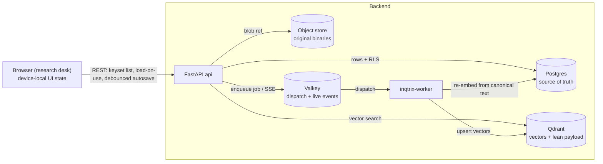

# Data architecture

## Scope

This page is the map of **where each kind of data lives, why it lives there,
and how it is loaded**. It covers the platform (HTTP serving) deployments, not
the library mode (a single `research()` call holds everything in memory). Read
it when you need to reason about persistence, latency, sharing, or the
local-first vs server-persistent split.

The guiding rule, applied everywhere below:

> **Postgres is the relational source of truth. Qdrant holds only vectors +
> a lean payload. The object store holds original binaries. Valkey is a
> dispatch/live-event channel, never a system of record. The browser keeps
> only device-local UI state.**

For an editor document converted to collaboration mode, the Yjs binary update
journal and verified snapshots inside PostgreSQL are the body source of truth;
its Markdown column is a derived projection. This is the only project-tier
exception to treating the relational text body itself as authoritative.

Latency comes from **keyset pagination + a client cache + load-on-use**, not
from a server read-cache.

## The five stores and why

| Store | Role | Why here |
|---|---|---|
| **Postgres** (one database, many tables) | Relational source of truth: canonical user UUIDs / workspaces / direct shares / quota, runs + run events, user invalidations, files registry, prompt and skill templates, knowledge collections / documents / chunk text, indexing-job rows, and the project tier (chat, editor text or collaboration binaries, file-asset records, knowledge-session records, vector-index records, account preferences). | One transactional, joinable, backup-able store. Sharing, ownership, audit, invalidation, and cross-entity queries commit together. Row-level security (RLS) enforces tenant isolation in the database itself. |
| **Qdrant** | Vectors + a lean payload only (document id, chunk id, collection id, tenant, filter metadata — under ~1 KB). | A vector index is a read index, not a record store. Keeping full text or metadata in the payload is the anti-pattern M2 removed; the canonical text is relational in Postgres, so a re-embed always has an authoritative source. |
| **Object store** (S3 / SeaweedFS / local volume) | Original binaries (PDF, DOCX, …) via the files registry. | Binaries do not belong in Postgres rows. Postgres keeps a reference (`server_file_id`); the bytes stay external. |
| **Valkey** | Job dispatch + live SSE buffering for runs and indexing jobs. | Durability lives in the Postgres job rows; Valkey only fans work out to the worker and carries live progress. Losing Valkey loses no committed state. |
| **Browser `localStorage`** | Device-local UI state only: theme/contrast/preset/user bubble tone (when offline), editor panel widths, scroll, drafts (`editorUi` / `ui`). | Per-device, sub-millisecond, never a server round-trip. Note: when a real session is active, theme/locale/contrast/user bubble tone are promoted to the account tier (see below) and `localStorage` becomes a fallback. |

## The storage matrix

Every row: where it lives, how the client loads it, what caches it, and the
latency note. This is the reference; the prose above explains the *why*.

| Data | Store | Loading | Cache | Note |
|---|---|---|---|---|
| Original files (PDF/DOCX) | Object store + Postgres reference | lazy (download/preview) | browser HTTP | never a Postgres BLOB above ~5 MB |
| Extracted / chunk text (RAG source) | **Postgres TEXT** (canonical) | first page eager, rest lazy | client | full text in the Qdrant payload is an anti-pattern |
| Embeddings / vectors | **Qdrant only** | at search time | Qdrant internal | no Postgres duplication |
| Chat threads (list) | Postgres, keyset | eager first page (metadata) | client | thread metadata only on the list |
| Chat messages | Postgres, keyset | eager on thread open | client | composite PK `(thread_id, id)` isolates threads |
| Knowledge session groups | Postgres | eager (metadata) | client | folder records; deleting a group orphans sessions |
| Knowledge sessions | Postgres | metadata eager, items load-on-open | client | list/get include `group_id`; `items_json` excluded from list |
| Editor documents (Markdown mode) | **Postgres TEXT** | **load-on-open** | client | revision-CAS debounced autosave; body excluded from the list |
| Editor documents (collaboration mode) | **Postgres Yjs updates + verified snapshots** | WebSocket join; Markdown projection for read-only/fallback consumers | active Y.Doc | binary state is truth; durable ack follows commit; Node has no persistence volume |
| Editor comments | Postgres (idx `document_id`) | lazy (on open) | client | composite PK `(document_id, id)`; cascade on doc delete |
| Editor suggestions | transient for Markdown mode; Postgres patch metadata + Yjs marks for collaboration mode | assistant/changes inspector | active Y.Doc + client | collaboration decisions are idempotent server mutations; AI drafts stay private until publication |
| File-asset records (+ extracted text) | Postgres (binary in object store) | metadata eager, **body load-on-use** | client | record relational, blob external |
| Vector-index records (file↔collection) | Postgres (full record) | eager (small) | client | members + capped history travel with the record |
| Account preferences | Postgres (per user) | eager on login | React state | theme, locale, contrast, and user bubble tone follow the user, not the workspace |
| Device UI state (panels, scroll, drafts) | Browser `localStorage` | eager (mount) | localStorage | no server round-trip |
| Auth sessions | Postgres | eager (init) | memory | cookie session |
| Job / progress state | Postgres job rows (durable) / in-memory (M1 fallback) | status poll / SSE | — | `FOR UPDATE SKIP LOCKED` |
| Job event stream | Postgres `*_events` + Valkey | SSE live | Valkey buffer | durability in Postgres |
| User invalidations | Postgres `user_events` / bounded memory queue | one per-user SSE channel | client refetch | content-free refetch signal, 24-hour retention |

## Two deployment realities

The same frontend runs in two modes, and the **capability flag** decides which:

- **Plain (`.env`, no Docker)** — no Postgres, no Qdrant, no object store. The
  research desk is **local-first**: the project lives in a local markdown
  directory / zip the user picks, and nothing syncs to a server. Indexing and
  RAG do not exist here.
- **Full stack (`docker compose`)** — Postgres + (optionally Qdrant + Valkey +
  `inqtrix-worker` + object store + one collaboration service). Here everything above can become
  **server-persistent**.

The switch is **capability-gated**. The server advertises
`features.project_persistence` (true only when the durable backend is on:
`INQTRIX_STORAGE_BACKEND=postgres`). How sync turns on then depends on the auth tier:

- **Authenticated cookie session (`local`/`oidc`/`ldap`) — automatic, server-first.**
  The desk derives `serverSyncEnabled` from the live session, so the project
  auto-hydrates from the server on every boot/reload and autosaves with **no button**.
  Data is scoped to a per-user namespace (below), so it survives reload + re-login and
  follows the user across devices. The server-first boot starts from an empty state and
  hydrates, so it does **not** re-push on boot. There is no import button in this tier.
- **`apikey` / local-first — manual opt-in.** The desk shows an explicit "move this
  project to the server" import (the button appears iff
  `canPersistProject && !serverSyncEnabled`); once a user opts in (`serverSyncEnabled`),
  the per-entity sync hooks hydrate the just-pushed data and take over autosave.

Without the capability, the desk stays local-first. No data is migrated behind
the user's back.

**Detached project import.** Before a manual server import, or when an
authenticated user loads a project exported from another per-user namespace,
the desk allocates a new globally unique id graph. Chat/rule/message, editor,
asset/index, knowledge-session and agent-session ids are remapped together and
all local references follow atomically in the reducer. Source server identities
(prompt-template, collaboration, file, knowledge collection/document, share,
indexing-job and agent-run ids) are cleared rather than promoted into ownership
of the clone. Imported report run ids remain local source references until the
run-import endpoint allocates canonical server ids and rewrites their project
references.

The current whole-project push still writes resource families sequentially;
it is not advertised as a cross-family server transaction. The detached graph
becomes the active, dirty local project before the first write and its mapping
is stable across retries in that project epoch. A mid-flight outage can leave
an incomplete same-owner copy until retry, but cannot mutate another user's
row; the scoped conflict guards remain the database backstop.

**Per-user namespace.** `workspace_id` is a free-form UI namespace, never an auth
input (authorization is the canonical `users.id` UUID). A fresh browser mints a random `ws_…`; on
the first authenticated boot the server **adopts** that id as the user's canonical
`users.default_workspace_id` (idempotent, atomic set-only-when-NULL) and returns it as
`project_namespace` from `/api/auth/session`. Every device then resolves the same
namespace from the session, so an authenticated user's project follows them with **zero
migration** — the originating browser's id IS the adopted namespace, so the data
reappears at once. The desk computes `effectiveWorkspaceId` (the namespace when
authenticated + capable, else the browser-local id) and scopes every project-data and
run call to it from a single source of truth. The flip to the namespace is in lockstep
with the desk becoming usable, so the sync lifecycle keys on the namespace from its
first hydrate and never re-keys off the browser id. The server-side
`workspaces`/`workspace_members` tables are a separate sharing/collab concept and are
not touched.

## The project-persistence tier (M6)

Each project entity follows the same faithful pattern: an ORM table → a linear
Alembic migration (with RLS + GRANT + CHECK boilerplate) → a port → a memory
implementation (offline/test) + a Postgres implementation → a service (scoping
+ validation) → a thin per-surface router → capability-gated frontend hooks.

**Scoping and resource identity.** Every project row is scoped
`(tenant_id, created_by_user_id, workspace_id)` — "this user's data in the
current workspace", the one-project-per-`(user, workspace)` model.
`created_by_user_id` is the principal's canonical local UUID for real sessions
(`oidc_session` / `pat`) and `NULL` for ownerless rows in anonymous/static
deployments. External issuer and subject values remain only in the
authentication binding and never authorize a project row. RLS enforces tenant
isolation in the database. Services apply the principal scope, while the store
also guards the conflict update itself: an `ON CONFLICT (id)` update proceeds
only when tenant, owner, and workspace match with null-safe equality. A foreign
id collision changes no row and is returned through the existing indistinct
not-found path.

Client-addressed project resource ids are globally unique, opaque values. The
browser uses one prefixed random-id generator; semantic behavior is determined
by fields such as `kind`, never by a fixed id. Legacy fixed bootstrap ids for
file sections and the default knowledge session are retained only when the
authoritative server list shows that they already belong to the current scope.
Otherwise the browser rekeys the record and every local reference atomically
before its first write. The same graph-wide rule is applied to detached project
imports; it is not limited to the two historical bootstrap ids.

**Autosave.** A shared `syncCollection` diff loop pushes entities whose
fingerprint (usually `updatedAt`) changed and deletes those the local project
no longer has, against an in-memory "what the server holds" map. On hydration
that map is seeded to the **server's** `updatedAt` so a local-newer entity is
pushed up rather than stranded. Server upserts are idempotent and never
reassign `created_at` or ownership. A child write locks and validates its parent
in the same database transaction, so relationships such as
asset-to-section/group and session-to-group cannot cross a tenant, owner, or
workspace boundary between a service precheck and the write.

These behaviours are worth calling out because they are where data-loss bugs
hide:

- **Re-arm on project identity, not just on the sync toggle.** The project-scoped
  hooks (chat, editor, file assets, knowledge sessions, vector indexes) key their reset+hydrate
  lifecycle on a project identity — `${workspaceId}:${projectEpoch}`, where
  `projectEpoch` is an ephemeral counter bumped on every wholesale project-state
  replace — via the shared `useProjectSyncLifecycle`. Switching to a *different*
  project that is also server-synced keeps the sync gate true but changes the
  identity, so each project re-hydrates from its **own** server state instead of
  inheriting the previous project's "what the server holds" map and deleting that
  project's rows on the next autosave. (Account preferences are account-scoped
  and deliberately re-arm on login instead — see below.) As defense-in-depth, the
  owner-only DELETE endpoints also refuse a request whose workspace namespace
  differs from the resource's (symmetric with how list filters `workspace_id`);
  edit-level deletes such as comments are exempt so shared collaborators still
  work.
- **Load-on-use for heavy bodies.** An editor document's `content_markdown` and
  a file asset's `extractedText` are excluded from the list (metadata-first)
  and fetched on demand. The invariant: a body is *authoritative locally* once
  loaded or once present at hydrate, and a metadata-only edit on an
  unloaded server entity must fetch the server body **before** a full-record
  PUT, or the empty local body would erase it. Editor documents load on open
  (the selected document); file assets have no per-asset "open" event, so their
  body loads **on use** — prefetched when a chip is attached to chat and awaited
  before send / before an index build / before an editor AI run, so a freshly
  hydrated body is never sent empty.
- **Knowledge sessions mirror Chat folders but keep item bodies lazy.**
  `knowledge_session_groups` are server records, and
  `knowledge_sessions.group_id` is a nullable membership FK. The frontend
  hydrates groups before sessions, saves groups before sessions, and includes
  `group_id` in the session fingerprint so moving a session into a folder is
  an autosaved metadata change. The heavy `items_json` body loads only through
  single-session GET. Deleting a group sets member sessions back to ungrouped
  (`ON DELETE SET NULL` in Postgres, explicit orphaning in the memory store).
  The untouched bootstrap placeholder remains local; a renamed or user-created
  empty session is persisted as real user state.
- **Defer-while-indexing for vector indexes.** A vector-index record carries
  its members and a capped run history with it (replaced wholesale on upsert).
  Live reindex progress lives in a separate, **non-serialized** map, so the
  autosave never fires on a progress tick. The autosave also defers the push
  while `status === 'indexing'`, so the server only ever holds a terminal
  status — a second device never sees a frozen spinner, and a crashed run never
  strands one. A persisted `indexing` status is reconciled to the pre-run
  status on load (no run survives a reload).
- **Account preferences follow the user.** Theme / locale / contrast / user
  bubble tone are an
  account tier (one row per `(tenant, user_id)`), not project data, and are
  deliberately excluded from the project import. On a real per-user session the
  saved row is applied over the device's preferences on login ("account wins");
  a project file's embedded preferences are ignored while a session drives the
  account tier, so loading a file never overwrites the account. Anonymous /
  apikey sessions do not sync preferences (there is no canonical per-user
  identity in those modes, so one caller could otherwise overwrite another
  visitor's preferences).

**Suggestion persistence depends on document mode.** Legacy Markdown AI
suggestions remain transient and only acceptance/rejection mutates the body.
Collaboration suggestions are part of the Yjs document and carry durable patch,
author, sequence, and decision metadata because other users must review the
same pending change after reconnect or restart. Private AI/comment work remains
visible only to its creator until the AI result is published as a shared Yjs
suggestion.

## Tenant isolation

Every Postgres table that holds tenant data is protected by two layers:

1. **Row-level security (RLS), fail-closed.** Each request resolves to a
   `Principal` carrying a `tenant_id`. The store opens its work inside a
   `tenant_session` wrapper that runs under a restricted role
   (`inqtrix_app`, `NOBYPASSRLS`) and sets a transaction-local GUC; the RLS
   policy on every table is `tenant_id = (SELECT inqtrix_current_tenant_id())`,
   `ENABLE`d **and** `FORCE`d. With no tenant set the resolver returns a value
   that matches nothing, so a missing tenant denies rather than leaks.
2. **Explicit query predicates.** The stores also filter `tenant_id` (and, for
   project rows, `created_by_user_id` / `workspace_id`) in the SQL itself, so
   per-user scoping is enforced in the service/store layer on top of the
   database-level tenant boundary.

The shared lifecycle for the project tier lives in
`src/inqtrix/project/base_session_store.py` (the dedicated NullPool engine +
`tenant_session`); the policy/GRANT boilerplate is applied uniformly in each
Alembic migration.

## Durable jobs and concurrency

Runs and indexing jobs are durable Postgres rows claimed with
`FOR UPDATE SKIP LOCKED`, with Valkey used only to dispatch work to the
`inqtrix-worker` and to fan out live SSE. This is the right design while worker
concurrency stays modest (order ~100 workers). Beyond that, move the *dispatch*
onto Valkey / Redis Streams (Postgres still owning the durable rows) before
reaching for a dedicated broker. The reindex tier is low-concurrency, so this
is a documented operating regime, not a current divergence.

### Collection maintenance during reindex

An active reindex job is the collection's serialized maintenance state. Job
submission locks the collection and refuses a second active job. Document
ingest/update/delete and collection deletion lock the same collection boundary
and return HTTP 409 `collection_maintenance` while the job is queued, running,
or `cancelling`. Cancellation keeps writes blocked until the worker confirms a
terminal state; there is no mutation queue or post-hoc reconcile algorithm.

Reads remain available during the in-place rebuild. The worker reloads each
canonical document immediately before embedding, checks the requester's current
account and `edit` access before and after the external vector write, and ends
as `authorization_revoked` if that authority disappears. Job visibility follows
the parent collection: current `view` can list/read/events; current `edit` can
cancel. `requested_by_user_id` is attribution for audit and quota, not a private
job owner. A backend without transactional collection metadata returns 501 for
sharing/reindex rather than presenting process-local state as a security
boundary.

## List loading and pagination contract

Lists are split by how they grow:

- **Keyset-paginated** (opaque `(created_at, id)` cursor): `/v1/runs`, the
  per-document knowledge list (`/v1/knowledge/collections/{id}/documents`),
  and every project-tier list endpoint (chat threads/messages, editor
  documents/comments, file assets, vector indexes). These can grow per user,
  so the API exposes `cursor`/`limit`.
- **Intentionally NOT paginated** (carved out, by design):
  - **`/v1/knowledge/collections`**, **`/v1/prompt-templates`**, and
    **`/v1/skills`** are list-all today, an intentional scale ceiling rather
    than an accidental omission. Prompt templates are expected to remain a
    small per-user library of chat rules and saved prompts. Each query joins
    owned rows with accepted direct user shares and returns an `access`
    annotation. There is no separate `/v1/shares/shared-with-me` resource union
    and no group expansion. The lifecycle-only `/v1/shares/inbox` and
    `/v1/shares/mine` lists are also intentionally small. These surfaces should
    gain keyset pagination only when observed cardinality warrants the added
    union-cursor contract; silently truncating them is not acceptable.

### Frontend loading policy (and the reference-map constraint)

The frontend loads a list incrementally **only when its entities are not
resolved by id from elsewhere**:

- **Chat threads** have no incoming cross-references (only their own order
  arrays + the selected id), so they load **truly on-demand**: page one first,
  then cursor-based load-more / infinite scroll. The autosave stays safe because
  its delete-detection only diffs *loaded* entities against the synced map — and
  you can only delete what is displayed, so an un-loaded entity is never mistaken
  for a local deletion.
- **Editor documents** already load their heavy data lazily — the list returns
  metadata only (`content_markdown=""`) and the body loads on open. The metadata
  tree itself is **not** lazily loaded on expand (deferred — see the limitation
  below); instead the editor offers a **client-side title search** that filters
  the already-loaded metadata across all folders (instant, no round-trip, works
  in the local-first tier too).
- **File assets** and **vector indexes** must keep their **metadata resident**:
  `fileAssets` is resolved by id from vector-index members, chat attachments,
  chat-rule context, and group expansion, so a partially-loaded asset map would
  silently break those references (a broken index member, an empty attachment).
  Their metadata is therefore the project's **reference map** — loaded fully but
  non-blocking (no blocking upfront walk; the heavy `extractedText` / vector
  payload stays lazy as always). Vector indexes are few per user and depend on
  assets being resolvable, so they are not paginated either.

Making assets themselves truly on-demand would require turning every
`fileAssets[id]` lookup into a load-aware async resolution (a reference-aware
project-store / resolver) — a deliberate, separate effort, **not** folded into
the metadata-first scale-proofing. Server knowledge collections are always
loaded from `/v1/knowledge/collections`, which is the authoritative
owned-plus-shared resource view. Browser vector-index records remain a
separate local project feature for setup/progress and never synthesize server
collection ownership or sharing state. Knowledge, prompt, skill, and
share-lifecycle lists stay list-all by design and are replaced as complete
server slices by the client, including when the response is empty.

**Known limitation — lazy hydrate vs. the local-full project (re-push).** This
applies to the **manual local→server import path** (apikey / local-first), not to
the authenticated server-first boot. An authenticated cookie session now opens
**server-first** — it starts from an empty state and hydrates from the server
(exactly the "server-first project open" foundation noted below), so there is no
local-full project to re-push. The limitation below is therefore scoped to the
import path and to opening a local markdown into an already-synced project.

On that path, a server-synced project is opened from the local markdown, which
loads **every** entity (chat threads, editor documents with bodies). The autosave
seeds its "what the server holds" (synced) baseline only for entities the lazy
hydrate actually **fetched** (page one), so the first reconciling flush
re-pushes every un-fetched-but-local entity. This is **not** data loss (the
no-spurious-delete invariant holds) and is idempotent + one-time per session.
For chat it is cheap (a hydrated thread carries no loaded messages, so only
thread metadata re-pushes) and is accepted as-is. It is the reason the editor
metadata tree is **not** lazily loaded: doing so would re-push document **bodies**
on every open. Removing the re-push entirely (and enabling a genuinely lazy
editor tree) needs one of two foundations, deferred until planned: a **durable
per-entity last-synced baseline** persisted in the project so hydrate can seed
the full synced map without fetching, or a **server-first project open** where a
synced project hydrates lazily from the server and the local markdown becomes an
export, not the live source.

## Sharing

`resource_shares` is one direct user-to-resource table for **research runs**,
**indexed knowledge collections**, **prompt templates**, and **skill
templates**. Each active row names exactly one `recipient_user_id`, one
`view`/`edit` permission, an integer revision, and consent/revocation
timestamps. The resource table remains the sole source of ownership;
`granted_by_user_id` is audit information, not a second owner.

There are no application sharing groups, derived workspace-role grants,
`comment`/`manage` permissions, or file shares. Files and original upload
binaries remain owner-bound. A shared collection exposes its metadata and
extracted/indexed text, not the source binary. Content an editor ingests into a
foreign collection becomes collection content and remains after that editor
leaves.

List queries join owned rows with accepted direct shares and return an
`access` object (`unscoped`, `owner`, or `shared` plus `view|edit`). A request
never carries a precomputed grant map as authority. Every read checks current
ownership/user/share state; every mutation locks the resource first and the
applicable share second, then checks active user, acceptance, permission,
optional common-workspace restriction, and revision before changing data. The
write, audit row, and user invalidations commit in the same transaction.

### Consent gate

A share is **not active on grant**: `accepted_at=NULL` is pending and grants
nothing; a timestamp means accepted. `POST /v1/shares` first validates the
entire invitee batch (duplicates, active users, workspace boundary, supported
permission, existing active shares) and then writes all rows atomically. An
existing active share is a 409, not an upsert. `PATCH /v1/shares/{id}` changes
permission through `expected_revision` and preserves acceptance for that same
row. Revoking and sharing again creates a new share id with fresh pending
consent; acceptance is never carried across the new grant.

The recipient surface lives behind `/v1/shares`: `GET /v1/shares/inbox` returns
the caller's incoming shares split into `pending` (the consent queue) and
`accepted` (shared with me); `POST /v1/shares/{id}/accept` consents; `DELETE
/v1/shares/{id}` is one verb for two callers — the owner revokes, or the
recipient drops their own share (declines a pending one, leaves an accepted
one). `GET /v1/shares/mine` summarizes what the caller has shared out. These
are lifecycle views only; regular resource lists are the authoritative
owned-plus-accepted-shared views.

When `restrict_to_workspace_members` is enabled, owner and recipient must have
at least one common workspace at grant, accept, and every live access. Removing
a member or deleting a workspace revokes shares in either direction only when
the last common workspace disappears. Startup reconciles existing shares
before readiness. Disabling the restriction stops future workspace checks but
never resurrects a revoked share.

## User invalidations and authoritative frontend state

`user_events` is a content-free cache-invalidation stream, not an event-sourced
resource model or JSON patch channel. Mutations append rows for affected owners,
recipients, and other active share recipients in the same transaction as the
domain write. A row contains only target user, scope, optional resource type/id,
and time; 24-hour retention is maintained by bounded lazy cleanup.

Each browser tab opens one `GET /v1/user/events` SSE channel. `ready` carries
the canonical `user_id` and cursor; `invalidate` names only what server view to
refetch; `reset` means the cursor fell outside retention. `Last-Event-ID`
replays retained rows, but every connect/reconnect still performs a broad
authoritative refetch. The stream checks the live credential immediately before
each data frame.

The frontend treats responses as replacements, not additive patches: missing
shared runs are removed and their streams closed; prompt, skill, and server
collection slices are cleared by a successful empty list; share inbox/mine and
the resource list refresh together. A permission downgrade to `view` preserves
readable content but disables save. A remote revision that meets a dirty local
prompt/skill buffer becomes an explicit conflict, never a silent overwrite.
Login/logout performs a document reload. After bootstrap, every protected SPA
request carries the rendered user's opaque id as an expected-principal
generation. The server compares it with the freshly authenticated principal in
the same dependency resolution and returns `409 principal_changed` before a
stale tab can read or mutate the new account; the SPA then reloads. Quiet user
SSE streams also re-check the principal before keepalives, so an identity switch
cannot remain hidden indefinitely. Session refreshes use generation
and abort guards so a late response for user A cannot modify user B's state.
Authoritative list responses replace the current user's slice, including when
the response is empty; they are never merged into a later login generation.

## Hot path on app start

Target ~100–150 ms to interactive: in parallel, fetch identity + account
preferences + the **first page** of the primary list (paginated metadata).
Everything else is lazy / load-on-open. There is no monolithic state rebuild
and no server read-cache — keyset pagination + the client cache + load-on-use
are sufficient. A Redis/Valkey read-cache is a deliberate carve-out, justified
only by repeated identical hot queries (>5 req/s) or >50 ms queries.

## Thresholds

- Binary **>5 MB** → object store (never a Postgres BLOB); **>100 MB**
  mandatory external.
- Extracted text stays in Postgres `TEXT` (TOAST); only **>~100 MB per
  document** would move it to the object store with a Postgres reference.

## Where this lives in code

- Postgres ORM + migrations: `src/inqtrix/storage/*_orm.py`,
  `src/inqtrix/storage/migrations/versions/`.
- Knowledge (Postgres-canonical + Qdrant `VectorIndex` seam):
  `src/inqtrix/knowledge/`, `src/inqtrix/services/knowledge_service.py`.
- Durable jobs + worker: `src/inqtrix/runs/`, `src/inqtrix/worker/`,
  `src/inqtrix/storage/indexing_orm.py`.
- Canonical identity, direct-share mutation guards, and invalidations:
  `src/inqtrix/auth/principal.py`, `src/inqtrix/auth/shares.py`,
  `src/inqtrix/storage/resource_access.py`, `src/inqtrix/user_events.py`, and
  `src/inqtrix/storage/user_events_postgres.py`.
- Project tier: `src/inqtrix/project/` (ports + memory/postgres stores +
  `base_session_store.py`), `src/inqtrix/services/*` (chat/editor/asset/
  vector-index/account-preferences services), `src/inqtrix/server/routers/*`.
- Keyset pagination: `src/inqtrix/pagination.py`.
- Frontend sync: `apps/research-desk/src/features/*/`+`syncCollection.ts`,
  the per-entity `use*HistoryApi` / `useAccountPreferences` hooks, and the
  project-level `useProjectServerImport`.
- Per-user namespace: `users.default_workspace_id`
  (`src/inqtrix/storage/identity_orm.py` + migration `0019`),
  `UserDirectory.resolve_default_workspace` (`src/inqtrix/auth/directory.py`,
  `src/inqtrix/storage/auth_postgres.py`), surfaced as `project_namespace` by
  `session_payload` (`src/inqtrix/auth/oidc.py`); the desk resolves
  `effectiveWorkspaceId` in `ResearchDesk.tsx` from `useAuthSession` +
  `useServerDiscovery`.
- Durable run retention: `run_durable_retention_seconds`
  (`src/inqtrix/settings.py`) wired into `PostgresRunStore` by `build_run_store`
  (`src/inqtrix/server/container.py`); run scoping lives in
  `apps/research-desk/src/features/researchRuns/useResearchRunApi.ts`.

## Related docs

- [Editor collaboration](editor-collaboration.md) - Yjs truth, durable update flow, suggestions, and failure semantics.
- [Authentication modes](../deployment/auth-modes.md) — canonical users,
  sessions, admin routes, and the direct-share lifecycle.
- [Knowledge retrieval](knowledge-retrieval.md) — collection authorization,
  reindex maintenance, and the Postgres/Qdrant split.
- [React UI](../deployment/react-ui.md) — authoritative client replacement and
  invalidation handling.
