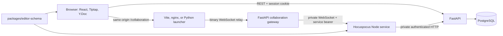
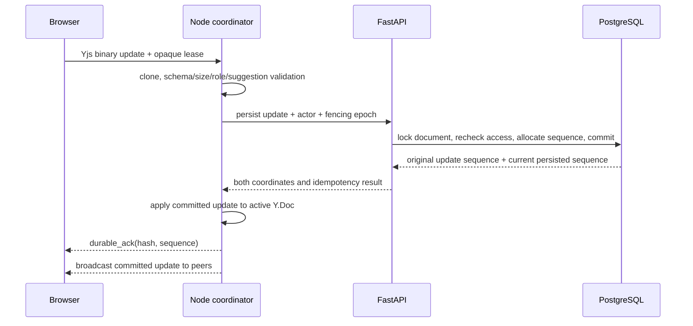

# Editor Collaboration

## Scope

This page describes the optional live-collaboration architecture for editor
documents: ownership boundaries, persistence, synchronization, suggestions,
and failure semantics. It does not describe the end-user controls in detail;
see [Collaborate on editor documents](../how-to/collaborate-on-editor-documents.md).
Version 1 is online-only and single-replica. It does not provide guest links,
offline writes, mouse pointers, shared discussion threads, or full version
restore.

## Guarantees

- The Yjs binary state is the body source of truth after conversion.
- PostgreSQL stores the update journal, verified snapshots, access leases,
  attribution, decisions, and the latest Markdown projection.
- A Hocuspocus `synced` event means CRDT synchronization only. A browser shows
  an edit as saved only after Inqtrix returns a durable acknowledgement for the
  committed update hash and sequence.
- FastAPI remains the authority for identity, direct shares, permissions,
  sequencing, retention, and row-level tenant isolation. The Node service has
  no database credentials.
- Legacy Markdown documents keep their existing revision-CAS save path. The
  collaboration path never falls back to a full-body Markdown `PUT`.

## Components and trust boundaries

The diagram answers: "Which process is allowed to decide and persist what?"

The public browser transport is always `/collaboration`. nginx, Vite, and
`scripts/run_research_desk.py` forward it to FastAPI, not to Node. FastAPI
validates the browser Origin and relays binary frames to the private Node URL.
The same proxies forward the content-free `GET /collaboration/instance`
release probe to FastAPI. That probe reports an identity only when two
RLS-scoped reads of the canonical tenant's unexpired fencing lease agree around
a live Node readiness request. The Node service remains a single-writer
coordinator with no public host port in bundled deployments.

`packages/editor-schema` is the shared schema boundary. It contains the
headless Tiptap extensions, canonical Markdown parser and serializer,
suggestion marks, Yjs fragment name, relative-position helpers, room/parser
contracts, and deterministic schema fingerprint. React NodeViews and visual
decorations stay in the Research Desk.

## Stored representations

| Representation | Source of truth | Purpose |
|---|---|---|
| Yjs update journal | Yes, with a verified snapshot and remaining tail | Live body reconstruction, merge history, attribution, and idempotent replay. |
| Yjs snapshot | Checkpoint of the same truth | Bounds replay time; it never replaces uncommitted tail updates. |
| `content_markdown` | No, derived projection | Read-only outage view, search/context, source view, and export. |
| Patch and activity rows | Metadata, not body truth | Suggestion ownership, decisions, audit-oriented history, and inspector lists. |
| Awareness | No, ephemeral | Current participants and carets. It is not restored or backed up separately. |

Migration `0048_editor_collaboration` adds collaboration mode and sequence
metadata to `editor_documents`, then creates:

- `editor_collaboration_updates` for idempotent update hashes and ordered
  per-document sequences;
- `editor_collaboration_snapshots` for binary state, state vectors, hashes, and
  covered sequence;
- `editor_collaboration_leases` for short-lived document access;
- `editor_collaboration_instances` for the single active Node writer and its
  fencing epoch.

The tables use the existing PostgreSQL database and tenant RLS. There is no
SQLite database, second PostgreSQL server, or sidecar volume.

## Document lifecycle

A document starts in `content_mode=markdown`. Only its owner can convert it,
and conversion checks the body revision, metadata revision, schema version,
document size, service readiness, and absence of active shares. Node parses
Markdown into a Y.Doc and returns an initial verified snapshot without writing
the database. FastAPI rechecks the preconditions and commits mode, generation,
snapshot, projection, and sequence metadata atomically.

Conversion is irreversible. To return to ordinary Markdown editing, export a
detached snapshot and import it as a new document. Deleting a collaboration
document creates a tombstone, increments its generation, revokes access, and
eventually permits physical cleanup. Version 1 has no restore UI.

The room name is
`inqtrix-editor-v1:{document_id}:g{collaboration_generation}`. A room name is
an address, never an authorization credential. Every connection and durable
write is checked against tenant, document, generation, lease, current user,
permission, and active Node fencing epoch.

## Authentication and authorization

Collaboration sessions require a real cookie-backed `local`, `ldap`, or `oidc`
login. Anonymous principals, the legacy static API key, and personal access
tokens cannot obtain a collaboration lease. A lease expires after 60 seconds
by default and is rotated while the document stays open. The browser and Node
treat its `cl1...` value as opaque; it never belongs in a URL, log, or metric.

Editor documents extend the existing direct-share system with one additional
permission:

| Permission | Live read | Direct edit | Suggest | Accept/reject | Metadata/share/delete |
|---|---:|---:|---:|---:|---:|
| Owner | Yes | Yes | Yes | Yes | Yes |
| `edit` | Yes | Yes | Yes | Yes | No |
| `suggest` | Yes | No | Yes, enforced | No | No |
| `view` | Yes | No | No | No | No |

Other resource types keep their existing `view|edit` matrix. Share, session,
and account invalidations reuse `user_events`; Node polls that feed, rechecks
affected leases, and closes access that is no longer valid.

## Public API surface

The editor API remains additive and keeps Markdown compatibility:

| Route | Collaboration behavior |
|---|---|
| `GET /v1/editor/documents?scope=owned|shared|all` | Returns metadata plus `content_mode`, `metadata_revision`, `access`, and collaboration sequence/projection metadata. The default remains `owned`. |
| `GET /v1/editor/documents/{id}` | Returns Markdown body for legacy documents or the latest confirmed projection for collaboration documents. |
| `PUT /v1/editor/documents/{id}` | Keeps the legacy full-body contract and returns `409 content_mode_changed` for a collaboration document. |
| `PATCH /v1/editor/documents/{id}` | Owner-only title/folder/metadata update using `expected_metadata_revision`. |
| `POST /v1/editor/documents/{id}/collaboration:enable` | Owner-only, atomic Markdown-to-Yjs conversion. |
| `POST /v1/editor/documents/{id}/collaboration/session` | Issues or rotates the opaque lease and returns room, access, user, and protocol/schema metadata. |
| `GET /v1/editor/documents/{id}/activity` | Keyset page of attributed direct, suggestion, decision, and system updates. Adjacent direct updates by one user may be grouped for display. |
| `POST /v1/editor/documents/{id}/patches:decide` | Idempotent accept/reject for explicit patch IDs using `expected_sequence` and a decision UUID. |
| `POST /v1/editor/documents/{id}/collaboration/projection:flush` | Waits for the room queue and returns a current confirmed Markdown projection. |
| `GET /collaboration/instance` | Unauthenticated, no-store release probe returning only contract/service/status and the stable DB-fenced instance ID/epoch; unavailable or changing state returns 503. |
| `GET /v1/capabilities` | Reports configured/available state, `/collaboration`, protocol/schema versions, and `single_replica`. |

Missing or hidden documents return 404; a visible but unauthorized action
returns 403; revision, sequence, mode, generation, or schema conflicts return
409; size limits return 413; and an unavailable optional service returns 503.
Errors use the normal Inqtrix envelope with a machine-readable `reason`.

## Durable update flow

This sequence explains why a visible remote edit and a saved edit are separate
states.

Each room has a serial queue. The coordinator validates on a clone before
persistence. FastAPI locks the document row, rejects stale generation or
fencing epochs, and writes the update plus suggestion/decision metadata in one
transaction. Only then does Node apply and broadcast the update. Repeating an
update hash returns its original sequence instead of inserting a duplicate,
alongside the locked document's current persisted sequence so a replay after
later edits cannot regress the room watermark.

If applying a committed update to the active in-memory Y.Doc fails, the room is
closed with `1011` and rebuilt from the latest verified snapshot plus update
tail. The committed database state remains authoritative.

## Suggestions and AI

Direct edits are immediately part of the final document and appear in activity
history; Inqtrix does not reconstruct them later as accept/reject patches.
Suggest mode stores insertion, deletion, and modification marks with a
suggestion UUID, patch UUID, author, and creation time. Server validation
requires the original projection to remain unchanged for a `suggest` user and
prevents a user from rewriting or deciding another user's suggestion.

Accept and reject are idempotent server mutations with an expected sequence
and command UUID. Structural operations that cannot be represented reversibly
as marks are rejected in Suggest mode. This includes table row/column changes,
merge/split operations, and atomic mathematics nodes; a user with `edit`
permission must switch to Edit for those operations.

Comments and AI work remain private to their creator. AI first waits for all
durable acknowledgements and a current Markdown projection. Its result is then
published through the same Node coordinator as a shared suggestion, never as a
direct collaboration edit and never through the legacy Markdown patch path.

## Projection, source, and export

The final Markdown projection is generated with the shared serializer after a
durable sequence. Source mode is read-only for collaboration documents. An
explicit projection barrier is required before AI context or a current export;
the system does not silently consume a stale projection. If durable writes
advance while projection is being published, the barrier reprojects at the new
watermark. It returns Markdown only when projection and persisted sequences
are equal; repeated races end in a visible `409 projection_not_current`.

Owned collaboration documents export as detached Markdown snapshots. Import
creates a new document ID in Markdown mode, so an exported project cannot
reconnect to the source room. Shared incoming documents are not copied into the
recipient's local project directories or project archive. When only an older
projection is available, the UI must label its timestamp and require an
explicit choice to export that saved state.

## Failure and compatibility model

The editor becomes read-only while connecting, reconnecting, after access
revocation, after a durability error, or when protocol/schema versions differ.
There is no offline write queue and no fallback to legacy autosave. Disabling
the feature removes the collaboration routes but leaves legacy documents
unchanged; existing collaboration documents remain available through their
last persisted Markdown projection in read-only form.

Protocol close codes are stable operator signals:

| Code | Meaning |
|---|---|
| `4401` | Lease invalid or expired. |
| `4403` | Origin or document access rejected. |
| `4409` | Binary protocol, generation, or schema incompatible. |
| `4429` | Connection/update/awareness rate limit. |
| `4503` | Collaboration service not ready. |
| `1009` | Frame exceeds the configured limit. |
| `1011` | Persistence or internal consistency failure. |
| `1012` | Planned service restart. |

## Related docs

- [Collaborate on editor documents](../how-to/collaborate-on-editor-documents.md)
- [Deploy editor collaboration](../deployment/editor-collaboration.md)
- [Data architecture](data-architecture.md)
- [Authentication modes](../deployment/auth-modes.md)
