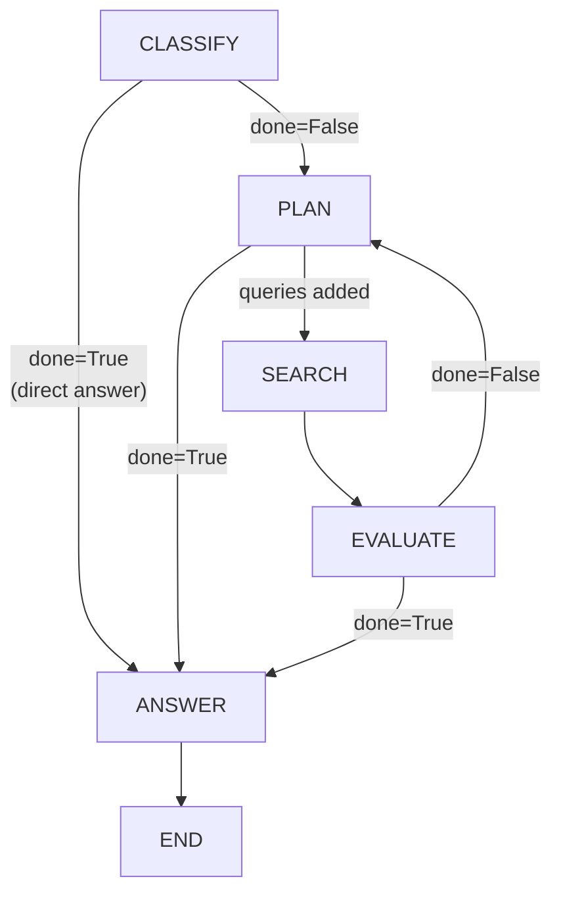

# Graph topology

> Files: `graph.py`, `nodes.py`

## Scope

How the LangGraph state machine is wired, when the graph is built, and how to insert or rewire nodes without subclassing `ResearchAgent`.

## Default topology



The loop runs `PLAN → SEARCH → EVALUATE → PLAN` until `done=True`, which can be set by any of the three loop-participating nodes.

## `GraphConfig`

The topology is described as a declarative dataclass:

```python
@dataclass
class GraphConfig:
    nodes: dict[str, Callable]
    entry: str
    edges: list[tuple[str, str]]
    conditional_edges: list[tuple[str, Callable, dict[str, str]]]
```

`default_graph_config(providers, strategies, settings)` returns the standard configuration. `build_graph(config)` compiles it into a LangGraph `CompiledGraph`, cached per `(providers, strategies, settings)` identity so repeated runs reuse the same compiled graph.

## Customising the topology

```python
from inqtrix.graph import GraphConfig, build_graph, default_graph_config
from inqtrix.providers import ProviderContext
from inqtrix.strategies import StrategyContext


config = default_graph_config(providers, strategies, settings)

config.nodes["fact_check"] = my_fact_check_node
config.edges.append(("evaluate", "fact_check"))
# Rewire: fact_check -> answer instead of evaluate -> answer

graph = build_graph(config)
```

`my_fact_check_node` must follow the node signature:

```python
def my_fact_check_node(s: dict, *, providers, strategies, settings) -> dict:
    ...
    return s  # modified state
```

`functools.partial` is used in `build_graph` to bind the context kwargs, so the exposed callable accepts `(state) -> state` as LangGraph expects.

## Cancel and deadline semantics

Every node begins with `check_cancel_event(state)` and `_check_deadline(state["deadline"])`. Custom nodes are expected to call the same helpers before they perform any non-trivial work — see [State and iteration](state-and-iteration.md) for the cancel protocol and [Timeouts and errors](../observability/timeouts-and-errors.md) for the deadline model.

## When to touch the graph vs when to touch a strategy

- **Change behaviour inside an existing step** (how confidence caps work, what a new source tier means): change a strategy, not the graph. See [Strategies](strategies.md).
- **Add a qualitatively new step** (fact-check, tool-use, human-in-the-loop review): add a node and rewire the graph.
- **Skip an existing step**: set `done=True` inside `classify` or `plan` — the graph already short-circuits to `answer` in that case. No topology change required.

## Related docs

- [State and iteration](state-and-iteration.md)
- [Nodes](nodes.md)
- [Strategies](strategies.md)
- [Stop criteria](../scoring-and-stopping/stop-criteria.md)
