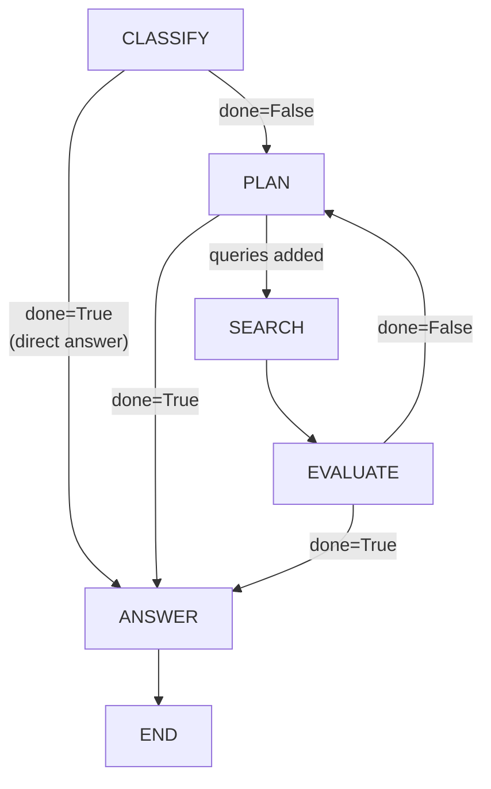

# Graph topology

> Files: `graph.py`, `nodes.py`

## Scope

How the LangGraph state machine is wired, when the graph is built, and how to insert or rewire nodes without subclassing `ResearchAgent`.

## Default topology

This diagram answers: "Which node function can run after which other node?"
Rectangles are node functions and diamonds are router decisions. The diagram is
control flow only; the state fields written by each node are covered in
[State and iteration](state-and-iteration.md).


```mermaid
flowchart TD
    C["CLASSIFY"] -->|"done=False"| P["PLAN"]
    C -->|"done=True<br/>(direct answer)"| A["ANSWER"]
    P -->|"queries added"| S["SEARCH"]
    P -->|"done=True"| A
    S --> E["EVALUATE"]
    E -->|"done=False"| P
    E -->|"done=True"| A
    A --> END["END"]
```

The loop runs `PLAN → SEARCH → EVALUATE → PLAN` until `done=True`, which can be set by any of the three loop-participating nodes.

## `GraphConfig`

The topology is described as a declarative dataclass:

```python
@dataclass
class GraphConfig:
    nodes: dict[str, Callable]
    entry_point: str
    edges: list[tuple[str, str]]
    conditional_edges: list[tuple[str, Callable]]
```

`default_graph_config(providers, strategies, settings)` returns the standard
configuration and binds `ProviderContext`, `StrategyContext`, and
`AgentSettings` into each node closure. `build_graph(config)` compiles it into
a LangGraph `CompiledGraph`, cached per `(providers, strategies, settings)`
identity so repeated runs reuse the same compiled graph.

Important current limitation: this graph config is not exposed as a public
`AgentConfig` field. Library callers can swap providers, strategies, and
settings, but the public high-level API does not yet select a completely
different algorithm/topology.

## Customising the topology

This is an advanced internal pattern for scripts or tests that call
`build_graph()` directly. It is not the same as passing a different algorithm to
`ResearchAgent`, because that public algorithm slot does not exist yet.

```python
from functools import partial

from inqtrix.graph import build_graph, default_graph_config
from inqtrix.providers.base import ProviderContext, _check_deadline
from inqtrix.settings import AgentSettings
from inqtrix.state import AgentState, check_cancel_event
from inqtrix.strategies import StrategyContext


def my_fact_check_node(
    s: AgentState,
    *,
    providers: ProviderContext,
    strategies: StrategyContext,
    settings: AgentSettings,
) -> AgentState:
    check_cancel_event(s)
    _check_deadline(s["deadline"])
    ...
    return s  # modified state


config = default_graph_config(providers, strategies, settings)

config.nodes["fact_check"] = partial(
    my_fact_check_node,
    providers=providers,
    strategies=strategies,
    settings=settings,
)
config.conditional_edges = [
    (src, router)
    for src, router in config.conditional_edges
    if src != "evaluate"
]
config.conditional_edges.append(
    ("evaluate", lambda s: "fact_check" if s["done"] else "plan")
)
config.edges.append(("fact_check", "answer"))

graph = build_graph(config)
```

`my_fact_check_node` can use the rich node signature internally, but
`config.nodes["fact_check"]` must contain the bound `(state) -> state` callable
that LangGraph expects. Rewiring must also replace the `evaluate` conditional
edge; appending a normal `("evaluate", "fact_check")` edge would not override the
existing router.

## Cancel and deadline semantics

Every node begins with `check_cancel_event(state)` and `_check_deadline(state["deadline"])`. Custom nodes are expected to call the same helpers before they perform any non-trivial work — see [State and iteration](state-and-iteration.md) for the cancel protocol and [Timeouts and errors](../observability/timeouts-and-errors.md) for the deadline model.

## When to touch the graph vs when to touch a strategy

- **Change behaviour inside an existing step** (how confidence caps work, what a new source tier means): change a strategy, not the graph. See [Strategies](strategies.md).
- **Add a qualitatively new step** (fact-check, tool-use, human-in-the-loop review): add a node and rewire the graph.
- **Skip an existing step**: set `done=True` inside `classify` or `plan` — the graph already short-circuits to `answer` in that case. No topology change required.

## Related docs

- [State and iteration](state-and-iteration.md)
- [Nodes](nodes.md)
- [Strategies](strategies.md)
- [Stop criteria](../scoring-and-stopping/stop-criteria.md)
