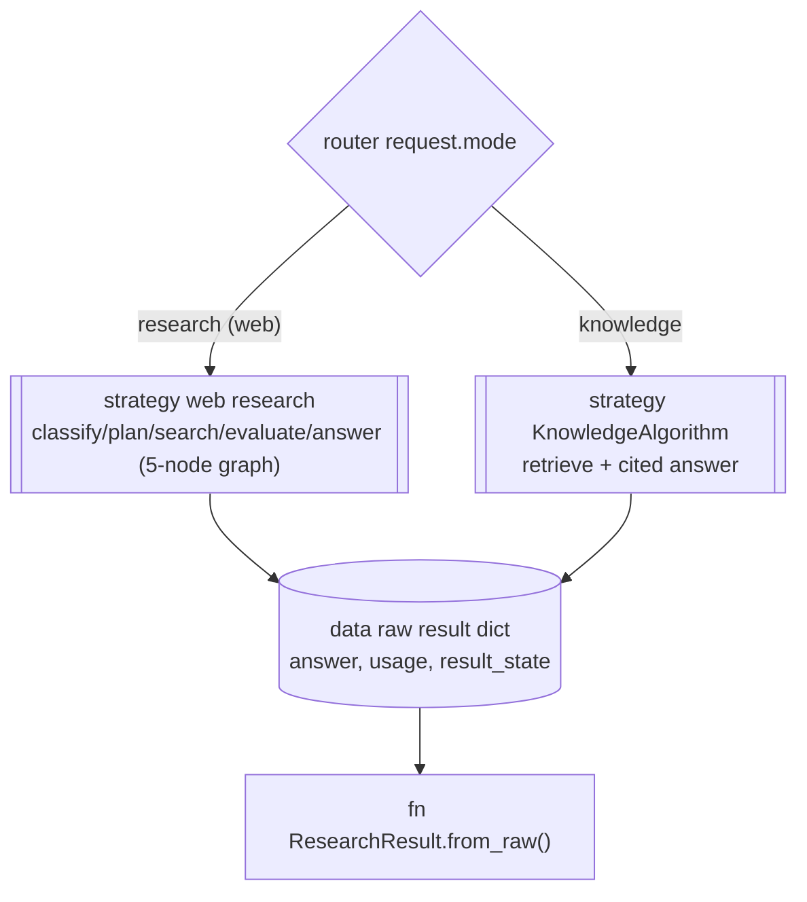
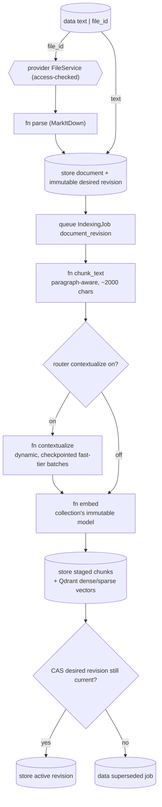
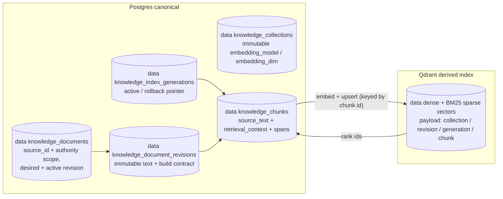
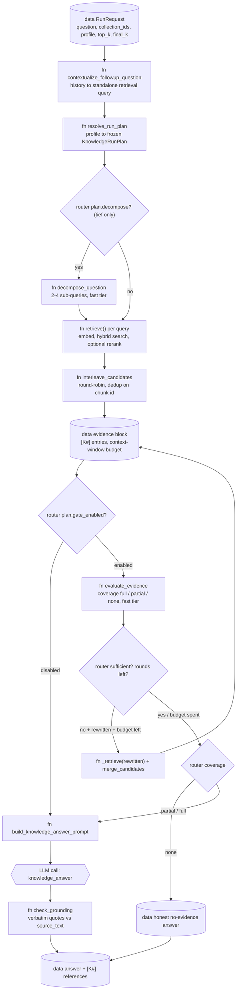
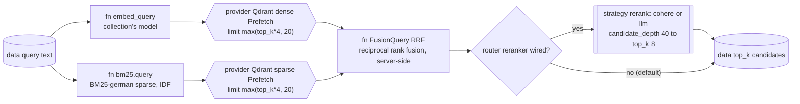

# Knowledge retrieval

> Files: `src/inqtrix/knowledge/` (`algorithm.py`, `retrieval.py`, `decompose.py`, `gate.py`, `grounding.py`, `contextualize.py`, `chunking.py`, `stores/qdrant_store.py`), `src/inqtrix/storage/knowledge_orm.py`

## Scope

This page is the architecture view of the knowledge engine: the internal data flow of `mode=knowledge` from a raw document to a cited answer. It covers ingestion and contextualization, the Postgres-canonical / Qdrant-derived storage topology, the end-to-end retrieval pipeline (hybrid search, RRF fusion, optional rerank, the sufficiency gate, and grounding), and how that pipeline relates to the web-research graph.

It does **not** cover operating the engine — collections, the ingestion API, the Wissen workspace, and the evaluation tiers live in [Knowledge engine](../knowledge/overview.md); the per-request stage matrix lives in [Retrieval profiles](../configuration/knowledge-profiles.md); every `INQTRIX_KNOWLEDGE_*` / `INQTRIX_EMBEDDING_*` / `INQTRIX_RERANKER_*` variable lives in [Settings and environment](../configuration/settings-and-env.md).

Knowledge retrieval is off by default. The hybrid, contextualization, and rerank stages described here engage only with the qdrant backend and the matching flags:

```dotenv
INQTRIX_KNOWLEDGE_ENABLED=true
INQTRIX_VECTOR_BACKEND=qdrant          # hybrid retrieval; memory backend is dense-only
INQTRIX_KNOWLEDGE_SPARSE=bm25_german   # the BM25 lexical branch (an algorithm, no hosted model)
INQTRIX_KNOWLEDGE_CONTEXTUALIZE=on     # situating prefix per chunk at ingestion (optional)
INQTRIX_RERANKER_PROVIDER=cohere       # rerank stage; "none" (default) skips it visibly
```

## Two engines, one serialization

This diagram answers: "Does `mode=knowledge` run through the same five-node research graph as web research?" It does not — the request is dispatched by the algorithm registry to a separate `KnowledgeAlgorithm`, but both engines emit the same raw result shape so run serialization, SSE events, and snapshots are shared.



Key transitions:

- `mode=knowledge` is **not** the web graph with a different backend — it is a distinct `KnowledgeAlgorithm` (`algorithm.py`) reached through the algorithm registry. The five-node graph (see [Graph topology](graph-topology.md)) never runs for a knowledge request.
- `KnowledgeAlgorithm.run()` returns a raw dict that mirrors the web-research shape (`answer`, `usage`, `result_state`), so `ResearchResult.from_raw`, native-run snapshots, completed-result export, and the SSE step stream consume knowledge runs without a parallel code path. Typed Knowledge result metadata, including retrieval degradations, is retained by this serialization rather than existing only in a transient event.
- The shared serialization is why the run card renders a knowledge run with the same machinery as a web run, only with `[K#]` evidence labels instead of `[E#]`.

## Ingestion: document to retrievable chunks

This diagram answers: "How does a raw document become embedded, retrievable chunks?" The browser-facing ingestion path is a durable server job. It reserves immutable source intent before it queues provider work, so retries and reordered completions cannot replace a document by accident.



Key transitions:

- **Parse** converts PDF/DOCX/PPTX/XLSX/HTML/Markdown to Markdown via MarkItDown; a file that yields no text (a scanned PDF without a text layer) fails loudly with HTTP 422 rather than producing a silently empty document.
- **Reserve** creates a stable logical document, a monotonically ordered desired revision, and the job identity in server-owned state before any contextualization or embedding call. Repeating the same `(collection, source, content hash)` request is idempotent. A later desired revision wins even when an older worker finishes last; the older job becomes `superseded` and never deletes or replaces the newer result.
- **Chunk** (`chunk_text_slices`) splits on blank-line paragraph boundaries, packs greedily up to `INQTRIX_KNOWLEDGE_CHUNK_MAX_CHARS` (default 2000 chars, ~500 tokens), and hard-splits oversize paragraphs on sentence boundaries. Every chunk carries an exact character span while it is processed and an exact UTF-8 byte span when persisted; repeated boilerplate is never rediscovered by prefix search.
- **Contextualize** (`contextualize.py`, `INQTRIX_KNOWLEDGE_CONTEXTUALIZE=on`) generates a short situating context for each chunk. `25` is only the maximum call width. The planner grows a contiguous batch while the complete rendered prompt, the model-card context window, guaranteed JSON response space, and safety reserve fit; every resulting document window contains the entire source span of its batch. The number of calls is therefore `ceil(chunks / effective dynamic batch size)`, not one call per document.
- Up to three contextualization batches execute concurrently, bounded further by the provider's declared LLM-concurrency capability and by one process-wide gate on the shared contextualizer. Every validated batch is checkpointed independently with model and prompt hashes, including when calls finish out of order. The first dependency or validation failure stops new dispatch; already-running successful batches may still checkpoint, but no incomplete revision is published. Resume validates the stored set and starts only missing batches. The UI can retry, cancel, or explicitly request a separate raw-text build. That explicit choice is recorded as `ready_raw_by_user_choice`; there is no automatic raw fallback.
- Transient dependency failures open a circuit keyed by tenant, LLM provider, and resolved contextualization model. In PostgreSQL deployments this state is shared by API and worker replicas; it is not a process-local hint. During the configured cooldown, new calls stop before reaching the provider and their jobs pause with a typed reason. When the cooldown expires, a row-locked lease grants exactly one half-open probe. A matching probe token closes the circuit after recovery; a failed probe reopens it, and an expired lease can be reclaimed after a worker crash. Provider retry/backoff loops receive the indexing cancellation probe in the actual executor thread, so cancellation does not wait for the remaining retry ladder. Cooldown and probe lease are recovery coordination, never document deadlines or silent fallback criteria.
- **Embedding text is not evidence.** `retrieval_context` is stored separately from the immutable `source_text`. Their concatenation exists only as the input to dense embedding and sparse indexing. Answer prompts, citations, Document Find, Canvas evidence, previews, and exports receive the common `KnowledgeEvidenceHit.excerpt`, which is verified against the canonical document span.

## Storage topology: Postgres canonical, Qdrant derived

This diagram answers: "Where does each piece of a chunk physically live, and what keeps them in sync?" The split follows the standard "Postgres = source of truth, vector DB = derived index" topology.



Key transitions:

- **Postgres holds the truth**: stable source and document identity, immutable document revisions, the desired/active revision pointers, generation history, canonical source text, and exact chunk provenance. A retrieval candidate is admitted only when its revision and generation match the active pointers and its UTF-8 span hashes back to the canonical document.
- **Qdrant is derived.** The Postgres-backed store places vectors in one physical Qdrant collection per embedding-model configuration. Logical collections, revisions, and generations are payload partitions; authorization remains a live transactional check rather than a Qdrant filter.
- **Why generations are logical inside the model collection.** A physical Qdrant collection per logical generation would force a multi-collection user query into a second fan-out and score-fusion implementation. The shared physical model index preserves one `KnowledgeService.search` pipeline. Atomicity comes from the Postgres generation pointer: search ranks candidates, hydrates only the active revision/generation, and geometrically over-fetches when stale points are still awaiting cleanup.
- **Rollback is pointer-based.** A collection rebuild writes a shadow generation without changing the active pointer. Publication validates revision identity, exact UTF-8 source spans and slices, chunk/point totals, and embedding dimension, then changes one transactional pointer. The previous generation remains `rollback_available` for `INQTRIX_GENERATION_ROLLBACK_RETENTION_SECONDS` (seven days by default). Retention first commits `deleting`, then removes and verifies derived vectors, and finally removes canonical chunk rows in the same transaction that marks the generation `deleted`. A crash or dependency error leaves `deleting`/`cleanup_failed`, never a falsely rollbackable row, and the existing worker maintenance cadence retries it idempotently.
- **Existing vector payloads migrate without a broad fallback.** The schema migration can recover canonical revision/generation rows and exact source spans in Postgres, but it cannot rewrite already persisted Qdrant payloads transactionally. Only while the explicitly marked compatibility generation is active, the vector filter admits payloads missing both lineage fields for the exact verified canonical chunk ids recovered by that migration. Postgres hydration still requires the active revision/generation, content hash, and exact source bytes. Activating any validated shadow generation removes this chunk allow-set from the search scope.

### Shared collections and maintenance

A collection list is a single authoritative owned-plus-accepted-shared view.
`view` permits metadata, document text, retrieval, and cited answers. `edit`
also permits ingest, document deletion, and reindex; collection deletion and
share management remain owner-only. Workspace membership does not grant
collection access by itself. When the optional common-workspace restriction is
enabled, every access verifies that the owner and recipient still share at
least one workspace.

Collection sharing covers extracted/indexed text and metadata, not the
uploader's original file binary. An editor can ingest a file they own into a
shared collection; its extracted text then belongs to the collection and
remains there after that editor leaves, while the binary remains accessible
only to the uploader. Client code must therefore hide binary download actions
for shared documents rather than constructing an endpoint the recipient cannot
use.

One collection-generation build is serialized per collection, but the active
generation remains readable throughout. Normal document revisions may continue:
the worker compares its staged manifest with the current active revisions and
reconciles deltas before its final publication check. A collection deletion
fences new generation work. The worker checks the requester's active account
and current `edit` access before and after external vector writes; losing that
authority ends the job as `authorization_revoked`. A current viewer can read
job state and events, while a current editor can pause, resume, choose a raw
build, or cancel. Backends without transactional collection metadata reject
generation operations rather than treating Qdrant or process-local state as an
authorization boundary.

## Retrieval pipeline: question to cited answer

This diagram answers: "What happens between a `mode=knowledge` question arriving and a cited answer leaving?" The node order is exactly the order of `KnowledgeAlgorithm.run()`. How much of this machinery runs is selected by the retrieval profile (`schnell` / `standard` / `gruendlich` / `tief` / `auto`); the diagram shows the maximal path.



Key transitions:

- **Follow-up contextualization** (`contextualize_followup_question`) runs only when the request carries prior `messages`/`history`. It rewrites the current follow-up into a standalone retrieval query before profile selection, decomposition, retrieval, and gate evaluation. The final answer still receives the original user question and the history, but the prompt states that history is context only, not evidence. Provider/parse failures fall back to the original question with `_knowledge_query_context_fallback` and `inqtrix.knowledge.contextualized`.
- **Decompose** (`decompose_question`, tief profile only) splits the retrieval query into 2-4 sub-queries on the fast tier. Each sub-query and the standalone retrieval query are retrieved independently.
- **Interleave** (`interleave_candidates`) merges the per-query result lists round-robin — one candidate per list in rotation, the original question's list first, duplicates collapsed on `chunk.id`. This guarantees every aspect contributes to the top-k instead of the first list crowding the others out (the aggregation-failure class a plain first-wins union reproduces). The return value remains a `RetrievalCandidateBatch`: typed degradations and source-integrity exclusions from every sub-query remain attached instead of being reduced to a plain candidate list.
- **Collection scope** (`knowledge_filters.collection_ids`) is resolved at admission (`KnowledgeService.resolve_ask_scope`, called by the chat and native-runs routers for `mode=knowledge`): an explicit, non-empty list is asserted strictly — one invisible collection denies the whole submission with a 404 — and an omitted/`null`/empty filter from an authenticated caller is pinned to the caller-visible collections (owned + accepted direct shares) before the run is stored, so a worker only ever re-executes a bounded request. An empty visible set remains the explicit empty scope and performs no embedding, store search, gate, or answer-model call. The execution actor's access to every pinned id is rechecked at run safepoints; losing one aborts with `authorization_revoked` instead of silently narrowing the evidence. Deployments without user auth (`AUTH_MODE` none/apikey) keep the historical ownerless view.
- **Mixed embedding-model scope** is handled inside the same `retrieve()` implementation used by Knowledge Desk, Kernel, and Mission. The concrete collection scope is partitioned by its immutable embedding model, the query is embedded once per model group, and each group runs through the same canonical store search. Scores from different vector spaces are never compared directly: the group rankings are interleaved by rank and de-duplicated before the common optional reranker and final projection. Every selected group therefore remains represented; no router or agent adapter narrows the corpus to the deployment's default model.
- **Retrieval widths**: `top_k` (per-(sub-)query width, `knowledge_filters.top_k`, 1-50) bounds each `retrieve()` call; `final_k` bounds the candidate pool actually surfaced to the answer. By default `final_k = min(top_k × profile.final_k_factor, EVIDENCE_K_MAX)` — only `tief` raises the factor above `1.0`, so its decompose/gate fan-out widens evidence instead of collapsing back to `top_k`; a profile without decomposition retrieves `final_k` directly. An explicit `knowledge_filters.final_k` pins it, overriding the factor. `EVIDENCE_K_MAX` and each profile's `final_k_factor` are published in `/v1/capabilities` (`knowledge.evidence_k_max`, `knowledge.profiles[].final_k_factor`); full request contract in [knowledge-profiles.md](../configuration/knowledge-profiles.md).
- **Retrieval degradation has two widths.** A technical vector cap or stalled backend page can under-fill the requested candidate pool even when the later reranker/final projection still fills every requested evidence slot. `inqtrix.knowledge.retrieval.degraded` therefore records `requested_candidate_pool`, `returned_candidate_pool`, `final_top_k`, `returned_hits`, and `final_evidence_complete` separately. Genuine corpus exhaustion is not mislabeled as a technical degradation. The same typed records live in `result_state.knowledge_retrieval`, the completed `/result` export, saved Knowledge answers, and reload reconstruction, so the UI cannot lose or reinterpret the warning after SSE disconnect.
- **Canonical exclusions are warnings, not missing evidence hidden as corpus exhaustion.** A ranked vector point whose original source cannot be verified remains a typed `RetrievalExclusion` through model-group fusion, reranking, decomposition interleave and gate-rewrite merge. The one shared projection maps `source_unverified` to `chunks_require_reindex` and `canonical_chunk_unavailable` to `chunks_pending_reconciliation`; future reasons remain visible under the generic integrity-warning code. Counts are persisted in `knowledge_retrieval.warnings`, emitted as bounded `inqtrix.knowledge.retrieval.warning` events and rendered by the same warning component used for synchronous Knowledge search. A count denotes exclusion observations across retrieval calls, not unique chunks: the text-free aggregate deliberately carries no point or chunk ids, so a point seen by multiple queries cannot be deduplicated by identity. The receipt contains no query, source id or evidence text.
- **Evidence budget** renders the candidates as `[K1] Title (Abschnitt N)` entries up to a context-window-derived character budget. Truncation happens once, here, and emits `inqtrix.knowledge.evidence.truncated` — the reference list and the prompt always describe the same set.
- **Sufficiency gate** (`evaluate_evidence`, `gate.py`) is one fast-tier call returning a three-way coverage verdict. `full` answers normally; `partial` answers with the gaps named explicitly (a binary verdict was observed refusing answerable multi-aspect questions wholesale); `none` yields the honest no-evidence answer instead of a fabrication. An unparseable gate response fails *open* to sufficient with `_knowledge_gate_fallback`; clients must render that marker as a degraded judgement in the visible run ledger.
- **The agentic loop**: while the gate is not satisfied, proposes a rewritten query, and the profile's round budget (capped by `INQTRIX_KNOWLEDGE_GATE_MAX_ROUNDS`) has rounds left, `run()` retrieves the rewritten query, merges it into the candidate pool (`merge_candidates`, original ranking authoritative), re-renders, and re-gates.
- **Grounding** (`check_grounding`, `grounding.py`) verifies the answer's `ZITATE:` block of verbatim `[K#]` quotes WITHOUT another LLM call: a formatting-tolerant (whitespace, Unicode/typography, case) verbatim-substring check against the specifically labelled chunk's `source_text` (the pre-contextualization body — a quote of the situating prefix must not verify as source content). Tolerance covers only encoding/typography, never paraphrase. A single deterministic repair may accept Markdown heading markers around both section headers; it never changes quote or answer text. Only a completely parsed response whose every quote verifies is publishable. Malformed output or one unverifiable quote creates a typed terminal failure, preserves consumed usage and bounded audit counts, and exposes only a safe explanation to Knowledge, chat, and Agent callers.

## Hybrid search and RRF

This diagram answers: "How do the dense and BM25 branches combine into one ranking?" It zooms into a single `retrieve()` call from the pipeline above (`stores/qdrant_store.py`).



Key transitions:

- **Two branches, one Qdrant call.** `_sync_hybrid_search` issues a single `query_points` with two `Prefetch` branches — dense (the query embedding, `using="dense"`) and sparse (the BM25-german `SparseVector`, `using="sparse"`) — each fetching `prefetch_depth = max(top_k * 4, 20)` candidates under the same collection-scope filter.
- **Reciprocal Rank Fusion (RRF)** combines the two rankings server-side via `models.FusionQuery(fusion=models.Fusion.RRF)`. RRF scores a document by the sum of its reciprocal ranks across the branches:

  ```text
  score(d) = Σ_i  1 / (k + rank_i(d))
  ```

  where `rank_i(d)` is `d`'s position in branch `i` and `k` is a smoothing constant. It is rank-based on purpose: dense cosine scores and BM25 IDF scores live on incommensurable scales, so fusing by **rank** rather than by raw score avoids one branch's score magnitude drowning the other. Both branches contribute regardless of scale.
- **Reranker** (optional, `INQTRIX_RERANKER_PROVIDER`) re-scores a deeper candidate pool (`INQTRIX_RERANK_CANDIDATE_DEPTH`, default 40) down to the requested `top_k` (default 8). `cohere` calls a Cohere-rerank-schema endpoint (native or Azure serverless); `llm` is a listwise fallback through the deployment's own LLM, hard-capped at 20 candidates and roughly an order of magnitude costlier. The default is `none` — a visible capability flag, never a silent downgrade; hybrid without a reranker is warned about at startup because plain RRF can degrade top-1 precision on paraphrase queries.

## Cross-lingual retrieval (query and corpus in different languages)

A common case is a German question against English documents (or the reverse). The two branches behave very differently here:

- **Dense is multilingual out of the box.** The default embedding model (`text-embedding-3-small`) and the selectable alternatives (`text-embedding-3-large`, `BAAI/bge-m3`, `voyage-3-large`) map semantically equivalent text across languages into one shared space. A German query and an English chunk land near each other with **no translation and no language tag** — and a language *filter* would actively break this, so documents/chunks deliberately carry no language metadata.
- **BM25 (the sparse branch) is language-bound.** The lexical encoder tokenizes and stems in exactly one language (`bm25_german` today). Cross-lingual *keyword* matching is structurally impossible — "Verschlüsselung" and "encryption" share no token — so when the query and corpus languages differ the sparse branch contributes little or unstably. It does **not** contribute nothing: query and documents pass through the same encoder, so shared exact terms (names, codes, acronyms, numbers) can still match. A multilingual learned-sparse model such as BGE-M3 exists as a model family, but the current Qdrant/fastembed BM25 branch is monolingual. Query translation is not part of the current retrieval contract.
- **The cross-lingual lever is a multilingual cross-encoder reranker — optional, not required.** It stays a recommendation: `INQTRIX_RERANKER_PROVIDER=none` is the default and a valid choice, and a deployment without a reranker keeps the dense+BM25 path unchanged — the absent optional stage is declared by capabilities rather than treated as a runtime failure. When configured, the `cohere` provider (a rerank-schema adapter, not vendor-locked: native Cohere `rerank-v3.5`, Azure serverless, or any compatible self-hosted endpoint) re-scores the fused candidates against the original query directly across languages, over the already-multilingual dense branch — no new retrieval code. The `llm` reranker is a fallback whose multilingual quality depends on the configured LLM and costs latency/tokens; it is not the recommended cross-lingual lever.

**Visibility.** The capability manifest (`/v1/capabilities` and the admin runtime payload) publishes `sparse_mode` (`bm25` or `off`), `sparse_language` (the BM25 tokenizer language, e.g. `de`, or `null` when sparse is off), `sparse_multilingual: false`, and `cross_lingual_recommendation: "reranker"`, so clients can show the limitation honestly. When the *confidently* detected query language differs from the tokenizer language, the run's `result_state.knowledge_sparse` carries the `_knowledge_sparse_tokenizer_mismatch` marker plus a redacted log/event (language codes only, never the query text). This signal is query-vs-**tokenizer** only; the current schema does not claim to detect query-vs-document language. The same-language default path adds no field, event, or log.

## Related docs

- [Knowledge engine](../knowledge/overview.md) — operating the engine: collections, ingestion API, the Wissen workspace, and the evaluation tiers.
- [Retrieval profiles](../configuration/knowledge-profiles.md) — the per-profile stage matrix, operator ceiling, and transport contract that select within this pipeline.
- [Evidence pipeline](evidence-pipeline.md) — the parallel evidence/citation flow on the web-research side (`[E#]` instead of `[K#]`).
- [Answer composition](answer-composition.md) — the section-by-section web answer composer, contrasted with the single quote-then-answer prompt here.
