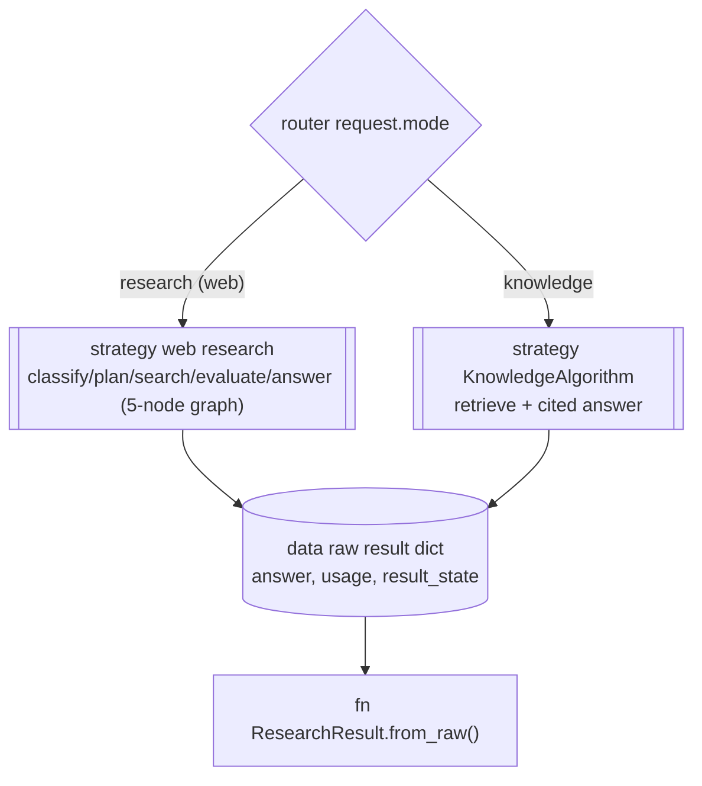
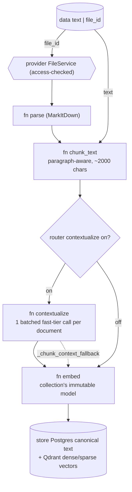
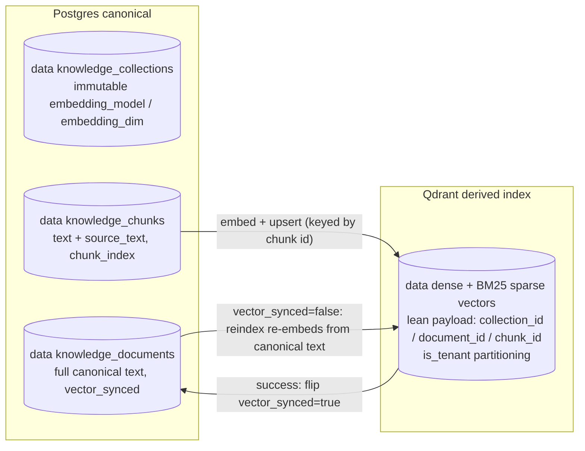
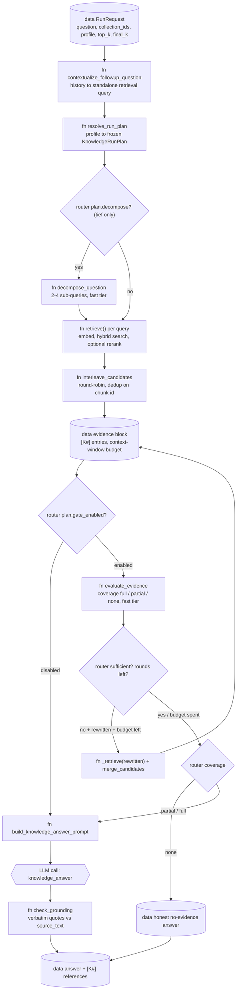
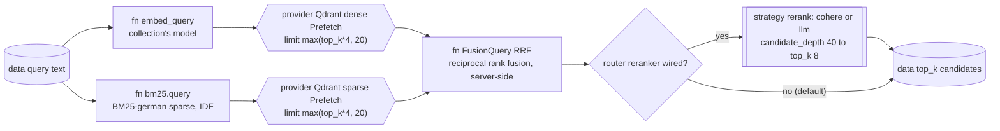

# Knowledge retrieval

> Files: `src/inqtrix/knowledge/` (`algorithm.py`, `retrieval.py`, `decompose.py`, `gate.py`, `grounding.py`, `contextualize.py`, `chunking.py`, `stores/qdrant_store.py`), `src/inqtrix/storage/knowledge_orm.py`

## Scope

This page is the architecture view of the knowledge engine: the internal data flow of `mode=knowledge` from a raw document to a cited answer. It covers ingestion and contextualization, the Postgres-canonical / Qdrant-derived storage topology, the end-to-end retrieval pipeline (hybrid search, RRF fusion, optional rerank, the sufficiency gate, and grounding), and how that pipeline relates to the web-research graph.

It does **not** cover operating the engine — collections, the ingestion API, the Wissen workspace, and the evaluation tiers live in [Knowledge engine](../knowledge/overview.md); the per-request stage matrix lives in [Retrieval profiles](../configuration/knowledge-profiles.md); every `INQTRIX_KNOWLEDGE_*` / `INQTRIX_EMBEDDING_*` / `INQTRIX_RERANKER_*` variable lives in [Settings and environment](../configuration/settings-and-env.md).

Knowledge retrieval is off by default. The hybrid, contextualization, and rerank stages described here engage only with the qdrant backend and the matching flags:

```dotenv
INQTRIX_KNOWLEDGE_ENABLED=true
INQTRIX_VECTOR_BACKEND=qdrant          # hybrid retrieval; memory backend is dense-only
INQTRIX_KNOWLEDGE_SPARSE=bm25_german   # the BM25 lexical branch (an algorithm, no hosted model)
INQTRIX_KNOWLEDGE_CONTEXTUALIZE=on     # situating prefix per chunk at ingestion (optional)
INQTRIX_RERANKER_PROVIDER=cohere       # rerank stage; "none" (default) skips it visibly
```

## Two engines, one serialization

This diagram answers: "Does `mode=knowledge` run through the same five-node research graph as web research?" It does not — the request is dispatched by the algorithm registry to a separate `KnowledgeAlgorithm`, but both engines emit the same raw result shape so run serialization, SSE events, and snapshots are shared.



Key transitions:

- `mode=knowledge` is **not** the web graph with a different backend — it is a distinct `KnowledgeAlgorithm` (`algorithm.py`) reached through the algorithm registry. The five-node graph (see [Graph topology](graph-topology.md)) never runs for a knowledge request.
- `KnowledgeAlgorithm.run()` returns a raw dict that mirrors the web-research shape (`answer`, `usage`, `result_state`), so `ResearchResult.from_raw`, native-run snapshots, and the SSE step stream consume knowledge runs without a parallel code path.
- The shared serialization is why the run card renders a knowledge run with the same machinery as a web run, only with `[K#]` evidence labels instead of `[E#]`.

## Ingestion: document to retrievable chunks

This diagram answers: "How does a raw document become embedded, retrievable chunks?" Ingestion is synchronous in this cut; the embedding call site is the seam a worker-based pipeline would replace.



Key transitions:

- **Parse** converts PDF/DOCX/PPTX/XLSX/HTML/Markdown to Markdown via MarkItDown; a file that yields no text (a scanned PDF without a text layer) fails loudly with HTTP 422 rather than producing a silently empty document.
- **Chunk** (`chunk_text`) splits on blank-line paragraph boundaries, packs greedily up to `INQTRIX_KNOWLEDGE_CHUNK_MAX_CHARS` (default 2000 chars, ~500 tokens), and hard-splits oversize paragraphs on sentence boundaries — content is never dropped.
- **Contextualize** (`contextualize.py`, `INQTRIX_KNOWLEDGE_CONTEXTUALIZE=on`) is contextual retrieval in the Anthropic 2024 pattern: ONE batched fast-tier LLM call per document (not per chunk) generates a short situating context per chunk, prepended before both dense embedding and BM25 indexing so a de-contextualized chunk ("die Pflichten nach Absatz 1") becomes retrievable by the vocabulary of the questions that target it. Paid once at ingestion, zero query-time latency; the published result is up to a 49% reduction in top-20 retrieval failures combined with BM25. An unparseable response degrades that document to uncontextualized chunks with the loud `_chunk_context_fallback` marker (No Silent Fallbacks) — ingestion never fails because a mini model produced bad JSON.
- The situating prefix lives in the chunk's `text` (what is embedded and indexed); the original chunk body is kept separately as `source_text` (what quote verification runs against). See the next section.

## Storage topology: Postgres canonical, Qdrant derived

This diagram answers: "Where does each piece of a chunk physically live, and what keeps them in sync?" The split follows the standard "Postgres = source of truth, vector DB = derived index" topology.



Key transitions:

- **Postgres holds the truth**: collections, documents (full canonical `text`), and chunk metadata (`text` plus `source_text`). The canonical text is the citable source view (the document viewer renders it; quote highlighting is text search within it) and the input reindex re-embeds from.
- **Qdrant holds only vectors plus a lean payload** — the chunk id and the filter keys (`collection_id` / `document_id` / `chunk_id`). No document text is duplicated into Qdrant. Retrieval returns chunk ids from Qdrant and hydrates text/title back from Postgres.
- **`vector_synced`** is the durable reconcile flag, not an outbox table: the canonical text commits to Postgres first, then vectors upsert to Qdrant and the flag flips `true`; a failed vector sync leaves it `false` — a queryable, operator-visible "vectors out of sync" signal. Reindex re-embeds from the canonical text and clears it.
- **One physical Qdrant collection per embedding-model configuration**, with the logical collection as an indexed payload field (`is_tenant` partitioning). `embedding_model`/`embedding_dim` are immutable per collection because vectors from different models are geometrically incomparable. The payload filter is a performance boundary, **not** the authorization boundary — live owner-or-accepted-direct-share checks stay with the `AuthorizationService` and the transactional collection store.

### Shared collections and maintenance

A collection list is a single authoritative owned-plus-accepted-shared view.
`view` permits metadata, document text, retrieval, and cited answers. `edit`
also permits ingest, document deletion, and reindex; collection deletion and
share management remain owner-only. Workspace membership does not grant
collection access by itself. When the optional common-workspace restriction is
enabled, every access verifies that the owner and recipient still share at
least one workspace.

Collection sharing covers extracted/indexed text and metadata, not the
uploader's original file binary. An editor can ingest a file they own into a
shared collection; its extracted text then belongs to the collection and
remains there after that editor leaves, while the binary remains accessible
only to the uploader. Client code must therefore hide binary download actions
for shared documents rather than constructing an endpoint the recipient cannot
use.

Reindex is a serialized maintenance state on the collection. While one job is
queued, running, or `cancelling`, document writes and collection deletion return
HTTP 409 `collection_maintenance`; reads remain available. The worker reloads
each canonical document before embedding and checks the requester's active
account plus current `edit` access before and after the external vector write.
Losing that authority ends the job as `authorization_revoked`. A current
viewer can list/read the job and its events; a current editor can cancel it.
Backends without transactional collection metadata return 501 for reindex and
collection sharing rather than treating Qdrant or process-local state as an
authorization boundary.

## Retrieval pipeline: question to cited answer

This diagram answers: "What happens between a `mode=knowledge` question arriving and a cited answer leaving?" The node order is exactly the order of `KnowledgeAlgorithm.run()`. How much of this machinery runs is selected by the retrieval profile (`schnell` / `standard` / `gruendlich` / `tief` / `auto`); the diagram shows the maximal path.



Key transitions:

- **Follow-up contextualization** (`contextualize_followup_question`) runs only when the request carries prior `messages`/`history`. It rewrites the current follow-up into a standalone retrieval query before profile selection, decomposition, retrieval, and gate evaluation. The final answer still receives the original user question and the history, but the prompt states that history is context only, not evidence. Provider/parse failures fall back to the original question with `_knowledge_query_context_fallback` and `inqtrix.knowledge.contextualized`.
- **Decompose** (`decompose_question`, tief profile only) splits the retrieval query into 2-4 sub-queries on the fast tier. Each sub-query and the standalone retrieval query are retrieved independently.
- **Interleave** (`interleave_candidates`) merges the per-query result lists round-robin — one candidate per list in rotation, the original question's list first, duplicates collapsed on `chunk.id`. This guarantees every aspect contributes to the top-k instead of the first list crowding the others out (the aggregation-failure class a plain first-wins union reproduces).
- **Collection scope** (`knowledge_filters.collection_ids`) is resolved at admission (`KnowledgeService.resolve_ask_scope`, called by the chat and native-runs routers for `mode=knowledge`): an explicit, non-empty list is asserted strictly — one invisible collection denies the whole submission with a 404 — and an omitted/`null`/empty filter from an authenticated caller is pinned to the caller-visible collections (owned + accepted direct shares) before the run is stored, so a worker only ever re-executes a bounded request. The execution actor's access to every pinned id is rechecked at run safepoints; losing one aborts with `authorization_revoked` instead of silently narrowing the evidence. When the visible set spans several embedding models, the pin narrows to the default embedding model's collections (the stores enforce one model per query); scoped asks reach the others. Deployments without user auth (`AUTH_MODE` none/apikey) keep the historical ownerless view.
- **Retrieval widths**: `top_k` (per-(sub-)query width, `knowledge_filters.top_k`, 1-50) bounds each `retrieve()` call; `final_k` bounds the candidate pool actually surfaced to the answer. By default `final_k = min(top_k × profile.final_k_factor, EVIDENCE_K_MAX)` — only `tief` raises the factor above `1.0`, so its decompose/gate fan-out widens evidence instead of collapsing back to `top_k`; a profile without decomposition retrieves `final_k` directly. An explicit `knowledge_filters.final_k` pins it, overriding the factor. `EVIDENCE_K_MAX` and each profile's `final_k_factor` are published in `/v1/capabilities` (`knowledge.evidence_k_max`, `knowledge.profiles[].final_k_factor`); full request contract in [knowledge-profiles.md](../configuration/knowledge-profiles.md).
- **Evidence budget** renders the candidates as `[K1] Title (Abschnitt N)` entries up to a context-window-derived character budget. Truncation happens once, here, and emits `inqtrix.knowledge.evidence.truncated` — the reference list and the prompt always describe the same set.
- **Sufficiency gate** (`evaluate_evidence`, `gate.py`) is one fast-tier call returning a three-way coverage verdict. `full` answers normally; `partial` answers with the gaps named explicitly (a binary verdict was observed refusing answerable multi-aspect questions wholesale); `none` yields the honest no-evidence answer instead of a fabrication. An unparseable gate response fails *open* to sufficient with the loud `_knowledge_gate_fallback` marker.
- **The agentic loop**: while the gate is not satisfied, proposes a rewritten query, and the profile's round budget (capped by `INQTRIX_KNOWLEDGE_GATE_MAX_ROUNDS`) has rounds left, `run()` retrieves the rewritten query, merges it into the candidate pool (`merge_candidates`, original ranking authoritative), re-renders, and re-gates.
- **Grounding** (`check_grounding`, `grounding.py`) verifies the answer's `ZITATE:` block of verbatim `[K#]` quotes WITHOUT another LLM call: a formatting-tolerant (whitespace, Unicode/typography, case) verbatim-substring check against each chunk's `source_text` (the pre-contextualization body — a quote of the situating prefix must not verify as source content). Tolerance covers only encoding/typography, never paraphrase, so a reworded quote still fails. The quote block is stripped from the user-facing answer; unverified quotes stay in the result with `verified=false`.

## Hybrid search and RRF

This diagram answers: "How do the dense and BM25 branches combine into one ranking?" It zooms into a single `retrieve()` call from the pipeline above (`stores/qdrant_store.py`).



Key transitions:

- **Two branches, one Qdrant call.** `_sync_hybrid_search` issues a single `query_points` with two `Prefetch` branches — dense (the query embedding, `using="dense"`) and sparse (the BM25-german `SparseVector`, `using="sparse"`) — each fetching `prefetch_depth = max(top_k * 4, 20)` candidates under the same collection-scope filter.
- **Reciprocal Rank Fusion (RRF)** combines the two rankings server-side via `models.FusionQuery(fusion=models.Fusion.RRF)`. RRF scores a document by the sum of its reciprocal ranks across the branches:

  ```text
  score(d) = Σ_i  1 / (k + rank_i(d))
  ```

  where `rank_i(d)` is `d`'s position in branch `i` and `k` is a smoothing constant. It is rank-based on purpose: dense cosine scores and BM25 IDF scores live on incommensurable scales, so fusing by **rank** rather than by raw score avoids one branch's score magnitude drowning the other. Both branches contribute regardless of scale.
- **Reranker** (optional, `INQTRIX_RERANKER_PROVIDER`) re-scores a deeper candidate pool (`INQTRIX_RERANK_CANDIDATE_DEPTH`, default 40) down to the requested `top_k` (default 8). `cohere` calls a Cohere-rerank-schema endpoint (native or Azure serverless); `llm` is a listwise fallback through the deployment's own LLM, hard-capped at 20 candidates and roughly an order of magnitude costlier. The default is `none` — a visible capability flag, never a silent downgrade; hybrid without a reranker is warned about at startup because plain RRF can degrade top-1 precision on paraphrase queries.

## Cross-lingual retrieval (query and corpus in different languages)

A common case is a German question against English documents (or the reverse). The two branches behave very differently here:

- **Dense is multilingual out of the box.** The default embedding model (`text-embedding-3-small`) and the selectable alternatives (`text-embedding-3-large`, `BAAI/bge-m3`, `voyage-3-large`) map semantically equivalent text across languages into one shared space. A German query and an English chunk land near each other with **no translation and no language tag** — and a language *filter* would actively break this, so documents/chunks deliberately carry no language metadata.
- **BM25 (the sparse branch) is language-bound.** The lexical encoder tokenizes and stems in exactly one language (`bm25_german` today). Cross-lingual *keyword* matching is structurally impossible — "Verschlüsselung" and "encryption" share no token — so when the query and corpus languages differ the sparse branch contributes little or unstably. It does **not** contribute nothing: query and documents pass through the same encoder, so shared exact terms (names, codes, acronyms, numbers) can still match. (A multilingual learned-sparse model such as BGE-M3 exists as a model *family*, but the project's current Qdrant/fastembed BM25 is monolingual; query translation — a later phase — is the right small fix for it.)
- **The cross-lingual lever is a multilingual cross-encoder reranker — optional, not required.** It stays a recommendation: `INQTRIX_RERANKER_PROVIDER=none` is the default and a valid choice, and a deployment without a reranker keeps today's dense+BM25 path **unchanged** — nothing degrades because a reranker is absent. When configured, the `cohere` provider (a rerank-**schema** adapter, not vendor-locked: native Cohere `rerank-v3.5`, Azure serverless, or any compatible self-hosted endpoint) re-scores the fused candidates against the original query directly across languages, over the already-multilingual dense branch — no new retrieval code. The `llm` reranker is a fallback whose multilingual quality depends on the configured LLM and costs latency/tokens; it is not the recommended cross-lingual lever. For environments that cannot use an external reranker, BM25 query translation (a deferred phase) is the alternative path that needs no separate rerank service.

**Visibility (Phase 1).** The capability manifest (`/v1/capabilities` and the admin runtime payload) publishes `sparse_mode` (`bm25` or `off`), `sparse_language` (the BM25 tokenizer language, e.g. `de`, or `null` when sparse is off), `sparse_multilingual: false`, and `cross_lingual_recommendation: "reranker"`, so clients can show the limitation honestly. When the *confidently* detected query language differs from the tokenizer language, the run's `result_state.knowledge_sparse` carries the `_knowledge_sparse_tokenizer_mismatch` marker plus a redacted log/event (language codes only, never the query text). This signal is query-vs-**tokenizer** only — it does not reliably detect query-vs-**document** language, which needs per-collection language metadata (a deferred phase). The same-language default path adds no field, event, or log.

## Related docs

- [Knowledge engine](../knowledge/overview.md) — operating the engine: collections, ingestion API, the Wissen workspace, and the evaluation tiers.
- [Retrieval profiles](../configuration/knowledge-profiles.md) — the per-profile stage matrix, operator ceiling, and transport contract that select within this pipeline.
- [Evidence pipeline](evidence-pipeline.md) — the parallel evidence/citation flow on the web-research side (`[E#]` instead of `[K#]`).
- [Answer composition](answer-composition.md) — the section-by-section web answer composer, contrasted with the single quote-then-answer prompt here.
