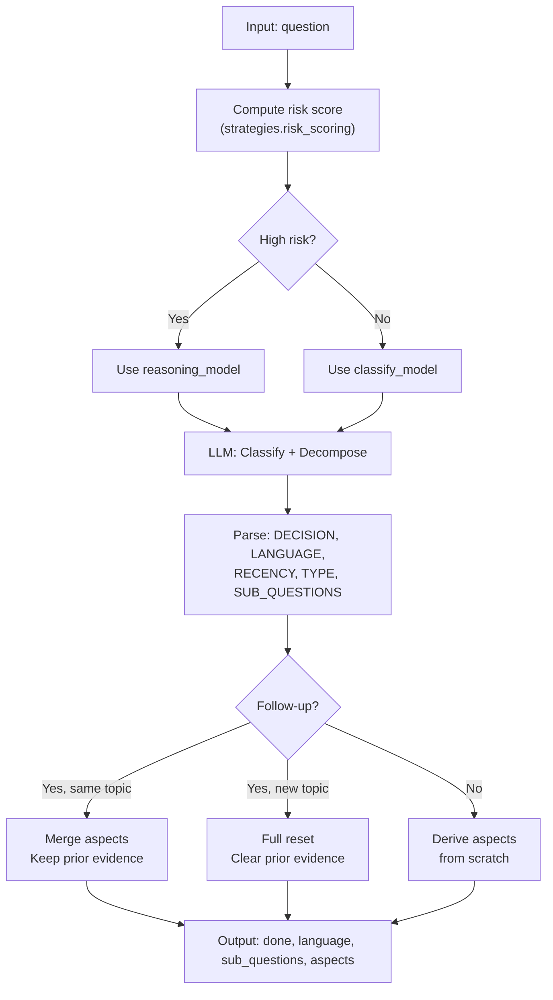
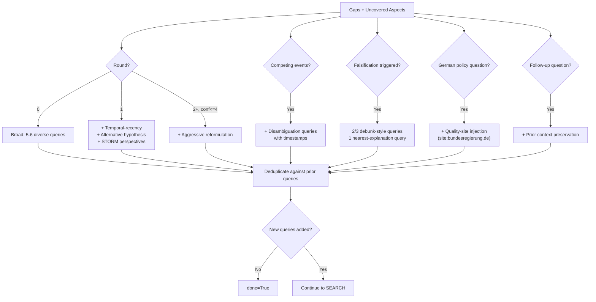
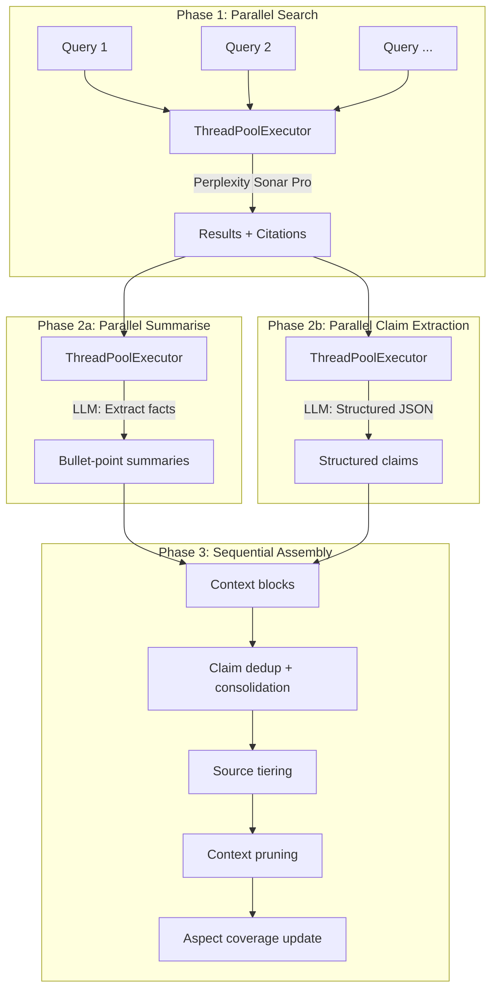
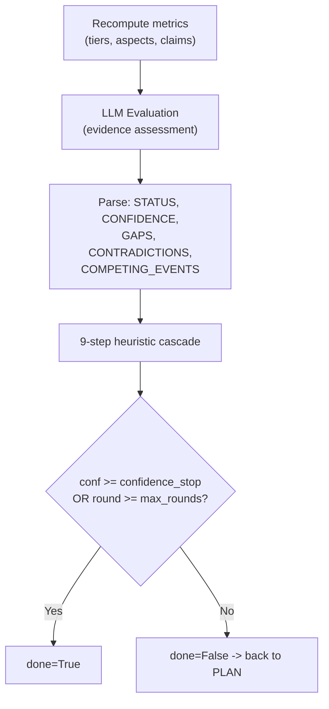
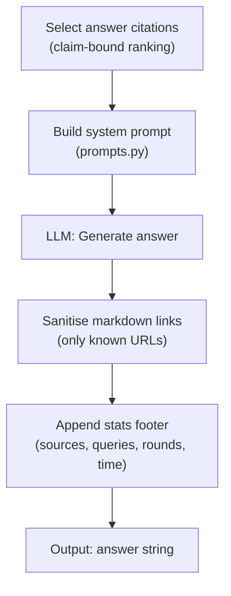

# Nodes

> File: `nodes.py`

## Scope

Per-node reference: purpose, control flow, LLM calls, state read/write, conditional strategies. All five pipeline nodes (`classify`, `plan`, `search`, `evaluate`, `answer`) are covered here. For the LangGraph topology that connects them, see [State and iteration](state-and-iteration.md).

## Node 1: `classify`

**Purpose.** Analyse the question, decide if web search is needed, detect language, decompose into sub-questions, derive required aspects, compute risk score.



### Risk scoring

Deterministic, regex-based (no LLM involved):

```
risk(q) = 2*I_policy + I_recency + I_numeric + I_normative + I_long
```

| Family | Points | Triggers |
|--------|--------|----------|
| Policy/Regulation | +2 | `gesetz*`, `recht*`, `verordnung*`, `regulier*`, `politik*`, `koalition*`, `gkv`, `beitrag*`, `haushalt*`, `privatis*` |
| Recency | +1 | `aktuell`, `heute`, `neueste`, `zuletzt`, `diskussion`, `trend`, `ausblick`, `prognose` |
| Numeric | +1 | `prozent`, `mrd`, `mio`, `euro`, or any digit sequence (`\d+[%€]?`) |
| Normative | +1 | `soll`, `sollen`, `geplant`, `durchsetzbar`, `realistisch` |
| Long question | +1 | > 220 characters |

**Escalation.** If `risk_score >= threshold` (default 4), the classify and evaluate nodes use the stronger reasoning model instead of lighter dedicated models. The score is capped at `min(score, 10)`.

### Academic keyword override

If the LLM does not classify as academic but the text contains keywords like `paper`, `studie`, `preprint`, `doi`, `arxiv`, `peer-review`, the type is forced to `"academic"`.

### Fallback behaviour

- LLM call fails: heuristic type inference (news for recency keywords, general otherwise), single sub-question = question verbatim, iteration-log marker `_classify_fallback` emitted, warning logged.
- Parsing fails partially: each missing field falls back independently; see `src/inqtrix/nodes.py` for the per-field rules.

## Node 2: `plan`

**Purpose.** Generate search queries for the next research round, adapting to gaps and prior findings.

### Query count

| Round | Count | Rationale |
|-------|-------|-----------|
| 0 (first) | 5-6 | Broad exploration |
| 1+ | 2-3 | Targeted gap-filling |

### Adaptive strategies

All strategies listed below are additive — multiple can activate simultaneously.



| Strategy | Trigger condition | Effect |
|----------|-------------------|--------|
| Base diverse queries | Always | 5-6 queries (round 0) or 2-3 queries (round 1+) |
| Temporal-recency | `round == 1` | Forces at least one query for the most current matching event |
| Alternative hypothesis | `round == 1` | Forces one query to explore counter-arguments |
| STORM perspective diversity | `round > 0` | Adds instruction to query from multiple stakeholder viewpoints |
| Aggressive reformulation | `round >= 2` AND `conf <= 4` | Completely rephrase using different terminology |
| Competing events disambiguation | `competing_events` set | Adds comparison instruction with timestamps |
| Falsification mode | `falsification_triggered` | 2/3 queries actively seek to disprove the premise; 1 query searches for the actual fact |
| Quality-site injection | German policy question detected | `site:` queries for primary and mainstream German sources |
| Follow-up context | `_prev_question` exists | Preserves prior research context in the prompt |

### Quality-site injection

For German policy questions (detected via regex: `privatis*|gkv|krankenkass*|gesetz*|verordnung*|beitrag*|kosten|haushalt*`), the plan node injects `site:`-prefixed queries:

- **Primary sources** (`bundesgesundheitsministerium.de`, `bundesregierung.de`, `bundestag.de`, `gkv-spitzenverband.de`, `gesetze-im-internet.de`) — injected if `round == 0` OR no primary sources yet OR claims needing primary verification remain unverified.
- **Mainstream sources** (`aerzteblatt.de`, `deutschlandfunk.de`, `zdfheute.de`, `spiegel.de`, `handelsblatt.com`, `tagesschau.de`) — injected if `round == 0` OR no mainstream sources yet OR `claim_quality_score < 0.35`.

Query terms come from `quality_terms_for_question()`, which filters out generic tokens (`soll`, `werden`, `aktuell`, `diskussion`, ...) and keeps up to 7 domain-specific tokens. Domain-specific additions are injected for dental (`zahnbehandlung`) and privatisation (`privatisierung`) topics; the `gkv` shorthand is reserved for health-policy questions.

### Fallback behaviour

- LLM call fails: fallback is `[question]` as the single query; marker `_plan_fallback` emitted.
- Parsed list empty: treated as "no new queries" — sets `done=True`, graph jumps directly to `answer`.

## Node 3: `search`

**Purpose.** Execute queries in parallel, summarise results, extract claims, assemble context.

### Three-phase pipeline



### Search parameters (per call)

| Parameter | Value | Source |
|-----------|-------|--------|
| `search_context_size` | `"high"` | Maximum depth |
| `recency_filter` | from classify | `"day"`, `"week"`, `"month"` |
| `language_filter` | from classify | `["de"]`, `["en"]` |
| `domain_filter` | computed per query | Blocklist low-quality or allowlist `site:` domain |
| `search_mode` | `"academic"` if applicable | For scholarly sources |
| `return_related` | `True` on round 0 | Seeds future queries |

### Domain filter logic

- Query contains `site:domain` → allowlist only that domain.
- Otherwise → blocklist domains from `LOW_QUALITY_DOMAINS` (pinterest, reddit, medium, gutefrage, etc.).

### Search caching

SHA-256 of `query + params`, TTL 1 hour, max 256 entries. Thread-safe via lock.

### Claim ledger cap

The claim ledger grows across rounds. To keep prompt size and RAM stable, it is capped at **400 entries** during research — if exceeded, only the most recent 400 are retained. Per-session storage uses a tighter cap of 50 entries (configurable via `SESSION_MAX_CLAIM_LEDGER`).

### Fallback behaviour

- Search provider fails for a query: that query is dropped, the remaining queries continue.
- Summarisation fails for a result: result kept without summary, claim extraction may still succeed.
- Claim extraction fails for a result: kept without structured claims, summary remains; the iteration log records the failed source (`Claim-Extraktion fehlgeschlagen (model=...)`).

## Node 4: `evaluate`

**Purpose.** Score evidence quality, check stopping criteria, decide whether to continue.



The 9-step heuristic cascade is detailed in [Stop criteria](../scoring-and-stopping/stop-criteria.md). Relevant markers emitted by this node:

- `_confidence_parsed` — the raw confidence the LLM produced.
- `_evidence_consistency_parsed` / `_evidence_sufficiency_parsed` — arithmetic sanity signals.
- `_evaluate_fallback` — LLM call failed; node keeps the previous confidence and records conservative gaps.

## Node 5: `answer`

**Purpose.** Synthesise the final answer with citations from accumulated evidence.



### Citation selection

1. **Primary** — verified claims with high-tier sources (primary > mainstream > stakeholder).
2. **Secondary** — contested claims (still informative).
3. **Tertiary** — unverified claims from quality sources.
4. **Fallback** — if fewer than 15 claim-bound citations, use the raw `all_citations` list.

Capped at `ANSWER_PROMPT_CITATIONS_MAX` (default 60).

### Answer format (German default prompt)

- **Kurzfazit** — executive summary (2–3 sentences).
- **Kernaussagen** — 5–8 bullet points with citations.
- **Detailanalyse** — subsections with evidence.
- **Einordnung / Ausblick** — context and outlook.

Length target: 600–1200 words. Markdown links must reference collected citations only; others are stripped.

### Fallback behaviour

- LLM call fails: raw context is returned without synthesis; iteration-log marker emitted; the answer fallback line is a German explanatory notice.
- No valid citations parsed: a fallback source bar is appended (`**Quellen:** [1](url1) | [2](url2) | ...`) with the top five prompt citations.

## Related docs

- [State and iteration](state-and-iteration.md)
- [Stop criteria](../scoring-and-stopping/stop-criteria.md)
- [Source tiering](../scoring-and-stopping/source-tiering.md)
- [Claims](../scoring-and-stopping/claims.md)
- [Iteration log](../observability/iteration-log.md)
