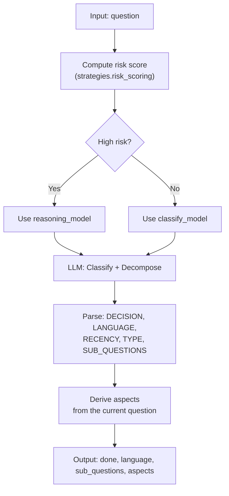
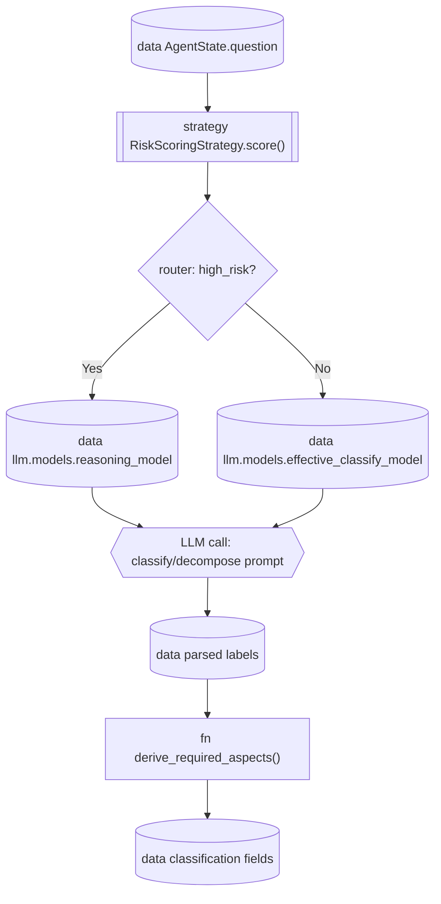
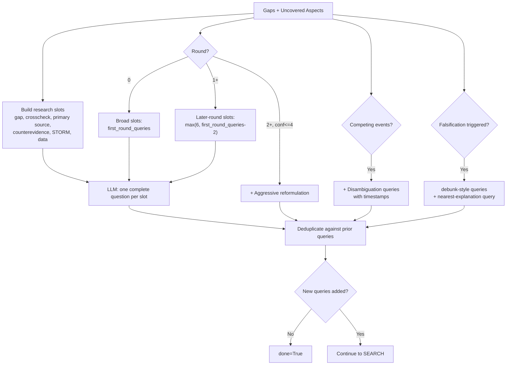
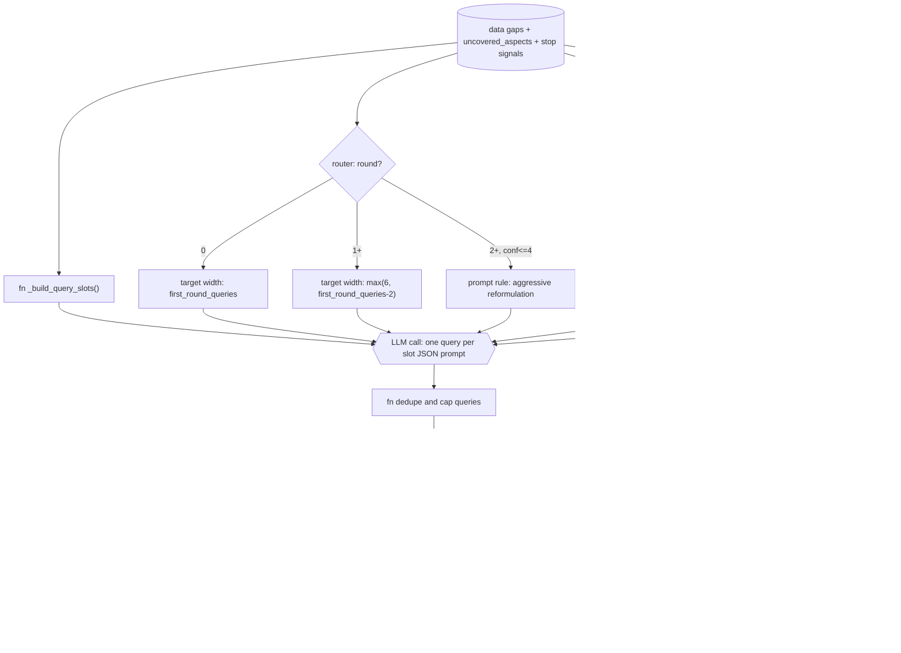
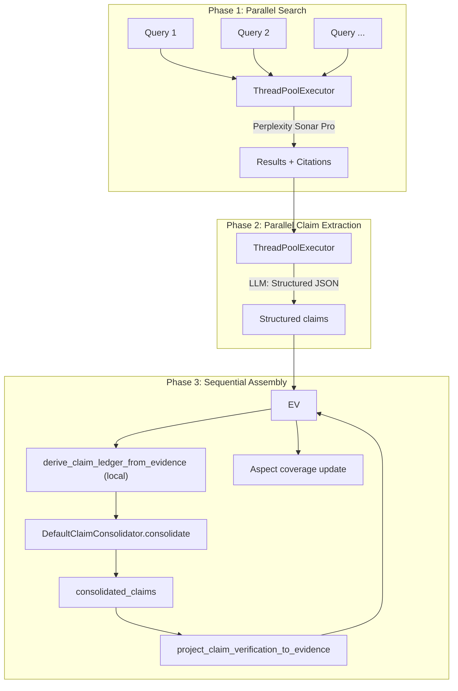
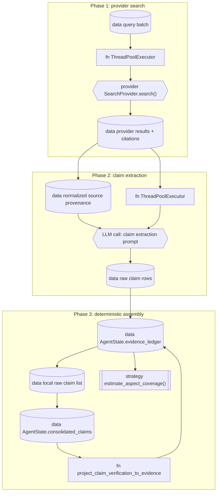
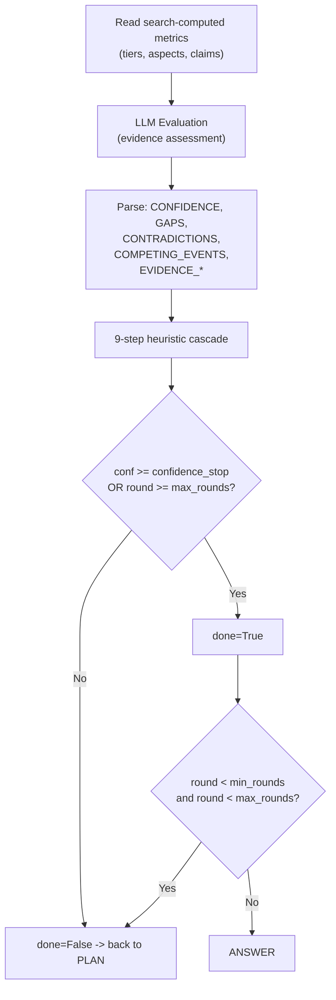
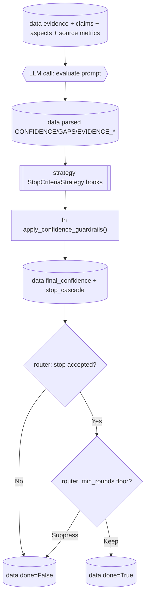
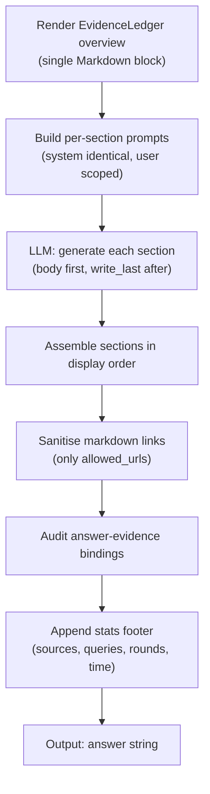
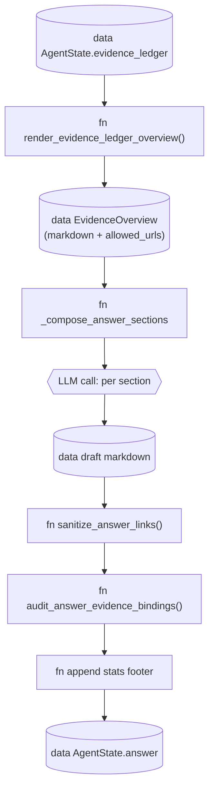

# Nodes

> File: `nodes.py`

## Scope

Per-node reference: purpose, control flow, LLM calls, state read/write, conditional strategies. All five pipeline nodes (`classify`, `plan`, `search`, `evaluate`, `answer`) are covered here. For the LangGraph topology that connects them, see [State and iteration](state-and-iteration.md).

Read this page as the detailed procedure guide. For each node, separate four
things:

- **State fields** are stored on the mutable `AgentState` dict.
- **Provider calls** leave the pure Python runtime and talk to a search or LLM
  backend.
- **Strategy calls** are replaceable policy/algorithm helpers.
- **Routers** read `state["done"]` to decide the next node.

## LLM call inventory

This table answers: "Where does the model actually get called, and what is it
asked to produce?" Prompt text is mostly inline in `nodes.py`; the final answer
system prompt also uses `prompts.py`.

| Stage | Provider method | Model role | Prompt origin | Expected output | Parser / fallback |
|---|---|---|---|---|---|
| `classify()` | `LLMProvider.complete()` | `classify` or `reasoning` for high-risk | inline classification/decomposition prompt in `nodes.py` | fixed labels: `DECISION`, `LANGUAGE`, `SEARCH_LANGUAGE`, `RECENCY`, `TYPE`, optional `FOLLOWUP`, `SUB_QUESTIONS` | regex + JSON-list parser; fallback seeds conservative defaults and emits `_classify_fallback` |
| `plan()` | `LLMProvider.complete()` | reasoning/default model | inline query-planning prompt in `nodes.py` | JSON array of search-query strings | JSON-list parser; fallback uses the original question as a query and emits `_plan_fallback` |
| `search()` claim extraction | `ClaimExtractionStrategy.extract()` usually calls LLM | claim extraction | `LLMClaimExtractor` prompt | JSON claims per source | extractor validates and returns empty claims on non-fatal failures |
| `evaluate()` | `LLMProvider.complete()` | `evaluate` or `reasoning` for high-risk | inline evaluator prompt in `nodes.py` plus prompt suffixes | `CONFIDENCE`, `GAPS`, contradictions, competing events, evidence scores | regex parsing; conservative fallback emits `_evaluate_fallback` |
| `answer()` | `LLMProvider.complete_with_metadata()` | reasoning/default, optional fallback model | one call **per section**: section system + user prompt composed in `nodes.py` and `prompts.py`, grounded in the single record-driven evidence overview from `render_evidence_ledger_overview()` | Markdown section body with allowed citations | link sanitizer + evidence audit; visible fallback answer on timeout/provider failure. See [answer-composition.md](answer-composition.md). |

## Node 1: `classify`

**Purpose.** Analyse the question, decide if web search is needed, detect language, decompose into sub-questions, derive required aspects, compute risk score.
This diagram answers: "How does the first node turn one user question into the
initial control and planning fields?"

Conventional flowchart

```mermaid
flowchart TD
    A["Input: question"] --> B["Compute risk score<br/>(strategies.risk_scoring)"]
    B --> C{"High risk?"}
    C -->|Yes| D["Use reasoning_model"]
    C -->|No| E["Use classify_model"]
    D --> F["LLM: Classify + Decompose"]
    E --> F
    F --> G["Parse: DECISION, LANGUAGE,<br/>RECENCY, TYPE, SUB_QUESTIONS"]
    G --> H["Derive aspects<br/>from the current question"]
    H --> I["Output: done, language, sub_questions, aspects"]
```

Typed flowchart

```mermaid
flowchart TD
    Q[("data AgentState.question")]
    Risk[["strategy RiskScoringStrategy.score()"]]
    High{"router: high_risk?"}
    ClassifyModel[("data llm.models.effective_classify_model")]
    ReasoningModel[("data llm.models.reasoning_model")]
    LLM{{"LLM call: classify/decompose prompt"}}
    Parsed[("data parsed labels")]
    Fresh["fn derive_required_aspects()"]
    Out[("data classification fields")]

    Q --> Risk
    Risk --> High
    High -->|Yes| ReasoningModel
    High -->|No| ClassifyModel
    ReasoningModel --> LLM
    ClassifyModel --> LLM
    LLM --> Parsed
    Parsed --> Fresh
    Fresh --> Out
```

The transition out of `classify()` is controlled by `state["done"]`. `DIRECT`
sets `done=True`, so the graph routes straight to `answer()`. `SEARCH` leaves
`done=False`, so the next node is `plan()`.

### Risk scoring

Deterministic, regex-based (no LLM involved):

```
risk(q) = 2*I_policy + I_recency + I_numeric + I_normative + I_long
```

| Family | Points | Triggers |
|--------|--------|----------|
| Policy/Regulation | +2 | `gesetz*`, `recht*`, `verordnung*`, `regulier*`, `politik*`, `koalition*`, `gkv`, `beitrag*`, `haushalt*`, `privatis*` |
| Recency | +1 | `aktuell`, `heute`, `neueste`, `zuletzt`, `diskussion`, `trend`, `ausblick`, `prognose` |
| Numeric | +1 | `prozent`, `mrd`, `mio`, `euro`, or any digit sequence (`\d+[%€]?`) |
| Normative | +1 | `soll`, `sollen`, `geplant`, `durchsetzbar`, `realistisch` |
| Long question | +1 | > 220 characters |

**High-risk flag.** If `risk_score >= threshold` (default 4), the question is flagged `high_risk`. This is an observability signal only (forensic events, `/health`, follow-up preservation); it does not change model selection — every node resolves its model via the model tiers (high/mid/fast) or a per-node override. The score is capped at `min(score, 10)`.

### Academic keyword override

If the LLM does not classify as academic but the text contains keywords like `paper`, `studie`, `preprint`, `doi`, `arxiv`, `peer-review`, the type is forced to `"academic"`.

### Fallback behaviour

- LLM call fails: heuristic type inference (news for recency keywords, general otherwise), single sub-question = question verbatim, iteration-log marker `_classify_fallback` emitted, warning logged.
- Parsing fails partially: each missing field falls back independently; see `src/inqtrix/nodes.py` for the per-field rules.

Example state after `classify()`:

```python
{
    "language": "de",
    "search_language": "de",
    "recency": "week",
    "query_type": "news",
    "answer_contract": "news_briefing",
    "risk_score": 4,
    "high_risk": True,
    "sub_questions": ["Was ist der aktuelle Stand der GKV-Reform?"],
    "required_aspects": ["aktueller Stand", "Akteure", "Zeitplan"],
    "done": False,
}
```

## Node 2: `plan`

**Purpose.** Generate search queries for the next research round, adapting to gaps and prior findings.

### Query count

| Round | Count | Rationale |
|-------|-------|-----------|
| 0 (first) | `first_round_queries` | Broad exploration |
| 1+ | `max(6, first_round_queries - 2)` | Targeted fan-out across gaps, cross-checks, and evidence-depth weaknesses |

The same internal helper is used by `plan()` and `search()`, so the number of
planned queries and the number of provider calls cannot drift apart. With the
current profiles this means COMPACT runs 6 later-round searches and DEEP runs
8 later-round searches.

### Adaptive strategies

All strategies listed below are additive — multiple can activate simultaneously.
This diagram answers: "Why does the next query batch look different from the
previous one?" Every box is a prompt instruction assembled by `plan()`.

Conventional flowchart

```mermaid
flowchart TD
    A["Gaps + Uncovered Aspects"] --> B{"Round?"}
    A --> S["Build research slots<br/>gap, crosscheck, primary source,<br/>counterevidence, STORM, data"]
    B -->|0| C["Broad slots:<br/>first_round_queries"]
    B -->|1+| D["Later-round slots:<br/>max(6, first_round_queries-2)"]
    B -->|2+, conf<=4| E["+ Aggressive reformulation"]
    A --> F{"Competing events?"}
    F -->|Yes| G["+ Disambiguation queries<br/>with timestamps"]
    A --> H{"Falsification triggered?"}
    H -->|Yes| I["debunk-style queries<br/>+ nearest-explanation query"]
    S --> LLM["LLM: one complete question per slot"]
    C --> LLM
    D --> LLM
    LLM --> L["Deduplicate against prior queries"]
    E --> L
    G --> L
    I --> L
    L --> M{"New queries added?"}
    M -->|No| N["done=True"]
    M -->|Yes| O["Continue to SEARCH"]
```

Typed flowchart

```mermaid
flowchart TD
    A[("data gaps + uncovered_aspects + stop signals")] --> B{"router: round?"}
    A --> S["fn _build_query_slots()"]
    B -->|0| C["target width: first_round_queries"]
    B -->|1+| D["target width: max(6, first_round_queries-2)"]
    B -->|2+, conf<=4| E["prompt rule: aggressive reformulation"]
    A --> F{"router: competing_events?"}
    F -->|Yes| G["prompt rule: disambiguation queries"]
    A --> H{"router: falsification_triggered?"}
    H -->|Yes| I["prompt rule: debunk + nearest explanation"]
    S --> L{{"LLM call: one query per slot JSON prompt"}}
    C --> L
    D --> L
    E --> L
    G --> L
    I --> L
    L --> M["fn dedupe and cap queries"]
    M --> N{"router: new queries added?"}
    N -->|No| O[("data done=True")]
    N -->|Yes| R[("data queries appended")]
```

The graph routes to `search()` only when `plan()` appends at least one new
query and leaves `done=False`. If parsing succeeds but every query is a
duplicate or the planner cannot produce a useful query, `done=True` sends the
run directly to `answer()`.

| Strategy | Trigger condition | Effect |
|----------|-------------------|--------|
| Base diverse queries | Always | `first_round_queries` in round 0; `max(6, first_round_queries - 2)` in round 1+ |
| Query slots | Always | Builds one slot per intended search query; slot types cover gaps, cross-checks, primary-source search, counterevidence, STORM perspectives, and data verification |
| Temporal-recency | `round == 1` | Forces at least one query for the most current matching event |
| Alternative hypothesis | `round == 1` | Forces one query to explore counter-arguments |
| STORM perspective diversity | Always as slot filler | Ensures unused slots become distinct perspectives instead of near-duplicate keyword searches |
| Aggressive reformulation | `round >= 2` AND `conf <= 4` | Completely rephrase using different terminology |
| Competing events disambiguation | `competing_events` set | Adds comparison instruction with timestamps |
| Falsification mode | `falsification_triggered` | At least two queries actively seek to disprove the premise; another query searches for the closest actual fact |
### Fallback behaviour

- LLM call fails: fallback is `[question]` as the single query; marker `_plan_fallback` emitted.
- Parsed list empty: treated as "no new queries" — sets `done=True`, graph jumps directly to `answer`.

## Node 3: `search`

**Purpose.** Execute queries in parallel, extract claims, assemble EvidenceRecords, derive claim/report views, and update context.

### Three-phase pipeline

This diagram answers: "What does `search()` actually build?" It is more than a
web-search call: the node first asks the search provider for results, then asks
the claim extractor to structure them, then derives the
internal ledgers used by evaluation and answer synthesis.

Conventional flowchart


```mermaid
flowchart TD
    subgraph "Phase 1: Parallel Search"
        P1["ThreadPoolExecutor"]
        Q1["Query 1"] --> P1
        Q2["Query 2"] --> P1
        Q3["Query ..."] --> P1
        P1 -->|"Perplexity Sonar Pro"| R1["Results + Citations"]
    end

    subgraph "Phase 2: Parallel Claim Extraction"
        P3["ThreadPoolExecutor"]
        R1 --> P3
        P3 -->|"LLM: Structured JSON"| CL["Structured claims"]
    end

    subgraph "Phase 3: Sequential Assembly"
        CL --> EV
        EV --> DED["derive_claim_ledger_from_evidence (local)"]
        DED --> CON["DefaultClaimConsolidator.consolidate"]
        CON --> CCL["consolidated_claims"]
        CCL --> PROJ["project_claim_verification_to_evidence"]
        PROJ --> EV
        EV --> COV["Aspect coverage update"]
    end
```

Typed flowchart

```mermaid
flowchart TD
    subgraph p1 ["Phase 1: provider search"]
        Queries[("data query batch")]
        Pool1["fn ThreadPoolExecutor"]
        SearchProvider{{"provider SearchProvider.search()"}}
        SearchResults[("data provider results + citations")]
        Queries --> Pool1 --> SearchProvider --> SearchResults
    end

    subgraph p2 ["Phase 2: claim extraction"]
        Pool2["fn ThreadPoolExecutor"]
        ClaimLLM{{"LLM call: claim extraction prompt"}}
        RawClaims[("data raw claim rows")]
        SourceProvenance[("data normalized source provenance")]
        SearchResults --> Pool2
        SearchResults --> SourceProvenance --> ClaimLLM
        Pool2 --> ClaimLLM --> RawClaims
    end

    subgraph p3 ["Phase 3: deterministic assembly"]
        Evidence[("data AgentState.evidence_ledger")]
        LocalClaims[("data local raw claim list")]
        Consolidated[("data AgentState.consolidated_claims")]
        Projection["fn project_claim_verification_to_evidence"]
        Coverage[["strategy estimate_aspect_coverage()"]]
        RawClaims --> Evidence
        Evidence --> LocalClaims
        LocalClaims --> Consolidated
        Consolidated --> Projection
        Projection --> Evidence
        Evidence --> Coverage
    end
```

Key transitions inside `search()`:

- Search results become normalized query/source/citation records.
- Claim extraction receives provider-neutral source provenance (URL, title,
  snippet, date, origin) when the provider exposes it; this keeps Azure and
  Perplexity shapes distinct at ingestion but common downstream.
- Extracted claims and provider source context are attached to `EvidenceRecord` rows.
- `evidence_ledger` is the **only persisted primary truth**. The raw claim
  list is a local variable inside `search()`, `consolidated_claims` is the one
  persisted claim view used by `plan`/`evaluate`. After consolidation,
  `project_claim_verification_to_evidence()` writes each claim's
  verification standing back onto the record it came from -- so the ledger
  is self-describing.
- There is no separate `context`, `claim_ledger`, `report_evidence_bundles`,
  `selected_report_evidence`, `unverified_evidence_notes`, or
  `prompt_evidence_units` state field anymore. The answer composer reads one
  rendered Markdown overview from `render_evidence_ledger_overview()` -- see
  [Evidence pipeline](evidence-pipeline.md#rendering-evidenceledger-markdown).
- A round with `claims=[]` is **not** degraded -- claimless records carry
  snippets, passages, and citations and are rendered as
  `source-context` blocks in the overview.
- The next graph node is always `evaluate()` because `search()` increments
  the round and writes the data evaluation needs.

### Search parameters (per call)

| Parameter | Value | Source |
|-----------|-------|--------|
| `search_context_size` | `"high"` | Maximum depth |
| `recency_filter` | from classify | `"day"`, `"week"`, `"month"` |
| `language_filter` | from classify | `["de"]`, `["en"]` |
| `domain_filter` | computed per query | Allowlist extracted `site:` domains |
| `search_mode` | `"academic"` if applicable | For scholarly sources |
| `return_related` | `True` on round 0 | Seeds future queries |

Before dispatch, the search node filters these hints through the active provider's capability metadata. Providers may expose either `supported_search_parameters` or `search_capabilities`; unsupported hints are omitted instead of being sent to a backend that cannot express them. The iteration log records the resolved `supported_parameters` list for each run.

### Domain filter logic

- Query contains one or more `site:domain` operators → allowlist all extracted domains.
- Otherwise → no domain filter. Source tiering classifies results after search
  instead of silently constraining the source pool before retrieval.

### Search caching

SHA-256 of `query + params`, TTL 1 hour, max 256 entries. Thread-safe via lock.

### Evidence and claim view caps

The search node writes the `evidence_ledger` first. The raw claim list and
`consolidated_claims` are deterministic projections from that ledger;
`search()` does not run a separate semantic-grouping LLM call.

The raw claim list (derived from `EvidenceRecord.claims[]` via
`derive_claim_ledger_from_evidence`) is a local variable in `search()` and is
not persisted on `AgentState`. The persisted `consolidated_claims` list is
materialised through `DefaultClaimConsolidator.consolidate()` with the
profile caps `materialize_max_total` (24 COMPACT / 48 DEEP) and
`materialize_max_unverified` (8 COMPACT / 48 DEEP).

Valid empty claim extraction is a visible but non-fatal state. When search
answers and citations exist but the extractor returns `claims=[]`, the search
iteration records `claim_valid_empty` / `_claim_extraction_empty`, and
`query_summary` records `claim_extraction_valid_empty`. Invalid or
token-limited claim JSON counts as `ALGO-FAIL claim_extraction` via
`claim_fallbacks`. If every claim-extraction call across a forensic/deep run
fails, the answer node returns a diagnostic report instead of composing a
normal report from unaudited source context.

Example state after `search()`:

```python
{
    "round": 1,
    "queries": ["What did the health ministry publish about ..."],
    "all_citations": ["https://www.bundesgesundheitsministerium.de/..."],
    "evidence_ledger": [{"evidence_id": "ev_...", "record_type": "source"}],
    "consolidated_claims": [
        {
            "claim_id": "claim_...",
            "status": "verified",
            "verification_basis": "verified_cross_checked",
            "supporting_evidence_ids": ["ev_...", "ev_..."],
        }
    ],
    "source_quality_score": 0.8,
    "claim_quality_score": 0.9,
    "evidence_depth_gap": {"active": False, "verified_count": 4, "cross_checked_count": 3, "single_source_verified_count": 1, "single_source_ratio": 0.25},
}
```

### Fallback behaviour

- Search provider fails for a query: that query is dropped, the remaining queries continue.
- Summarisation fails for a result: result kept without summary, claim extraction may still succeed.
- Claim extraction fails for a result: kept without structured claims, summary remains; the iteration log records `ALGO-FAIL claim_extraction`. Full-run failure in forensic/deep mode blocks normal report synthesis.

## Node 4: `evaluate`

**Purpose.** Score evidence quality, check stopping criteria, decide whether to continue.
This diagram answers: "How does evidence become `done=True` or `done=False`?"
The LLM produces evaluator text; strategy hooks and deterministic guardrails
turn it into stored stop signals.

Conventional flowchart

```mermaid
flowchart TD
    A["Read search-computed metrics<br/>(tiers, aspects, claims)"] --> B["LLM Evaluation<br/>(evidence assessment)"]
    B --> C["Parse: CONFIDENCE, GAPS,<br/>CONTRADICTIONS,<br/>COMPETING_EVENTS,<br/>EVIDENCE_*"]
    C --> D["9-step heuristic cascade"]
    D --> E{"conf >= confidence_stop<br/>OR round >= max_rounds?"}
    E -->|Yes| F["done=True"]
    E -->|No| G["done=False -> back to PLAN"]
    F --> H{"round < min_rounds<br/>and round < max_rounds?"}
    H -->|Yes| G
    H -->|No| I["ANSWER"]
```

Typed flowchart

```mermaid
flowchart TD
    Metrics[("data evidence + claims + aspects + source metrics")]
    EvalLLM{{"LLM call: evaluate prompt"}}
    Parsed[("data parsed CONFIDENCE/GAPS/EVIDENCE_*")]
    Hooks[["strategy StopCriteriaStrategy hooks"]]
    Guard["fn apply_confidence_guardrails()"]
    StopData[("data final_confidence + stop_cascade")]
    Gate{"router: stop accepted?"}
    Min{"router: min_rounds floor?"}
    Continue[("data done=False")]
    Done[("data done=True")]

    Metrics --> EvalLLM --> Parsed --> Hooks --> Guard --> StopData
    StopData --> Gate
    Gate -->|No| Continue
    Gate -->|Yes| Min
    Min -->|Suppress| Continue
    Min -->|Keep| Done
```

The 9-step heuristic cascade is detailed in [Stop criteria](../scoring-and-stopping/stop-criteria.md). Relevant markers emitted by this node:

- `_confidence_parsed` — whether `CONFIDENCE: N` was parsed successfully.
- `_evidence_consistency_parsed` / `_evidence_sufficiency_parsed` — arithmetic sanity signals.
- `_evaluate_fallback` — LLM call failed; node derives a conservative fallback confidence and records conservative gaps.

`STATUS: SUFFICIENT|INSUFFICIENT` is requested in the evaluate prompt for evaluator discipline, but stop logic is driven by parsed numeric/text signals (`CONFIDENCE`, `GAPS`, contradiction/event/evidence fields) plus deterministic guardrails and post-LLM heuristics.

Example state after `evaluate()`:

```python
{
    "final_confidence": 6,
    "evidence_consistency": 8,
    "evidence_sufficiency": 6,
    "gaps": "Need one primary source for the cost estimate.",
    "done": False,
    "_stop_reason": "",
    "falsification_triggered": False,
}
```

If `done=False`, the router returns to `plan()` and the next query prompt reads
`gaps`, `uncovered_aspects`, `competing_events`, and
`falsification_triggered`. If `done=True`, the router moves to `answer()`.

## Node 5: `answer`

**Purpose.** Synthesise the final answer one section at a time from the
single record-driven evidence overview, then audit the resulting citations.
This diagram answers: "How does the EvidenceLedger become the final Markdown
answer returned to the caller?"

Conventional flowchart

```mermaid
flowchart TD
    A["Render EvidenceLedger overview<br/>(single Markdown block)"] --> B["Build per-section prompts<br/>(system identical, user scoped)"]
    B --> C["LLM: generate each section<br/>(body first, write_last after)"]
    C --> D["Assemble sections in display order"]
    D --> E["Sanitise markdown links<br/>(only allowed_urls)"]
    E --> F["Audit answer-evidence bindings"]
    F --> G["Append stats footer<br/>(sources, queries, rounds, time)"]
    G --> H["Output: answer string"]
```

Typed flowchart

```mermaid
flowchart TD
    Ledger[("data AgentState.evidence_ledger")]
    Overview["fn render_evidence_ledger_overview()"]
    OverviewData[("data EvidenceOverview<br/>(markdown + allowed_urls)")]
    Compose["fn _compose_answer_sections"]
    SectionLLM{{"LLM call: per section"}}
    Draft[("data draft markdown")]
    Links["fn sanitize_answer_links()"]
    Audit["fn audit_answer_evidence_bindings()"]
    Footer["fn append stats footer"]
    Final[("data AgentState.answer")]

    Ledger --> Overview --> OverviewData --> Compose
    Compose --> SectionLLM --> Draft
    Draft --> Links --> Audit --> Footer --> Final
```

The answer node does not perform new search. It renders the single canonical
evidence overview from the ledger (see [Evidence pipeline — Rendering](evidence-pipeline.md#rendering-evidenceledger-markdown)),
invokes the section composer (one LLM call per section, body sections first
and `write_last` sections like Executive Summary / Kurzfazit afterwards),
sanitizes citations so only URLs in `allowed_urls` remain, then audits
whether the cited URLs map back to EvidenceRecords.

### Answer composer (one LLM call per section)

The section composer is a meaningful sub-pipeline on its own and gets its
own dedicated page: [Answer composition](answer-composition.md). In summary:

- `_compose_answer_sections()` in `nodes.py` (~lines 970-1277) iterates
  through the active `AnswerSectionSpec` list and issues **one LLM call per
  section**.
- The **system prompt** is the same for every section call (full
  `evidence_overview` + conditional CLAIM-KALIBRIERUNG / ABDECKUNGSREGEL /
  EVIDENZTIEFE / TRANSPARENZPFLICHT blocks + ZITATIONS-REGELN), built by
  `_build_answer_system_prompt_with_style()` in `prompts.py`. Only the
  section-specific style block (heading, position, length guidance)
  changes.
- The **user prompt** is built per call by
  `build_answer_section_user_prompt()` in `prompts.py` and carries the
  section's focus hint, the running `report_so_far_summary`, the
  accumulated `used_evidence_labels`, and the `synthesizing_existing`
  flag for write-last sections.
- **Write order ≠ display order.** Sections with `write_last=True` (DEEP
  "Executive Summary", COMPACT "Kurzfazit") are written **after** the body
  sections, so they can see the body via `report_so_far_summary`. They are
  re-assembled at their declared display index, which is why the Executive
  Summary still appears at the top of the answer.

### Citation allowlist

Citations are restricted to `EvidenceOverview.allowed_urls` -- the union of
canonical URLs whose source blocks are visible in the EvidenceOverview.
The link sanitizer (`sanitize_answer_links`) strips Markdown links to any
other URL. The cap `answer_prompt_citations_max` (60 COMPACT / 500 DEEP)
limits how many citations may appear in the answer body. There is no
parallel numbered citation map -- labels are `[E1]`, `[E2]`, …, defined by
`label_urls` from the renderer.

### Answer format (German default prompts)

Section list per profile is defined in
`src/inqtrix/report_profiles.py::_COMPACT_ANSWER_SECTIONS` and
`_DEEP_ANSWER_SECTIONS`.

COMPACT (4 sections; "Kurzfazit" is `write_last=True`):
- **Kurzfazit** — executive summary (2-3 sentences).
- **Kernaussagen** — bullet points with citations.
- **Detailanalyse** — sub-sections with evidence.
- **Einordnung / Ausblick** — context and outlook.

DEEP (6 sections; "Executive Summary" is `write_last=True`):
- **Executive Summary**
- **Hintergrund / Kontext**
- **Analyse**
- **Perspektiven / Positionen**
- **Risiken / Unsicherheiten**
- **Fazit / Ausblick**

Length is steered by per-section `length_guidance` in the spec, not a fixed
word target.

If no report-eligible records exist but source-context records do, the final
footer reports `Evidence-Contract: source_context_only`, not a
missing-evidence failure. Forensic/deep runs still block normal report
synthesis when claim extraction failed for the whole run.

### Section composer memory

For multi-section reports, `_compose_answer_sections()` carries two
deterministic memory fields between calls:

- `report_so_far_summary`: rolling 2400-char compaction of already rendered
  sections (heading + 900-char whitespace-normalized body per section), via
  `_compact_section_summary()`.
- `used_evidence_labels`: citation labels (`E1`, `E12`, …) already used in
  earlier sections, extracted via `_extract_evidence_labels()` regex.

Before each section, `select_section_evidence_records()` in
`src/inqtrix/evidence.py` picks a small label hint list based on the section
heading, required aspects, and already used labels (already-used labels get a
`-16` ranking penalty to spread coverage). The result is passed into the
user prompt as `section_focus_labels` -- a **soft hint**, not a filter: the
LLM still sees the full evidence overview in the system prompt and may cite
any allowed URL. See [Answer composition](answer-composition.md) for the
exact prompt structure.

### Fallback behaviour

The answer node has three distinct LLM-call fallback paths and all of them are surfaced according to Design Principle 1 ("No Silent Fallbacks"). Each path emits a `log.warning(...)` line, a `progress` event on the user-visible queue, an iteration-log marker (`_answer_fallback=True` plus a structured `_answer_fallback_kind` and `_answer_fallback_reason`), and prepends a visible `> [!WARNING] Antwort-Synthese-Fallback aktiv` block to the answer body so the degradation is also visible in the rendered markdown:

| `_answer_fallback_kind` | Trigger | Replacement body |
|---|---|---|
| `timeout` | `_compose_answer_sections` raised `AgentTimeout` | Visible warning header + the existing `ctx` (research context) verbatim, or a "no context yet" hint when context is empty. |
| `no_fallback_model` | `_compose_answer_sections` raised a provider API error and `fallback_model` was not configured (i.e. the configured `effective_evaluate_model` equals `reasoning_model`) | Same as `timeout`. |
| `fallback_model_failed` | The primary call raised, the fallback model was attempted (`emit_progress("answer_fallback_model")`), and the fallback model also raised. | Same as `timeout`, plus the original primary error class is included in `_answer_fallback_reason`. |

A successful fallback-model attempt sets `fallback_attempted=True`, `fallback_succeeded=True`, leaves `_answer_fallback=False`, and is signalled by the `answer_fallback_model` progress event only.

If no valid citations are parsed during a successful synthesis, a fallback source bar is appended (`**Quellen:** [1](https://example.com/source-1) | [2](https://example.com/source-2) | ...`) with the top five prompt citations.

This is separate from `ALGO-FAIL` handling. Blocking algorithm failures
(`claim_extraction` or `report_evidence`) do not produce a
normal answer fallback; the node returns a short diagnostic report with
`Evidence-Contract: algorithm_failed` and caps confidence at 3.

## Related docs

- [Answer composition](answer-composition.md) -- per-section LLM call flow, prompt templates, write-last summary.
- [State and iteration](state-and-iteration.md)
- [Evidence pipeline](evidence-pipeline.md)
- [Stop criteria](../scoring-and-stopping/stop-criteria.md)
- [Confidence pipeline](../scoring-and-stopping/confidence.md)
- [Calculation overview](../scoring-and-stopping/calculation-overview.md)
- [Source tiering](../scoring-and-stopping/source-tiering.md)
- [Claims](../scoring-and-stopping/claims.md)
- [Iteration log](../observability/iteration-log.md)
