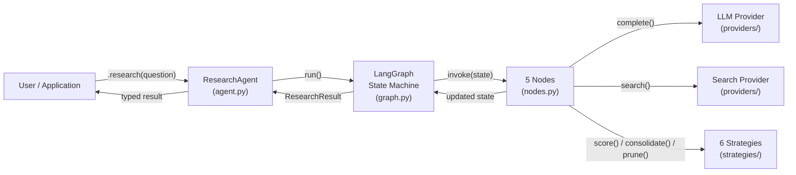
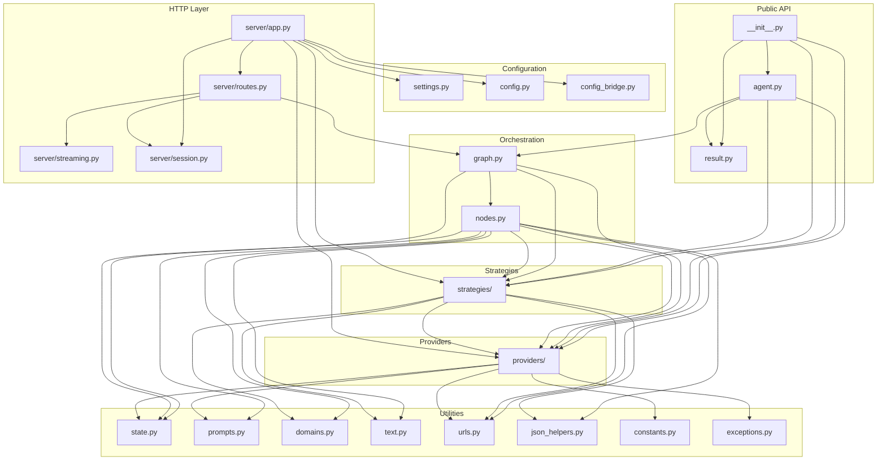

# Architecture overview

Inqtrix is an iterative research agent that runs a bounded multi-round loop of web search, evidence evaluation, and answer synthesis. This page is the high-level map. Individual concerns are covered in dedicated pages linked below.

## Scope

Reading this page gives you the mental model of the system:

- which modules exist and how they depend on each other,
- how a `research(question)` call flows through the five nodes,
- where each algorithmic concern lives (providers vs strategies vs orchestration),
- which file to touch for a given change.

## System flow

**Core idea.** Rather than single-pass retrieval and summarisation, the agent runs a bounded loop with independent stopping criteria, aspect coverage tracking, structured claim consolidation, and risk-based model escalation.

## Design principles

| Principle | Implementation |
|-----------|----------------|
| Pluggable providers | Abstract `LLMProvider` and `SearchProvider` classes (see [Providers overview](../providers/overview.md)) |
| Pluggable strategies | Six strategy ABCs with default implementations (see [Strategies](strategies.md)) |
| Declarative graph | `GraphConfig` dataclass describes topology; `build_graph()` compiles it (see [Graph topology](graph-topology.md)) |
| Typed results | Pydantic `ResearchResult` with nested metrics (see [Result schema](result-schema.md)) |
| Lazy initialisation | `ResearchAgent` creates providers and strategies on first use |
| Backwards compatible | FastAPI server (`server/app.py`) works alongside the library API |
| No silent fallbacks | Every fallback path emits both a `log.warning(...)` and a progress marker (see [Iteration log](../observability/iteration-log.md)) |
| Constructor first | Providers never read environment variables directly; only the example scripts and the `Settings` bridge translate `.env` into constructor arguments |

## Module dependency graph

**Key property.** No circular dependencies. The dependency direction flows strictly downward: Public API → Orchestration → Providers/Strategies → Utilities.

## Where to change what

| Goal | Files to touch | Detailed reference |
|------|----------------|--------------------|
| Add a new search backend | `providers/` (implement `SearchProvider`) | [Providers overview](../providers/overview.md), [Writing a custom provider](../providers/writing-a-custom-provider.md) |
| Add a new LLM backend | `providers/` (implement `LLMProvider`) | [Providers overview](../providers/overview.md), [Writing a custom provider](../providers/writing-a-custom-provider.md) |
| Use Azure OpenAI as the LLM | `providers/azure.py`, see `examples/provider_stacks/azure_openai_*.py` | [Azure OpenAI provider](../providers/azure-openai.md) |
| Use Amazon Bedrock as the LLM | `providers/bedrock.py`, see `examples/provider_stacks/bedrock_perplexity.py` | [Bedrock provider](../providers/bedrock.md) |
| Use Azure OpenAI or Foundry search | `providers/azure_openai_web_search.py`, `providers/azure_bing.py`, `providers/azure_web_search.py` | [Azure OpenAI web search](../providers/azure-openai-web-search.md), [Azure Foundry Bing](../providers/azure-foundry-bing.md), [Azure Foundry web search](../providers/azure-foundry-web-search.md) |
| Change source quality tiers | `strategies/_source_tiering.py`, `domains.py` | [Source tiering](../scoring-and-stopping/source-tiering.md) |
| Customise claim extraction | `strategies/_claim_extraction.py` | [Claims](../scoring-and-stopping/claims.md) |
| Customise claim dedup/consolidation | `strategies/_claim_consolidation.py` | [Claims](../scoring-and-stopping/claims.md) |
| Change context pruning | `strategies/_context_pruning.py` | [Nodes](nodes.md) |
| Change risk scoring | `strategies/_risk_scoring.py` | [Nodes](nodes.md), [Aspect coverage](../scoring-and-stopping/aspect-coverage.md) |
| Change stop or continue heuristics | `strategies/_stop_criteria.py`, `nodes.py` | [Stop criteria](../scoring-and-stopping/stop-criteria.md) |
| Add or rewire a graph node | `nodes.py` (node function), `graph.py` (wiring) | [State and iteration](state-and-iteration.md), [Graph topology](graph-topology.md) |
| Change prompt templates | `prompts.py` | [Nodes](nodes.md) |
| Add new state fields | `state.py` (add to `AgentState` TypedDict) | [State and iteration](state-and-iteration.md) |
| Add a new HTTP endpoint | `server/routes.py`, `server/app.py` | [Web server mode](../deployment/webserver-mode.md) |
| Change timeouts or thresholds | `constants.py` (defaults), `settings.py` (env), `config.py` (YAML schema) | [Settings and env](../configuration/settings-and-env.md), [Timeouts and errors](../observability/timeouts-and-errors.md) |
| Change session or follow-up behaviour | `server/session.py`, `state.py` | [Web server mode](../deployment/webserver-mode.md) |
| Add domain allow or block lists | `domains.py` | [Source tiering](../scoring-and-stopping/source-tiering.md) |
| Add regression baselines | `parity/`, `tests/integration/` | [Parity tooling](../development/parity-tooling.md) |

All strategy and provider customisations are passed via `AgentConfig`; no subclassing of `ResearchAgent` is required.

## Related docs

- [Public API layer](public-api.md)
- [State and iteration](state-and-iteration.md)
- [Nodes](nodes.md)
- [Strategies](strategies.md)
- [Providers overview](../providers/overview.md)
