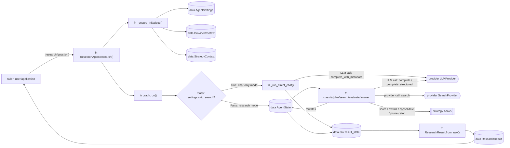
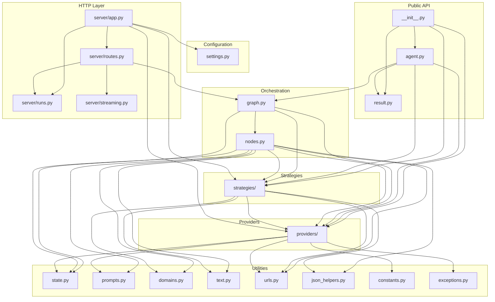

# Architecture overview

Inqtrix is an iterative research agent that runs a bounded multi-round loop of web search, evidence evaluation, and answer synthesis. This page is the high-level map. Individual concerns are covered in dedicated pages linked below.

## Scope

Reading this page gives you the mental model of the system:

- which modules exist and how they depend on each other,
- how a standard `research(question)` call flows through the five nodes,
- where each algorithmic concern lives (providers vs strategies vs orchestration),
- which file to touch for a given change.

## How to read this documentation

Assume you are following one question through the system. Each page should make
clear what exists, where it lives in code, who writes it, who reads it, how it
changes, and why the next transition happens. The internal runtime is a mutable
`AgentState` dict passed through a LangGraph state machine; most named data
objects in the docs are either fields on that state or derived public views.

Inqtrix currently has one default research procedure: an iterative
`classify -> plan -> search -> evaluate -> answer` loop. `AgentConfig` lets you
swap providers, strategies, budgets, and thresholds for that procedure. It does
not yet select a completely different algorithm or graph topology from the
public API.

The HTTP serving layer adds a second procedure on top of this loop: `mode=knowledge`
is dispatched by the algorithm registry to a separate `KnowledgeAlgorithm` (retrieval
over the deployment's own documents), not the five-node graph. It returns the same raw
result shape, so run serialization and the SSE stream are shared. See
[Knowledge retrieval](knowledge-retrieval.md).

## How to read the diagrams

The diagrams use shape and label prefixes to distinguish executable code from
data. When a page introduces a local diagram, the paragraph before it states the
question the diagram answers, and the paragraph after it names the important
transitions.

| Shape / label | Meaning | Example |
|---|---|---|
| `fn ...` in a rectangle | Python function or LangGraph node | `fn search()` |
| Cylinder-like node / `data ...` | State field, ledger, or stored view | `data AgentState.evidence_ledger` |
| Double-bracket node / `strategy ...` | Swappable strategy implementation | `strategy ClaimConsolidationStrategy` |
| Hexagon-like node / `provider ...` | LLM/search provider or external backend | `provider SearchProvider` |
| `LLM call: ...` | Concrete call to `LLMProvider.complete*` or strategy-owned helper call | `LLM call: evaluate prompt` |
| Diamond / `router ...` | Control-flow decision | `router done?` |

## System flow

This diagram answers: "What happens after a caller invokes
`ResearchAgent.research(question)`?" The left side is public API code; the
middle is the algorithm; the right side shows providers, strategies, and the
public result projection.

```mermaid
flowchart LR
    User["caller: user/application"]
    Agent["fn ResearchAgent.research()"]
    Init["fn _ensure_initialised()"]
    Settings[("data AgentSettings")]
    Providers[("data ProviderContext")]
    Strategies[("data StrategyContext")]
    Run["fn graph.run()"]
    Skip{"router: settings.skip_search?"}
    Direct["fn _run_direct_chat()"]
    State[("data AgentState")]
    Nodes["fn classify/plan/search/evaluate/answer"]
    LLM{{"provider LLMProvider"}}
    Search{{"provider SearchProvider"}}
    Strat[["strategy hooks"]]
    Raw[("data raw result_state")]
    Result["fn ResearchResult.from_raw()"]
    Public[("data ResearchResult")]

    User -->|".research(question)"| Agent
    Agent --> Init
    Init --> Settings
    Init --> Providers
    Init --> Strategies
    Agent --> Run
    Run --> Skip
    Skip -->|"False: research mode"| State
    Skip -->|"True: chat-only mode"| Direct
    State --> Nodes
    Direct -->|"LLM call: complete_with_metadata"| LLM
    Direct --> Raw
    Nodes -->|"LLM call: complete / complete_structured"| LLM
    Nodes -->|"provider call: search"| Search
    Nodes -->|"score / extract / consolidate / prune / stop"| Strat
    Nodes -->|"mutates"| State
    State --> Raw
    Raw --> Result
    Result --> Public
    Public --> User
```

Key transitions:

- `ResearchAgent.research()` lazily creates `ProviderContext`,
  `StrategyContext`, and `AgentSettings` before the first run.
- `graph.run()` creates `AgentState`; every node reads and mutates that same
  state object on the standard research path.
- If `AgentSettings.skip_search` is true, `graph.run()` bypasses the LangGraph
  node loop and calls `_run_direct_chat()`, which uses the LLM provider directly
  and returns an uncited chat-only result with `round=0`.
- Providers perform external work: LLM calls and search calls. Strategies keep
  algorithmic policies replaceable inside the default procedure.
- `ResearchResult.from_raw()` is a public projection of selected state fields,
  not a full dump of every internal ledger.

**Core idea.** Rather than single-pass retrieval and synthesis, the agent
runs a bounded loop with independent stopping criteria, aspect coverage
tracking, and structured claim consolidation. Model selection is per call
site via the model tiers (high/mid/fast), not driven by risk.

## Design principles

| Principle | Implementation |
|-----------|----------------|
| Pluggable providers | Abstract `LLMProvider` and `SearchProvider` classes (see [Providers overview](../providers/overview.md)) |
| Pluggable strategies | Six strategy ABCs with default implementations (see [Strategies](strategies.md)) |
| Declarative graph | `GraphConfig` dataclass describes the internal default topology; `build_graph()` compiles it (see [Graph topology](graph-topology.md)) |
| Typed results | Pydantic `ResearchResult` with nested metrics (see [Result schema](result-schema.md)) |
| Lazy initialisation | `ResearchAgent` creates providers and strategies on first use |
| Backwards compatible | FastAPI server (`server/app.py`) works alongside the library API |
| No silent fallbacks | Every fallback path emits both a `log.warning(...)` and a progress marker (see [Iteration log](../observability/iteration-log.md)) |
| Constructor first | Providers never read environment variables directly; only the example scripts and the `Settings` bridge translate `.env` into constructor arguments |

## Module dependency graph

This diagram answers: "Which module owns which layer?" It is a file/package
dependency map, not a runtime call graph. Runtime data movement is explained in
[State and iteration](state-and-iteration.md) and [Nodes](nodes.md).

```mermaid
flowchart TD
    subgraph "Public API"
        init["__init__.py"]
        agent["agent.py"]
        result["result.py"]
    end

    subgraph "Orchestration"
        grph["graph.py"]
        nodes["nodes.py"]
    end

    subgraph "Providers"
        providers["providers/"]
    end

    subgraph "Strategies"
        strategies["strategies/"]
    end

    subgraph "Configuration"
        settings["settings.py"]
    end

    subgraph "HTTP Layer"
        app["server/app.py"]
        routes["server/routes.py"]
        runs["server/runs.py"]
        streaming["server/streaming.py"]
    end

    subgraph "Utilities"
        state["state.py"]
        prompts["prompts.py"]
        domains["domains.py"]
        text["text.py"]
        urls["urls.py"]
        json_h["json_helpers.py"]
        constants["constants.py"]
        exceptions["exceptions.py"]
    end

    init --> agent
    init --> result
    init --> providers
    init --> strategies
    agent --> grph
    agent --> providers
    agent --> strategies
    agent --> result
    grph --> nodes
    grph --> state
    grph --> providers
    grph --> strategies
    nodes --> providers
    nodes --> strategies
    nodes --> prompts
    nodes --> state
    nodes --> domains
    nodes --> text
    nodes --> urls
    nodes --> json_h
    strategies --> domains
    strategies --> text
    strategies --> urls
    strategies --> json_h
    strategies --> providers
    providers --> constants
    providers --> exceptions
    providers --> prompts
    providers --> state
    providers --> urls
    app --> providers
    app --> routes
    app --> runs
    app --> settings
    app --> strategies
    routes --> grph
    routes --> runs
    routes --> streaming
```

Key takeaways:

- Public callers enter through `agent.py` and receive typed models from
  `result.py`.
- `graph.py` wires the default node sequence; `nodes.py` contains the concrete
  step implementations.
- Providers and strategies are injected into nodes, so the default algorithm can
  use different backends without changing graph wiring.
- Native browser clients use the run store (`server/runs.py` in-memory by default; `runs/postgres_store.py` + Valkey worker dispatch opt-in) as queue and event
  registry around the same `graph.run()` path; OpenAI-compatible chat clients
  continue to use `server/streaming.py`.

**Key property.** No circular dependencies. The dependency direction flows
strictly downward: Public API → Orchestration → Providers/Strategies →
Utilities.

## Where to change what

| Goal | Files to touch | Detailed reference |
|------|----------------|--------------------|
| Add a new search backend | `providers/` (implement `SearchProvider`) | [Providers overview](../providers/overview.md), [Writing a custom provider](../providers/writing-a-custom-provider.md) |
| Add a new LLM backend | `providers/` (implement `LLMProvider`) | [Providers overview](../providers/overview.md), [Writing a custom provider](../providers/writing-a-custom-provider.md) |
| Use Azure OpenAI as the LLM | `providers/azure.py`, see `examples/provider_stacks/azure_openai_*.py` | [Azure OpenAI provider](../providers/azure-openai.md) |
| Use Amazon Bedrock as the LLM | `providers/bedrock.py`, see `examples/provider_stacks/bedrock_perplexity.py` | [Bedrock provider](../providers/bedrock.md) |
| Use Azure Foundry search | `providers/azure_web_search.py` | [Azure Foundry web search](../providers/azure-foundry-web-search.md) |
| Change source quality tiers | `strategies/_source_tiering.py`, `domains.py` | [Source tiering](../scoring-and-stopping/source-tiering.md) |
| Customise claim extraction | `strategies/_claim_extraction.py` | [Claims](../scoring-and-stopping/claims.md) |
| Customise claim dedup/consolidation | `strategies/_claim_consolidation.py` | [Claims](../scoring-and-stopping/claims.md) |
| Change risk scoring | `strategies/_risk_scoring.py` | [Nodes](nodes.md), [Aspect coverage](../scoring-and-stopping/aspect-coverage.md) |
| Change stop or continue heuristics | `strategies/_stop_criteria.py`, `nodes.py` | [Stop criteria](../scoring-and-stopping/stop-criteria.md) |
| Add or rewire a graph node | `nodes.py` (node function), `graph.py` (wiring) | [State and iteration](state-and-iteration.md), [Graph topology](graph-topology.md) |
| Change prompt templates | `prompts.py` | [Nodes](nodes.md) |
| Add new state fields | `state.py` (add to `AgentState` TypedDict) | [State and iteration](state-and-iteration.md) |
| Add a new HTTP endpoint | `server/routes.py`, `server/app.py` | [Web server mode](../deployment/webserver-mode.md) |
| Change native run queue or events | `server/runs.py`, `server/routes.py`, `state.py`, `graph.py` | [Run events](../observability/run-events.md), [Web server mode](../deployment/webserver-mode.md) |
| Change timeouts or thresholds | `constants.py` (defaults), `settings.py` (env) | [Settings and env](../configuration/settings-and-env.md), [Timeouts and errors](../observability/timeouts-and-errors.md) |
| Change request history or state initialisation | `state.py`, `graph.py`, `server/routes.py` | [Web server mode](../deployment/webserver-mode.md) |
| Add domain allow or block lists | `domains.py` | [Source tiering](../scoring-and-stopping/source-tiering.md) |
| Add regression baselines | `parity/`, `tests/integration/` | [Parity tooling](../development/parity-tooling.md) |

All strategy and provider customisations are passed via `AgentConfig`; no subclassing of `ResearchAgent` is required.

## Related docs

- [Public API layer](public-api.md)
- [Data architecture](data-architecture.md) -- where each kind of data lives and why (Postgres source of truth, lean Qdrant, object store, Valkey, browser), the storage matrix, the local-first vs server-persistent split, and the project-persistence tier.
- [Knowledge retrieval](knowledge-retrieval.md) -- the second engine (`mode=knowledge`): hybrid retrieval, RRF, the gate loop, and grounding.
- [Agent platform](agent-platform.md) -- the workspace agent (`mode=workspace_agent`): staged phase machine, plans and approvals, child research runs, memo artifact.
- [State and iteration](state-and-iteration.md)
- [Nodes](nodes.md)
- [Run events](../observability/run-events.md)
- [Strategies](strategies.md)
- [Providers overview](../providers/overview.md)
