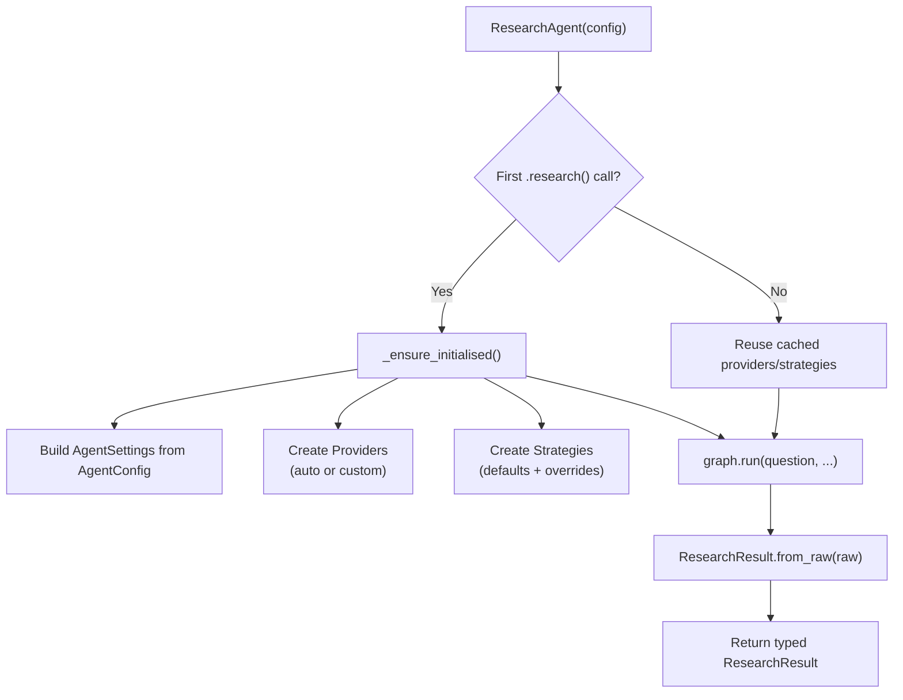

# Public API layer

> Files: `agent.py`, `result.py`, `__init__.py`

## Scope

Everything exported from `inqtrix` — what library callers see. Type-safe, backwards-compatible, lazy-initialised. If you are writing a script that calls `inqtrix.ResearchAgent(...)`, this page is the contract.

## `ResearchAgent`

The main entry point. Wraps the internal `graph.run()` machinery behind a clean interface.

```python
from inqtrix import ResearchAgent, AgentConfig

agent = ResearchAgent(AgentConfig(max_rounds=3))
result = agent.research("Question")
```

### Lifecycle



The agent is reusable across runs. A typical web server keeps a single `ResearchAgent` instance for the lifetime of the process (see [Web server mode](../deployment/webserver-mode.md)).

### Public methods

| Method | Purpose |
|--------|---------|
| `research(question, history=None, deadline=None)` | Blocking run; returns a typed `ResearchResult`. |
| `stream(question, *, include_progress=True, history=None, deadline=None)` | Generator that yields progress messages (optional) followed by answer chunks. Used for CLIs, SSE servers, and Streamlit UIs. |

Both methods are thread-safe as long as a single agent instance is not invoked concurrently against the same cancel event. The HTTP server uses a semaphore for concurrency (see [Web server mode](../deployment/webserver-mode.md)).

## `AgentConfig`

Pydantic `BaseModel` holding all `ResearchAgent`-relevant configuration. It covers agent behaviour, model selection via provider constructors, timeouts, cache settings, and provider connection settings. Server-only deployment settings remain in `ServerSettings`.

```python
AgentConfig(
    llm=MyCustomLLM(),           # Optional: custom LLM
    search=BingSearch(),         # Optional: custom search
    stop_criteria=FastStop(),    # Optional: custom strategy
    max_rounds=2,
    report_profile=ReportProfile.DEEP,
)
```

Fields set to `None` (providers, strategies) are auto-created from defaults on first use. Model names live on the provider constructors, not on `AgentConfig`. See [AgentConfig reference](../configuration/agent-config.md) for every field.

## `ResearchResult`

Pydantic model returned by `research()`:

| Field | Type | Description |
|-------|------|-------------|
| `answer` | `str` | Markdown-formatted answer |
| `metrics` | `ResearchMetrics` | Aggregated quality and performance metrics |
| `top_sources` | `list[Source]` | Cited sources with quality tiers |
| `top_claims` | `list[Claim]` | Key claims with verification status, evidence counts, primary-need flag, and source-tier breakdown |

See [Result schema](result-schema.md) for the full field list and the export helper (`to_export_payload`). `ResearchResult.from_raw()` bridges the internal state dict to the typed Pydantic model.

## Related docs

- [Configuration overview](../configuration/agent-config.md)
- [Result schema](result-schema.md)
- [Strategies](strategies.md)
- [Providers overview](../providers/overview.md)
