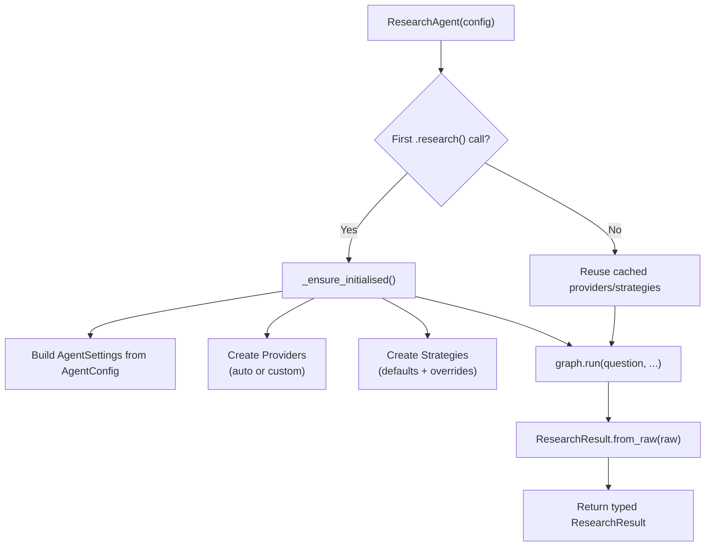
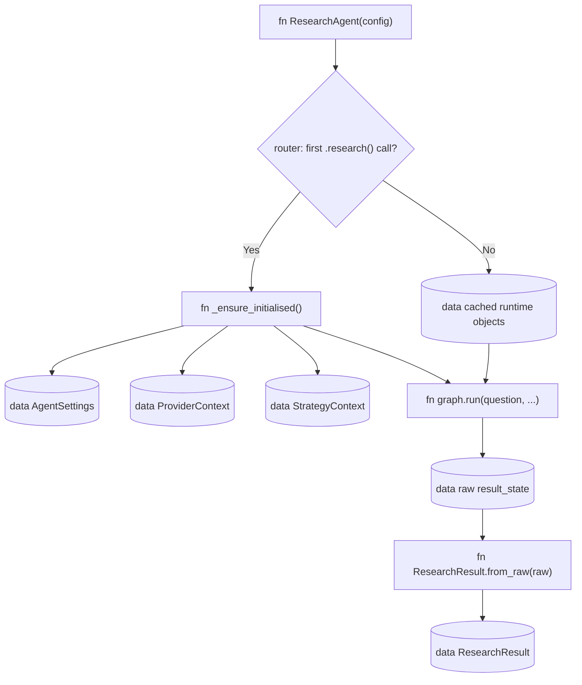

# Public API layer

> Files: `agent.py`, `result.py`, `__init__.py`

## Scope

Everything exported from `inqtrix` — what library callers see. Type-safe, backwards-compatible, lazy-initialised. If you are writing a script that calls `inqtrix.ResearchAgent(...)`, this page is the contract.

## `ResearchAgent`

The main entry point. Wraps the internal `graph.run()` machinery behind a clean interface.

```python
from inqtrix import ResearchAgent, AgentConfig

agent = ResearchAgent(AgentConfig(max_rounds=3))
result = agent.research("Question")
```

### Lifecycle

This diagram answers: "What does the public object do before the internal graph
starts?" Rectangles are methods, cylinder-style nodes are constructed runtime
objects, and the last node is the public Pydantic result.

Conventional flowchart

```mermaid
flowchart TD
    A["ResearchAgent(config)"] --> B{"First .research() call?"}
    B -->|Yes| C["_ensure_initialised()"]
    C --> D["Build AgentSettings from AgentConfig"]
    C --> E["Create Providers<br/>(auto or custom)"]
    C --> F["Create Strategies<br/>(defaults + overrides)"]
    B -->|No| G["Reuse cached providers/strategies"]
    G --> H["graph.run(question, ...)"]
    C --> H
    H --> I["ResearchResult.from_raw(raw)"]
    I --> J["Return typed ResearchResult"]
```

Typed flowchart

```mermaid
flowchart TD
    A["fn ResearchAgent(config)"] --> B{"router: first .research() call?"}
    B -->|Yes| C["fn _ensure_initialised()"]
    C --> D[("data AgentSettings")]
    C --> E[("data ProviderContext")]
    C --> F[("data StrategyContext")]
    B -->|No| G[("data cached runtime objects")]
    G --> H["fn graph.run(question, ...)"]
    C --> H
    H --> Raw[("data raw result_state")]
    Raw --> I["fn ResearchResult.from_raw(raw)"]
    I --> J[("data ResearchResult")]
```

The public API hides the mutable `AgentState`. `graph.run()` returns a raw dict
for internal/parity use, then `ResearchResult.from_raw()` projects selected
fields into typed public models.

The agent is reusable across runs. A typical web server keeps a single `ResearchAgent` instance for the lifetime of the process (see [Web server mode](../deployment/webserver-mode.md)).

### Public methods

| Method | Purpose |
|--------|---------|
| `research(question, history=None, deadline=None)` | Blocking run; returns a typed `ResearchResult`. |
| `stream(question, *, include_progress=True, history=None, deadline=None)` | Generator that yields progress messages (optional) followed by answer chunks. Used for CLIs, SSE servers, and browser UIs. |

Both methods are thread-safe as long as a single agent instance is not invoked concurrently against the same cancel event. The HTTP server uses a semaphore for concurrency (see [Web server mode](../deployment/webserver-mode.md)).

## `AgentConfig`

Pydantic `BaseModel` holding all `ResearchAgent`-relevant configuration. It covers agent behaviour, model selection via provider constructors, timeouts, cache settings, and provider connection settings. Server-only deployment settings remain in `ServerSettings`.

```python
AgentConfig(
    llm=MyCustomLLM(),           # Optional: custom LLM
    search=CustomWebSearch(),    # Optional: custom search
    stop_criteria=FastStop(),    # Optional: custom strategy
    max_rounds=2,
    report_profile=ReportProfile.DEEP,
)
```

Fields set to `None` (providers, strategies) are auto-created from defaults on first use. Model names live on the provider constructors, not on `AgentConfig`. See [AgentConfig reference](../configuration/agent-config.md) for every field.

The current `AgentConfig` parametrizes the default iterative research
procedure. It does not yet expose `algorithm="..."` or a graph-topology field.

## `ResearchResult`

Pydantic model returned by `research()`:

| Field | Type | Description |
|-------|------|-------------|
| `answer` | `str` | Markdown-formatted answer |
| `metrics` | `ResearchMetrics` | Aggregated quality and performance metrics |
| `top_sources` | `list[Source]` | Sources ordered by answer-linked URLs first, then prompt-selected evidence URLs, then remaining discovered citations; tiers prefer run source records |
| `references` | `list[ReportReference]` | Exact source list rendered in the report's `## Referenzen` appendix, including label, URL, and tier |
| `top_claims` | `list[Claim]` | Key claims with verification status, evidence counts, primary-need flag, and source-tier breakdown |
| `execution` | `AgentExecution \| None` | Effective Agent Desk route, model/effort, source policy, consent reason, and actual source-tool counts; absent for ordinary research and legacy results |

See [Result schema](result-schema.md) for the full field list and the export helper (`to_export_payload`). `ResearchResult.from_raw()` bridges the internal state dict to the typed Pydantic model.

Typical library consumption:

```python
from inqtrix import AgentConfig, LiteLLM, PerplexitySearch, ResearchAgent

agent = ResearchAgent(AgentConfig(
    llm=LiteLLM(api_key="...", default_model="gpt-4o"),
    search=PerplexitySearch(api_key="...", model="sonar-pro"),
    max_rounds=3,
))

result = agent.research("What changed in EU AI Act implementation this month?")

print(result.answer)
print(result.metrics.confidence)
print(result.metrics.evidence_contract_status)
print([source.url for source in result.top_sources[:3]])
```

Use the public result when building applications. Inspect raw state only in
debugging or parity tooling, because internal ledger shapes can evolve more
quickly than the public model.

## Related docs

- [Configuration overview](../configuration/agent-config.md)
- [Result schema](result-schema.md)
- [Strategies](strategies.md)
- [Providers overview](../providers/overview.md)
