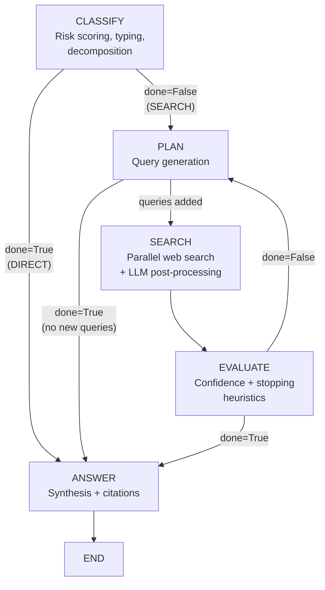

# State and iteration

> Files: `graph.py`, `state.py`

## Scope

How the agent threads state through the five-node loop, which fields live on `AgentState`, and which are preserved across follow-up questions. Read this before adding or renaming state fields.

## Graph topology



**Key insight.** The loop always goes `EVALUATE → PLAN`, never directly to `SEARCH`. This lets `plan` adapt based on `evaluate` findings (for example by injecting disambiguation queries when competing events surface).

## Node wiring

Nodes are plain functions with dependency injection:

```python
def classify(s: dict, *, providers: ProviderContext,
             strategies: StrategyContext, settings: AgentSettings) -> dict:
```

`graph.py` uses `functools.partial` to bind providers/strategies/settings, producing the `(state) -> state` signature LangGraph expects. The compiled graph is cached per `(providers, strategies, settings)` identity; repeated runs reuse it.

## `AgentState`

`TypedDict` with roughly 48 fields across these categories:

| Category | Fields (examples) | Example values |
|----------|-------------------|----------------|
| Input | `question`, `history` | User question plus optional chat history |
| Classification | `language`, `search_language`, `recency`, `query_type`, `sub_questions`, `risk_score`, `high_risk` | `"de"`, `"news"`, `4`, `true` |
| Research | `context`, `queries`, `all_citations`, `related_questions` | Context blocks assembled by `search` |
| Claims | `claim_ledger`, `consolidated_claims`, `claim_status_counts` | Verified / contested / unverified |
| Aspects | `required_aspects`, `uncovered_aspects`, `aspect_coverage` | Completeness signal |
| Quality | `source_tier_counts`, `source_quality_score`, `evidence_consistency` | Aggregated metrics |
| Control | `round`, `done`, `final_confidence`, `gaps`, `falsification_triggered`, `competing_events` | Loop state |
| Follow-up | `_is_followup`, `_prev_question`, `_prev_answer` | Session context |
| Tokens | `total_prompt_tokens`, `total_completion_tokens` | Usage tracking |
| Internals | `deadline`, `_cancel_event` (`NotRequired`) | Runtime control |

See [`src/inqtrix/state.py`](../../src/inqtrix/state.py) for the authoritative list. Additive extensions follow ADR-MS-6: new fields must be `NotRequired[...]` and prefixed with `_` when they are internal.

### Per-node read/write summary

| Node | Reads | Writes |
|------|-------|--------|
| classify | `question`, `history` | `language`, `search_language`, `recency`, `query_type`, `sub_questions`, `risk_score`, `high_risk`, `required_aspects`, `uncovered_aspects`, `aspect_coverage`, `done` (direct-answer path) |
| plan | Everything from classify, `final_confidence`, `gaps`, `falsification_triggered`, `competing_events`, `queries`, `round` | `queries` (appended), `done` (if no new queries) |
| search | `queries`, `context`, `claim_ledger` | `context`, `claim_ledger`, `all_citations`, `related_questions`, `source_tier_counts`, `source_quality_score`, `round` (incremented) |
| evaluate | `context`, `claim_ledger`, `required_aspects`, `all_citations`, `round`, `final_confidence`, `competing_events` | `final_confidence`, `gaps`, `competing_events`, `evidence_consistency`, `evidence_sufficiency`, `done`, `falsification_triggered`, `aspect_coverage` |
| answer | Everything from the prior nodes | `answer`, iteration log entries, token totals |

## Follow-up carry-over

A subset of fields is preserved across follow-up questions via the session system (see [Web server mode](../deployment/webserver-mode.md) for session mechanics). Twenty fields carry over by default, including `context` (capped at 8 blocks), `claim_ledger` (capped at 50 entries per session), `all_citations`, `required_aspects`, `consolidated_claims`, and `source_quality_score`. Non-carry-over fields (like `queries` and `gaps`) reset on every turn.

## Cancel and deadline

Every node reads `_cancel_event` via `check_cancel_event(state)`; if the event is set, an `AgentCancelled` exception terminates the run at the next node boundary (see ADR-MS-5, ADR-WS-11). `deadline` is a monotonic timestamp used to shrink per-call timeouts; see [Timeouts and errors](../observability/timeouts-and-errors.md).

## Iteration log

In testing mode, each node appends a structured entry to the iteration log with fallback markers (`_classify_fallback`, `_plan_fallback`, `_evaluate_fallback`, `_confidence_parsed`, `_evidence_consistency_parsed`). See [Iteration log](../observability/iteration-log.md) for the field list and consumers.

## Related docs

- [Graph topology](graph-topology.md)
- [Nodes](nodes.md)
- [Iteration log](../observability/iteration-log.md)
- [Web server mode](../deployment/webserver-mode.md)
