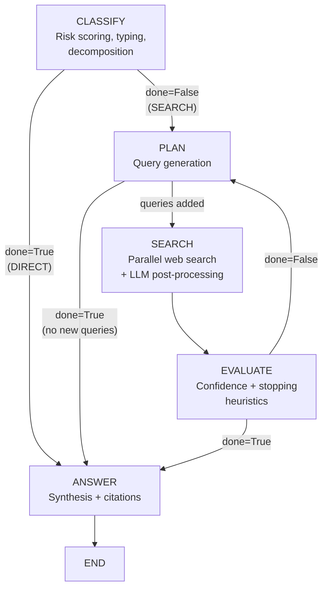
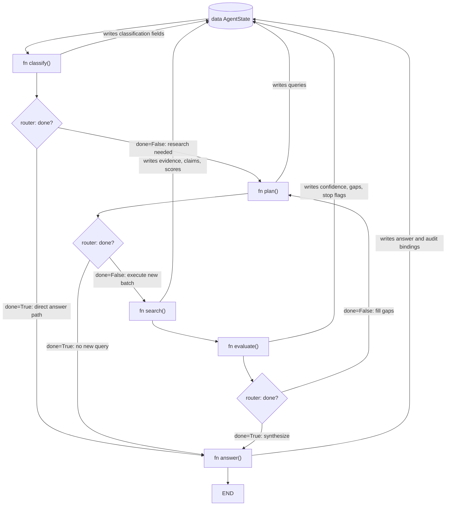
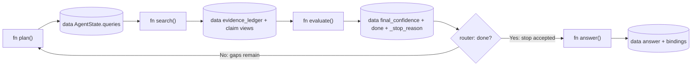

# State and iteration

> Files: `graph.py`, `state.py`

## Scope

How the agent threads state through the five-node loop, which fields live on
`AgentState`, and which values reset on every run. Read this before adding or
renaming state fields.

## Graph topology

This diagram answers: "Which function runs next, and which state object moves
between them?" Rectangles are node functions, diamonds are graph routers, and
the cylinder-style node is the mutable `AgentState` that every node reads and
writes.

Convebtional flowchart

```mermaid
flowchart TD
    C["CLASSIFY<br/>Risk scoring, typing,<br/>decomposition"]
    P["PLAN<br/>Query generation"]
    S["SEARCH<br/>Parallel web search<br/>+ LLM post-processing"]
    E["EVALUATE<br/>Confidence + stopping<br/>heuristics"]
    A["ANSWER<br/>Synthesis + citations"]

    C -->|"done=True<br/>(DIRECT)"| A
    C -->|"done=False<br/>(SEARCH)"| P
    P -->|"done=True<br/>(no new queries)"| A
    P -->|"queries added"| S
    S --> E
    E -->|"done=True"| A
    E -->|"done=False"| P
    A --> END["END"]
```

Typed flowchart

```mermaid
flowchart TD
    State[("data AgentState")]
    C["fn classify()"]
    P["fn plan()"]
    S["fn search()"]
    E["fn evaluate()"]
    A["fn answer()"]
    Rc{"router: done?"}
    Rp{"router: done?"}
    Re{"router: done?"}
    End["END"]

    State --> C
    C -->|"writes classification fields"| State
    C --> Rc
    Rc -->|"done=True: direct answer path"| A
    Rc -->|"done=False: research needed"| P
    P -->|"writes queries"| State
    P --> Rp
    Rp -->|"done=True: no new query"| A
    Rp -->|"done=False: execute new batch"| S
    S -->|"writes evidence, claims, scores"| State
    S --> E
    E -->|"writes confidence, gaps, stop flags"| State
    E --> Re
    Re -->|"done=False: fill gaps"| P
    Re -->|"done=True: synthesize"| A
    A -->|"writes answer and audit bindings"| State
    A --> End
```

Key transitions:

- `classify` decides whether a search loop is needed and seeds the aspect list.
- `plan` only creates queries; it does not call the search provider.
- `search` is the heavy data-building step: it calls search, extracts claims,
  extracts claims, builds evidence records, and refreshes derived views.
- `evaluate` decides whether the next transition is back to `plan` or forward
  to `answer`.

**Key insight.** The loop always goes `EVALUATE → PLAN`, never directly to
`SEARCH`. This lets `plan` adapt based on `evaluate` findings (for example by
injecting disambiguation queries when competing events surface).

## Node wiring

Nodes are plain functions with dependency injection:

```python
def classify(s: dict, *, providers: ProviderContext,
             strategies: StrategyContext, settings: AgentSettings) -> dict:
```

`graph.py` uses `functools.partial` to bind providers/strategies/settings, producing the `(state) -> state` signature LangGraph expects. The wrapper also writes `_current_node` and emits native run events when `_run_event_sink` is present. The compiled graph is cached per `(providers, strategies, settings)` identity; repeated runs reuse it.

## `AgentState`

`AgentState` is a `TypedDict` with 60+ fields. It is the internal working
memory for one run, not the public result model. The table below groups fields
by purpose and names the main writer; later nodes may read most earlier fields.
Some underscore-prefixed runtime keys are written to the mutable state dict even
when they are not declared on the `TypedDict`; those are called out as runtime
dict keys rather than stable schema fields.

| Group | Main writer | Main readers | Fields |
|---|---|---|---|
| Input | `initial_state()` | all nodes | `question`, `history`, `deadline`, `progress`, `start_time`, `_cancel_event`, `_max_rounds`, `_run_event_sink` |
| Classification | `classify()` | `plan`, `search`, `evaluate`, `answer` | `language`, `search_language`, `recency`, `query_type`, `answer_contract`, `sub_questions`, `risk_score`, `high_risk` |
| Planning | `classify()`, `plan()`, `evaluate()` | `plan`, `search` | `required_aspects`, `uncovered_aspects`, `aspect_coverage`, `queries`, `search_offset`, `gaps` |
| Source inventory | `search()` | `evaluate`, `answer`, result projection | `all_citations`, `source_tier_counts`, `source_quality_score`, `query_records`, `source_records`, `provider_citation_records` |
| Evidence primary truth | `search()` | claim consolidation, answer, audit | `evidence_ledger`, `evidence_depth_gap` |
| Claims derived from evidence | `search()` | `evaluate`, `answer`, result projection | `consolidated_claims`, `claim_status_counts`, `claim_quality_score`, `claim_needs_primary_total`, `claim_needs_primary_verified` |
| Stop and scoring | `evaluate()`, score helpers | `plan`, `answer`, metrics | `round`, `done`, `final_confidence`, `competing_events`, `prev_competing_events`, `falsification_triggered`, `evidence_consistency`, `evidence_sufficiency`, `utility_scores`, `score_ledger`, `_conf_stable_rounds`, `_evidence_depth_gap_active`, `_stop_reason` (runtime dict key) |
| Answer and audit | `answer()` | result projection, observability | `answer`, `answer_finish_reason`, `answer_incomplete`, `answer_incomplete_reasons`, `allowed_citations`, `evidence_label_urls`, `evidence_label_by_id`, `visible_evidence_labels`, `visible_evidence_label_count`, `rendered_evidence_ids`, `rendered_evidence_record_count`, `omitted_evidence_record_count`, `answer_claim_bindings`, `answer_evidence_bindings` |
| Tokens and diagnostics | providers, nodes, graph wrapper | metrics, logs, native run API | `iteration_logs`, `total_prompt_tokens`, `total_completion_tokens`, `_run_id`, `_event_seq`, `_current_node` |

See [`src/inqtrix/state.py`](../../src/inqtrix/state.py) for the authoritative list. Additive extensions should be backwards compatible: use `NotRequired[...]` and prefix internal runtime-only fields with `_`.

### Per-node read/write summary

| Node | Reads | Writes |
|------|-------|--------|
| classify | `question`, `history` | `language`, `search_language`, `recency`, `query_type`, `answer_contract`, `sub_questions`, `risk_score`, `high_risk`, `required_aspects`, `uncovered_aspects`, `aspect_coverage`, `done` |
| plan | classification fields, `final_confidence`, `gaps`, `falsification_triggered`, `competing_events`, `queries`, `round`, `evidence_depth_gap` | `queries` (appended), query-slot diagnostics, `done` if no useful new queries |
| search | next query batch, search hints, existing evidence/claims | `query_records`, `source_records`, `provider_citation_records`, `evidence_ledger`, `consolidated_claims`, `all_citations`, `source_quality_score`, `claim_quality_score`, `evidence_depth_gap`, `round` |
| evaluate | evidence, claims, aspects, source metrics, previous confidence | `final_confidence`, `gaps`, `competing_events`, `evidence_consistency`, `evidence_sufficiency`, `evidence_depth_gap`, `done`, `falsification_triggered`, `utility_scores`, `_stop_reason` (runtime dict key), `stop_cascade`, `score_ledger` |
| answer | Everything from the prior nodes | `answer`, `answer_finish_reason`, `answer_incomplete`, `answer_incomplete_reasons`, visible citation allowlist / label fields, `answer_claim_bindings`, `answer_evidence_bindings`, iteration log entries, token totals |

### Round dataflow (control + stop signals)

This diagram answers: "Within one loop iteration, which stored data makes the
router continue or stop?"


```mermaid
flowchart LR
    planNode["fn plan()"]
    queries[("data AgentState.queries")]
    searchNode["fn search()"]
    evidence[("data evidence_ledger + claim views")]
    evalNode["fn evaluate()"]
    stopData[("data final_confidence + done + _stop_reason")]
    gateNode{"router: done?"}
    answerNode["fn answer()"]
    answerData[("data answer + bindings")]

    planNode --> queries
    queries --> searchNode
    searchNode --> evidence
    evidence --> evalNode
    evalNode --> stopData
    stopData --> gateNode
    gateNode -->|No: gaps remain| planNode
    gateNode -->|Yes: stop accepted| answerNode
    answerNode --> answerData
```

The diagram shows one complete research round. `plan` writes only query text;
`search` converts those queries into source/evidence/claim data; `evaluate`
turns that data into stop signals. If `done=False`, the next `plan` call reads
the gaps and stop signals before producing a narrower query batch.

## Run Boundaries

Every `graph.run()` starts from a clean `AgentState`; only the explicit
`history` string is passed into prompts as conversational context. Previous
citations, evidence, claims, aspects, confidence, and stop-state never seed a
new run.

## Cancel and deadline

Every node reads `_cancel_event` via `check_cancel_event(state)`; if the event is set, an `AgentCancelled` exception terminates the run at the next node boundary. `deadline` is a monotonic timestamp used to shrink per-call timeouts; see [Timeouts and errors](../observability/timeouts-and-errors.md).

## Native run snapshots

`build_run_snapshot(state)` derives the compact progress object used by `/v1/runs/{run_id}` and `/v1/runs/{run_id}/events`. It includes the current node, active/completed rounds, query/source counters, confidence, `done`, and an approximate `progress_estimate`. It does not include full evidence ledgers or raw provider payloads.

`emit_progress(...)` still feeds the legacy text progress queue. When `_run_event_sink` is set, it also emits `inqtrix.progress.message` with the snapshot. The graph wrapper emits `inqtrix.node.started`, `inqtrix.node.finished`, and `inqtrix.node.failed` around each node call. `RunStore` stores that snapshot on the run record and also emits `inqtrix.run.snapshot` for clients that want one stable event type for card-state updates. See [Run events](../observability/run-events.md).

## Iteration log

In testing mode, each node appends a structured entry to the iteration log with fallback markers (`_classify_fallback`, `_plan_fallback`, `_evaluate_fallback`, `_confidence_parsed`, `_evidence_consistency_parsed`). See [Iteration log](../observability/iteration-log.md) for the field list and consumers.

## Related docs

- [Graph topology](graph-topology.md)
- [Nodes](nodes.md)
- [Evidence pipeline](evidence-pipeline.md)
- [Iteration log](../observability/iteration-log.md)
- [Web server mode](../deployment/webserver-mode.md)
- [Run events](../observability/run-events.md)
