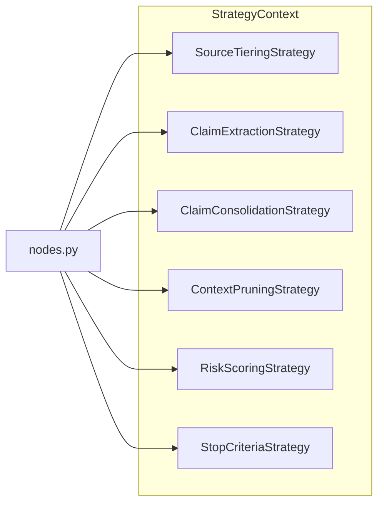

# Strategies

> Package: `strategies/`

## Scope

Six pluggable strategies, each encapsulating a single algorithmic concern. Strategies are swapped via `AgentConfig`; no subclassing of `ResearchAgent` is required.



## Strategy matrix

| ABC | Methods | Default | Used by |
|-----|---------|---------|---------|
| `SourceTieringStrategy` | `tier_for_url()`, `quality_from_urls()` | `DefaultSourceTiering` | search, evaluate |
| `ClaimExtractionStrategy` | `extract()` | `LLMClaimExtractor` | search |
| `ClaimConsolidationStrategy` | `consolidate()`, `materialize()`, `select_answer_citations()` | `DefaultClaimConsolidator` | search, evaluate, answer |
| `ContextPruningStrategy` | `prune()` | `RelevanceBasedPruning` | search |
| `RiskScoringStrategy` | `score()`, `derive_required_aspects()`, `estimate_aspect_coverage()`, `inject_quality_site_queries()` | `KeywordRiskScorer` | classify, plan, search |
| `StopCriteriaStrategy` | 10 methods (`check_contradictions`, `check_stagnation`, ...) | `MultiSignalStopCriteria` | evaluate |

### StrategyContext

```python
@dataclass
class StrategyContext:
    source_tiering: SourceTieringStrategy
    claim_extraction: ClaimExtractionStrategy
    claim_consolidation: ClaimConsolidationStrategy
    context_pruning: ContextPruningStrategy
    risk_scoring: RiskScoringStrategy
    stop_criteria: StopCriteriaStrategy
```

Created via `create_default_strategies(llm, settings)` or composed manually and passed into `AgentConfig`. The default factory uses `resolve_summarize_model(llm, fallback=...)` to read the summarize model constructor-first instead of falling back to global `Settings` model defaults.

## Writing a custom strategy

Each ABC documents its contract: what the method may read, what it must write, and what the return semantics mean. A minimal `SourceTieringStrategy` override looks like this:

```python
from inqtrix import ResearchAgent, AgentConfig, SourceTieringStrategy


class MySourceTiering(SourceTieringStrategy):
    """Treat the internal wiki as a primary source."""

    def tier_for_url(self, url: str) -> str:
        if "internal-wiki.example.com" in url:
            return "primary"
        return "unknown"

    def quality_from_urls(self, urls: list[str]) -> tuple[dict[str, int], float]:
        counts = {"primary": 0, "mainstream": 0, "stakeholder": 0, "unknown": 0, "low": 0}
        for url in urls:
            counts[self.tier_for_url(url)] += 1
        total = len(urls) or 1
        weights = {"primary": 1.0, "mainstream": 0.8, "stakeholder": 0.45, "unknown": 0.35, "low": 0.1}
        score = sum(weights[self.tier_for_url(u)] for u in urls) / total
        return counts, score


agent = ResearchAgent(AgentConfig(source_tiering=MySourceTiering()))
```

`StopCriteriaStrategy` has 10 abstract methods covering the full heuristic cascade. Start from `MultiSignalStopCriteria` and override only the methods you need to change; do not re-implement from scratch. Simpler ABCs like `ContextPruningStrategy` (one method) are easier starting points.

## Default-implementation pointers

- `DefaultSourceTiering` — [Source tiering](../scoring-and-stopping/source-tiering.md).
- `LLMClaimExtractor` and `DefaultClaimConsolidator` — [Claims](../scoring-and-stopping/claims.md).
- `RelevanceBasedPruning` — context dedup + newest-protection rules, see `src/inqtrix/strategies/_context_pruning.py`.
- `KeywordRiskScorer` — [Nodes](nodes.md) (classify), [Aspect coverage](../scoring-and-stopping/aspect-coverage.md).
- `MultiSignalStopCriteria` — [Stop criteria](../scoring-and-stopping/stop-criteria.md).

## Related docs

- [State and iteration](state-and-iteration.md)
- [Nodes](nodes.md)
- [Stop criteria](../scoring-and-stopping/stop-criteria.md)
- [Claims](../scoring-and-stopping/claims.md)
