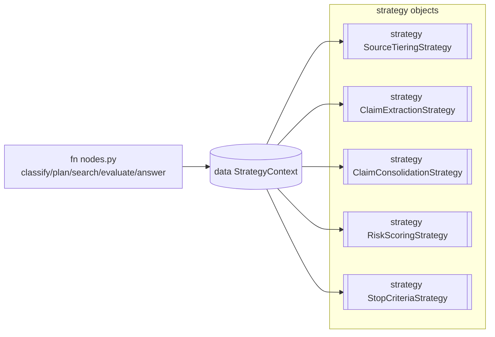

# Strategies

> Package: `strategies/`

## Scope

Six pluggable strategies, each encapsulating a single algorithmic concern. Strategies are swapped via `AgentConfig`; no subclassing of `ResearchAgent` is required.

Strategies are replaceable building blocks inside the current default
algorithm. They do not replace the whole `classify -> plan -> search ->
evaluate -> answer` procedure. A strategy may return a value, mutate selected
state fields, or call an LLM depending on its contract; the matrix below calls
that out explicitly.

This diagram answers: "Where do strategy objects sit relative to the node
functions?" `StrategyContext` is data created before the graph runs. Nodes call
its members when they need policy decisions or reusable algorithmic helpers.


```mermaid
flowchart LR
    Nodes["fn nodes.py<br/>classify/plan/search/evaluate/answer"]
    Context[("data StrategyContext")]
    subgraph strategies ["strategy objects"]
        ST[["strategy SourceTieringStrategy"]]
        CE[["strategy ClaimExtractionStrategy"]]
        CC[["strategy ClaimConsolidationStrategy"]]
        RS[["strategy RiskScoringStrategy"]]
        SC[["strategy StopCriteriaStrategy"]]
    end

    Nodes --> Context
    Context --> ST
    Context --> CE
    Context --> CC
    Context --> RS
    Context --> SC
```

Key takeaway: the graph topology is fixed by `graph.py`; strategy instances
change decisions inside nodes, such as how URLs are tiered, how claims are
deduplicated, or whether stopping is suppressed.

## Strategy matrix

| ABC | Main methods | Default | Called by | State behaviour |
|-----|--------------|---------|-----------|-----------------|
| `SourceTieringStrategy` | `tier_for_url()`, `quality_from_urls()` | `DefaultSourceTiering` | `search`, result helpers | Returns tier/count/score values; does not mutate state itself. |
| `ClaimExtractionStrategy` | `extract()` | `LLMClaimExtractor` | `search` | Usually calls the LLM and returns raw claim rows; `search()` attaches them to evidence. |
| `ClaimConsolidationStrategy` | `consolidate()`, `materialize()`, `quality_metrics()`, `select_answer_citations()` | `DefaultClaimConsolidator` | `search`, `answer` | Returns consolidated claims, metrics, and citation selections; node writes them to state. |
| `RiskScoringStrategy` | `score()`, `infer_query_type()`, `derive_required_aspects()`, `estimate_aspect_coverage()` | `KeywordRiskScorer` | `classify`, `plan`, `search` | Returns risk/aspect/query values; topic-neutral, with no domain-specific policy bias. |
| `StopCriteriaStrategy` | ordered cascade hooks plus `should_stop()` | `MultiSignalStopCriteria` | `evaluate` | Some hooks mutate stop-related state directly; `evaluate()` still owns the final stop gate. |

`KeywordRiskScorer` also implements `infer_answer_contract()` today. That hook
is used by `classify()` via feature detection and is not yet part of the formal
`RiskScoringStrategy` ABC. Treat it as current default behaviour, not a stable
extension point.

### StrategyContext

```python
@dataclass
class StrategyContext:
    source_tiering: SourceTieringStrategy
    claim_extraction: ClaimExtractionStrategy
    claim_consolidation: ClaimConsolidationStrategy
    risk_scoring: RiskScoringStrategy
    stop_criteria: StopCriteriaStrategy
```

Created via `create_default_strategies(llm, settings)` or composed manually and passed into `AgentConfig`. The default factory uses `resolve_claim_extract_model(llm, fallback=...)` to read the claim-extraction model constructor-first instead of falling back to global `Settings` model defaults.

## Writing a custom strategy

Each ABC documents its contract: what the method may read, what it must write, and what the return semantics mean. A minimal `SourceTieringStrategy` override looks like this:

```python
from inqtrix import ResearchAgent, AgentConfig, SourceTieringStrategy


class MySourceTiering(SourceTieringStrategy):
    """Treat the internal wiki as a primary source."""

    def tier_for_url(self, url: str) -> str:
        if "internal-wiki.example.com" in url:
            return "primary"
        return "unknown"

    def quality_from_urls(self, urls: list[str]) -> tuple[dict[str, int], float]:
        counts = {"primary": 0, "mainstream": 0, "stakeholder": 0, "unknown": 0, "low": 0}
        for url in urls:
            counts[self.tier_for_url(url)] += 1
        total = len(urls) or 1
        weights = {"primary": 1.0, "mainstream": 0.8, "stakeholder": 0.45, "unknown": 0.35, "low": 0.1}
        score = sum(weights[self.tier_for_url(u)] for u in urls) / total
        return counts, score


agent = ResearchAgent(AgentConfig(source_tiering=MySourceTiering()))
```

`StopCriteriaStrategy` has 10 abstract methods covering the full heuristic
cascade. Start from `MultiSignalStopCriteria` and override only the methods you
need to change; do not re-implement from scratch. Smaller ABCs like
`SourceTieringStrategy` are easier starting points.

The most important boundary: strategy overrides should preserve the data shape
that nodes expect. For example, a custom claim extractor can use rules instead
of an LLM, but it must still return claim rows with `claim_text`,
`claim_type`, `polarity`, `needs_primary`, `source_urls`, and
`published_date`.

## Default-implementation pointers

- `DefaultSourceTiering` — [Source tiering](../scoring-and-stopping/source-tiering.md).
- `LLMClaimExtractor` and `DefaultClaimConsolidator` — [Claims](../scoring-and-stopping/claims.md).
- `KeywordRiskScorer` — [Nodes](nodes.md) (classify), [Aspect coverage](../scoring-and-stopping/aspect-coverage.md).
- `MultiSignalStopCriteria` — [Stop criteria](../scoring-and-stopping/stop-criteria.md).

## Related docs

- [State and iteration](state-and-iteration.md)
- [Nodes](nodes.md)
- [Stop criteria](../scoring-and-stopping/stop-criteria.md)
- [Claims](../scoring-and-stopping/claims.md)
