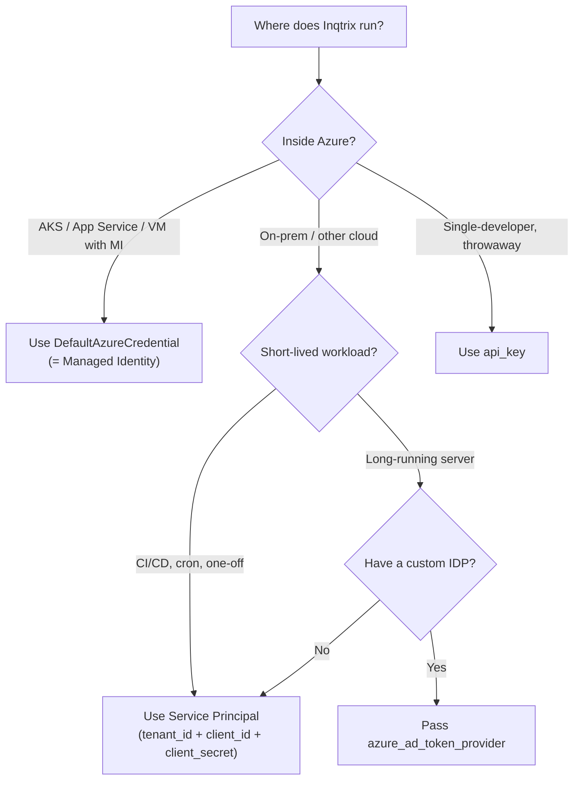

# Enterprise Azure deployment

## Scope

Deploying Inqtrix inside an enterprise Azure tenant: picking an authentication mode, handling Foundry token lifetime, configuring CORS/TLS, and keeping the HTTP server healthy across long-lived sessions. The Azure-provider details themselves live on the per-provider pages ([Azure OpenAI](../providers/azure-openai.md), [Azure OpenAI Web Search](../providers/azure-openai-web-search.md), [Azure Foundry Bing](../providers/azure-foundry-bing.md), [Azure Foundry Web Search](../providers/azure-foundry-web-search.md)).

## Authentication decision tree

All four modes are constructor arguments on the Azure providers; the modes are mutually exclusive. See [Azure OpenAI](../providers/azure-openai.md) for the exact parameters.

## Service Principal setup (common)

1. Register an app in Azure AD and create a client secret.
2. Grant the SP access to the relevant Azure OpenAI resource (`Cognitive Services OpenAI User`) and/or Azure AI Foundry project.
3. Pass `tenant_id`, `client_id`, `client_secret` to each Azure provider constructor.
4. The providers internally build a `ClientSecretCredential` and a cached token provider; you do not manage tokens yourself.

The same three values are used by the Foundry providers and the Azure OpenAI provider; you do not need separate app registrations per backend unless your security model requires it.

## Foundry token lifetime

Foundry agents are reached through the Responses API with an AAD bearer token. `ClientSecretCredential` and `DefaultAzureCredential` cache tokens for approximately 60–75 minutes. Two operational consequences:

- **Transient 401 at the end of a cache window.** If a request starts with a nearly expired token, the first tool call can fail before the cache refreshes. Inqtrix does not re-issue tokens mid-run; the next run gets a fresh token automatically.
- **Container-restart cadence.** For long-lived servers, restart the container periodically (for example every 50 minutes) to force a fresh token on the next boot. Kubernetes can do this with a rolling restart cron. A dedicated `/admin/refresh-providers` endpoint is an open follow-up; the container-restart strategy is the recommended workaround today.

See Gotcha #17 in the internal notes.

## CORS and TLS

Both hardening layers live on `ServerSettings` and are off by default:

- `INQTRIX_SERVER_TLS_KEYFILE` / `INQTRIX_SERVER_TLS_CERTFILE` — both required to activate TLS at the uvicorn layer. Partial configuration raises `RuntimeError`.
- `INQTRIX_SERVER_CORS_ORIGINS` — comma-separated origin list. `*` is accepted but WARNs (browsers reject `*` together with credentials).

For production, terminate TLS at a reverse proxy (nginx, Traefik, Azure Application Gateway) whenever possible and keep Inqtrix HTTP-only on the internal network. The built-in TLS option exists for small self-hosted setups. See [Security hardening](security-hardening.md).

## Bearer API key

`INQTRIX_SERVER_API_KEY` gates `/v1/chat/completions` and `/v1/test/run` with a static Bearer token (`hmac.compare_digest`, timing-safe). `/health` and `/v1/models` stay public for liveness and discovery. Rotate the key via a container restart; there is no hot-reload path today, and multi-key lists are an open follow-up.

## CORS with Streamlit / browser UIs

For Streamlit or a browser UI served from a different origin:

- Use explicit origins, not `*`, if you send credentials.
- Allow `Authorization` and `Content-Type` on preflight.
- Set the credentials mode on the client to match your server configuration (`credentials: "include"` only if the server has `allow_credentials=True`).

## Running behind an Azure Application Gateway

- Put the Azure Application Gateway (or Azure Front Door) in front of Inqtrix to terminate TLS and handle WAF rules.
- Keep Inqtrix on HTTP on the internal network; the `INQTRIX_SERVER_API_KEY` Bearer layer still activates if you want defence in depth.
- Forward `X-Forwarded-For` / `X-Forwarded-Proto`; uvicorn's `--proxy-headers` flag is set by default in the example scripts.

## Health probes

Azure infrastructure probes should target `/health`:

- App Service: liveness probe URL `/health`, expected status 200.
- AKS: `httpGet` on `/health`.

The health payload exposes provider readiness via `is_available()` — operators can tell from the response whether Azure credentials are missing or a deployment is unreachable. `/v1/stacks` extends the same health view per stack for multi-stack deployments (see [Web server mode](webserver-mode.md)).

## Container restart vs zero-downtime

Because Inqtrix keeps sessions in-process, restarting a container drops active sessions but preserves conversational continuity from the client side (the client re-sends the history and the new process rebuilds the session). Zero-downtime blue-green is possible if you route traffic so that both colours briefly accept writes; this is the responsibility of the Azure infrastructure layer and not handled by Inqtrix.

## Related docs

- [Azure OpenAI](../providers/azure-openai.md)
- [Azure OpenAI Web Search](../providers/azure-openai-web-search.md)
- [Azure Foundry Bing](../providers/azure-foundry-bing.md)
- [Azure Foundry Web Search](../providers/azure-foundry-web-search.md)
- [Security hardening](security-hardening.md)
- [Web server mode](webserver-mode.md)
