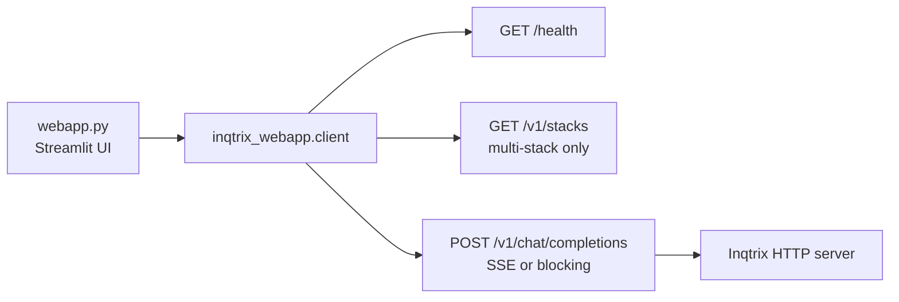

# Streamlit UI

> Files: `webapp.py`, `inqtrix_webapp/client.py`, `webapp_translations.py`

## Scope

How to run and operate the bundled Streamlit chat UI. The UI is a prototype frontend for the HTTP server: it is useful for local operation, demos, and integration testing, but it is not a hardened multi-user product surface.

## Architecture

`webapp.py` is a pure HTTP consumer. It does not import the `inqtrix` package and does not read provider credentials. All model, search, security, and stack choices live on the server process.



The UI discovers server capabilities, lets the user pick a stack when `/v1/stacks` is available, and streams progress plus answer chunks from `/v1/chat/completions`.

## Start it

Start a server first. The multi-stack example is the most convenient companion because the UI can discover all active stacks:

```bash
# Terminal 1
uv run python examples/webserver_stacks/multi_stack.py
```

Then install the UI extra and run Streamlit:

```bash
# Terminal 2
uv sync --extra ui
INQTRIX_WEBAPP_BASE_URL=http://localhost:5100 \
  uv run streamlit run webapp.py
```

If the server has `INQTRIX_SERVER_API_KEY` set, pass the same token to the UI:

```bash
INQTRIX_WEBAPP_BASE_URL=http://localhost:5100 \
INQTRIX_WEBAPP_API_KEY=dev-secret-xxxxx \
  uv run streamlit run webapp.py
```

## Request controls

The composer controls map to the server-side `agent_overrides` whitelist:

| UI control | Request field | Behaviour |
|------------|---------------|-----------|
| Research mode | `report_profile` | `compact` or `deep`. |
| Effort | `max_rounds`, `min_rounds` | `Auto` omits both so server defaults apply; other values send a fixed pair. |
| Confidence | `confidence_stop` | Stop threshold from 1 to 10. |
| Time budget | `max_total_seconds` | Wall-clock deadline in seconds. |
| First-round breadth | `first_round_queries` | Number of broad queries in round 0. |
| German policy heuristics | `enable_de_policy_bias` | Toggles DE health/social-policy biasing and quality-site injection. |
| Web search | `skip_search` | When web search is off, the UI sends `skip_search=true`; the server answers directly through the LLM without citations. |

Example body sent by the UI:

```json
{
  "model": "research-agent",
  "messages": [{"role": "user", "content": "Was ist der Stand der GKV-Reform?"}],
  "stream": true,
  "include_progress": true,
  "stack": "anthropic_perplexity",
  "agent_overrides": {
    "report_profile": "deep",
    "max_rounds": 4,
    "min_rounds": 2,
    "confidence_stop": 8,
    "max_total_seconds": 300,
    "first_round_queries": 6,
    "enable_de_policy_bias": true
  }
}
```

When the web-search toggle is off, the UI adds `"skip_search": true` to the same object.

## Operational notes

- `/health` and `/v1/models` are always queried without authentication; `/v1/stacks` is also open in multi-stack apps so the UI can render stack selection before asking for a token.
- Chat requests include `Authorization: Bearer ...` only when `INQTRIX_WEBAPP_API_KEY` is set or the user enters a token in the UI.
- Streamlit Stop closes the active request. The server cancels at the next LangGraph node boundary; an in-flight provider call may still complete before the backend run stops.
- The UI stores conversation state in the Streamlit session. Restarting Streamlit clears the local chat view, but the HTTP server may still retain in-memory agent sessions until their TTL expires.

## Related docs

- [Web server mode](webserver-mode.md)
- [Security hardening](security-hardening.md)
- [Agent config](../configuration/agent-config.md)
- [Progress events](../observability/progress-events.md)
