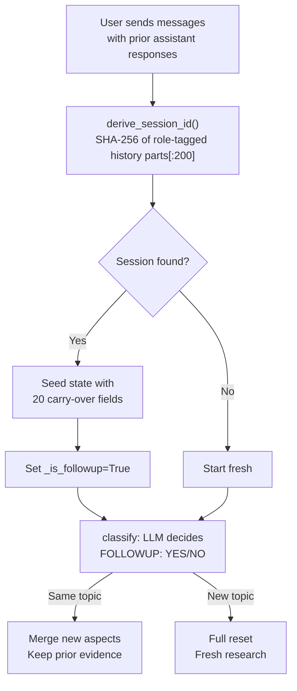

# Web server mode

> Files: `src/inqtrix/server/app.py`, `src/inqtrix/server/routes.py`, `src/inqtrix/server/streaming.py`, `src/inqtrix/server/session.py`, `src/inqtrix/server/stacks.py`

## Scope

How Inqtrix exposes the agent as an OpenAI-compatible HTTP service. This page summarises the endpoints, lifecycle, concurrency, cancel semantics, and session storage. The authoritative operational reference for the eight example stacks lives in [`examples/webserver_stacks/README.md`](../../examples/webserver_stacks/README.md) — this doc links to it for deployment-specific details.

## Endpoints

| Route | Method | Auth | Purpose |
|-------|--------|------|---------|
| `/health` | GET | Open | Liveness probe + active-provider summary. |
| `/v1/models` | GET | Open | OpenAI-style model discovery. Returns `research-agent`. |
| `/v1/stacks` | GET | Open | Multi-stack-only discovery (created by `create_multi_stack_app`). 5-second cache. |
| `/v1/chat/completions` | POST | Optional Bearer | Main research endpoint, streaming and non-streaming. |
| `/v1/test/run` | POST | Optional Bearer | Structured test endpoint, only when `TESTING_MODE=true`. |

The Bearer layer activates when `INQTRIX_SERVER_API_KEY` is set; see [Security hardening](security-hardening.md).

## Startup

`python -m inqtrix` boots the default server via `__main__.py`. The eight example scripts in `examples/webserver_stacks/*.py` follow the same pattern but inject explicit providers instead of relying on `Settings`/YAML:

```python
from inqtrix.server.app import create_app
from inqtrix.server.stacks import StackBundle, create_multi_stack_app
```

`create_app(*, settings=None, providers=None, strategies=None)` is the single-stack factory (see [ADR-WS-1] in the internal notes). `create_multi_stack_app(*, settings, stacks, default_stack)` is the multi-stack variant (see [ADR-MS-1]).

### Lifespan logging

Both factories wire an ASGI `lifespan` context manager that logs on startup and shutdown. On startup it probes `is_available()` per provider, logs the active security layers (TLS on/off, API key on/off, CORS on/off), and logs the report profile, concurrency and session TTL. On shutdown it writes a compact "server stopping" line. This satisfies the "no silent fallbacks" rule for operator visibility and fires automatically for `TestClient(app)` as well.

### uvicorn log mirroring

The example scripts pass `log_config=build_uvicorn_log_config(log_file, web_level=...)` to `uvicorn.run(...)` so that `uvicorn.error`, `uvicorn.access`, and the `inqtrix` logger all write to the same file (see [ADR-WS-10]). Attaching a mirror handler to `uvicorn.*` at runtime does **not** work because uvicorn's internal `logging.config.dictConfig` replaces the handlers on boot.

## Per-request overrides

Clients can override a whitelisted subset of agent fields per request:

```json
{
  "model": "research-agent",
  "messages": [{"role": "user", "content": "..."}],
  "agent_overrides": {
    "max_rounds": 3,
    "confidence_stop": 7,
    "report_profile": "deep"
  }
}
```

The whitelist is: `max_rounds`, `min_rounds`, `confidence_stop`, `report_profile`, `max_total_seconds`, `first_round_queries`, `max_context`. Unknown keys return HTTP 400. Provider-, model-, and session-level fields are intentionally not overridable — those are operator concerns. See [Agent config](../configuration/agent-config.md) and the recipe in `src/inqtrix/server/overrides.py` for how to extend the whitelist safely.

## Streaming (SSE)

The endpoint supports OpenAI-style Server-Sent Events:

```bash
curl -N http://localhost:5100/v1/chat/completions \
    -H "Content-Type: application/json" \
    -d '{
        "model": "research-agent",
        "messages": [
            {"role": "user", "content": "Was ist der aktuelle Stand der GKV-Reform?"}
        ],
        "stream": true
    }'
```

When `stream` is `true`, progress chunks come first (`> Research Step: ...`), followed by a `---` separator and the answer chunks, terminated with `data: [DONE]`. Pass `"include_progress": false` for answer-only SSE.

Library streaming yields plain text chunks (see [Library mode](library-mode.md)). HTTP streaming yields SSE chunks in the OpenAI-compatible `data: {...}` format.

## Concurrency

An async semaphore (`MAX_CONCURRENT`, default 3) caps parallel research runs. When saturated the server returns HTTP 429 (not blocking). Tune by environment variable or by passing a custom `ServerSettings` to `create_app`. In-process session storage means a single process holds all sessions; horizontal scaling requires a sticky session affinity until a shared session store is introduced.

## Cancel on disconnect

Every streaming response spawns a watcher task that calls `await request.receive()` blocking on `http.disconnect`. On disconnect it sets `cancel_event`, and the next node boundary raises `AgentCancelled`. Latency from disconnect to actual stop equals the remaining duration of the currently running provider call — typically 5–60 seconds (see Gotcha #18 in the internal notes and [ADR-WS-11]).

There is no explicit `/v1/runs/{id}/cancel` endpoint today. The disconnect-based path covers Streamlit Stop, browser close, and `curl --max-time`. Hard cancel through in-flight provider calls is an open follow-up.

## Sessions

Follow-up turns reuse prior research via the session store:



- Storage: in-memory dict with a threading lock.
- TTL: 30 minutes (configurable via `SESSION_TTL_SECONDS`).
- Capacity: 20 sessions (LRU eviction).
- Carry-over fields: 20, including citations, context, claims, aspects, quality metrics.
- Per-session caps: 8 context blocks, 50 claim-ledger entries (`SESSION_MAX_CONTEXT_BLOCKS`, `SESSION_MAX_CLAIM_LEDGER`).
- Session ID: `SHA-256("|".join(f"{role}:{content[:200]}" for user/assistant messages))[:24]`. The current question is excluded when deriving the lookup id; `prospective_session_id()` includes it and is used for save-before-response-complete.

Multi-stack apps mix the stack name into the hash input (`stack:<name>`), so session state does not leak across stacks (see [ADR-MS-4]).

## Multi-stack serving

`create_multi_stack_app(...)` mounts several provider stacks in one process. Each stack is a `StackBundle(providers, strategies, agent_settings, description)` keyed by a lowercase-alphanumeric name. The request picks a stack via `body["stack"]`; absent or unknown values fall back to `default_stack` (known) or raise HTTP 400 (unknown). The dedicated example is `examples/webserver_stacks/multi_stack.py`; each `StackBundle` is opt-in through environment-variable gating.

## Health payload

`/health` returns the report profile, the active security layers, per-role model identities (constructor-first; see ADR-WS-8), and search-model identities via the `SearchProvider.search_model` property (ADR-WS-12). Operators should read these values to confirm the deployment is wired as intended. `/v1/stacks` exposes the same information per stack for multi-stack deployments.

## Related docs

- [Examples README](../../examples/webserver_stacks/README.md) — the operational reference with per-stack env-variable tables and run commands.
- [Enterprise Azure](enterprise-azure.md) — Managed Identity, SP, Foundry token lifetime.
- [Security hardening](security-hardening.md) — TLS, Bearer, CORS.
- [Agent config](../configuration/agent-config.md) — per-request overrides.
