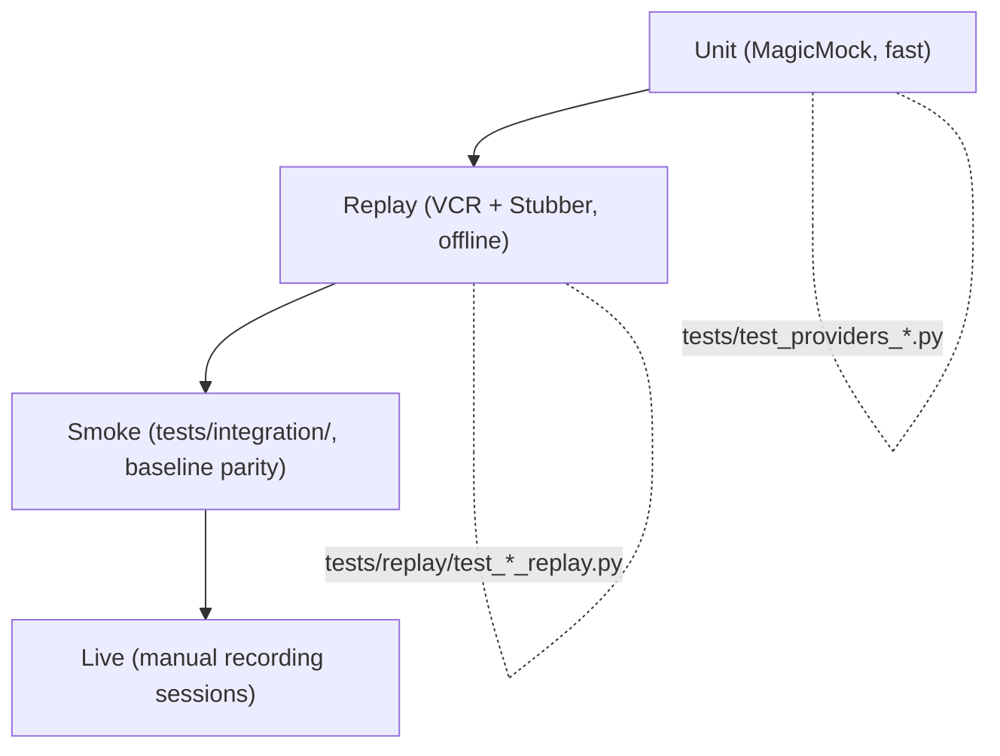

# Testing Strategy

This document explains the four-layer test pyramid that protects Inqtrix
provider code, when each layer applies, and how to add a new test for a
provider you are introducing or refactoring. It is the canonical
reference for the **Aufgabe 3 — Mock-/Replay-Test-Suite** introduced in
2026-04 and supersedes any in-line documentation that may exist in
individual test modules.

## Table of contents

- [The four layers](#the-four-layers)
- [Tool matrix per provider](#tool-matrix-per-provider)
- [Cassette layout and naming](#cassette-layout-and-naming)
- [Sanitization](#sanitization)
- [Markers and CI](#markers-and-ci)
- [Recording new cassettes](#recording-new-cassettes)
- [Cookbook: adding a test for provider X](#cookbook-adding-a-test-for-provider-x)
- [Known limitations](#known-limitations)

## The four layers



| Layer | Location | What it tests | When to add |
|---|---|---|---|
| **Unit** | `tests/test_providers_*.py` | Construction, parameter routing, response normalization, edge-case shapes (SSE strings, `model_dump` quirks). | Always — every new public method or branch deserves a unit test. |
| **Replay** | `tests/replay/test_*_replay.py` + `tests/fixtures/cassettes/<provider>/` (VCR) or `tests/fixtures/bedrock/` (Stubber JSON) | End-to-end provider behavior against realistic backend payloads with no network access. | When you change request/response wire shape, error mapping, or retry logic. |
| **Smoke** | `tests/integration/` | Cross-provider parity (`baseline.json.migrated`, per-question `q*.json`). | When you change the agent loop or add a new provider permutation. |
| **Live** | Manual recording (`INQTRIX_RECORD_MODE=once`) | Real backend behavior for one-off cassette refreshes. | Whenever a backend's response shape changes upstream. |

There is **no automated live-test layer**. The "live" layer is a
maintainer-driven recording workflow (see
[Recording new cassettes](#recording-new-cassettes)).

## Tool matrix per provider

The HTTP transport dictates the mock library, not the provider's
purpose:

| Provider | Module | Transport | Replay tool |
|---|---|---|---|
| `LiteLLM` | `inqtrix.providers.litellm` | OpenAI SDK → httpx | vcrpy |
| `PerplexitySearch` | `inqtrix.providers.perplexity` | OpenAI SDK → httpx | vcrpy |
| `AzureOpenAILLM` | `inqtrix.providers.azure` | OpenAI SDK → httpx | vcrpy |
| `AzureOpenAIWebSearch` | `inqtrix.providers.azure_openai_web_search` | OpenAI SDK responses → httpx | vcrpy |
| `AzureFoundryWebSearch` | `inqtrix.providers.azure_web_search` | OpenAI SDK responses → httpx | vcrpy |
| `AzureFoundryBingSearch` (modern path) | `inqtrix.providers.azure_bing` | OpenAI SDK responses → httpx | vcrpy |
| `AzureFoundryBingSearch` (legacy path) | same | `azure-ai-projects` AIProjectClient → azure-core transport | MagicMock (VCR cannot intercept azure-core reliably) |
| `AnthropicLLM` | `inqtrix.providers.anthropic` | `urllib.request.urlopen` | vcrpy (patches `http.client.HTTPConnection`) |
| `BraveSearch` | `inqtrix.providers.brave` | `urllib.request.urlopen` | vcrpy |
| `BedrockLLM` | `inqtrix.providers.bedrock` | `boto3.client("bedrock-runtime")` | `botocore.stub.Stubber` (VCR's boto3 integration is fragile; Moto does not yet support `bedrock-runtime`) |

**Single-library principle**: every replay test in this repo uses
either vcrpy + pytest-recording OR `botocore.stub.Stubber`. There is no
third mocking library. Sequence scenarios that would normally require
a side-effect mock (e.g. Anthropic 529 → success) are expressed
through multi-interaction cassettes; for Bedrock the same pattern
becomes successive `Stubber.add_response`/`add_client_error` calls.

## Cassette layout and naming

All cassette and stub data live under `tests/fixtures/`:

```
tests/fixtures/
  __init__.py
  sanitize.py                    # request/response scrubbing hooks
  bedrock_responses.py           # JSON loader + ClientError builders
  bedrock/<scenario>.json        # Bedrock Converse response fixtures
  cassettes/
    litellm/<test_name>.yaml
    perplexity/<test_name>.yaml
    anthropic/<test_name>.yaml
    azure_openai/<test_name>.yaml
    azure_openai_web_search/<test_name>.yaml
    azure_foundry_web_search/<test_name>.yaml
    azure_foundry_bing/<test_name>.yaml
    brave/<test_name>.yaml
```

Conventions:

- **One cassette per test by default**. The cassette filename matches
  the test function (`test_complete_success_replay.yaml`) and
  pytest-recording resolves the path automatically via the
  `vcr_cassette_dir` fixture each module overrides.
- **Reuse via explicit decorator** when several tests would otherwise
  produce identical wire data: `@pytest.mark.vcr("test_complete_success_replay.yaml")`
  points the test at an existing cassette by name.
- **Hand-crafted cassettes are annotated** with a leading comment
  explaining their provenance: `# Hand-crafted from <provider> response
  shape on YYYY-MM-DD`. Re-record via `INQTRIX_RECORD_MODE=once` when
  the upstream schema drifts.
- **Cassette size**: keep individual files under 50 KB. Truncate long
  realistic payloads to a representative snippet — schema fidelity
  matters, byte fidelity does not.

## Sanitization

`tests/fixtures/sanitize.py` is the single source of truth. It is
wired into VCR via `vcr_config` in `tests/replay/conftest.py` and
exposes:

- `before_record_request` / `before_record_response` — VCR hooks that
  strip every header in `SANITIZED_HEADERS`, scrub query parameters
  in `SANITIZED_QUERY_KEYS`, and replace JSON body fields whose name
  matches `SECRET_BODY_KEYS`.
- `assert_cassette_clean(path)` — protective scan used by
  `tests/replay/test_sanitization.py`. Walks `tests/fixtures/`
  recursively, runs every entry of `_SECRET_PATTERNS` against each
  YAML/JSON file, and fails loudly on the first match.

If you introduce a new auth header or payload key carrying secrets,
extend `SANITIZED_HEADERS` / `SANITIZED_QUERY_KEYS` / `SECRET_BODY_KEYS`
**before** recording the cassette. The protective scan in
`tests/replay/test_sanitization.py::test_every_committed_cassette_passes_secret_scan`
will catch any oversight in CI.

## Markers and CI

There is exactly **one** custom pytest marker:

- `@pytest.mark.replay` — applied module-wide via
  `pytestmark = pytest.mark.replay` at the top of every file in
  `tests/replay/`. Selectable via `pytest -m replay` for fast targeted
  runs.

There is **no** `live` marker. Recording against real backends is a
manual maintainer workflow that uses the same tests (see next
section).

Default CI invocation:

```bash
uv run pytest tests/ -v
```

Runs the full offline suite. All replay cassettes / stubs are committed and offline; no env vars or network access are required. Use collect-only when you need the current count for a release note:

```bash
uv run pytest tests/ --collect-only -q
```

Suggested GitHub Actions workflow snippet (not committed because the
repo's CI configuration is maintainer-owned):

```yaml
name: tests
on:
  pull_request:
  push:
    branches: [main]
jobs:
  pytest:
    runs-on: ubuntu-latest
    steps:
      - uses: actions/checkout@v4
      - uses: astral-sh/setup-uv@v3
      - run: uv sync --all-extras
      - run: uv run pytest tests/ -v
```

## Recording new cassettes

Recording is the only operation that needs real API keys. The
recording workflow uses the same replay test as a recorder by setting
`INQTRIX_RECORD_MODE=once`:

```bash
INQTRIX_RECORD_MODE=once \
  ANTHROPIC_API_KEY=sk-ant-real-key \
  uv run pytest tests/replay/test_anthropic_replay.py::test_complete_success_replay -v
```

What happens internally:

1. `tests/replay/conftest.py::vcr_config` reads the env var and sets
   `record_mode="once"`.
2. The test runs; VCR sees no cassette matching the test name and
   makes one real HTTP call.
3. The request and response pass through `before_record_request` /
   `before_record_response` from `tests/fixtures/sanitize.py`,
   stripping all known auth headers, query parameters, and JSON body
   fields.
4. VCR writes the sanitized YAML cassette to
   `tests/fixtures/cassettes/anthropic/test_complete_success_replay.yaml`.
5. Review the cassette diff manually. Run
   `pytest tests/replay/test_sanitization.py` to confirm the
   protective scan stays green.
6. Commit the cassette together with any test or sanitizer changes.

Allowed `INQTRIX_RECORD_MODE` values mirror VCR's record modes:

| Value | Behavior |
|---|---|
| `none` (default) | Replay-only; missing cassette fails the test immediately. |
| `once` | Record if cassette is missing; replay if it exists. **Recommended for adding new cassettes.** |
| `new_episodes` | Add new interactions to existing cassettes. |
| `all` | Re-record every interaction. **Only use when intentionally refreshing all cassettes for a provider.** |

Anything else (typos, capitalisation drift) silently falls back to
`none` so a misconfigured shell cannot accidentally enable recording
in CI.

## Cookbook: adding a test for provider X

1. **Inspect the provider's transport.** Read the relevant
   `src/inqtrix/providers/<x>.py`: does it use the OpenAI SDK
   (httpx → vcrpy), `urllib.request.urlopen` (also vcrpy), or
   `boto3` (`Stubber`)? AzureFoundry's legacy AIProjectClient path
   needs a MagicMock — VCR cannot intercept azure-core's transport
   reliably.
2. **Pick a scenario.** The minimum coverage per provider is five
   distinct cassettes/stubs: success + rate-limit + API error +
   one provider-specific edge case (empty response, summarize, SP
   auth, etc.) + one more variation. For Azure providers, cover all
   four auth modes (api_key, SP, custom token_provider, pre-built
   credential) — reuse cassettes via explicit `@pytest.mark.vcr("...")`
   when wire shape is identical.
3. **Add the cassette / stub fixture.** For VCR providers, create
   `tests/fixtures/cassettes/<provider>/<test_name>.yaml` matching
   the [layout above](#cassette-layout-and-naming). For Bedrock,
   add a JSON file under `tests/fixtures/bedrock/` and reference it
   from `tests/fixtures/bedrock_responses.py::load_bedrock_response`.
4. **Write the test.** Drop a new file
   `tests/replay/test_<provider>_replay.py` modelled on the existing
   `tests/replay/test_litellm_replay.py` (vcrpy) or
   `tests/replay/test_bedrock_replay.py` (Stubber). Set
   `pytestmark = pytest.mark.replay` and override `vcr_cassette_dir`
   per module.
5. **Verify the protective scan passes.** Run
   `pytest tests/replay/test_sanitization.py` after committing the
   cassette. If it flags a secret-pattern hit, sanitize the cassette
   by hand and extend `SANITIZED_HEADERS` / `SECRET_BODY_KEYS` so
   future recordings handle the same field automatically.
6. **Run the full suite.** `uv run pytest tests/ -v` should stay
   fully green.

## Known limitations

- **AzureFoundryBingSearch legacy path** (`AIProjectClient.agents.*`)
  is mocked with `unittest.mock.MagicMock` rather than VCR cassettes.
  azure-core's transport pipeline is not VCR-friendly, and the
  alternative — a custom monkey-patch — would be more brittle than
  the existing MagicMock pattern. The single legacy test in
  `tests/replay/test_azure_foundry_bing_replay.py::test_legacy_thread_run_path_returns_answer_with_mock`
  documents this trade-off and pins the legacy-Thread/Run wiring.
- **Bedrock-runtime mocking** uses `botocore.stub.Stubber` because
  vcrpy's boto3 integration is historically fragile and Moto does not
  support `bedrock-runtime`. Stub responses must match the real
  Converse API shape (including required fields like `metrics` and
  `usage.totalTokens`); the Stubber's parameter validator will reject
  malformed fixtures at test-time.
- **Azure Foundry token lifetime** (~60–75 min) is not exercised by
  any replay test — the provider mints a static bearer at construction
  time. A long-running server should re-instantiate the provider every
  ~60 min; this is a runtime concern that belongs to the deployment
  documentation, not to the replay suite.
- **OpenAI SDK retry sequences** are reflected as multi-interaction
  cassettes when needed (e.g. Anthropic 529-then-success). Tests that
  intentionally disable the SDK's retry loop set
  `provider._client.with_options(max_retries=0)` so a single-interaction
  cassette suffices for rate-limit and API-error scenarios.
