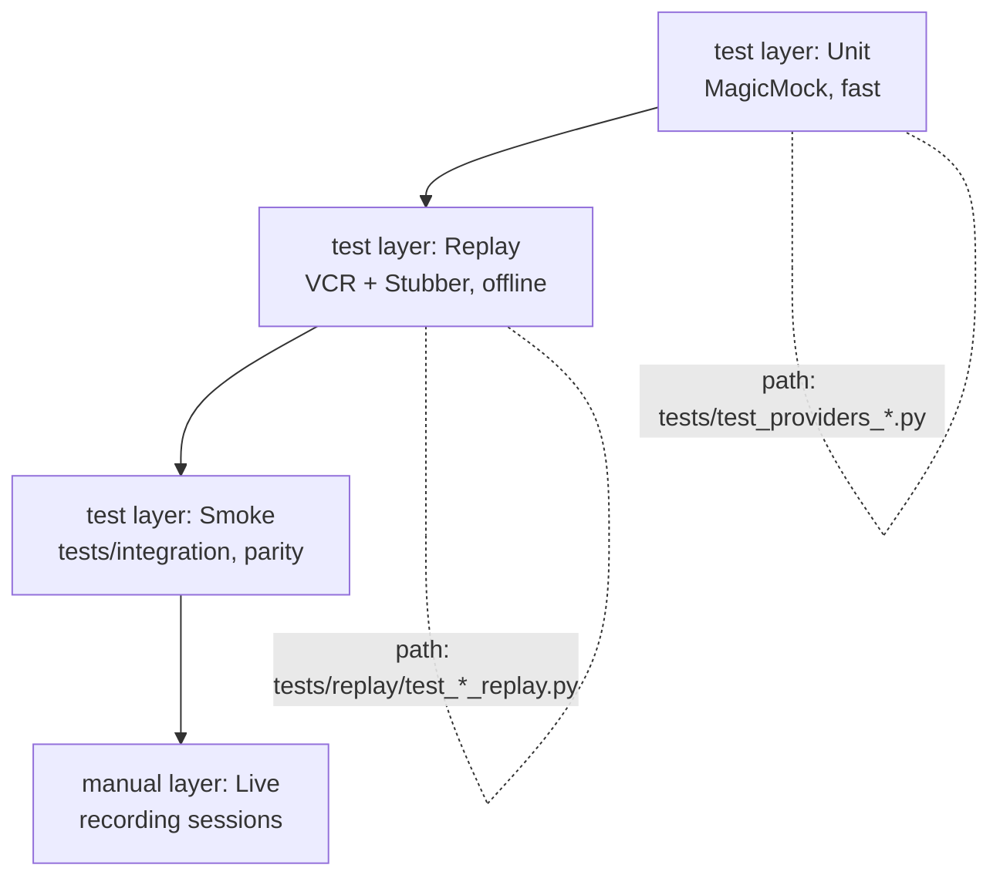

# Testing Strategy

## Scope

This document explains the test layers that protect Inqtrix provider code and
cross-process product features, when each layer applies, and which release
gates remain manual. It covers offline unit/replay tests, PostgreSQL integration
tests, the editor collaboration matrix, and live qualification. It does not
replace the command-focused [Running tests](running-tests.md) page.

## Table of contents

- [The four layers](#the-four-layers)
- [Tool matrix per provider](#tool-matrix-per-provider)
- [Cassette layout and naming](#cassette-layout-and-naming)
- [Sanitization](#sanitization)
- [Markers and local gates](#markers-and-local-gates)
- [Recording new cassettes](#recording-new-cassettes)
- [Cookbook: adding a test for provider X](#cookbook-adding-a-test-for-provider-x)
- [Collaboration test matrix](#collaboration-test-matrix)
- [Known limitations](#known-limitations)

## The four layers

This diagram answers: "How much real runtime surface does each test layer
cover?" It is a testing pyramid: lower layers are faster and more isolated,
upper layers are closer to real providers and more expensive to maintain.


```mermaid
flowchart TD
    Unit["test layer: Unit<br/>MagicMock, fast"] --> Replay["test layer: Replay<br/>VCR + Stubber, offline"]
    Replay --> Smoke["test layer: Smoke<br/>tests/integration, parity"]
    Smoke --> Live["manual layer: Live<br/>recording sessions"]
    Unit -. "path: tests/test_providers_*.py" .- Unit
    Replay -. "path: tests/replay/test_*_replay.py" .- Replay
```

Read the arrows as increasing integration depth, not as runtime execution
order. A provider change usually starts with unit tests and adds replay coverage
when the wire shape matters.

| Layer | Location | What it tests | When to add |
|---|---|---|---|
| **Unit** | `tests/test_providers_*.py` | Construction, parameter routing, response normalization, edge-case shapes (SSE strings, `model_dump` quirks). | Always — every new public method or branch deserves a unit test. |
| **Replay** | `tests/replay/test_*_replay.py` + `tests/fixtures/cassettes/<provider>/` (VCR) or `tests/fixtures/bedrock/` (Stubber JSON) | End-to-end provider behavior against realistic backend payloads with no network access. | When you change request/response wire shape, error mapping, or retry logic. |
| **Smoke** | `tests/integration/` | Cross-provider parity (`baseline.json.migrated`, per-question `q*.json`). | When you change the agent loop or add a new provider permutation. |
| **Live** | Manual recording (`INQTRIX_RECORD_MODE=once`) | Real backend behavior for one-off cassette refreshes. | Whenever a backend's response shape changes upstream. |

There is **no automated live-provider layer in this provider pyramid**. Its
"live" layer is a maintainer-driven cassette-recording workflow (see
[Recording new cassettes](#recording-new-cassettes)). This is distinct from
the automated, production-like product verification profiles documented under
[Shared verification profiles](#shared-verification-profiles): those exercise
the deployed UI, API, sharing, and collaboration stack without calling real
third-party model/search providers.

## Tool matrix per provider

The HTTP transport dictates the mock library, not the provider's
purpose:

| Provider | Module | Transport | Replay tool |
|---|---|---|---|
| `LiteLLM` | `inqtrix.providers.litellm` | OpenAI SDK → httpx | vcrpy |
| `PerplexitySearch` | `inqtrix.providers.perplexity` | Perplexity SDK responses | unit stubs + debug dataflow script |
| `AzureOpenAILLM` | `inqtrix.providers.azure` | OpenAI SDK → httpx | vcrpy |
| `AzureFoundryWebSearch` | `inqtrix.providers.azure_web_search` | Azure AI Foundry / OpenAI SDK responses | unit stubs (`_parse_response` contract) |
| `AnthropicLLM` | `inqtrix.providers.anthropic` | `urllib.request.urlopen` | vcrpy (patches `http.client.HTTPConnection`) |
| `BedrockLLM` | `inqtrix.providers.bedrock` | `boto3.client("bedrock-runtime")` | `botocore.stub.Stubber` (VCR's boto3 integration is fragile; Moto does not yet support `bedrock-runtime`) |

**Single-library principle**: every replay test in this repo uses
either vcrpy + pytest-recording OR `botocore.stub.Stubber`. There is no
third mocking library. Sequence scenarios that would normally require
a side-effect mock (e.g. Anthropic 529 → success) are expressed
through multi-interaction cassettes; for Bedrock the same pattern
becomes successive `Stubber.add_response`/`add_client_error` calls.

## Cassette layout and naming

All cassette and stub data live under `tests/fixtures/`:

```
tests/fixtures/
  __init__.py
  sanitize.py                    # request/response scrubbing hooks
  bedrock_responses.py           # JSON loader + ClientError builders
  bedrock/<scenario>.json        # Bedrock Converse response fixtures
  cassettes/
    anthropic/<test_name>.yaml
    azure_foundry_bing/<test_name>.yaml
    azure_openai/<test_name>.yaml
    litellm/<test_name>.yaml
```

Conventions:

- **One cassette per test by default**. The cassette filename matches
  the test function (`test_complete_success_replay.yaml`) and
  pytest-recording resolves the path automatically via the
  `vcr_cassette_dir` fixture each module overrides.
- **Reuse via explicit decorator** when several tests would otherwise
  produce identical wire data: `@pytest.mark.vcr("test_complete_success_replay.yaml")`
  points the test at an existing cassette by name.
- **Hand-crafted cassettes are annotated** with a leading comment
  explaining their provenance: `# Hand-crafted from <provider> response
  shape on YYYY-MM-DD`. Re-record via `INQTRIX_RECORD_MODE=once` when
  the upstream schema drifts.
- **Cassette size**: keep individual files under 50 KB. Truncate long
  realistic payloads to a representative snippet — schema fidelity
  matters, byte fidelity does not.

## Sanitization

`tests/fixtures/sanitize.py` is the single source of truth. It is
wired into VCR via `vcr_config` in `tests/replay/conftest.py` and
exposes:

- `before_record_request` / `before_record_response` — VCR hooks that
  strip every header in `SANITIZED_HEADERS`, scrub query parameters
  in `SANITIZED_QUERY_KEYS`, and replace JSON body fields whose name
  matches `SECRET_BODY_KEYS`.
- `assert_cassette_clean(path)` — protective scan used by
  `tests/replay/test_sanitization.py`. Walks `tests/fixtures/`
  recursively, runs every entry of `_SECRET_PATTERNS` against each
  YAML/JSON file, and fails loudly on the first match.

If you introduce a new auth header or payload key carrying secrets,
extend `SANITIZED_HEADERS` / `SANITIZED_QUERY_KEYS` / `SECRET_BODY_KEYS`
**before** recording the cassette. The protective scan in
`tests/replay/test_sanitization.py::test_every_committed_cassette_passes_secret_scan`
must catch any oversight in the mandatory local gate.

## Markers and local gates

There is exactly **one** custom pytest marker:

- `@pytest.mark.replay` — applied module-wide via
  `pytestmark = pytest.mark.replay` at the top of every file in
  `tests/replay/`. Selectable via `pytest -m replay` for fast targeted
  runs.

There is **no** `live` marker. Recording against real backends is a
manual maintainer workflow that uses the same tests (see next
section).

The authoritative local invocations are:

```bash
uv run pytest tests/ -v
# or, after `python -m pip install -e ".[dev]"`:
python -m pytest tests/ -v
```

Runs the full offline suite. All replay cassettes / stubs are committed and offline; no env vars or network access are required. Use collect-only when you need the current count for a release note:

```bash
uv run pytest tests/ --collect-only -q
# or, after `python -m pip install -e ".[dev]"`:
python -m pytest tests/ --collect-only -q
```

GitHub Actions are intentionally inactive while release management is being
redesigned. No local pass should be described as a CI or release pass, and a
skipped PostgreSQL/browser/profile prerequisite must remain visible as
`blocked` or not run. The archived historical files are not templates to
reactivate; see [Release process](release-process.md).

## Recording new cassettes

Recording is the only operation that needs real API keys. The
recording workflow uses the same replay test as a recorder by setting
`INQTRIX_RECORD_MODE=once`:

```bash
INQTRIX_RECORD_MODE=once \
  ANTHROPIC_API_KEY=sk-ant-real-key \
  uv run pytest tests/replay/test_anthropic_replay.py::test_complete_success_replay -v

# or in the pip-installed environment:
INQTRIX_RECORD_MODE=once \
  ANTHROPIC_API_KEY=sk-ant-real-key \
  python -m pytest tests/replay/test_anthropic_replay.py::test_complete_success_replay -v
```

What happens internally:

1. `tests/replay/conftest.py::vcr_config` reads the env var and sets
   `record_mode="once"`.
2. The test runs; VCR sees no cassette matching the test name and
   makes one real HTTP call.
3. The request and response pass through `before_record_request` /
   `before_record_response` from `tests/fixtures/sanitize.py`,
   stripping all known auth headers, query parameters, and JSON body
   fields.
4. VCR writes the sanitized YAML cassette to
   `tests/fixtures/cassettes/anthropic/test_complete_success_replay.yaml`.
5. Review the cassette diff manually. Run
   `pytest tests/replay/test_sanitization.py` to confirm the
   protective scan stays green.
6. Commit the cassette together with any test or sanitizer changes.

Allowed `INQTRIX_RECORD_MODE` values mirror VCR's record modes:

| Value | Behavior |
|---|---|
| `none` (default) | Replay-only; missing cassette fails the test immediately. |
| `once` | Record if cassette is missing; replay if it exists. **Recommended for adding new cassettes.** |
| `new_episodes` | Add new interactions to existing cassettes. |
| `all` | Re-record every interaction. **Only use when intentionally refreshing all cassettes for a provider.** |

Anything else (typos, capitalisation drift) silently falls back to
`none` so a misconfigured shell cannot accidentally enable recording
in a future automation environment.

## Cookbook: adding a test for provider X

1. **Inspect the provider's transport.** Read the relevant
   `src/inqtrix/providers/<x>.py`: does it use the OpenAI SDK
   (httpx → vcrpy), `urllib.request.urlopen` (also vcrpy), or
   `boto3` (`Stubber`)?
2. **Pick a scenario.** The minimum coverage per provider is five
   distinct cassettes/stubs: success + rate-limit + API error +
   one provider-specific edge case (empty response, structured output, SP
   auth, etc.) + one more variation. For Azure providers, cover all
   four auth modes (api_key, SP, custom token_provider, pre-built
   credential) — reuse cassettes via explicit `@pytest.mark.vcr("...")`
   when wire shape is identical.
3. **Add the cassette / stub fixture.** For VCR providers, create
   `tests/fixtures/cassettes/<provider>/<test_name>.yaml` matching
   the [layout above](#cassette-layout-and-naming). For Bedrock,
   add a JSON file under `tests/fixtures/bedrock/` and reference it
   from `tests/fixtures/bedrock_responses.py::load_bedrock_response`.
4. **Write the test.** Drop a new file
   `tests/replay/test_<provider>_replay.py` modelled on the existing
   `tests/replay/test_litellm_replay.py` (vcrpy) or
   `tests/replay/test_bedrock_replay.py` (Stubber). Set
   `pytestmark = pytest.mark.replay` and override `vcr_cassette_dir`
   per module.
5. **Verify the protective scan passes.** Run
   `pytest tests/replay/test_sanitization.py` after committing the
   cassette. If it flags a secret-pattern hit, sanitize the cassette
   by hand and extend `SANITIZED_HEADERS` / `SECRET_BODY_KEYS` so
   future recordings handle the same field automatically.
6. **Run the full suite.** `uv run pytest tests/ -v`, or
   `python -m pytest tests/ -v` in the pip-installed environment, should stay
   fully green.

## Retrieval evaluation (tests/eval/)

A fifth, quality-focused layer gates retrieval changes (embedding
models, store backends, chunking): a committed German golden set
(10 corpus documents, 50 labeled queries under
[`tests/eval/golden/`](../../tests/eval/golden/)) graded with
document-level recall@k, MRR, and nDCG@5.

| Suite | Runs | Purpose |
|---|---|---|
| `test_metrics.py` | always (offline) | Metric math against hand-computed values; golden-set label integrity. |
| `test_retrieval_smoke.py` | always (offline) | The harness end to end with stub embeddings — proves ingestion/search/report wiring, NOT quality. |
| `test_retrieval_eval.py` | only with `INQTRIX_EVAL_EMBEDDING_BASE_URL` (+ `_API_KEY`, `_MODEL`) | Real-embedding quality against the committed per-model baseline in `tests/eval/baselines/`. |

Baseline workflow: the first gated run for a model writes a JSON
artifact (`tests/eval/artifacts/`, gitignored) and skips with a
pointer; establishing the baseline is a deliberate commit of the
aggregate metrics. Later runs fail when any gated metric drops more
than 0.05 below the baseline. Before switching retrieval backends
(memory to Qdrant hybrid) or locking an embedding model, run the
gated suite per candidate and compare artifacts.

`no_evidence` queries are excluded from retrieval metrics; they feed
the answer-side faithfulness judge that lands together with the
sufficiency check (the judge model must be pinned — swapping it
silently re-baselines every threshold).

## Agent-kernel evaluation (tests/eval/)

The agent tier grades the KERNEL as a whole — answer, citations,
routing, policy — through the real `/v1/runs` serving path, with
code-first graders and `pass^k` reliability (all-k-trials succeed,
stricter than any-of-k). Harness:
[`tests/eval/agent_kernel_harness.py`](../../tests/eval/agent_kernel_harness.py);
scenarios are versioned German assignments defined in
[`tests/eval/test_agent_kernel_eval.py`](../../tests/eval/test_agent_kernel_eval.py).

| Suite | Runs | Purpose |
|---|---|---|
| `test_agent_kernel_eval.py` (offline part) | always | Harness CONTRACT with scripted providers: collection (answer artifact, references, tools, gates, tokens), every code grader incl. a negative control, and the `pass^k` math. Deterministic; proves wiring, NOT model quality. |
| `test_agent_kernel_eval.py::test_agent_kernel_live_eval` | only with `INQTRIX_EVAL_AGENT_LIVE=1` (+ real provider env, `uv run --env-file .env`) | k=3 real trials per scenario against the configured providers; writes the reviewable artifact `tests/eval/artifacts/agent_kernel_live.json` and enforces the initial reliability floors. |

Grading is code-first by design: citation resolution against the run's
reference labels (plus the cited-only contract), tool-routing and
policy conformance (expected/forbidden tools, gate parked or not),
answer-artifact materialization, token/latency capture. An LLM judge
for subjective quality is a later, separately pinned addition — a
judge model swap silently re-baselines every threshold, so it never
enters the offline default suite.

Baseline workflow mirrors the retrieval tier: live runs write the
artifact for review; tightening the floors (or adding per-model
baselines under `tests/eval/baselines/`) is a deliberate commit.
Failure-driven growth: recurring live failures (park/resume, gate,
fallback-marker cases mined from real run history) become new
versioned scenarios — the eval set follows the product's actual weak
spots instead of a static benchmark.

## Collaboration test matrix

Editor collaboration crosses a shared schema package, two runtimes, a binary
gateway, PostgreSQL, three browser-serving paths, and role-aware UI. No single
mocked test proves the feature. Changes must select the layers whose public
contract they can break:

| Layer | Current location | Contract protected |
|---|---|---|
| Shared schema | `packages/editor-schema/tests/` | Markdown/Yjs round trips, secure UUID fallback, schema fingerprint, five suggestion kinds, reversible structure suggestions, decision bypass, and final/original projections. |
| Node coordinator | `apps/collaboration-server/tests/` | Config validation, leases, state loading, durable acknowledgements, restart-safe semantic sync no-ops, five-kind suggestion policy, bounded change summaries, AI publication, decisions, and failure close codes. |
| FastAPI service | `tests/test_editor_collaboration.py`, `tests/test_editor_patch_collaboration.py` | Session contracts, shared-comment permissions/lifecycle, mentions, private-note isolation, activity summaries, expected-sequence decisions, idempotency, and legacy Markdown isolation. |
| PostgreSQL | `tests/storage/test_editor_collaboration_postgres.py`, `tests/storage/test_editor_collaboration_migration.py` | RLS, sequence allocation, comment threads/messages/read cursors, hash/command idempotency, instance fencing, snapshots, retention, tombstones, additive migrations, and tenant isolation. |
| Binary transport | `tests/test_collaboration_gateway.py` | Origin policy, binary-only relay, bidirectional frame limits, upstream failure, and close-code propagation. |
| Deployment paths | `tests/test_collaboration_deployment.py`, `tests/web_gateway/`, `tests/test_helm_chart.py`, `tests/test_container_supply_chain.py` | Private Node topology, Compose profile, Python/nginx WebSocket forwarding, immutable images, and one-replica disabled-by-default Helm rendering. |
| Research Desk | `apps/research-desk/src/**/*.test.ts(x)` | HTTP-compatible UUIDs, jittered reconnect/manual retry without global auth reload, durable-ack state, role and comment-mode locking, shared/private comment separation, review presentation, inspector filtering/navigation, responsive toolbar geometry, and detached export/import rules. |

Run the offline gates after every collaboration milestone:

```bash
uv run ruff check src/
uv run pytest tests/ -v
# or: python -m pytest tests/ -v
npm ci
npm --workspace @inqtrix/editor-schema run typecheck
npm --workspace @inqtrix/editor-schema test
npm --workspace @inqtrix/collaboration-server run typecheck
npm --workspace @inqtrix/collaboration-server test
npm run ui:lint
npm run ui:typecheck
npm run ui:test
npm run ui:build
npm ls yjs
npm run verify:tooling
helm lint deploy/helm/inqtrix
helm template inqtrix deploy/helm/inqtrix -f deploy/helm/inqtrix/values-dev.yaml
```

`helm template` is the step that proves the chart's fail-fast guards; a bare
render exits 1. `helm lint` is a style and structure check only: since Helm 4 a
failing guard surfaces as `level=INFO msg="funcMap fail"` while the lint still
reports "0 chart(s) failed". A green lint is therefore not evidence.

`npm ls yjs` must resolve one compatible Yjs copy. Browser, shared schema, and
Node package versions must stay exact and coordinated; a duplicated Yjs or
mixed Tiptap schema is a visible verification blocker, not a warning.
`package-lock.json` is the sole JavaScript lock.

Set `INQTRIX_TEST_DATABASE_URL` to a disposable migrated PostgreSQL database to
exercise the real store and RLS tests. The default offline run may skip those
tests, so an all-green offline run alone does not prove sequence races, fencing,
or tenant isolation. The proof is the second run:

```bash
INQTRIX_TEST_REQUIRE_INTEGRATION=1 uv run pytest tests/storage tests/test_qdrant_store.py
```

`INQTRIX_TEST_REQUIRE_INTEGRATION=1` turns a missing URL from a skip into a
session error, so this run cannot report green without the services.

### Shared verification profiles

Six reusable technical engines serve seven profiles because they prove
different things,
but one orchestrator owns profile selection, Run ID, preflight, reporting,
process cleanup, and the scenario inventory:

| Profile | Purpose | Required infrastructure | What it does not prove |
|---|---|---|---|
| `ui-fixture` | Deterministic React behavior without a backend | Local Node/browser toolchain | Authentication, persistence, real WebSockets |
| `system-smoke` | Visible multiuser workflows and document/role isolation | Production-like stack, distinct authenticated users, disposable fixture | Fault controls or sustained capacity |
| `fault-injection` | Revocation, downgrade, gateway/sidecar outage and restart, lost-ACK recovery, private-anchor isolation, protocol failure | Running canonical stack with the collaboration fault seam explicitly enabled, provisioning credentials, explicit Podman/Docker engine; or an authenticated external fault fixture | Capacity or provider correctness |
| `load-smoke` | Local WebSocket/Yjs visibility and durability with at least 20 sockets and five writers | Live collaboration stack plus admin and temporary-user passwords for automatic Run-ID-bound provisioning | Production capacity |
| `load-capacity` | Fixed 1,000-socket/100-writer capacity, restart, lease rotation, and reconstruction gate | Explicit production-like HTTPS fixture and budget | Browser UX/accessibility |
| `edge-conformance` | Black-box parity of the packaged Python and nginx web adapters | Explicit Podman or Docker engine; synthetic isolated backend | Authentication, persistence, browser UX, or production capacity |

Use only the profile entrypoints:

```bash
npm run verify:list
npm run verify:ui-fixture
npm run verify:system-smoke
npm run verify:fault-injection -- --container-engine podman
npm run verify:load-smoke
npm run verify:load-capacity -- --fixture /protected/load-fixture.json
npm run verify:edge -- --container-engine podman
# or select Docker explicitly:
npm run verify:edge -- --container-engine docker
```

For a generated fault fixture, recreate the collaboration service with
`INQTRIX_COLLABORATION_VERIFICATION_FAULTS=1` before the profile. The default
is disabled; recreate the service without the variable after fault testing so
ordinary runtime behavior contains no active deterministic-fault mechanism.

Every run receives an `inqv-…` Run ID and a redacted report under
`e2e/.results/verification/<run-id>/`. Missing users, documents, controls,
browsers, HTTPS, or capacity metadata block the relevant profile before an
engine starts; they are never converted to a skip/pass. Every created resource
must carry the Run ID, be registered immediately, and be removed after success,
failure, or interruption. A cleanup failure changes the overall result to
`cleanup_failed`.

The edge profile is intentionally self-contained and reads no stack env or
secret file. It builds both final web targets from the shared Dockerfile,
exercises normalized plain/percent-encoded guest and share-link routes, and
tests streaming, duplicate cookies, request/response hop-by-hop removal,
header-independent body limits, binary WebSockets, recovery, and runtime
hardening. Engine selection is mandatory and never inferred. Its run-labelled
containers, network, and final image tags are registered before creation,
removed in reverse order, and followed by a zero-residual label check.

`system-smoke` covers the real UI through isolated identities and exercises
Owner/Edit/Suggest/View, identical titles under different owners, a private
control document, share acceptance, permission downgrade/revocation, direct
unauthorized requests, comments, suggestions, presence, rapid document
switching, reload/navigation, reconnect, and responsive/focus behavior. It
must inspect browser console/network state and relevant service logs; an API
response alone is not sufficient.

`load-smoke` is the bounded local gate required for ordinary changes. It
automatically creates four temporary identities, a collaboration document,
accepted Edit shares, and 20 short-lived leases through the product API. Five
sessions are issued per identity to respect the default per-user/document cap;
the session order distributes the first five writer sockets across identities.
All resources enter the shared cleanup ledger, and the generated `0600`
fixture is removed before completion. The
stricter `load-capacity` profile retains the fixed 1,000 sockets, 100 active
writers, 20 observers, at least 30 seconds and 10 acknowledged rounds per
writer, plus visible-update p95 below 250 ms and durable-ack p95 below 500 ms.
The smoke base URL should use HTTPS. A temporary plain-HTTP loopback/LAN run
must explicitly set `INQTRIX_OIDC_INSECURE_DEV_COOKIES=true`; this
development-only cookie relaxation is forbidden in production.
Capacity additionally requires FastAPI health sampling, abnormal restart loss,
independent instance advancement, session reissue/reauthentication, and exact
fresh-observer reconstruction. Record its environment and measurements; it is
not implied by the local smoke profile.

## Writing browser assertions that can fail

Browser checks in `e2e/` and `tests/verification/` assert against a live app,
which means they can also assert against the wrong screen. These rules exist
because each was violated in a real verification run and produced a confident
pass that a screenshot later refuted.

**Anchor first.** Prove the measurement is where it claims to be — authenticated,
app shell mounted, target view rendered — before asserting anything. A sign-in
screen must raise, not return an empty result. A text search for a control name
will happily match stray copy on a login page.

**Assert on the element that owns the state.** Read a status from the node that
renders it, not from `document.body.innerText`. Two components on one screen can
use the same word for different axes: the header badge reports project sync, the
editor badge reports the collaboration transport. A page-wide search returns
whichever appears first in the DOM.

**Probe the mechanism the code uses.** Check `disabled`/`aria-busy` only if the
implementation sets them. A component that signals busy by swapping an icon will
read as "no busy state" to a probe looking for attributes.

**Count confirmations, not attempts.** Input sent to a read-only surface is
discarded. Derive counts from what the server persisted or the peer received;
treat browser-side counters as claims.

**Review the images.** Screenshots are evidence only once a human or the agent
opens them. Truncated labels, contradictory indicators and wrong badges are
invisible to text assertions by construction.

## Known limitations

- **Bedrock-runtime mocking** uses `botocore.stub.Stubber` because
  vcrpy's boto3 integration is historically fragile and Moto does not
  support `bedrock-runtime`. Stub responses must match the real
  Converse API shape (including required fields like `metrics` and
  `usage.totalTokens`); the Stubber's parameter validator will reject
  malformed fixtures at test-time.
- **Azure Foundry token lifetime** (~60–75 min) is not exercised by
  any replay test — the provider mints a static bearer at construction
  time. A long-running server should re-instantiate the provider every
  ~60 min; this is a runtime concern that belongs to the deployment
  documentation, not to the replay suite.
- **Retry sequences** are reflected as multi-interaction cassettes when
  needed (for example Anthropic 529-then-success). LLM providers backed by
  the OpenAI SDK disable hidden SDK retries and use Inqtrix-owned retry loops;
  replay tests can still call
  `provider._client.with_options(max_retries=0)` when they need to pin
  endpoint-specific search-provider behavior.

## Related docs

- [Running tests](running-tests.md)
- [Editor collaboration architecture](../architecture/editor-collaboration.md)
- [Deploy editor collaboration](../deployment/editor-collaboration.md)
- [Local infrastructure](local-infrastructure.md)
