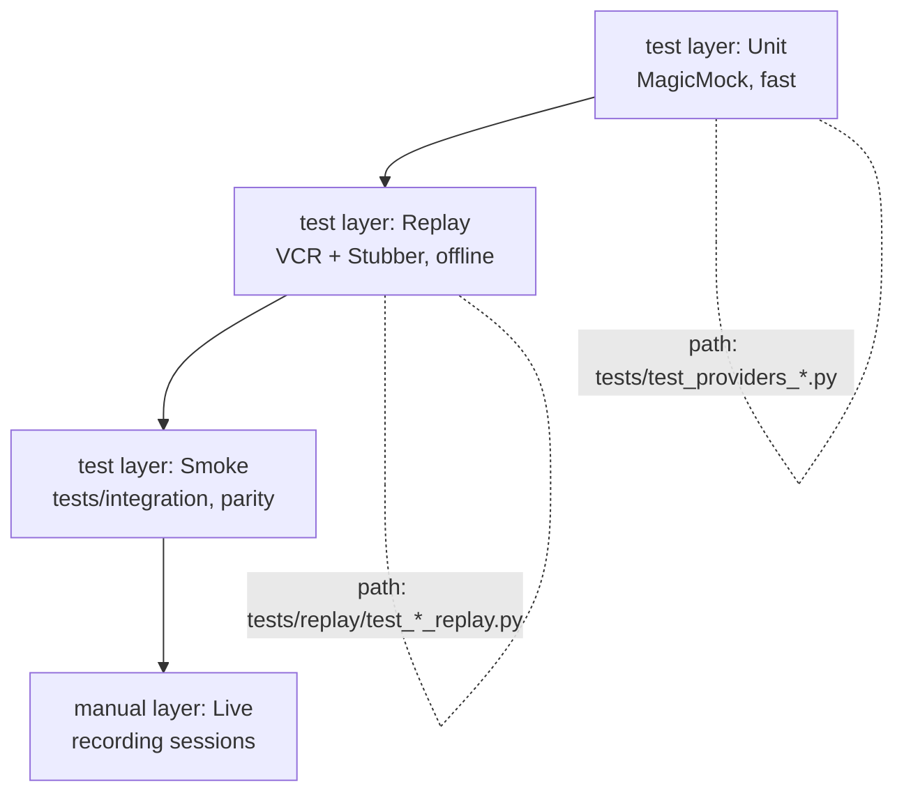

# Testing Strategy

## Scope

This document explains the test layers that protect Inqtrix provider code and
cross-process product features, when each layer applies, and which release
gates remain manual. It covers offline unit/replay tests, PostgreSQL integration
tests, the editor collaboration matrix, and live qualification. It does not
replace the command-focused [Running tests](running-tests.md) page.

## Table of contents

- [The four layers](#the-four-layers)
- [Tool matrix per provider](#tool-matrix-per-provider)
- [Cassette layout and naming](#cassette-layout-and-naming)
- [Sanitization](#sanitization)
- [Markers and CI](#markers-and-ci)
- [Recording new cassettes](#recording-new-cassettes)
- [Cookbook: adding a test for provider X](#cookbook-adding-a-test-for-provider-x)
- [Collaboration test matrix](#collaboration-test-matrix)
- [Known limitations](#known-limitations)

## The four layers

This diagram answers: "How much real runtime surface does each test layer
cover?" It is a testing pyramid: lower layers are faster and more isolated,
upper layers are closer to real providers and more expensive to maintain.


```mermaid
flowchart TD
    Unit["test layer: Unit<br/>MagicMock, fast"] --> Replay["test layer: Replay<br/>VCR + Stubber, offline"]
    Replay --> Smoke["test layer: Smoke<br/>tests/integration, parity"]
    Smoke --> Live["manual layer: Live<br/>recording sessions"]
    Unit -. "path: tests/test_providers_*.py" .- Unit
    Replay -. "path: tests/replay/test_*_replay.py" .- Replay
```

Read the arrows as increasing integration depth, not as runtime execution
order. A provider change usually starts with unit tests and adds replay coverage
when the wire shape matters.

| Layer | Location | What it tests | When to add |
|---|---|---|---|
| **Unit** | `tests/test_providers_*.py` | Construction, parameter routing, response normalization, edge-case shapes (SSE strings, `model_dump` quirks). | Always — every new public method or branch deserves a unit test. |
| **Replay** | `tests/replay/test_*_replay.py` + `tests/fixtures/cassettes/<provider>/` (VCR) or `tests/fixtures/bedrock/` (Stubber JSON) | End-to-end provider behavior against realistic backend payloads with no network access. | When you change request/response wire shape, error mapping, or retry logic. |
| **Smoke** | `tests/integration/` | Cross-provider parity (`baseline.json.migrated`, per-question `q*.json`). | When you change the agent loop or add a new provider permutation. |
| **Live** | Manual recording (`INQTRIX_RECORD_MODE=once`) | Real backend behavior for one-off cassette refreshes. | Whenever a backend's response shape changes upstream. |

There is **no automated live-test layer**. The "live" layer is a
maintainer-driven recording workflow (see
[Recording new cassettes](#recording-new-cassettes)).

## Tool matrix per provider

The HTTP transport dictates the mock library, not the provider's
purpose:

| Provider | Module | Transport | Replay tool |
|---|---|---|---|
| `LiteLLM` | `inqtrix.providers.litellm` | OpenAI SDK → httpx | vcrpy |
| `PerplexitySearch` | `inqtrix.providers.perplexity` | Perplexity SDK responses | unit stubs + debug dataflow script |
| `AzureOpenAILLM` | `inqtrix.providers.azure` | OpenAI SDK → httpx | vcrpy |
| `AzureFoundryWebSearch` | `inqtrix.providers.azure_web_search` | Azure AI Foundry / OpenAI SDK responses | unit stubs (`_parse_response` contract) |
| `AnthropicLLM` | `inqtrix.providers.anthropic` | `urllib.request.urlopen` | vcrpy (patches `http.client.HTTPConnection`) |
| `BedrockLLM` | `inqtrix.providers.bedrock` | `boto3.client("bedrock-runtime")` | `botocore.stub.Stubber` (VCR's boto3 integration is fragile; Moto does not yet support `bedrock-runtime`) |

**Single-library principle**: every replay test in this repo uses
either vcrpy + pytest-recording OR `botocore.stub.Stubber`. There is no
third mocking library. Sequence scenarios that would normally require
a side-effect mock (e.g. Anthropic 529 → success) are expressed
through multi-interaction cassettes; for Bedrock the same pattern
becomes successive `Stubber.add_response`/`add_client_error` calls.

## Cassette layout and naming

All cassette and stub data live under `tests/fixtures/`:

```
tests/fixtures/
  __init__.py
  sanitize.py                    # request/response scrubbing hooks
  bedrock_responses.py           # JSON loader + ClientError builders
  bedrock/<scenario>.json        # Bedrock Converse response fixtures
  cassettes/
    anthropic/<test_name>.yaml
    azure_foundry_bing/<test_name>.yaml
    azure_openai/<test_name>.yaml
    litellm/<test_name>.yaml
```

Conventions:

- **One cassette per test by default**. The cassette filename matches
  the test function (`test_complete_success_replay.yaml`) and
  pytest-recording resolves the path automatically via the
  `vcr_cassette_dir` fixture each module overrides.
- **Reuse via explicit decorator** when several tests would otherwise
  produce identical wire data: `@pytest.mark.vcr("test_complete_success_replay.yaml")`
  points the test at an existing cassette by name.
- **Hand-crafted cassettes are annotated** with a leading comment
  explaining their provenance: `# Hand-crafted from <provider> response
  shape on YYYY-MM-DD`. Re-record via `INQTRIX_RECORD_MODE=once` when
  the upstream schema drifts.
- **Cassette size**: keep individual files under 50 KB. Truncate long
  realistic payloads to a representative snippet — schema fidelity
  matters, byte fidelity does not.

## Sanitization

`tests/fixtures/sanitize.py` is the single source of truth. It is
wired into VCR via `vcr_config` in `tests/replay/conftest.py` and
exposes:

- `before_record_request` / `before_record_response` — VCR hooks that
  strip every header in `SANITIZED_HEADERS`, scrub query parameters
  in `SANITIZED_QUERY_KEYS`, and replace JSON body fields whose name
  matches `SECRET_BODY_KEYS`.
- `assert_cassette_clean(path)` — protective scan used by
  `tests/replay/test_sanitization.py`. Walks `tests/fixtures/`
  recursively, runs every entry of `_SECRET_PATTERNS` against each
  YAML/JSON file, and fails loudly on the first match.

If you introduce a new auth header or payload key carrying secrets,
extend `SANITIZED_HEADERS` / `SANITIZED_QUERY_KEYS` / `SECRET_BODY_KEYS`
**before** recording the cassette. The protective scan in
`tests/replay/test_sanitization.py::test_every_committed_cassette_passes_secret_scan`
will catch any oversight in CI.

## Markers and CI

There is exactly **one** custom pytest marker:

- `@pytest.mark.replay` — applied module-wide via
  `pytestmark = pytest.mark.replay` at the top of every file in
  `tests/replay/`. Selectable via `pytest -m replay` for fast targeted
  runs.

There is **no** `live` marker. Recording against real backends is a
manual maintainer workflow that uses the same tests (see next
section).

Default CI invocation:

```bash
uv run pytest tests/ -v
```

Runs the full offline suite. All replay cassettes / stubs are committed and offline; no env vars or network access are required. Use collect-only when you need the current count for a release note:

```bash
uv run pytest tests/ --collect-only -q
```

Suggested GitHub Actions workflow snippet (not committed because the
repo's CI configuration is maintainer-owned):

```yaml
name: tests
on:
  pull_request:
  push:
    branches: [main]
jobs:
  pytest:
    runs-on: ubuntu-latest
    steps:
      - uses: actions/checkout@v4
      - uses: astral-sh/setup-uv@v3
      - run: uv sync --all-extras
      - run: uv run pytest tests/ -v
```

## Recording new cassettes

Recording is the only operation that needs real API keys. The
recording workflow uses the same replay test as a recorder by setting
`INQTRIX_RECORD_MODE=once`:

```bash
INQTRIX_RECORD_MODE=once \
  ANTHROPIC_API_KEY=sk-ant-real-key \
  uv run pytest tests/replay/test_anthropic_replay.py::test_complete_success_replay -v
```

What happens internally:

1. `tests/replay/conftest.py::vcr_config` reads the env var and sets
   `record_mode="once"`.
2. The test runs; VCR sees no cassette matching the test name and
   makes one real HTTP call.
3. The request and response pass through `before_record_request` /
   `before_record_response` from `tests/fixtures/sanitize.py`,
   stripping all known auth headers, query parameters, and JSON body
   fields.
4. VCR writes the sanitized YAML cassette to
   `tests/fixtures/cassettes/anthropic/test_complete_success_replay.yaml`.
5. Review the cassette diff manually. Run
   `pytest tests/replay/test_sanitization.py` to confirm the
   protective scan stays green.
6. Commit the cassette together with any test or sanitizer changes.

Allowed `INQTRIX_RECORD_MODE` values mirror VCR's record modes:

| Value | Behavior |
|---|---|
| `none` (default) | Replay-only; missing cassette fails the test immediately. |
| `once` | Record if cassette is missing; replay if it exists. **Recommended for adding new cassettes.** |
| `new_episodes` | Add new interactions to existing cassettes. |
| `all` | Re-record every interaction. **Only use when intentionally refreshing all cassettes for a provider.** |

Anything else (typos, capitalisation drift) silently falls back to
`none` so a misconfigured shell cannot accidentally enable recording
in CI.

## Cookbook: adding a test for provider X

1. **Inspect the provider's transport.** Read the relevant
   `src/inqtrix/providers/<x>.py`: does it use the OpenAI SDK
   (httpx → vcrpy), `urllib.request.urlopen` (also vcrpy), or
   `boto3` (`Stubber`)?
2. **Pick a scenario.** The minimum coverage per provider is five
   distinct cassettes/stubs: success + rate-limit + API error +
   one provider-specific edge case (empty response, structured output, SP
   auth, etc.) + one more variation. For Azure providers, cover all
   four auth modes (api_key, SP, custom token_provider, pre-built
   credential) — reuse cassettes via explicit `@pytest.mark.vcr("...")`
   when wire shape is identical.
3. **Add the cassette / stub fixture.** For VCR providers, create
   `tests/fixtures/cassettes/<provider>/<test_name>.yaml` matching
   the [layout above](#cassette-layout-and-naming). For Bedrock,
   add a JSON file under `tests/fixtures/bedrock/` and reference it
   from `tests/fixtures/bedrock_responses.py::load_bedrock_response`.
4. **Write the test.** Drop a new file
   `tests/replay/test_<provider>_replay.py` modelled on the existing
   `tests/replay/test_litellm_replay.py` (vcrpy) or
   `tests/replay/test_bedrock_replay.py` (Stubber). Set
   `pytestmark = pytest.mark.replay` and override `vcr_cassette_dir`
   per module.
5. **Verify the protective scan passes.** Run
   `pytest tests/replay/test_sanitization.py` after committing the
   cassette. If it flags a secret-pattern hit, sanitize the cassette
   by hand and extend `SANITIZED_HEADERS` / `SECRET_BODY_KEYS` so
   future recordings handle the same field automatically.
6. **Run the full suite.** `uv run pytest tests/ -v` should stay
   fully green.

## Retrieval evaluation (tests/eval/)

A fifth, quality-focused layer gates retrieval changes (embedding
models, store backends, chunking): a committed German golden set
(10 corpus documents, 50 labeled queries under
[`tests/eval/golden/`](../../tests/eval/golden/)) graded with
document-level recall@k, MRR, and nDCG@5.

| Suite | Runs | Purpose |
|---|---|---|
| `test_metrics.py` | always (offline) | Metric math against hand-computed values; golden-set label integrity. |
| `test_retrieval_smoke.py` | always (offline) | The harness end to end with stub embeddings — proves ingestion/search/report wiring, NOT quality. |
| `test_retrieval_eval.py` | only with `INQTRIX_EVAL_EMBEDDING_BASE_URL` (+ `_API_KEY`, `_MODEL`) | Real-embedding quality against the committed per-model baseline in `tests/eval/baselines/`. |

Baseline workflow: the first gated run for a model writes a JSON
artifact (`tests/eval/artifacts/`, gitignored) and skips with a
pointer; establishing the baseline is a deliberate commit of the
aggregate metrics. Later runs fail when any gated metric drops more
than 0.05 below the baseline. Before switching retrieval backends
(memory to Qdrant hybrid) or locking an embedding model, run the
gated suite per candidate and compare artifacts.

`no_evidence` queries are excluded from retrieval metrics; they feed
the answer-side faithfulness judge that lands together with the
sufficiency check (the judge model must be pinned — swapping it
silently re-baselines every threshold).

## Collaboration test matrix

Editor collaboration crosses a shared schema package, two runtimes, a binary
gateway, PostgreSQL, three browser-serving paths, and role-aware UI. No single
mocked test proves the feature. Changes must select the layers whose public
contract they can break:

| Layer | Current location | Contract protected |
|---|---|---|
| Shared schema | `packages/editor-schema/tests/` | Markdown/Yjs round trips, schema fingerprint, package exports, nested suggestions, decision bypass, and final/original projections. |
| Node coordinator | `apps/collaboration-server/tests/` | Config validation, internal API parsing, leases, state loading, serialized persistence, durable acknowledgements, suggestion policy, AI suggestion publication, decisions, and failure close codes. |
| FastAPI service | `tests/test_editor_collaboration.py`, `tests/test_editor_patch_collaboration.py` | Activation/session contracts, cookie-only leases, error mapping, AI publication, expected-sequence decisions, idempotency, and legacy Markdown isolation. |
| PostgreSQL | `tests/storage/test_editor_collaboration_postgres.py`, `tests/storage/test_editor_collaboration_migration.py` | RLS, sequence allocation, hash/command idempotency, instance fencing, snapshots, retention, tombstones, migration/backfill, and tenant isolation. |
| Binary transport | `tests/test_collaboration_gateway.py` | Origin policy, binary-only relay, bidirectional frame limits, upstream failure, and close-code propagation. |
| Deployment paths | `tests/test_collaboration_deployment.py`, `tests/test_run_research_desk.py`, `tests/test_helm_chart.py` | Private Node topology, Compose profile, nginx/launcher WebSocket forwarding, and one-replica disabled-by-default Helm rendering. |
| Research Desk | `apps/research-desk/src/**/*.test.ts(x)` | Collaboration lifecycle, lease rotation, durable-ack state, no Markdown body autosave, role locking, review presentation, inspector filtering/navigation, and detached export/import rules. |

Run the offline gates after every collaboration milestone:

```bash
uv run pytest tests/ -v
corepack pnpm --filter @inqtrix/editor-schema typecheck
corepack pnpm --filter @inqtrix/editor-schema test
corepack pnpm --filter @inqtrix/collaboration-server typecheck
corepack pnpm --filter @inqtrix/collaboration-server test
corepack pnpm run ui:lint
corepack pnpm run ui:typecheck
corepack pnpm run ui:test
corepack pnpm run ui:build
corepack pnpm why yjs
helm lint deploy/helm/inqtrix
helm template inqtrix deploy/helm/inqtrix
```

`corepack pnpm why yjs` must resolve one Yjs copy. Browser, shared schema, and
Node package versions must stay exact and coordinated; a duplicated Yjs or
mixed Tiptap schema is a release blocker, not a warning.

Set `INQTRIX_TEST_DATABASE_URL` to a disposable migrated PostgreSQL database to
exercise the real store and RLS tests. The default offline run may skip those
tests, so an all-green offline run alone does not prove sequence races, fencing,
or tenant isolation.

Production qualification additionally requires a real two-user browser test
through each supported serving path (Vite, bundled nginx/Compose, and the dist
launcher), at desktop and mobile widths. Exercise direct concurrent edits,
carets, Suggest/Accept/Reject, reconnect, revoke/downgrade, schema mismatch,
sidecar failure, a distinct public FastAPI/gateway failure, source read-only,
private AI anchors, and detached export. The browser gate must assert document
content, visible durability clearance, suggest-lease identity plus rejection of
an unmarked direct Yjs update, same-socket protocol rejection after downgrade,
hidden-document 404 after revoke, and full editor/Inspector bounds with a
populated expanded Changes row, not only that controls are present. Run its
local semantic and compile gates with `pnpm e2e:tooling:test` and
`pnpm e2e:typecheck`; `pnpm e2e:release` additionally requires the external
fixture, treats every required skip as a failure, and accepts no CLI arguments
that could alter or bypass the fixed Playwright release matrix.

A load qualification must use 1,000 connected sockets and 100 active writers,
20 non-writer observers, at least 30 seconds of sustained writes, and at least
10 acknowledged rounds per writer. Visible remote update p95 must stay below
250 ms and durable acknowledgement p95 below 500 ms. Twenty validated FastAPI
`/health` samples must span the full loaded interval and degrade by no more than
20 percent. Qualification also requires abnormal `1006` loss for every live
socket during the ungraceful restart, independently observed production
instance/epoch advancement at `/collaboration/instance`, and exact marker
reconstruction on a fresh observer cohort. Run the semantic harness checks with
`pnpm load:collaboration:test`. Release qualification also requires fixture-v2
authenticated reissue of 60-second leases for all connected sockets, live
socket reauthentication, refresh-at scheduling, and newly issued post-restart
observer sessions; a longer initial lease is not a substitute. The repository's
unit/integration suites do not simulate production load by themselves. Record
the external release command, environment, and measurements with the release
evidence.

## Known limitations

- **Bedrock-runtime mocking** uses `botocore.stub.Stubber` because
  vcrpy's boto3 integration is historically fragile and Moto does not
  support `bedrock-runtime`. Stub responses must match the real
  Converse API shape (including required fields like `metrics` and
  `usage.totalTokens`); the Stubber's parameter validator will reject
  malformed fixtures at test-time.
- **Azure Foundry token lifetime** (~60–75 min) is not exercised by
  any replay test — the provider mints a static bearer at construction
  time. A long-running server should re-instantiate the provider every
  ~60 min; this is a runtime concern that belongs to the deployment
  documentation, not to the replay suite.
- **Retry sequences** are reflected as multi-interaction cassettes when
  needed (for example Anthropic 529-then-success). LLM providers backed by
  the OpenAI SDK disable hidden SDK retries and use Inqtrix-owned retry loops;
  replay tests can still call
  `provider._client.with_options(max_retries=0)` when they need to pin
  endpoint-specific search-provider behavior.

## Related docs

- [Running tests](running-tests.md)
- [Editor collaboration architecture](../architecture/editor-collaboration.md)
- [Deploy editor collaboration](../deployment/editor-collaboration.md)
- [Local infrastructure](local-infrastructure.md)
