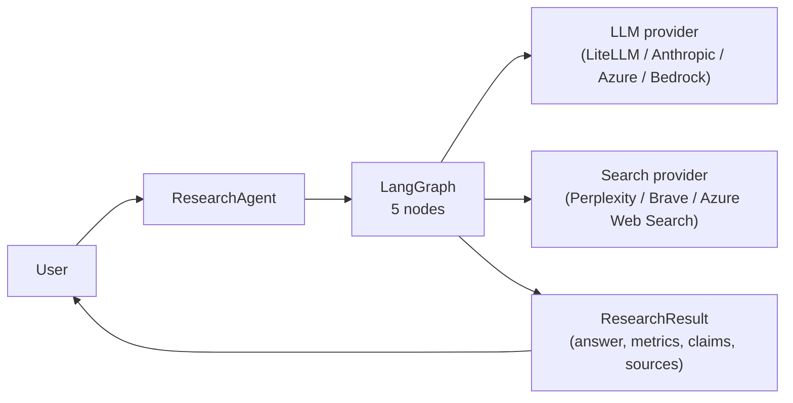

# Overview

## Scope

What Inqtrix is, who it targets, and how the runtime modes differ. Read this page first if you have not used Inqtrix before.

## What Inqtrix does

Inqtrix is an iterative AI research agent. Given a question, it:

1. Classifies the question (language, topic, risk, aspect list).
2. Generates a handful of broad search queries.
3. Runs the queries in parallel, summarises each result, extracts structured claims.
4. Evaluates the accumulated evidence against nine independent stop heuristics.
5. Loops back to planning if evidence is insufficient, terminates otherwise.
6. Produces a cited, structured Markdown answer.

Everything above is **bounded** — wall-clock deadline, max rounds, max citations, max context blocks. Runs cannot accidentally explode in cost.

## Who it is for

- Developers who need structured, auditable research answers inside a larger Python application.
- Teams that want a pluggable, typed backend for a research-UI product.
- Operators who need to stay inside a specific tenancy (Azure, AWS Bedrock) for compliance reasons and who value Constructor-First provider wiring.

Inqtrix is **not** a general-purpose agent framework; the graph topology, strategy ABCs, and stopping cascade are opinionated.

## Runtime modes

| Mode | Optional files | Where models are defined | How to start |
|------|----------------|--------------------------|--------------|
| Python library via `.env` or process env | `.env` | environment variables | `uv run python main.py` |
| Python library via `AgentConfig` | none | Python code | `uv run python main.py` |
| HTTP server in env-only mode | `.env` | environment variables | `uv run python -m inqtrix` |
| HTTP server in YAML mode | `inqtrix.yaml`, `.inqtrix.yaml` or `inqtrix.yml`, plus optional `.env` for secrets | YAML `roles:` + env variables for secrets | `uv run python -m inqtrix` |

`main.py` only exists when you author a library script yourself. The HTTP server boots directly via `python -m inqtrix`; no user-supplied `main.py` is required.

For local development, `.env` is convenient in both library and server mode. Exported process environment variables always take precedence over values from `.env`. In library mode, explicit scalar fields in `AgentConfig` override values loaded from env when providers are auto-created.

See [Library mode](../deployment/library-mode.md) and [Web server mode](../deployment/webserver-mode.md) for the complete entry-path documentation.

## Mental model in one diagram

## Next steps

- [Installation](installation.md) — set up the editable install.
- [First research run](first-research-run.md) — run a live question against your own providers.
- [Architecture overview](../architecture/overview.md) — understand the pipeline in depth.
- [Providers overview](../providers/overview.md) — pick a provider combination.

## Related docs

- [Installation](installation.md)
- [First research run](first-research-run.md)
- [Architecture overview](../architecture/overview.md)
