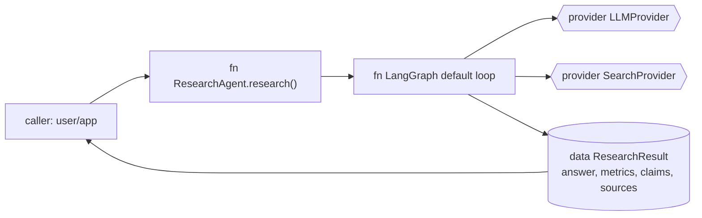

# Overview

## Scope

What Inqtrix is, who it targets, and how the runtime modes differ. Read this page first if you have not used Inqtrix before.

## What Inqtrix does

Inqtrix is an iterative AI research agent. Given a question, it:

1. Classifies the question (language, topic, risk, aspect list).
2. Generates a handful of broad search queries.
3. Runs the queries in parallel and extracts structured claims from each grounded result.
4. Evaluates the accumulated evidence against a nine-step stop cascade plus a global `min_rounds` floor.
5. Loops back to planning if evidence is insufficient, terminates otherwise.
6. Produces a cited, structured Markdown answer.

Everything above is **bounded** — wall-clock deadline, max rounds, max citations, max context blocks. Runs cannot accidentally explode in cost.

Around the agent sits a platform layer (v0.2.0): an HTTP server with native runs (`/v1/runs` + SSE events) next to the OpenAI-compatible chat surface, an optional knowledge engine that answers with verified quotes from your own document collections (`mode=knowledge`, see [Retrieval profiles](../configuration/knowledge-profiles.md)), a files API, and the Research Desk browser UI. All of it defaults to zero infrastructure (in-memory storage and queue) and scales up to Postgres, S3, Qdrant, Valkey workers, and OIDC login — see [Platform components](platform-components.md).

## Who it is for

- Developers who need structured, auditable research answers inside a larger Python application.
- Teams that want a pluggable, typed backend for a research UI.
- Operators who need to stay inside a specific tenancy (Azure, AWS Bedrock) for compliance reasons and who value Constructor-First provider wiring.

Inqtrix is **not** a general-purpose agent framework; the graph topology, strategy ABCs, and stopping cascade are opinionated.

## Runtime modes

| Mode | Optional files | Where models are defined | How to start |
|------|----------------|--------------------------|--------------|
| Python library via `.env` or process env | `.env` | environment variables | `uv run python main.py` |
| Python library via `AgentConfig` | none | Python code | `uv run python main.py` |
| HTTP server in env-only mode | `.env` | environment variables | `uv run python -m inqtrix` |
| Research Desk UI (against a running server) | none | on the server | `pnpm run ui:dev` |
| Stack mode (one command: API + web + Postgres) | `deploy/.env.stack` | environment variables | [Stack quickstart](stack-quickstart.md) |
| Platform components (S3, Qdrant, Valkey, Dex profiles) | `.env` + compose | environment variables | [Platform components](platform-components.md) |

`main.py` only exists when you author a library script yourself. The HTTP server boots directly via `python -m inqtrix`; no user-supplied `main.py` is required.

For local development, `.env` is convenient in both library and server mode. Exported process environment variables always take precedence over values from `.env`. In library mode, explicit scalar fields in `AgentConfig` override values loaded from env when providers are auto-created.

See [Library mode](../deployment/library-mode.md) and [Web server mode](../deployment/webserver-mode.md) for the complete entry-path documentation.

## Mental model in one diagram

This diagram answers: "What are the outer boxes a beginner should remember?"
It hides the internal five-node loop; the detailed version is in
[Architecture overview](../architecture/overview.md).

```mermaid
flowchart LR
    U["caller: user/app"] --> A["fn ResearchAgent.research()"]
    A --> G["fn LangGraph default loop"]
    G --> L{{"provider LLMProvider"}}
    G --> S{{"provider SearchProvider"}}
    G --> R[("data ResearchResult<br/>answer, metrics, claims, sources")]
    R --> U
```

Read the center box as "the built-in iterative research procedure." Providers
do external work; `ResearchResult` is the public data object returned to your
application.

## Next steps

The getting-started pages chain from clone to a first cited knowledge answer:

1. [Installation](installation.md) — set up the editable install and the optional frontend toolchain.
2. [First research run](first-research-run.md) — a live web-research answer with zero infrastructure.
3. [Stack quickstart](stack-quickstart.md) — run the whole stack (API + web + Postgres) with one `docker compose up`; [Platform components](platform-components.md) explains which extras you need.
4. [First knowledge answer](first-knowledge-answer.md) — a cited answer over your own documents.

Then go deeper:

- [Architecture overview](../architecture/overview.md) — understand the pipeline in depth.
- [Providers overview](../providers/overview.md) — pick a provider combination.

## Related docs

- [Installation](installation.md)
- [First research run](first-research-run.md)
- [Architecture overview](../architecture/overview.md)
