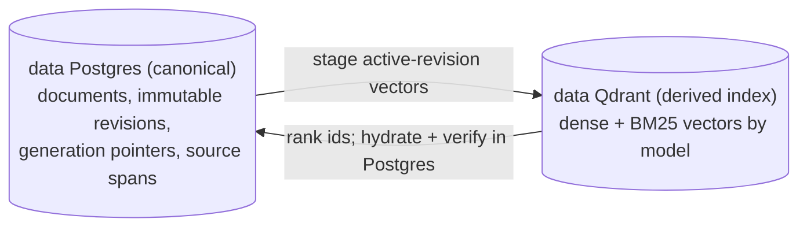
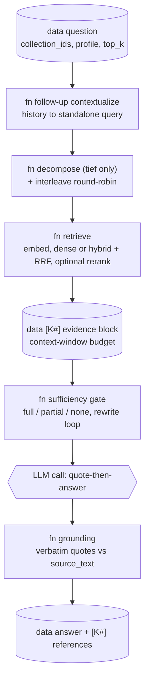

# Knowledge engine

> Files: `src/inqtrix/knowledge/` (`algorithm.py`, `profiles.py`, `gate.py`, `decompose.py`, `grounding.py`, `contextualize.py`, `chunking.py`, `parsing.py`, `retrieval.py`, `stores/`), `src/inqtrix/services/knowledge_service.py`, `src/inqtrix/server/routers/knowledge.py`, `src/inqtrix/server/routers/sources.py`

## Scope

The knowledge engine answers questions from the deployment's own documents instead of the web: ingest documents into collections, retrieve evidence chunks, and synthesise a cited answer through `mode=knowledge`. It is off by default — `INQTRIX_KNOWLEDGE_ENABLED=true` registers the `/v1/knowledge/*` and `/v1/sources/*` routes, constructs the embedding provider, and registers the `knowledge` algorithm. A disabled deployment has no knowledge surface at all (requests naming `mode=knowledge` get the standard mode-validation 400).

## Data model

| Object | Id prefix | Key facts |
|---|---|---|
| Collection | `kc_` | Name plus an **immutable** `embedding_model` and `embedding_dim`, fixed at creation. |
| Document | `kd_` | Stable logical identity with `source_id`, a server-owned owner/workspace source scope, desired revision, active revision, title, metadata, and the currently active extracted text (up to `INQTRIX_KNOWLEDGE_MAX_DOCUMENT_CHARS`, default 2,000,000). |
| Revision | `rev_` | Immutable source text, content hash, parser/chunker/contextualization contract, desired sequence, and publication status. |
| Generation | `gen_` | One immutable collection-wide index build and its revision manifest; exactly one generation is active, retained predecessors can be rolled back. |
| Chunk | `kch_` | One retrieval unit with original `source_text`, optional `retrieval_context`, exact UTF-8 `source_start`/`source_end`, revision/generation identity, and the derived vector. |

**Why the embedding identity is immutable.** Every chunk in a collection must live in the same vector space: vectors from different models (or the same model at a different dimension) are geometrically incomparable, so mixing them would silently corrupt similarity scores. The dimension is recorded at creation — from the embedding catalog when the model is catalogued, otherwise probed with one real embedding call — and enforced on every upsert. A mismatch raises `EmbeddingDimensionMismatch` (HTTP 409), never a padded or truncated vector. Changing `INQTRIX_EMBEDDING_MODEL` only affects *new* collections.

**Why the full document text is kept.** It is the citable source view: the document viewer renders it (`GET /v1/knowledge/documents/{id}/text`), and snippet/quote highlighting works by text search within it.

**Why source scope is typed.** A `source_id` is unique only within its
tenant/owner/workspace authority. Asset metadata can identify a candidate
source but cannot authorize it. Ingestion copies the scope from the canonical
asset lifecycle into dedicated document columns; aggregate deletion matches
all four dimensions and a retained deletion permit. Missing, foreign, or
unbound identities never mint a deletion operation and never fall back to a
tenant-wide `source_id` cleanup.

**Retrieval text vs. evidence.** When contextual retrieval is on, the generated situating prefix is persisted as `retrieval_context`; the original body is `source_text`. Their concatenation is used only to build dense and sparse indexes. Public search hits expose `excerpt`, never the combined embedding text. Every reader-facing excerpt and quote is verified against the canonical document's content hash and UTF-8 source span. Legacy chunks that cannot pass that check are excluded with a visible `chunks_require_reindex` warning; there is no fallback that presents synthetic retrieval text as source evidence. While the migration-marked compatibility generation is active, pre-lineage Qdrant payloads are admitted only for the exact verified canonical chunk ids recovered by the migration; canonical generation/revision hydration plus the same hash/span verification still gates every result. A validated shadow generation removes that compatibility branch automatically.

## Storage topology

This diagram answers: "Where does each piece of a chunk live, and what keeps the two stores in sync?" Postgres is the canonical source of truth; Qdrant is a derived index holding only vectors. See [Knowledge retrieval](../architecture/knowledge-retrieval.md#storage-topology-postgres-canonical-qdrant-derived) for the full topology.



Key transitions:

- Postgres is the only evidence authority. It owns the full document, immutable revisions, exact chunk source text/spans, active pointers, and generation history.
- Qdrant is shared per embedding model and contains derived vectors. Logical collection, revision, and generation identities partition the payload. Search always hydrates through Postgres and discards inactive, deleting, or source-unverified candidates; geometric over-fetch preserves `top_k` while stale vectors are cleaned asynchronously.
- A shadow generation can be built and validated while the active generation serves reads. Publication changes one Postgres pointer; the previous generation remains rollbackable for seven days. This logical-generation topology preserves one cross-collection retrieval/ranking path instead of creating a second fan-out over physical Qdrant collections.

## Ingestion

The durable browser path starts `POST /v1/knowledge/collections/{id}/document-revisions` with canonical `text`. The existing `POST /documents` endpoint remains a compatibility adapter: it performs access-checked file parsing when `file_id` is used, submits the same document-revision job, waits for its terminal state, and returns the historical document response.

```text
text ─► reserve stable document + immutable desired revision ─► queue job
file_id ─► FileService (access-checked read) ─► parse ───────────┘
  ─► chunk with exact spans
  ─► contextualize in dynamic checkpointed batches (optional)
  ─► embed with the collection model
  ─► confirm the idempotent embedding-usage receipt
  ─► compare-and-swap publish if the revision is still desired
```

1. **Parse** — file ingestion converts PDF (text layer), DOCX, PPTX, XLSX, HTML, Markdown, and plain text to Markdown via MarkItDown (`INQTRIX_DOCUMENT_PARSER=markitdown`, the default; `none` disables file ingestion). A file that yields no text — the classic scanned PDF without a text layer — fails loudly with HTTP 422, never a silently empty document. The parser id and the originating `file_id`/`file_name` are recorded in document metadata.
2. **Reserve** — source identity and content hash select or create one stable logical document. An immutable desired revision and its sequence exist before provider work starts. If requests A/B/C complete out of order, only the still-desired revision can pass the publication CAS; older attempts end as `superseded` without deleting a returned id.
3. **Chunk** — `chunking.py` splits on blank-line paragraph boundaries, packs paragraphs greedily up to the chunk budget, and splits oversize paragraphs on sentence boundaries. It emits exact source substrings and offsets, including for repeated boilerplate; content is never dropped or mapped back through a prefix search.
4. **Contextualize** (optional, `INQTRIX_KNOWLEDGE_CONTEXTUALIZE`, **default `off`** — an unconfigured deployment indexes the plain chunk body and skips this step entirely) — the maximum is 25 chunks per provider call, but the effective batch size is calculated from the resolved model's context window, complete rendered prompt, guaranteed JSON output space, and safety reserve. Every batch window includes every chunk span it asks the model to describe, so a document requires `ceil(chunks / effective dynamic batch size)` calls rather than one call per document. Up to three batches execute concurrently, never above the provider's declared LLM-concurrency cap. Each validated batch is checkpointed independently, so out-of-order completions remain reusable and resume dispatches only missing batches.
5. **Pause instead of fallback** — a provider timeout becomes `paused_dependency`; malformed contextualization output becomes `paused_validation`. The active revision remains unchanged. A tenant/provider/model circuit shared through PostgreSQL prevents every worker from repeating the same transient failure; after its configured cooldown, exactly one leased half-open probe may test recovery. Pauses have no age deadline and are excluded from terminal-history retention and restart-orphan cleanup. Retry/resume, cancel, and the explicit “build without context” choice are separate user actions. Resume reconstructs the same operation kind from its canonical document/revision or generation identity before the paused-to-queued transition; an invalid identity leaves the checkpoint paused and returns `resume_unavailable`. Only the explicit raw choice can publish `ready_raw_by_user_choice`; the system never silently converts a failed contextualized build into a raw one.
6. **Embed** — with the collection's immutable model, against the configured embedding endpoint (`INQTRIX_EMBEDDING_PROVIDER=openai_compatible` reuses the LiteLLM gateway by default; `azure` uses deployment-based auth).
7. **Receipt and publish** — the fully prepared provider result remains outside the publication boundary until its idempotent embedding-usage receipt is confirmed. A receipt outage pauses the job with the prior active revision and search scope unchanged. Only then does the existing store CAS write derived vectors, canonical chunks, and the active revision pointer; a retry that already crossed the CAS repeats the same receipt idempotently and reads the published revision without reactivating anything. `INQTRIX_VECTOR_BACKEND=memory` is process-local; the production path is Postgres plus Qdrant. Hybrid retrieval fuses dense and German BM25 ranks through RRF; see [Knowledge retrieval](../architecture/knowledge-retrieval.md#hybrid-search-and-rrf).

The 202 response identifies `document_id`, `revision_id`, and `job_id`. Job SSE reports extraction/parsing where applicable, chunking, contextualization batch `x/y`, embedding, validation, and publication. A browser abort stops only the HTTP observation; the explicit job cancel endpoint is the server-side cancellation authority.

**Collection rebuild.** `POST /v1/knowledge/collections/{id}/reindex` builds a new generation rather than replacing active chunks in place. One generation build is serialized per collection. The active generation keeps serving, normal document revisions can continue, and the worker reconciles manifest deltas before the final pointer switch. Publication independently verifies the exact document/revision set, source spans and source slices, per-document and total chunk counts, vector-point count, and embedding dimension. PostgreSQL plus Valkey/worker makes jobs durable across API restarts. The previous generation is retained for the configured rollback window; incomplete or invalid generations never become searchable. Expired generations are swept on the existing worker reconciliation cadence. They leave `rollback_available` before vector deletion, and an interrupted cleanup remains `deleting` or `cleanup_failed` until an idempotent retry reaches zero residual points and rows.

## Answer path (`mode=knowledge`)

This diagram answers: "What stages turn a `mode=knowledge` question into a cited answer?" Each stage is gated by the retrieval profile; the full diagram with the rewrite loop and coverage routing is in [Knowledge retrieval](../architecture/knowledge-retrieval.md#retrieval-pipeline-question-to-cited-answer). The stages do not all run on the same kind of engine — retrieval uses an embedding model, the lexical branch and the fusion use no model at all, and only the final synthesis is a high-tier LLM call; the per-stage mapping is in [Which engine owns which stage](../architecture/knowledge-retrieval.md#which-engine-owns-which-stage).



- **Follow-up contextualization** — when `/v1/runs` receives prior chat `messages`, the knowledge algorithm uses the formatted history to rewrite the current follow-up into a standalone retrieval query before profile selection, decomposition, retrieval, and the gate. The original user question still drives the final answer prompt, and history is explicitly not evidence: every factual claim must be supported by the current `[K#]` excerpts. Failures fall back to the original question with the loud `_knowledge_query_context_fallback` marker and `inqtrix.knowledge.contextualized` event.
- **Retrieve** (`retrieval.py`, defined once for Knowledge answers, `/v1/knowledge/search`, Kernel, and Mission): partition the concrete collection scope by immutable embedding model, embed the query once per model group, and run every group through the same canonical store search. Because scores from different vector spaces are not comparable, group results are interleaved by rank and de-duplicated before the common optional rerank stage reduces the candidate pool to the requested final evidence width. No caller silently narrows a mixed-model scope to the default model. Reranker variants are `cohere` (Cohere-rerank-schema endpoint, native or Azure serverless) or `llm` (listwise through the deployment's own LLM, hard-capped at 20 candidates and materially more expensive).
- **Retrieval degradation** — a technical vector cap or stalled backend page reports the requested and returned candidate-pool widths separately from `final_top_k`, `returned_hits`, and `final_evidence_complete`. A smaller rerank pool can therefore be diagnosed without falsely claiming that final evidence is missing. These typed records are included in the live event, result state, completed export, and saved-session reconstruction; the Answer and Find views keep the notice after reconnect or reload. Ordinary corpus exhaustion is not classified as a technical degradation.
- **Evidence budget** — hits render as `[K1] Title (Abschnitt N)` entries up to `(context_window − 4000 reserved tokens) × 3` chars (floor 8000). The reference list and the prompt always describe the same set; dropped hits emit `inqtrix.knowledge.evidence.truncated`.
- **Sufficiency gate** (`gate.py`) — one fast-tier call judges whether the evidence carries the question and may propose one rewritten query per round for the rewrite-and-retrieve loop (round budget set by the profile, hard-capped by `INQTRIX_KNOWLEDGE_GATE_MAX_ROUNDS`). The verdict is three-way coverage: `full` answers normally; `partial` answers **with the gaps named explicitly** (live evaluation showed a binary verdict refusing answerable multi-aspect questions wholesale); `none` — no relevant evidence after the rewrite budget — yields the honest no-evidence answer instead of a fabricated one. An unparseable gate response fails *open* to sufficient with `_knowledge_gate_fallback`; the run ledger renders that marker as a visible degraded evidence judgement rather than a normal verdict.
- **Quote-then-answer grounding** (`grounding.py`) — the answer prompt requires a `ZITATE:` block of verbatim `[K#]`-labelled quotes before the `ANTWORT:` section (WebGPT/GopherCite lineage). Because the quotes claim to be verbatim, they are verified WITHOUT another LLM call: a formatting-normalized substring check against the specifically labelled chunk's `source_text`. One bounded parser repair accepts Markdown heading markers around both required headers; it never changes a quote or calls a model. The quote block is stripped only after every quote verifies. A missing or ambiguous block, an empty answer, an invalid label, or one unverifiable quote terminally rejects the completion with a typed, safe failure and `inqtrix.knowledge.grounding.checked`; unchecked model text is never returned as an answer.
- **References** — `[K#]` labels resolve to `inqtrix://documents/<id>#chunk-N` URIs, or to clickable `{base}/v1/sources/<document_id>?chunk=N` links when `INQTRIX_PUBLIC_BASE_URL` is set.

How much of this machinery runs per request is selected by the retrieval profile (`schnell` | `standard` | `gruendlich` | `tief` | `auto`) in `knowledge_filters.profile` — see [Retrieval profiles](../configuration/knowledge-profiles.md) for the stage matrix, the operator-ceiling rule, and the transport contract. Which collections a `mode=knowledge` ask searches is fixed at admission: an explicit non-empty `knowledge_filters.collection_ids` list is asserted strictly (one invisible collection denies the submission), and an authenticated omitted, `null`, or empty filter is expanded and pinned to the caller-visible collections before execution. If that visible set is empty, retrieval remains empty and performs no provider or store call. A pinned set spanning several embedding models is partitioned and rank-fused inside the shared retrieval implementation; deployments without user auth keep the historical search-everything view (details in [knowledge-retrieval.md](../architecture/knowledge-retrieval.md)). Each stage emits a structured event (`inqtrix.knowledge.contextualized`, `inqtrix.knowledge.profile.resolved`, `inqtrix.knowledge.retrieval.completed`, `inqtrix.knowledge.retrieval.degraded`, `inqtrix.knowledge.gate.evaluated`, `inqtrix.knowledge.grounding.checked`, `inqtrix.knowledge.decomposition.completed`) consumed by the UI run card.

## The Wissen workspace

The React Research Desk (`apps/research-desk/src/features/knowledge/`) exposes the engine as the "Wissen" workspace with two modes and a shared reader. **Ask** submits the question as a native run (`POST /v1/runs` with `mode=knowledge` plus the selected collections, profile, and top-k). Follow-up asks include recent completed Q&A turns as `messages` so retrieval can resolve "that/there/also" style references, while old answers and old citations never become evidence for the new answer. The UI renders the live SSE step stream — contextualization, profile resolution, retrieval, gate rounds, grounding — inline before the cited answer appears. The answer card shows the verified quotes; clicking a `[K#]` reference opens the reader at the cited document. **Find** is a debounced literal retrieval search against `POST /v1/knowledge/search`, with hits grouped per document so one strong document does not read as twenty results. **Read** is the document viewer overlay both modes open into: the *extracted* tab renders the ingested text (the exact text retrieval and grounding verified against) with exact match highlighting for the opened quote or snippet, and the *original* tab streams the source binary via `/v1/files/{file_id}/content` when the document was ingested from a server file. The workspace gates every feature on the `/v1/capabilities` manifest, so deployments without hybrid retrieval, reranker, or file parsing degrade visibly instead of breaking.

## Evaluation

The retrieval eval (`tests/eval/test_retrieval_eval.py`) and the answer eval (`tests/eval/test_answer_eval.py`, the only eval that exercises the gate) run live against real embedding/LLM backends and parametrize over golden tiers:

| Tier | Corpus | Character |
|---|---|---|
| `base` | 10 committed German documents | Smoke-level retrieval sanity. |
| `hard` | EU AI Act, split per article (rebuilt from EUR-Lex) | Hard paraphrase and cross-article queries. |
| `bsi` | BSI IT-Grundschutz Bausteine + C5 criteria (rebuilt from official downloads) | Technical-control vocabulary. |
| `dora` | Regulation (EU) 2022/2554, split per article (rebuilt from the Publications Office) | Multi-hop/aggregation headroom. |
| `dora_holdout` | Shares the DORA corpus | NEVER tuned against — held-out overfitting-regression gate only. |
| `gquad` | GermanQuAD Wikipedia QA (generated locally, share-alike license) | Everyday-German counterweight to the legal tiers. |

`INQTRIX_EVAL_GOLDEN_SET` selects the tier and `INQTRIX_EVAL_KNOWLEDGE_PROFILE` the retrieval profile for the answer eval; both fail loudly at import on a typo (never silently grading the base set):

```bash
INQTRIX_EVAL_GOLDEN_SET=dora INQTRIX_EVAL_KNOWLEDGE_PROFILE=gruendlich \
  uv run --env-file .env pytest tests/eval/test_answer_eval.py -v

# Standard pip/plain-Python environment:
python -m pip install -e ".[dev]"
set -a
. ./.env
set +a
INQTRIX_EVAL_GOLDEN_SET=dora INQTRIX_EVAL_KNOWLEDGE_PROFILE=gruendlich \
  python -m pytest tests/eval/test_answer_eval.py -v
```

Baselines under `tests/eval/baselines/` are **deliberate commits**: a run never overwrites a baseline; a human reviews the artifact and commits the new floor with a rationale. Retrieval baselines are keyed `{tier}__{embedding-model}.json` (the base tier keeps the legacy unkeyed name); answer baselines are keyed `answer-{model}.json` for base/standard and `answer-{model}-{tier}-{profile}.json` otherwise.

Reading a baseline file: `_inqtrix_version` identifies the product version
whose behaviour is protected, while `_context` records the relevant stack
(store, embedding model, reranker, contextualization), current comparison
constraints, and known misses with their failure class. Retrieval baselines
carry `recall_at_1/3/5`, `mrr`, `ndcg_at_5`, and `multi_complete_at_5` (share
of multi-document queries with ALL labeled documents in the top-5). Answer
baselines carry `abstention_rate` (floor; `null` on tiers without
`no_evidence` queries, which then skip that gate), `false_refusal_rate`
(ceiling — the costlier error for users), and `citation_rate` (floor).
Absolute behaviour floors apply on top of the per-baseline values:
abstention ≥ 0.5, false refusal ≤ 0.10, citation ≥ 0.9.

## Related docs

- [Knowledge retrieval architecture](../architecture/knowledge-retrieval.md) — the internal data flow with diagrams: ingestion, storage topology, hybrid + RRF, the gate loop, and grounding.
- [Retrieval profiles](../configuration/knowledge-profiles.md) — the profile matrix, operator ceiling, transport, and eval keying.
- [Settings and environment](../configuration/settings-and-env.md) — every `INQTRIX_KNOWLEDGE_*` / `INQTRIX_EMBEDDING_*` / `INQTRIX_RERANKER_*` variable.
- [Web server mode](../deployment/webserver-mode.md) — endpoint surface, registration gates, `/v1/capabilities`.
- [Local infrastructure](../development/local-infrastructure.md) — the Qdrant/SeaweedFS/Postgres/Valkey dev compose stack.
