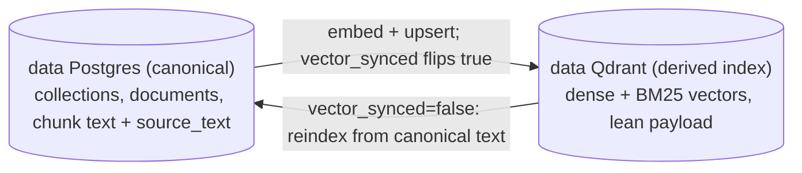
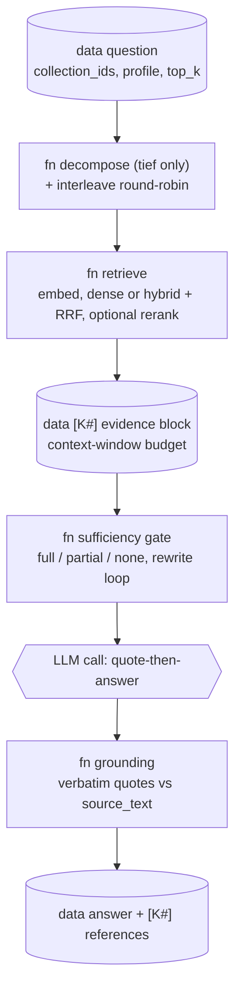

# Knowledge engine

> Files: `src/inqtrix/knowledge/` (`algorithm.py`, `profiles.py`, `gate.py`, `decompose.py`, `grounding.py`, `contextualize.py`, `chunking.py`, `parsing.py`, `retrieval.py`, `stores/`), `src/inqtrix/services/knowledge_service.py`, `src/inqtrix/server/routers/knowledge.py`, `src/inqtrix/server/routers/sources.py`

## Scope

The knowledge engine answers questions from the deployment's own documents instead of the web: ingest documents into collections, retrieve evidence chunks, and synthesise a cited answer through `mode=knowledge`. It is off by default — `INQTRIX_KNOWLEDGE_ENABLED=true` registers the `/v1/knowledge/*` and `/v1/sources/*` routes, constructs the embedding provider, and registers the `knowledge` algorithm. A disabled deployment has no knowledge surface at all (requests naming `mode=knowledge` get the standard mode-validation 400).

## Data model

| Object | Id prefix | Key facts |
|---|---|---|
| Collection | `kc_` | Name plus an **immutable** `embedding_model` and `embedding_dim`, fixed at creation. |
| Document | `kd_` | Title, free-form `metadata`, and the **full extracted text** (up to `INQTRIX_KNOWLEDGE_MAX_DOCUMENT_CHARS`, default 2,000,000 — the synchronous-ingestion guard). |
| Chunk | `kch_` | One embedded retrieval unit: `text` (budgeted by `INQTRIX_KNOWLEDGE_CHUNK_MAX_CHARS`, default 2000 chars ≈ 500 tokens), its dense vector, and `source_text`. |

**Why the embedding identity is immutable.** Every chunk in a collection must live in the same vector space: vectors from different models (or the same model at a different dimension) are geometrically incomparable, so mixing them would silently corrupt similarity scores. The dimension is recorded at creation — from the embedding catalog when the model is catalogued, otherwise probed with one real embedding call — and enforced on every upsert. A mismatch raises `EmbeddingDimensionMismatch` (HTTP 409), never a padded or truncated vector. Changing `INQTRIX_EMBEDDING_MODEL` only affects *new* collections.

**Why the full document text is kept.** It is the citable source view: the document viewer renders it (`GET /v1/knowledge/documents/{id}/text`), and snippet/quote highlighting works by text search within it.

**Chunk `text` vs. `source_text`.** When contextual retrieval is on, `text` carries a generated situating prefix that improves retrieval but is not part of the document. `source_text` is the original chunk body — quote verification runs against it, because a "verbatim, verified" quote must exist in the cited source, not in machine-generated scaffolding. Chunks ingested before the field existed have it empty; consumers fall back to `text`.

## Storage topology

This diagram answers: "Where does each piece of a chunk live, and what keeps the two stores in sync?" Postgres is the canonical source of truth; Qdrant is a derived index holding only vectors. See [Knowledge retrieval](../architecture/knowledge-retrieval.md#storage-topology-postgres-canonical-qdrant-derived) for the full topology.



Key transitions:

- The full document text and chunk `source_text` live only in Postgres; Qdrant stores vectors plus a lean payload (chunk id and filter keys), never the document text.
- `vector_synced` on the document is the visible reconcile flag: `true` once vectors land in Qdrant, `false` on a failed sync, cleared again when reindex re-embeds from the canonical text.

## Ingestion

`POST /v1/knowledge/collections/{id}/documents` accepts either `text` or `file_id` (both at once is a 400):

```
text ────────────────────────────────────────────┐
file_id ─► FileService (access-checked read)     │
             ─► parse (MarkItDown) ──────────────┤
                                                 ▼
   chunk (paragraph-aware) ─► [contextualize: one fast-tier LLM call per document]
     ─► embed (per-collection model) ─► store (memory | qdrant hybrid + BM25-german)
```

1. **Parse** — file ingestion converts PDF (text layer), DOCX, PPTX, XLSX, HTML, Markdown, and plain text to Markdown via MarkItDown (`INQTRIX_DOCUMENT_PARSER=markitdown`, the default; `none` disables file ingestion). A file that yields no text — the classic scanned PDF without a text layer — fails loudly with HTTP 422, never a silently empty document. The parser id and the originating `file_id`/`file_name` are recorded in document metadata.
2. **Chunk** — `chunking.py` splits on blank-line paragraph boundaries, packs paragraphs greedily up to the chunk budget, and splits oversize paragraphs on sentence boundaries (hard-wrapping a single oversize sentence as a last resort — content is never dropped).
3. **Contextualize** (optional, `INQTRIX_KNOWLEDGE_CONTEXTUALIZE=on`) — contextual retrieval in the Anthropic 2024 pattern: ONE batched fast-tier LLM call per document (not per chunk) generates a short situating context per chunk, prepended before dense embedding and BM25 indexing. Paid once at ingestion, zero query-time latency. An unparseable response degrades that document to uncontextualized chunks with the loud `_chunk_context_fallback` marker, recorded per document in `metadata._chunk_context`.
4. **Embed** — with the collection's immutable model, against the configured embedding endpoint (`INQTRIX_EMBEDDING_PROVIDER=openai_compatible` reuses the LiteLLM gateway by default; `azure` uses deployment-based auth).
5. **Store** — `INQTRIX_VECTOR_BACKEND=memory` (in-process, lost on restart) or `qdrant` (persistent, hybrid retrieval: client-side BM25 sparse vectors with German tokenization/stemming — `INQTRIX_KNOWLEDGE_SPARSE=bm25_german`, an algorithm, not a hosted model — fused with the dense branch via RRF). Hybrid without a reranker is warned about at startup: plain RRF can degrade top-1 precision on paraphrase queries. RRF (reciprocal rank fusion) merges the dense and BM25 rankings by summing reciprocal ranks, so their incommensurable score scales combine fairly — see [Knowledge retrieval](../architecture/knowledge-retrieval.md#hybrid-search-and-rrf) for the formula and the prefetch depths.

Ingestion is synchronous in this cut; the embedding call site is what a worker-based pipeline would replace.

**Reindex (re-embed in place).** Re-embedding an existing collection's documents — keeping each document's identity, recomputing only its vectors — runs as a background job (`POST /v1/knowledge/collections/{id}/reindex`, progress over SSE, cancellable, per-collection history). It is serialized per collection (one active reindex at a time). With the in-memory store the job lives in-process (survives closing the browser, not a server restart); with `INQTRIX_STORAGE_BACKEND=postgres` the job becomes durable, and with `INQTRIX_QUEUE_BACKEND=valkey` plus a running `inqtrix-worker` it survives a server restart and is executed off the API process (re-embedding from the canonical Postgres text). See [Web server mode](../deployment/webserver-mode.md) for the worker and the reindex stream.

## Answer path (`mode=knowledge`)

This diagram answers: "What stages turn a `mode=knowledge` question into a cited answer?" Each stage is gated by the retrieval profile; the full diagram with the rewrite loop and coverage routing is in [Knowledge retrieval](../architecture/knowledge-retrieval.md#retrieval-pipeline-question-to-cited-answer).



- **Retrieve** (`retrieval.py`, defined once for the answer path and the `/v1/knowledge/search` debug endpoint): query embedding with the scope's collection model, hybrid search when the store supports it, then the optional rerank stage reducing a deeper candidate pool (`INQTRIX_RERANK_CANDIDATE_DEPTH`, default 40) to the requested `top_k` (`INQTRIX_KNOWLEDGE_TOP_K`, default 8). Reranker variants: `cohere` (Cohere-rerank-schema endpoint, native or Azure serverless) or `llm` (listwise via the deployment's own LLM — a fallback, hard-capped at 20 candidates, roughly an order of magnitude costlier).
- **Evidence budget** — hits render as `[K1] Title (Abschnitt N)` entries up to `(context_window − 4000 reserved tokens) × 3` chars (floor 8000). The reference list and the prompt always describe the same set; dropped hits emit `inqtrix.knowledge.evidence.truncated`.
- **Sufficiency gate** (`gate.py`) — one fast-tier call judges whether the evidence carries the question and may propose one rewritten query per round for the rewrite-and-retrieve loop (round budget set by the profile, hard-capped by `INQTRIX_KNOWLEDGE_GATE_MAX_ROUNDS`). The verdict is three-way coverage: `full` answers normally; `partial` answers **with the gaps named explicitly** (live evaluation showed a binary verdict refusing answerable multi-aspect questions wholesale); `none` — no relevant evidence after the rewrite budget — yields the honest no-evidence answer instead of a fabricated one. An unparseable gate response fails *open* to sufficient, always with the loud `_knowledge_gate_fallback` marker.
- **Quote-then-answer grounding** (`grounding.py`) — the answer prompt requires a `ZITATE:` block of verbatim `[K#]`-labelled quotes before the `ANTWORT:` section (WebGPT/GopherCite lineage). Because the quotes claim to be verbatim, they are verified WITHOUT another LLM call: a whitespace-normalized substring check against each chunk's `source_text`. The quote block is stripped from the user-facing answer; unverified quotes stay in the result with `verified=false`; a missing quote block degrades to the unmodified answer with `_knowledge_grounding_fallback`.
- **References** — `[K#]` labels resolve to `inqtrix://documents/<id>#chunk-N` URIs, or to clickable `{base}/v1/sources/<document_id>?chunk=N` links when `INQTRIX_PUBLIC_BASE_URL` is set.

How much of this machinery runs per request is selected by the retrieval profile (`schnell` | `standard` | `gruendlich` | `tief` | `auto`) in `knowledge_filters.profile` — see [Retrieval profiles](../configuration/knowledge-profiles.md) for the stage matrix, the operator-ceiling rule, and the transport contract. Each stage emits a structured event (`inqtrix.knowledge.profile.resolved`, `retrieval.completed`, `gate.evaluated`, `grounding.checked`, `decomposition.completed`) consumed by the UI run card.

## The Wissen workspace

The React Research Desk (`apps/research-desk/src/features/knowledge/`) exposes the engine as the "Wissen" workspace with two modes and a shared reader. **Ask** submits the question as a native run (`POST /v1/runs` with `mode=knowledge` plus the selected collections, profile, and top-k) and renders the live SSE step stream — profile resolution, retrieval, gate rounds, grounding — as a run card before the cited answer appears. The answer card shows the verified quotes; clicking a `[K#]` reference opens the reader at the cited document. **Find** is a debounced literal retrieval search against `POST /v1/knowledge/search`, with hits grouped per document so one strong document does not read as twenty results. **Read** is the document viewer overlay both modes open into: the *extracted* tab renders the ingested text (the exact text retrieval and grounding verified against) with exact match highlighting for the opened quote or snippet, and the *original* tab streams the source binary via `/v1/files/{file_id}/content` when the document was ingested from a server file. The workspace gates every feature on the `/v1/capabilities` manifest, so deployments without hybrid retrieval, reranker, or file parsing degrade visibly instead of breaking.

## Evaluation

The retrieval eval (`tests/eval/test_retrieval_eval.py`) and the answer eval (`tests/eval/test_answer_eval.py`, the only eval that exercises the gate) run live against real embedding/LLM backends and parametrize over golden tiers:

| Tier | Corpus | Character |
|---|---|---|
| `base` | 10 committed German documents | Smoke-level retrieval sanity. |
| `hard` | EU AI Act, split per article (rebuilt from EUR-Lex) | Hard paraphrase and cross-article queries. |
| `bsi` | BSI IT-Grundschutz Bausteine + C5 criteria (rebuilt from official downloads) | Technical-control vocabulary. |
| `dora` | Regulation (EU) 2022/2554, split per article (rebuilt from the Publications Office) | Multi-hop/aggregation headroom. |
| `dora_holdout` | Shares the DORA corpus | NEVER tuned against — release-gate only. |
| `gquad` | GermanQuAD Wikipedia QA (generated locally, share-alike license) | Everyday-German counterweight to the legal tiers. |

`INQTRIX_EVAL_GOLDEN_SET` selects the tier and `INQTRIX_EVAL_KNOWLEDGE_PROFILE` the retrieval profile for the answer eval; both fail loudly at import on a typo (never silently grading the base set):

```bash
INQTRIX_EVAL_GOLDEN_SET=dora INQTRIX_EVAL_KNOWLEDGE_PROFILE=gruendlich \
  uv run --env-file .env pytest tests/eval/test_answer_eval.py -v
```

Baselines under `tests/eval/baselines/` are **deliberate commits**: a run never overwrites a baseline; a human reviews the artifact and commits the new floor with a rationale. Retrieval baselines are keyed `{tier}__{embedding-model}.json` (the base tier keeps the legacy unkeyed name); answer baselines are keyed `answer-{model}.json` for base/standard and `answer-{model}-{tier}-{profile}.json` otherwise.

Reading a baseline file: the `_established` field is the provenance note — date, exact stack (store, embedding model, reranker, contextualization), what changed since the previous baseline, and the known misses with their failure class. Retrieval baselines carry `recall_at_1/3/5`, `mrr`, `ndcg_at_5`, and `multi_complete_at_5` (share of multi-document queries with ALL labeled documents in the top-5). Answer baselines carry `abstention_rate` (floor; `null` on tiers without `no_evidence` queries, which then skip that gate), `false_refusal_rate` (ceiling — the costlier error for users), and `citation_rate` (floor). Absolute behaviour floors apply on top of the per-baseline values: abstention ≥ 0.5, false refusal ≤ 0.10, citation ≥ 0.9.

## Related docs

- [Knowledge retrieval architecture](../architecture/knowledge-retrieval.md) — the internal data flow with diagrams: ingestion, storage topology, hybrid + RRF, the gate loop, and grounding.
- [Retrieval profiles](../configuration/knowledge-profiles.md) — the profile matrix, operator ceiling, transport, and eval keying.
- [Settings and environment](../configuration/settings-and-env.md) — every `INQTRIX_KNOWLEDGE_*` / `INQTRIX_EMBEDDING_*` / `INQTRIX_RERANKER_*` variable.
- [Web server mode](../deployment/webserver-mode.md) — endpoint surface, registration gates, `/v1/capabilities`.
- [Local infrastructure](../development/local-infrastructure.md) — the Qdrant/SeaweedFS/Postgres/Valkey dev compose stack.
