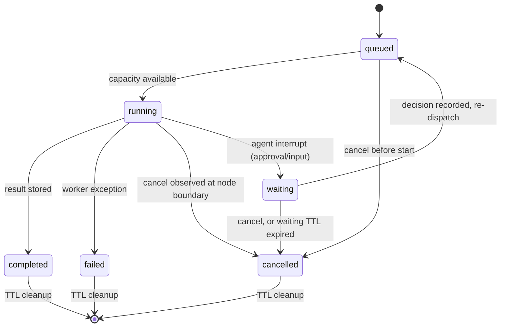

# Run events

> Files: `src/inqtrix/server/runs.py`, `src/inqtrix/server/routes.py`,
> `src/inqtrix/state.py`, `src/inqtrix/graph.py`, `src/inqtrix/agents/`

## Scope

Structured live events for native browser UIs that need progress cards, queue state, cancellation, and a final report fetch. This page covers the `/v1/runs` API. The OpenAI-compatible `/v1/chat/completions` endpoint uses OpenAI-style chunks and may additionally include Inqtrix diagnostics such as `inqtrix.model_resolution`; see [Web server mode](../deployment/webserver-mode.md).

## Endpoint model

Native runs are short-lived server resources addressed by an opaque `run_id`:

| Route | Method | Purpose |
|---|---|---|
| `/v1/runs` | POST | Create a queued research run. Accepts either `question` or OpenAI-style `messages`. Agent runs additionally accept `response_form` (`"auto"`\|`"chat"`\|`"canvas"`), `source_policy`, and the one-shot `execution_directive`; see below. Returns HTTP 202 with the run summary. |
| `/v1/runs` | GET | List visible queued, running, waiting, and retained terminal runs from the configured run store. |
| `/v1/runs/{run_id}` | GET | Fetch the current run summary. |
| `/v1/runs/{run_id}/events` | GET | Stream buffered and live events as Server-Sent Events. The server sends periodic SSE comment heartbeats (`: keepalive`) without allocating event sequences. The optional `?after=<sequence>` query parameter filters the REPLAY to events with a higher sequence (reconnect support); the live tail is unaffected. A non-integer value returns 400. With `?format=json` the SAME replay buffer returns immediately as a JSON page `{"object": "list", "data": [...], "terminal": bool}` instead of a stream — the polling fallback for clients behind SSE-buffering proxies. |
| `/v1/runs/{run_id}/children` | GET | List an agent run's direct child runs, newest first, as `{"object": "list", "data": [...]}`. Access is decided on the parent (a view share suffices); the children's own URLs stay owner-scoped. Standard runs return an empty list. |
| `/v1/runs/{run_id}/plan` | GET | The run's execution plan (latest version by default, `?version=` for older ones) with its tasks and the version history. 404 with `Noch kein Plan vorhanden` before the agent proposed one. |
| `/v1/runs/{run_id}/tasks/{task_id}/result` | GET | Lazy full Agent task result: complete `answer_markdown`, references, claims, usage/metrics, and error. The plan/overview keeps only the compact `result_summary`; no user-facing result text is truncated at persistence. |
| `/v1/runs/{run_id}/tasks/{task_id}/cancel` | POST | Cancel a pending Agent task or request cancellation for a running task. Returns the authoritative task status. Synthesis and already-terminal tasks reject incompatible cancellation with HTTP 409. |
| `/v1/runs/{run_id}/approvals` | GET | The run's approval requests, newest first. |
| `/v1/runs/{run_id}/approvals/{approval_id}` | POST | Decide one approval: `{"decision": "approve"\|"reject"\|"edit", "plan"?, "note"?}`. `edit` carries the revised plan (validated by the same deterministic rules as the planner) and appends an approved plan version. The decision and the run's `waiting -> queued` resume commit atomically; replaying the SAME decision answers 200, a different one 409 `conflict`. Owner or edit share. |
| `/v1/runs/{run_id}/clarifications` | GET | The run's clarification questions, newest first. |
| `/v1/runs/{run_id}/clarifications/{clarification_id}` | POST | Answer one clarification with exactly one of `{"answer": ...}` (whole-round free text), `{"option_id": ...}` (legacy single option), or `{"answers": {question_id: {"option_ids": [...], "text": "..."}}}` for structured rounds — the map must resolve EVERY question of the round (partial maps 400). Resumes the run like a decision. Owner or edit share. |
| `/v1/runs/{run_id}/artifacts` | GET | Artifact metadata page (no bodies), `?kind&limit&cursor` keyset pagination. |
| `/v1/runs/{run_id}/artifacts/{artifact_id}` | GET | One artifact with body, refs, and revision history; `?revision=` serves an older body. |
| `/v1/runs/{run_id}/artifacts/{artifact_id}` | PUT | Optimistic user edit: `{"content_markdown", "expected_revision"}`. 409 `conflict` with `current_revision` on a revision miss; 409 with `locked_by: "agent"` while the agent streams (`status: "writing"`). Owner or edit share. |
| `/v1/runs/{run_id}/artifacts/{artifact_id}/export` | POST | Copy the artifact into a NEW editor document (`{"target": "editor_document", "title"?, "folder_id"?}`), 201 with the document. Not idempotent — every call creates a fresh copy. 502 when editor persistence is not wired. |
| `/v1/agent-sessions*`, `/v1/agent-session-groups*` | GET/PUT/DELETE | Saved agent-desk sessions — a structural clone of the `/v1/knowledge-sessions` surface (private per user, metadata lists, load-on-open bodies, groups). |
| `/v1/agent/memory*` | GET/PATCH/POST/DELETE | Personal long-term agent memory: accepted memories, candidates, search (`GET /v1/agent/memory?q=`), clear, and feedback history. Auth derives ownership; client owner fields are rejected. |
| `/v1/agent/runs/{run_id}/feedback` | POST | Store personal run feedback (`positive`/`negative`/`neutral`, optional `reason`, optional owner-checked `memory_id`). Shared run access does not grant personal memory access. |
| `/v1/runs/{run_id}/result` | GET | Fetch the final `ResearchResult.to_export_payload()` report after completion. Agent Desk results include the same canonical `execution` block as the live snapshot; Knowledge results include the text-free `knowledge_profile`, `knowledge_gate`, `knowledge_grounding`, `knowledge_retrieval`, `knowledge_candidates`, and `knowledge_evidence_used` receipt reconstructed from the result and terminal snapshot. |
| `/v1/runs/{run_id}/cancel` | POST | Cancel a queued run or request cancellation for a running run. Cancelling an agent run cascades over its child runs. |
| `/v1/runs/{run_id}` | DELETE | Permanently delete a terminal run (owner-only); returns 409 while the run is still active. Revokes any shares on the run. To delete an active run, cancel it first, poll the summary until it turns terminal (its summary carries `cancel_requested: true` in the meantime), then delete — the reference web client automates exactly this flow. |

The opaque `run_id` identifies the job, while the server binds that job to its
tenant, workspace, owner, and optional shares. Clients address work by
`run_id`; possession of an id never grants access.

### Agent source and execution request

The additive Agent Desk contract is:

```json
{
  "question": "Who won today's final?",
  "mode": "agent_kernel",
  "source_policy": {
    "web": "available",
    "knowledge": "disabled"
  },
  "execution_directive": "quick_web",
  "response_form": "chat",
  "agent_overrides": {
    "depth": "normal",
    "model": "operator-published-model-id",
    "effort": "high"
  }
}
```

`source_policy.web` and `.knowledge` each accept `available` or `disabled`;
missing fields default to `available`, preserving old clients. The block is
valid only for agent modes. It is inherited by mission and research child runs
and enforced at planning and tool dispatch, so `disabled` means no contact with
that source rather than a UI preference.

`execution_directive` accepts `quick_web` or `knowledge_only`. Either directive
forces the registered cognitive kernel, chat output, and normal depth for that
message. `quick_web` uses only web and invokes `web.search.instant` exactly
once; `knowledge_only` permits only project-knowledge read/search (plus a
clarification when needed). A directive cannot be combined with `document_id`
or the legacy `tool_directives` field. A directive deliberately overrides a
stale submitted mode by forcing the kernel; an unsupported directive or
missing required capability fails with HTTP 400 rather than falling back.
`source_policy` without an agent mode/directive is rejected. Omission retains
the normal automatic/mission behaviour.

For `quick_web`, Standard (`balanced`) treats the explicit one-shot command as
the consent for that single external query. `strict` emits the normal tool
approval and parks before any search; approving resumes with the persisted,
reviewed query. A rejected quick-web approval completes without contacting the
provider. The query-derivation and grounded-answer calls use the request's
resolved model and reasoning effort.

## Queue and lifecycle

`RUN_MAX_CONCURRENT` (default 100) caps active native provider work; clearing
the environment variable yields that default rather than the historical
fallback to `MAX_CONCURRENT`. Additional `/v1/runs` jobs enter a bounded
FIFO queue controlled by `RUN_QUEUE_MAX_SIZE` (default 100). With the in-memory
store, terminal runs remain fetchable for `RUN_COMPLETED_TTL_SECONDS` (default
300). With the PostgreSQL run store, terminal rows, their event history, and
result payloads survive process restarts and are retained for
`RUN_POSTGRES_RETENTION_SECONDS` (default 90 days). Both stores enforce their
configured cleanup and history bounds.



The important transition is `queued -> running`: it is driven by the run store (in-memory by default; Postgres-backed with worker dispatch when the durable backends are configured), not by the client polling loop. Active jobs do not count against `RUN_QUEUE_MAX_SIZE`.

Agent runs add three non-terminal waiting statuses. `waiting_for_approval` and
`waiting_for_input` park the run (no execution slot held) until a HUMAN decision
resumes it back through `queued`. `waiting_for_children` parks it while its
child research runs execute: the store itself re-queues the parent when the
LAST child reaches a terminal state (the wake happens inside the child's
terminal transaction, so it cannot be lost), and a park that lands after the
last child already finished self-heals back to `queued` immediately. Because
the parent holds no slot while waiting, a pool smaller than one child wave
serialises the wave instead of deadlocking it. For every waiting status a
cancel ends the run (reason `cancelled_while_waiting`), or the waiting TTL
expires (default seven days) and the store auto-cancels it with the visible
reason `approval_timeout` (human waits) or `children_timeout` (children wait).
Waiting runs are excluded from orphan/stuck sweeps. Agent runs also carry
additive summary keys — `kind` (`agent` or `agent_child`), `children_url`,
`parent_run_id`, `root_run_id`, `session_id` — emitted only when non-default,
so standard run summaries keep the exact historical key set.

## Run summary

Every list/detail response returns the same summary shape:

```json
{
  "run_id": "run_abc123",
  "status": "running",
  "queue_position": null,
  "question": "What changed?",
  "stack": "default",
  "mode": "research",
  "created_at": 1760000000.0,
  "started_at": 1760000001.0,
  "finished_at": null,
  "elapsed_seconds": 12.34,
  "snapshot": {
    "current_node": "search",
    "completed_rounds": 1,
    "active_round": 2,
    "max_rounds": 4,
    "total_queries": 6,
    "total_citations": 21,
    "total_sources": 18,
    "confidence": 7,
    "source_tier_counts": {
      "primary": 2,
      "mainstream": 11,
      "stakeholder": 3,
      "unknown": 2,
      "low": 0
    },
    "source_quality_score": 0.72,
    "claim_status_counts": {
      "verified": 4,
      "contested": 1,
      "unverified": 8
    },
    "claim_quality_score": 0.5,
    "evidence_record_count": 18,
    "consolidated_claim_count": 13,
    "aspect_coverage": 0.75,
    "evidence_consistency": 7,
    "evidence_sufficiency": 6,
    "done": false,
    "progress_estimate": 0.42,
    "last_message": "Durchsuche 3 Suchanfragen (Runde 2/4)..."
  },
  "error": null,
  "events_url": "/v1/runs/run_abc123/events",
  "result_url": "/v1/runs/run_abc123/result"
}
```

`mode` is `research` for the normal graph path and `direct_llm` when the run uses the explicit direct-provider chat mode. `snapshot` is a compact derived view from `AgentState`. It deliberately omits raw provider responses, full evidence ledgers, and secrets. The source and claim quality fields are live counters for UI cards and diagnostics; the final authoritative report payload still comes from `/result`.

Agent summaries additionally expose a `timing` object with
`total_seconds`, `active_seconds`, `waiting_seconds`, `queued_seconds`,
`segment_count`, `resume_count`, and `current_segment_id`. Standard run
summaries retain their historical exact key set.

Agent summaries and state-bearing agent events add one canonical
`snapshot.execution` block with an exact, algorithm-independent key set:

```json
{
  "execution": {
    "execution_directive": "quick_web",
    "effective_mode": "agent_kernel",
    "response_form": "chat",
    "depth": "normal",
    "model": "operator-published-model-id",
    "reasoning_effort": "high",
    "source_policy": {
      "web": "available",
      "knowledge": "disabled"
    },
    "consent_reason": "explicit_directive",
    "tool_use_counts": {
      "web": 1,
      "knowledge": 0
    }
  }
}
```

All keys are present for current agent runs. Optional scalar values use the
empty string rather than disappearing. `effective_mode` is the engine that
actually executes (`agent_kernel` or `workspace_agent`), which can differ from
a stale client selection when an execution directive forces the kernel.
`source_policy` is the effective policy after the one-shot override, not the
unchanged session preference. `consent_reason` is a stable machine token such
as `explicit_directive`, `strict_approval_required`, `strict_approval`,
`strict_rejected`, `autonomous_policy`, or `permission_policy`; clients should
map known values for display and preserve unknown future values.

`tool_use_counts` counts successful source-tool invocations. Zero therefore
means “not used”, while `source_policy.*="available"` means only “allowed to
be selected”. Keep those as separate rows in audit/transparency UIs. Counts
advance after a successful capability/tool result and survive a parked kernel
resume; a quick-web completion has exactly `web: 1`, and a rejected strict
quick-web approval remains `web: 0`.

The completed `GET /v1/runs/{run_id}/result` payload copies this object to its
top-level `execution` field. Older stored results and non-agent algorithms omit
that field; clients should retain their existing compatibility view when it is
absent rather than inventing effective values.

## Event envelope

`GET /v1/runs/{run_id}/events` returns SSE frames where the event name matches `event.type`:

```text
event: inqtrix.node.started
data: {"type":"inqtrix.node.started","run_id":"run_abc123","sequence":3,"created_at":1760000002.0,"data":{"node":"plan","snapshot":{"current_node":"plan"}}}
```

Event payloads are sanitized through the same recursive drop-list used by runtime logging. Unknown event types are allowed so future UI events can be added without changing the log schema.

## Event types

| Event | When emitted | Important data |
|---|---|---|
| `inqtrix.run.queued` | Run record created or a parked run is admitted for another segment. | `status`, `queue_position`, optional `resumed`, `segment_id`, `segment_ordinal` |
| `inqtrix.run.started` | The first execution segment starts. | `status`, `snapshot`, `segment_id`, `segment_ordinal`, `reason` |
| `inqtrix.run.resumed` | A later execution segment actually starts. | `status`, `snapshot`, `segment_id`, `segment_ordinal`, `reason` |
| `inqtrix.run.snapshot` | A snapshot was updated for a state-bearing event. | `snapshot` |
| `inqtrix.progress.message` | Existing `emit_progress(...)` message fires. | `message`, `phase`, `severity`, `snapshot` |
| `inqtrix.node.model_resolution` | A node resolves its provider model and reasoning effort. | `node`, `model`, `tier`, `effort`, `model_source`, `effort_source`, `requested_tier` |
| `inqtrix.node.started` | LangGraph enters a node. | `node`, `snapshot` |
| `inqtrix.node.finished` | Node returns normally. | `node`, `snapshot` |
| `inqtrix.node.failed` | Node raises. | `node`, `snapshot` |
| `inqtrix.answer.started` | One final-answer publication begins after the empty durable answer artifact is committed as `writing`. | `artifact_id`, `publication_id`, `status=writing`, and additively since v0.2.0.8 `reference_labels` — the evidence labels this answer WILL cite, announced before the first delta so a client can render `[W1]` as its final linked form from the outset instead of rewriting the block when the references land (absent = no labels announced; a client must still accept labels it was not told about) |
| `inqtrix.output_text.delta` | Final Markdown is emitted in word-aligned chunks. | `artifact_id`, `publication_id`, UTF-8 byte `offset`, `delta` |
| `inqtrix.answer.ready` | The publication completed without a gap. | `artifact_id`, `publication_id`, `bytes`, `status=ready` |
| `inqtrix.answer.interrupted` | Publication stopped before completion. | `artifact_id`, `publication_id`, `offset`, `status=interrupted`, `stage` (`staging` / `streaming` / `finalizing` / `publishing_ready`) |
| `inqtrix.run.completed` | Result payload was stored. | `metrics`, `result_url`, `snapshot` |
| `inqtrix.run.waiting` | Agent run parked itself for an approval, user input, or its running children. | `status` (`waiting_for_approval` / `waiting_for_input` / `waiting_for_children`), `snapshot` |
| `inqtrix.run.cancel_requested` | Client requested cancellation while running. | `status`, `reason` |
| `inqtrix.run.cancelled` | Run is terminal cancelled. | `status`, `reason` (`cancelled_while_waiting` / `approval_timeout` / `children_timeout` for parked runs), `snapshot` |
| `inqtrix.run.failed` | Worker failed. | `status`, `error`, `snapshot` |

A resumed run first emits another `inqtrix.run.queued` event with
`resumed: true`; `inqtrix.run.resumed` follows only when the worker actually
starts that segment. `started_at` remains the first execution start. Agent-run
summaries expose the accumulated active, explicit-wait and resumed-queue time
in `timing`; worker reclaim does not create a false execution segment.

Knowledge runs additionally emit these typed retrieval events:

| Event | When emitted | Important data |
|---|---|---|
| `inqtrix.knowledge.retrieval.completed` | The shared retrieval implementation has produced the initial candidate set for the evidence budget. | `candidate_count`, `top_k`, `final_k`, `final_k_overridden`, `collection_document_count`, `degradations`, `warnings` |
| `inqtrix.knowledge.retrieval.degraded` | A technical vector boundary or stalled candidate page prevented the requested candidate pool from filling. Ordinary corpus exhaustion does not emit this event. | `reason`, `retrieval_mode`, `stage=vector_candidate_pool`, `requested_candidate_pool`, `returned_candidate_pool`, `final_top_k`, `returned_hits`, `final_evidence_complete`, optional `candidate_cap` |
| `inqtrix.knowledge.retrieval.warning` | Canonical hydration excluded one or more unsafe candidates. The event is a cumulative, text-free snapshot after the last retrieval, including decomposition and gate rewrites. | `code`, `reason`, `stage`, `count`, optional `recommended_action`; known codes include `chunks_require_reindex` and `chunks_pending_reconciliation` |
| `inqtrix.knowledge.answer.retry` | The first answer attempt contained quotes that failed verbatim verification; the single visible regeneration attempt is about to run. At most one per run, only for `quote_unverified` (format failures stay immediately terminal). Counter-only by design — quote texts never cross the event boundary. | `attempt` (always `2`), `quotes_total`, `quotes_unverified` |

Candidate-pool completeness and final-evidence completeness are separate
facts: a reranker may still fill every final evidence slot from a technically
under-filled pool. Each degradation is therefore also persisted in the
text-free `knowledge_retrieval.degradations` result receipt. The terminal
snapshot and `/result` export expose that same deduplicated receipt, and saved
Knowledge sessions retain it with the answer. Reconnect, reload, or export
cannot turn a visible degradation into an ordinary successful retrieval. A
transport timeout, provider retry exhaustion, gate parse fallback, or other
quality downgrade likewise remains a typed event/result marker or terminal
failure; it is never hidden behind a completed event.

Store-side source-integrity exclusions remain typed on the
`RetrievalCandidateBatch` through embedding-model fusion, decomposition
interleave, reranking and gate-rewrite merges. Their bounded public projection
is persisted in `knowledge_retrieval.warnings` and rendered through the same
warning surface as synchronous Knowledge search; no query, source id, chunk
text or excerpt is part of that receipt. `count` is consequently the number of
exclusion observations across the run's retrieval calls, not a distinct-chunk
count: without identifiers the same unsafe point returned for two queries
cannot and must not be guessed to be one unique point.

Agent control actions additionally emit signal events (rows are the truth,
clients reconcile via the GET endpoints above):

| Event | When emitted | Important data |
|---|---|---|
| `inqtrix.agent.approval.decided` | A user decided an approval. | `approval_id`, `status`, `decided_by_user_id` |
| `inqtrix.agent.clarification.answered` | A user answered a clarification. | `clarification_id` |
| `inqtrix.agent.limit.reached` | A deterministic tool/step/token ceiling was reached. Recoverable ceilings park the run instead of silently returning a partial answer. | `kind`, `used`, `limit`, `ceiling`, `state`, supported `actions` |
| `inqtrix.agent.limit.decided` | The user explicitly chose a terminal partial answer or cancellation after a recoverable limit. | `clarification_id`, `kind`, `decision` |
| `inqtrix.agent.artifact.created` | An agent artifact was committed for the first time. For an answer this precedes `answer.started` and exposes only an empty `writing` body. All agent-side emitters share one payload builder. | `artifact_id`, `kind`, `revision`, `title`, `status`, `updated_by`, `from_revision`, and additively since v0.2.0.8 the write's line delta `lines_added`/`lines_removed` (absent = honestly not counted, e.g. events from before the change or the size guard) |
| `inqtrix.agent.artifact.updated` | An artifact revision advanced: agent-side writes (kernel `write_canvas`, mission memo flush, the deep-revision batch — previously silent) emit the shared agent payload; a user content PUT emits a deliberately kind-less signal (`artifact_id`, `revision`, `updated_by` only — it must never render as a file chip); a user rename adds `title` and `renamed: true` at an UNCHANGED revision. | agent writes: same columns as `created`; user PUT: `artifact_id`, `revision`, `updated_by`; rename: + `title`, `renamed` |
| `inqtrix.agent.citation.validation` | A final kernel chat answer contained unknown citation labels and completed its single bounded repair decision. | `status` (`repaired` / `degraded`), `unknown_labels`, `resolution` |
| `inqtrix.agent.artifact.edit_conflict` | A follow-up turn found the session memo edited by the user since it read it (E13); the agent preserved that text and appended its update instead of overwriting. The client refetches the reconciled memo. | `artifact_id`, `kind` |
| `inqtrix.agent.patch.proposed` | The agent proposed an editor patch (M7); the always-gated patch approval follows. | `patch_id`, `document_id`, `artifact_id`, `edit_count` |
| `inqtrix.agent.canvas_context.attached` | Emitted exactly once per kernel run that carried a canvas attachment (P9d) — the durable transcript record of which comments rode the submission (run summaries deliberately never carry the canvas context). Comment text travels in full; the quote is a visibly shortened 120-char preview whose full text stays reachable via the document. | `artifact_id`, `revision`, `comments[]` (`comment`, `quote_preview`) |

The cognitive kernel (`mode=agent_kernel`) additionally
emits `inqtrix.agent.tool.started` (`tool`, `tool_call_id`, redacted
`args_preview`), `inqtrix.agent.tool.finished` (`tool`, `tool_call_id`,
`status`, `result_preview`, and additively since v0.2.0.8 a `snapshot`
carrying the complete canonical triple `{current_node, phase,
execution}` described under "Run summary" — built at the tool boundary,
so limit readouts advance per finished tool instead of only per phase
change; both the graph lane and the quick-web lane attach it),
`inqtrix.agent.todo.updated` (the
`write_todos` task list as `{content, status}` items), and
`inqtrix.agent.narration` with content-hash ids (`kernel_<sha1[:8]>`,
kind `intent` — the model's one-sentence intent line before tool
calls); plus `phase.changed` (`execution` -> `done`) for timeline
compatibility. A successful `load_skill` call emits
`inqtrix.agent.skill.loaded` (`skill_id`, `label`) — the visible
counterpart of the tool-limit narrowing it applies. In Deep mode the
verification pass reports as one narration with
`narration_id=kernel_deep_review` (finding count or "keine Befunde")
plus an `inqtrix.node.model_resolution` event for the
`agent_deep_review` node.

The enforced quick-web lane uses the same kernel tool events with
`tool="web_instant"` and `tool_call_id="quick_web"`. It emits one started and
one successful finished event around the single capability invocation. A
visible `inqtrix.agent.quick_web.fallback` event is emitted when query parsing
falls back to the original question (`stage="query"`) or an empty synthesis
falls back to the grounded provider answer (`stage="answer"`); neither
fallback adds another search. Its `inqtrix.agent.phase.changed` snapshots
carry the canonical `execution` projection described above, so clients can
distinguish the source being available from the source actually being used.

The agent runtime (mode `workspace_agent`) additionally emits
`inqtrix.agent.phase.changed`, `plan.proposed`/`plan.revised`,
`approval.requested`, `clarification.requested`, `task.started`/
`task.cancel_requested`/`task.finished`/`task.failed`, `child.progress` (projected onto the parent
stream from child snapshots, messages, and terminal states),
`artifact.created`, `activity`, `narration`, and per-node
`inqtrix.node.model_resolution` — see
[Agent platform](../architecture/agent-platform.md).

`inqtrix.agent.activity` is the compact live-status channel for
short-lived runtime facts (rendered as the one-line status readout). Source
operations add the stable fields `scope` (`discovery` or `task`), `operation`,
`status` (`started`, `completed`, or `failed`), and optional `task_id`, `query`,
`purpose`, `current`, `total`, `metrics`, `attempt`, `error`, and `fallback`.
The primary UI translates and aggregates stable operation codes such as
`knowledge.collections.list`, `knowledge.search`, and `web.search.instant`;
the technical detail keeps every individual event and unknown code visible.
Events bracket the real operation rather than announcing an entire batch
before work starts. Additively since v0.2.0.8 the kernel brackets every
model turn as `operation="agent.model.turn"` with the constant
`activity_id="model-turn"` (`kind="working"`, `scope="run"`), so clients
upsert ONE live row per run that flips `started` -> `completed` instead of
stacking a row per turn; the previously silent model boundary — the
kernel's longest event-free stretch — becomes visible.

Independent tasks emit their terminal task/activity projection as each future
finishes, even when a slower sibling remains active in the same wave. The
topological scheduler still advances to dependent work only after the wave is
complete; completion-order telemetry therefore improves liveness without
changing dependency semantics.

The parent `inqtrix.agent.child.progress` projection carries `task_id`,
`child_run_id`, `run_status`, the latest real `current_node`, a sanitized
message/error, metrics, attempt, and update time. An identity-only child-start
event has no current node and means "preparing"; clients must never infer the
terminal `answer` phase from a missing snapshot. The parent stream powers the
overview, while a selected child may replay its own run stream for detailed
diagnostics.

Current additional `kind` values include `searching`, `memory`,
`memory_unavailable`, `memory_candidate`, `memory_conflict`,
`critic_research`, and `critic_research_exhausted`. `memory_conflict`
means the critic found a contradiction between non-citable memory
context and current evidence; the evidence remains authoritative.

`inqtrix.agent.narration` is the user-facing narration channel: short
German prose paragraphs derived deterministically from artifacts the run
already produced (discovery result, plan summary, task outcomes, memo
outline/sections) — never a raw chain of thought, and no extra LLM call.
Payload: `narration_id`, `kind` (`discovery` / `plan` / `task` /
`synthesis` / `conclusion`), `text`, `phase`, `final`. `narration_id` is
STABLE per emission site (e.g. `n-plan-2`, `n-task-t1`, `n-section-0`):
a checkpointed node that re-executes (critic replan loop) re-emits the
same id with a fresh sequence, and clients upsert by `narration_id`
instead of appending a duplicate line. The payload passes a strict
sanitizer allowlist (exactly the fields above).

The final answer body never uses the narration channel. The server first
persists an empty `writing` answer artifact, then emits `answer.started` and
the contiguous deltas. Immediately before `answer.ready`, the same artifact is
CAS-finalized with the complete Markdown and the exact reference list exported
in the run result. Clients render only contiguous deltas for the matching
publication id through the shared Markdown renderer and refetch the
authoritative artifact on `ready` or `interrupted`; they never infer a complete
answer from an artifact signal alone.

Decision/answer signals are emitted while the run is still parked, so they
PRECEDE the resumed `inqtrix.run.queued` event. They are optimistic: in the
rare race of two conflicting decisions, the loser's signal can remain in
the log although its decision was rejected with 409 — clients must treat
these events as refresh hints and read the approval state via GET. The event log of a run ends
with its terminal event: signals for already-finished runs (e.g. an
artifact edit after completion) are dropped with a warning — clients of
finished runs reconcile via the GET endpoints, never the closed stream.
Agent-side events (`plan.proposed`, `task.*`, `artifact.created`,
`phase.changed`) arrive with the agent runtime itself.

User actions on agent runs are audited as `agent.approval_decided`,
`agent.clarification_answered`, `agent.artifact_edited`, and
`agent.artifact_exported` (audit `actor_type` stays `user`). The runtime's
OWN writes use `actor_type: agent` with the effective actor as
`actor_user_id` (E6): a
document-targeted run records `editor.patch_proposed` when it proposes
edits (M7), alongside the user's `editor.patch_applied` /
`editor.patch_rejected` on the decision.

Terminal events are `inqtrix.run.completed`, `inqtrix.run.failed`, and `inqtrix.run.cancelled`. A browser can close its SSE connection after receiving one of those.

Background knowledge indexing operations use the same endpoint and event model
on a parallel surface: `GET
/v1/knowledge/indexing-jobs/{job_id}/events`. The operation summary identifies
`operation_kind` as `collection_generation` or `document_revision`; both use
the shared durable queue, checkpoint, cancellation, and replay contract. The
stream includes `inqtrix.index.{queued,started,phase,progress,
document_completed,context_batch_completed,cancel_requested,paused_dependency,
paused_validation,resumed,completed,ready_raw_by_user_choice,superseded,failed,
cancelled}`. Progress snapshots contain real phases and known counters rather
than invented percentages. A dependency timeout or validation failure pauses
the operation visibly and leaves the active generation unchanged. Paused and
other non-terminal jobs are never failed by the terminal-history TTL or an
implicit maximum age. Continuing without contextualization requires the
explicit raw-build decision. Queue-backed recovery re-enqueues stale queued
rows and reclaims abandoned running/cancelling deliveries under a new attempt
fence. A no-queue restart reconstructs paused execution from the durable
operation identity before emitting `resumed`; an unsafe reconstruction returns
`resume_unavailable` without changing the status or checkpoint. In the durable
backend the jobs use a separate Valkey stream consumed by the same
`inqtrix-worker` — see [Web server mode](../deployment/webserver-mode.md).

Cancellation is a two-step lifecycle for running jobs. `POST
/v1/runs/{run_id}/cancel` returns the current summary, but a running summary can
still have `status="running"` because the cancel request is observed at the
run's next cancellation checkpoint. While the cancel is pending, the summary
additionally carries `cancel_requested: true` (emitted only in that state, so
historical summaries are unchanged). The intermediate
`inqtrix.run.cancel_requested` event tells clients that the request was
accepted; it is not terminal and should not move a card to the cancelled
bucket. Only `inqtrix.run.cancelled` or a summary with `status="cancelled"`
should do that. Queued jobs can skip the intermediate event and become
cancelled immediately.

Checkpoints are dense: besides the node boundaries, every provider retry
ladder checks before each attempt and during backoff sleeps, the search and
claim-extraction fan-outs abandon queued calls (visible as a warning progress
message plus the `cancel_abandoned_work` iteration-log marker with
`abandoned`/`in_flight`/`total` counts), and answer composition stops between
report sections. Typical time from cancel request to the terminal event is
therefore a few seconds; the residual worst case is the remainder of ONE
in-flight provider HTTP attempt (bounded by its transport timeout).

`inqtrix.progress.message` is the user-facing agent protocol. Native UIs should
prefer these messages for visible timelines because they match the terminal
progress wording (`Analysiere Frage...`, `Plane Suchanfragen...`, source/claim
quality summaries, report-section synthesis, warnings). Technical events such
as `inqtrix.run.snapshot`, `inqtrix.node.started`, `inqtrix.node.finished`, and
`inqtrix.output_text.delta` are still useful for state patches and diagnostics,
but should not be shown as primary user-facing steps. The progress event
`severity` is currently `info`, `warning`, `success`, or `error`; warnings cover
fallbacks, context-window notices, violated evidence contracts, and other
messages that should be highlighted compactly in cards without moving them into
duration or queue metadata. Native UIs may store an optional normalized phase
beside each visible event (`analysis`, `planning`, `search`, `evaluation`, or
`answer`) for compact phase visualizations. If that field is absent, clients
should derive the phase from `data.phase`, `snapshot.current_node`, or the known
progress-message wording instead of introducing a separate timeline structure.

When a UI persists completed reports, it should keep the visible event records
as the report's agent protocol. In the React Research Desk project format those
records live in the completed run Markdown frontmatter under `events`; there is
no separate `agent_steps` field. Importers should tolerate older records without
`kind`, `severity`, or `phase` and default missing classification fields
defensively.

## Example client flow

```bash
run_id=$(
  curl -s http://localhost:5100/v1/runs \
    -H "Content-Type: application/json" \
    -d '{"question":"Which providers meet the 2026 sovereignty requirements?"}' \
  | jq -r .run_id
)

curl -N "http://localhost:5100/v1/runs/${run_id}/events"
curl "http://localhost:5100/v1/runs/${run_id}/result"
```

For a React UI, create the run first, render the returned summary as a card,
stream `events_url`, patch the card with every `snapshot`, append visible
timeline rows only from user-facing progress and terminal/error events, then
fetch `result_url` after the terminal event. Completed runs should move to the
`completed` UI status only after the terminal event or a completed summary. The
Markdown report, `top_sources`, `references`, `top_claims`, final metrics,
`usage`, and optional Agent Desk `execution` should be attached to the same run record after
`GET /v1/runs/{run_id}/result` succeeds. The same visible timeline should remain
available from the completed report view so users can audit the agent's path
after the live run is gone.

When `INQTRIX_SERVER_API_KEY` is enabled, prefer a fetch-based SSE client because the browser `EventSource` API cannot attach an `Authorization` header. The endpoint already accepts `Authorization: Bearer ...`; the browser API is the limiting piece. Native `EventSource` is only appropriate when auth is off or a same-site proxy/cookie layer handles auth before the request reaches Inqtrix.

```js
const response = await fetch(`${baseUrl}${eventsUrl}`, {
  headers: { Authorization: `Bearer ${apiKey}` },
});

const reader = response.body
  .pipeThrough(new TextDecoderStream())
  .getReader();
let buffer = "";

for (;;) {
  const { value, done } = await reader.read();
  if (done) break;
  buffer += value;
  const frames = buffer.split("\n\n");
  buffer = frames.pop() ?? "";

  for (const frame of frames) {
    const event = frame.match(/^event: (.+)$/m)?.[1];
    const data = frame.match(/^data: (.+)$/m)?.[1];
    if (!event || !data) continue;
    handleRunEvent(event, JSON.parse(data));
  }
}
```

## Related docs

- [Web server mode](../deployment/webserver-mode.md)
- [Progress events](progress-events.md)
- [Result schema](../architecture/result-schema.md)
- [Debugging runs](debugging-runs.md)
