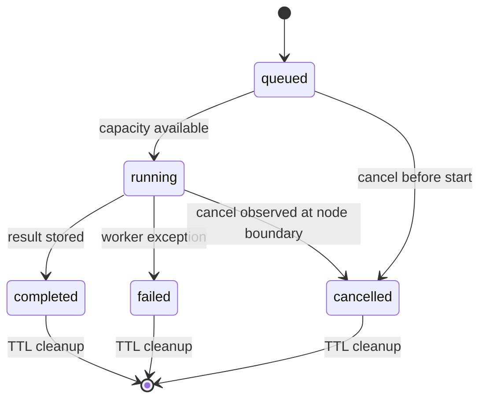

# Run events

> Files: `src/inqtrix/server/runs.py`, `src/inqtrix/server/routes.py`, `src/inqtrix/state.py`, `src/inqtrix/graph.py`

## Scope

Structured live events for native browser UIs that need progress cards, queue state, cancellation, and a final report fetch. This page covers the `/v1/runs` API. The OpenAI-compatible `/v1/chat/completions` endpoint uses OpenAI-style chunks and may additionally include Inqtrix diagnostics such as `inqtrix.model_resolution`; see [Web server mode](../deployment/webserver-mode.md).

## Endpoint model

Native runs are short-lived server resources addressed by an opaque `run_id`:

| Route | Method | Purpose |
|---|---|---|
| `/v1/runs` | POST | Create a queued research run. Accepts either `question` or OpenAI-style `messages`. Returns HTTP 202 with the run summary. |
| `/v1/runs` | GET | List queued, running, and short-lived terminal runs currently in memory. |
| `/v1/runs/{run_id}` | GET | Fetch the current run summary. |
| `/v1/runs/{run_id}/events` | GET | Stream buffered and live events as Server-Sent Events. |
| `/v1/runs/{run_id}/result` | GET | Fetch the final `ResearchResult.to_export_payload()` report after completion. |
| `/v1/runs/{run_id}/cancel` | POST | Cancel a queued run or request cancellation for a running run. |

The `run_id` identifies the job, not a user. Future authentication can add a user or tenant owner beside it; clients should still address work by `run_id`.

## Queue and lifecycle

`RUN_MAX_CONCURRENT` caps active native provider work when set; otherwise native runs reuse `MAX_CONCURRENT`. Additional `/v1/runs` jobs enter a bounded FIFO queue controlled by `RUN_QUEUE_MAX_SIZE` (default 50). Terminal runs stay in memory for `RUN_COMPLETED_TTL_SECONDS` (default 300) so a UI can fetch the report after the terminal event. Persistence across refreshes beyond that window is intentionally left to a future database adapter.



The important transition is `queued -> running`: it is driven by the in-memory `RunStore`, not by the client polling loop. Active jobs do not count against `RUN_QUEUE_MAX_SIZE`.

## Run summary

Every list/detail response returns the same summary shape:

```json
{
  "run_id": "run_abc123",
  "status": "running",
  "queue_position": null,
  "question": "What changed?",
  "stack": "default",
  "mode": "research",
  "created_at": 1760000000.0,
  "started_at": 1760000001.0,
  "finished_at": null,
  "elapsed_seconds": 12.34,
  "snapshot": {
    "current_node": "search",
    "completed_rounds": 1,
    "active_round": 2,
    "max_rounds": 4,
    "total_queries": 6,
    "total_citations": 21,
    "total_sources": 18,
    "confidence": 7,
    "source_tier_counts": {
      "primary": 2,
      "mainstream": 11,
      "stakeholder": 3,
      "unknown": 2,
      "low": 0
    },
    "source_quality_score": 0.72,
    "claim_status_counts": {
      "verified": 4,
      "contested": 1,
      "unverified": 8
    },
    "claim_quality_score": 0.5,
    "evidence_record_count": 18,
    "consolidated_claim_count": 13,
    "aspect_coverage": 0.75,
    "evidence_consistency": 7,
    "evidence_sufficiency": 6,
    "done": false,
    "progress_estimate": 0.42,
    "last_message": "Durchsuche 3 Suchanfragen (Runde 2/4)..."
  },
  "error": null,
  "events_url": "/v1/runs/run_abc123/events",
  "result_url": "/v1/runs/run_abc123/result"
}
```

`mode` is `research` for the normal graph path and `direct_llm` when the run uses the explicit direct-provider chat mode. `snapshot` is a compact derived view from `AgentState`. It deliberately omits raw provider responses, full evidence ledgers, and secrets. The source and claim quality fields are live counters for UI cards and diagnostics; the final authoritative report payload still comes from `/result`.

## Event envelope

`GET /v1/runs/{run_id}/events` returns SSE frames where the event name matches `event.type`:

```text
event: inqtrix.node.started
data: {"type":"inqtrix.node.started","run_id":"run_abc123","sequence":3,"created_at":1760000002.0,"data":{"node":"plan","snapshot":{"current_node":"plan"}}}
```

Event payloads are sanitized through the same recursive drop-list used by runtime logging. Unknown event types are allowed so future UI events can be added without changing the log schema.

## Event types

| Event | When emitted | Important data |
|---|---|---|
| `inqtrix.run.queued` | Run record created. | `status`, `queue_position` |
| `inqtrix.run.started` | Worker thread starts. | `status`, `snapshot` |
| `inqtrix.run.snapshot` | A snapshot was updated for a state-bearing event. | `snapshot` |
| `inqtrix.progress.message` | Existing `emit_progress(...)` message fires. | `message`, `phase`, `severity`, `snapshot` |
| `inqtrix.node.model_resolution` | A node resolves its provider model and reasoning effort. | `node`, `model`, `tier`, `effort`, `model_source`, `effort_source`, `requested_tier` |
| `inqtrix.node.started` | LangGraph enters a node. | `node`, `snapshot` |
| `inqtrix.node.finished` | Node returns normally. | `node`, `snapshot` |
| `inqtrix.node.failed` | Node raises. | `node`, `snapshot` |
| `inqtrix.output_text.delta` | Final answer text is emitted in word-aligned chunks. | `delta` |
| `inqtrix.run.completed` | Result payload was stored. | `metrics`, `result_url`, `snapshot` |
| `inqtrix.run.cancel_requested` | Client requested cancellation while running. | `status`, `reason` |
| `inqtrix.run.cancelled` | Run is terminal cancelled. | `status`, `reason`, `snapshot` |
| `inqtrix.run.failed` | Worker failed. | `status`, `error`, `snapshot` |

Terminal events are `inqtrix.run.completed`, `inqtrix.run.failed`, and `inqtrix.run.cancelled`. A browser can close its SSE connection after receiving one of those.

Cancellation is a two-step lifecycle for running jobs. `POST
/v1/runs/{run_id}/cancel` returns the current summary, but a running summary can
still have `status="running"` because the cancel request is observed at the next
agent node boundary. The intermediate `inqtrix.run.cancel_requested` event tells
clients that the request was accepted; it is not terminal and should not move a
card to the cancelled bucket. Only `inqtrix.run.cancelled` or a summary with
`status="cancelled"` should do that. Queued jobs can skip the intermediate
event and become cancelled immediately.

`inqtrix.progress.message` is the user-facing agent protocol. Native UIs should
prefer these messages for visible timelines because they match the terminal
progress wording (`Analysiere Frage...`, `Plane Suchanfragen...`, source/claim
quality summaries, report-section synthesis, warnings). Technical events such
as `inqtrix.run.snapshot`, `inqtrix.node.started`, `inqtrix.node.finished`, and
`inqtrix.output_text.delta` are still useful for state patches and diagnostics,
but should not be shown as primary user-facing steps. The progress event
`severity` is currently `info`, `warning`, `success`, or `error`; warnings cover
fallbacks, context-window notices, violated evidence contracts, and other
messages that should be highlighted compactly in cards without moving them into
duration or queue metadata. Native UIs may store an optional normalized phase
beside each visible event (`analysis`, `planning`, `search`, `evaluation`, or
`answer`) for compact phase visualizations. If that field is absent, clients
should derive the phase from `data.phase`, `snapshot.current_node`, or the known
progress-message wording instead of introducing a separate timeline structure.

When a UI persists completed reports, it should keep the visible event records
as the report's agent protocol. In the React Research Desk project format those
records live in the completed run Markdown frontmatter under `events`; there is
no separate `agent_steps` field. Importers should tolerate older records without
`kind`, `severity`, or `phase` and default missing classification fields
defensively.

## Example client flow

```bash
run_id=$(
  curl -s http://localhost:5100/v1/runs \
    -H "Content-Type: application/json" \
    -d '{"question":"Which providers meet the 2026 sovereignty requirements?"}' \
  | jq -r .run_id
)

curl -N "http://localhost:5100/v1/runs/${run_id}/events"
curl "http://localhost:5100/v1/runs/${run_id}/result"
```

For a React UI, create the run first, render the returned summary as a card,
stream `events_url`, patch the card with every `snapshot`, append visible
timeline rows only from user-facing progress and terminal/error events, then
fetch `result_url` after the terminal event. Completed runs should move to the
`completed` UI status only after the terminal event or a completed summary. The
Markdown report, `top_sources`, `references`, `top_claims`, final metrics, and
`usage` should be attached to the same run record after
`GET /v1/runs/{run_id}/result` succeeds. The same visible timeline should remain
available from the completed report view so users can audit the agent's path
after the live run is gone.

When `INQTRIX_SERVER_API_KEY` is enabled, prefer a fetch-based SSE client because the browser `EventSource` API cannot attach an `Authorization` header. The endpoint already accepts `Authorization: Bearer ...`; the browser API is the limiting piece. Native `EventSource` is only appropriate when auth is off or a same-site proxy/cookie layer handles auth before the request reaches Inqtrix.

```js
const response = await fetch(`${baseUrl}${eventsUrl}`, {
  headers: { Authorization: `Bearer ${apiKey}` },
});

const reader = response.body
  .pipeThrough(new TextDecoderStream())
  .getReader();
let buffer = "";

for (;;) {
  const { value, done } = await reader.read();
  if (done) break;
  buffer += value;
  const frames = buffer.split("\n\n");
  buffer = frames.pop() ?? "";

  for (const frame of frames) {
    const event = frame.match(/^event: (.+)$/m)?.[1];
    const data = frame.match(/^data: (.+)$/m)?.[1];
    if (!event || !data) continue;
    handleRunEvent(event, JSON.parse(data));
  }
}
```

## Related docs

- [Web server mode](../deployment/webserver-mode.md)
- [Progress events](progress-events.md)
- [Result schema](../architecture/result-schema.md)
- [Debugging runs](debugging-runs.md)
