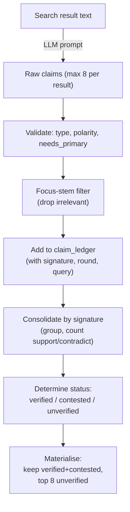

# Claims

> Files: `strategies/_claim_extraction.py` (`LLMClaimExtractor`), `strategies/_claim_consolidation.py` (`DefaultClaimConsolidator`)

## Scope

How Inqtrix extracts structured claims from search results, deduplicates them across rounds, assigns a verified / contested / unverified status, and computes the aggregate claim-quality score.

## Claim lifecycle



## Claim schema

```json
{
  "claim_text": "Precise, atomic statement",
  "claim_type": "fact | actor_claim | forecast",
  "polarity": "affirmed | negated",
  "needs_primary": true,
  "source_urls": ["https://..."],
  "published_date": "YYYY-MM-DD or unknown"
}
```

Post-parse normalisation:

- Actor-verb regex may reclassify `"fact"` to `"actor_claim"` when speech verbs are found.
- `needs_primary` is set or confirmed by a primary-hint regex when the LLM omits or underestimates it.
- `source_urls` are normalised and allow-listed against the citations already attached to the same search result; stray URLs are dropped.
- Non-fatal provider errors are tolerated: the search result stays in the loop even when no structured claim is produced for it (iteration-log marker `_claim_extraction_fallback`).
- Each result keeps at most 8 claims.

## Signature-based deduplication

1. Tokenise claim text via regex (`[a-zA-Z0-9äöüÄÖÜß]+`, lowercase).
2. Remove tokens shorter than 3 characters.
3. Remove negation tokens (`kein`, `keine`, `keinen`, `keinem`, `keiner`, `nicht`, `ohne`, `no`, `not`, `never`, `none`, `without`).
4. Remove German and English stopwords (75 unique words).
5. Fallback: if all tokens were removed, keep tokens minus negations only.
6. Keep the first 16 tokens in order, join with spaces → signature string.

Claims with the same signature but different polarity are detected as a conflict and receive `status = contested`.

## Claim-ledger cap

The ledger grows across rounds. To keep prompt size and RAM stable, it is capped at **400 entries** during research — if exceeded, only the most recent 400 are retained. Per-session storage uses a tighter cap of 50 entries (configurable via `SESSION_MAX_CLAIM_LEDGER`).

## Status determination

Applied in order; the first matching rule wins:

| Condition | Status |
|-----------|--------|
| `support > 0` AND `contradict > 0` | `contested` |
| `needs_primary` AND no primary source | `unverified` |
| `support >= 2` AND (primary OR mainstream OR stakeholder) | `verified` |
| `support >= 1` AND (primary OR mainstream) | `verified` |
| Otherwise | `unverified` |

## Claim-quality score

```
q_claim = (|verified| + 0.5 * |contested|) / |total|
```

Range: 0.0 (no verified or contested claims) to 1.0 (every claim verified). The score is recomputed in `search`, `evaluate`, and `answer`; it feeds several caps in [Stop criteria](stop-criteria.md).

## Materialisation for the answer prompt

`materialize(consolidated)` prunes noise before the answer prompt is built:

- keep all `verified` claims,
- keep all `contested` claims,
- keep up to 8 `unverified` claims, ranked by support count and source tier.

`select_answer_citations(consolidated, all_citations, max_items)` picks the URLs the answer LLM is allowed to cite; the same function is the source of truth for the `top_sources`-field of the [result schema](../architecture/result-schema.md).

## Extending claim extraction

The default extractor is LLM-based (`LLMClaimExtractor`). Common customisations:

- **Swap the extraction prompt** — subclass `LLMClaimExtractor` and override the prompt builder. The output contract (the JSON schema above) must stay the same.
- **Plug in a rule-based extractor** — implement `ClaimExtractionStrategy.extract()` and pass an instance to `AgentConfig`. You are responsible for returning claims that match the schema.
- **Change the consolidation heuristics** — subclass `DefaultClaimConsolidator` or reimplement `ClaimConsolidationStrategy`. The nodes only call `consolidate`, `materialize`, and `select_answer_citations`; internal helpers (`claim_signature`, `claim_matches_focus_stems`) are reusable.

See [Strategies](../architecture/strategies.md) for the ABC contracts.

## Related docs

- [Source tiering](source-tiering.md)
- [Aspect coverage](aspect-coverage.md)
- [Stop criteria](stop-criteria.md)
- [Nodes](../architecture/nodes.md)
