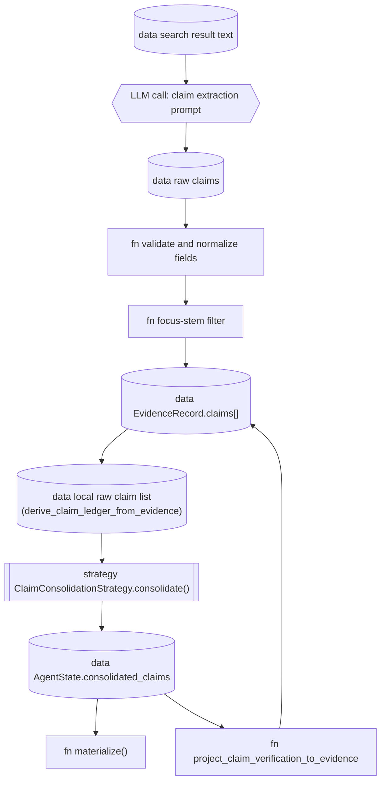

# Claims

> Files: `strategies/_claim_extraction.py` (`LLMClaimExtractor`), `strategies/_claim_consolidation.py` (`DefaultClaimConsolidator`)

## Scope

How Inqtrix extracts structured claims from search results, deduplicates them across rounds, assigns a verified / contested / unverified status, and computes the aggregate claim-quality score.

## Claim lifecycle

This diagram answers: "How does free text from a search result become a
verified or contested claim?" The first transition is usually an LLM call; the
remaining transitions are deterministic validation, filtering, and
consolidation.


```mermaid
flowchart TD
    Text[("data search result text")]
    Extract{{"LLM call: claim extraction prompt"}}
    Raw[("data raw claims")]
    Validate["fn validate and normalize fields"]
    Focus["fn focus-stem filter"]
    InEvidence[("data EvidenceRecord.claims[]")]
    Local[("data local raw claim list<br/>(derive_claim_ledger_from_evidence)")]
    Consolidate[["strategy ClaimConsolidationStrategy.consolidate()"]]
    Claims[("data AgentState.consolidated_claims")]
    Project["fn project_claim_verification_to_evidence"]
    Materialize["fn materialize()"]

    Text --> Extract --> Raw --> Validate --> Focus --> InEvidence
    InEvidence --> Local --> Consolidate --> Claims --> Materialize
    Claims --> Project --> InEvidence
```

Key transitions:

- `LLMClaimExtractor` asks for atomic JSON claims per source.
- Validation prevents unsupported URLs and malformed fields from entering
  the ledger.
- Claims are attached to their `EvidenceRecord.claims[]` -- the primary
  truth. The "raw claim list" is a local variable in `search()` derived via
  `derive_claim_ledger_from_evidence()`; it is **not** persisted on
  `AgentState`.
- `consolidate()` groups raw claims by signature and assigns a `status`
  (`verified` / `contested` / `unverified`) plus a more specific
  `verification_basis` (see [Status determination](#status-determination)).
- `project_claim_verification_to_evidence()` writes the verification fields
  back onto each matching `record.claims[n]`, so the EvidenceLedger is
  self-describing.

## Claim schema

This is the extractor output shape before it is projected into
`EvidenceRecord.claims[]`.

```json
{
  "claim_text": "Precise, atomic statement",
  "claim_type": "fact | actor_claim | forecast",
  "polarity": "affirmed | negated",
  "needs_primary": true,
  "source_urls": ["https://..."],
  "published_date": "YYYY-MM-DD or unknown"
}
```

Post-parse normalisation:

- Actor-verb regex may reclassify `"fact"` to `"actor_claim"` when speech verbs are found.
- `needs_primary` is set or confirmed by a primary-hint regex when the LLM omits or underestimates it.
- `source_urls` are normalised and allow-listed against the citations already attached to the same search result; stray URLs are dropped.
- Non-fatal provider errors are tolerated: the search result stays in the loop even when no structured claim is produced for it (iteration-log marker `_claim_extraction_fallback`).
- Each result keeps at most 8 claims.

## Signature-based deduplication

1. Tokenise claim text via regex (`[a-zA-Z0-9äöüÄÖÜß]+`, lowercase).
2. Remove tokens shorter than 3 characters.
3. Remove negation tokens (`kein`, `keine`, `keinen`, `keinem`, `keiner`, `nicht`, `ohne`, `no`, `not`, `never`, `none`, `without`).
4. Remove German and English stopwords (75 unique words).
5. Fallback: if all tokens were removed, keep tokens minus negations only.
6. Keep the first 16 tokens in order, join with spaces → signature string.

Claims with the same signature but different polarity are detected as a conflict and receive `status = contested`.

## Materialisation caps

The local raw claim list (derived per round from `EvidenceRecord.claims[]`)
is not persisted. The persisted `consolidated_claims` list is materialised
through `materialize()` with profile caps:

- `materialize_max_total` -- 24 (COMPACT) / 48 (DEEP) consolidated claims
  total.
- `materialize_max_unverified` -- 8 (COMPACT) / 48 (DEEP) of those may be
  unverified.

This cap is a **loop view**, not a report breadth: the answer composer
reads from the EvidenceLedger overview, not from this list.

## Status determination

Source: `DefaultClaimConsolidator.consolidate()` in
`src/inqtrix/strategies/_claim_consolidation.py`. The branches below are
applied in order; the first matching rule wins. The right-hand `basis`
column is what gets stored on the consolidated claim's `verification_basis`
field; it is the more precise signal of *why* a claim is verified or
unverified.

| Branch condition | `status` | `verification_basis` | Example |
|---|---|---|---|
| Affirmed and negated members coexist | `contested` | `contested` | provider-grounded results make opposing claims |
| At least one affirmed primary-tier source exists | `verified` | `verified_primary` | an official or regulator URL returned by the provider |
| At least two affirmed, non-low domains support the claim | `verified` | `verified_cross_checked` | two independent provider-grounded results support the same value |
| At least two evidence records from two quality-tier domains support the claim | `verified` | `verified_cross_checked` | two separately grounded reports agree |
| At least two affirmed supports include a primary, mainstream, or stakeholder source | `verified` | `verified_cross_checked` | repeated provider evidence agrees |
| One affirmed primary or mainstream source exists | `verified` | `verified_quality_source` | one provider-grounded institutional or editorial source |
| `needs_primary=True` without a primary-tier source | `unverified` | `missing_primary_source` | a central number has only unknown, stakeholder, or low-tier support |
| Otherwise | `unverified` | `weak_evidence` | evidence is too shallow |

Source tiers remain discovery, ranking, and source-quality signals. They do
not admit or reject a provider result. Unknown publishers remain in the
ledger and reach synthesis; a single unknown source is merely insufficient to
mark a central claim verified.

`needs_primary` is an evidence-depth signal for factual claims. The
`verified_quality_source` basis is still tracked by the depth-gap diagnostic
and cross-check planner because one grounded quality source is useful but not
corroboration (see
[stop-criteria.md](stop-criteria.md#evidence-depth-gap) and
[calculation-overview.md](calculation-overview.md)).

## Claim-quality score

Source: `quality_metrics()` in
`src/inqtrix/strategies/_claim_consolidation.py`. The score is evidence-
depth weighted; each consolidated claim contributes one weight to the
average, depending on its `status` and `verification_basis`:

| `status` / `verification_basis` | Weight |
|---|---:|
| `verified_cross_checked` | `1.0` |
| `verified_primary` | `0.9` |
| `verified` (other basis, fallback) | `0.8` |
| `verified_quality_source` | `0.7` |
| `contested` | `0.5` |
| `unverified` (any basis) | `0.0` |

Formula: `claim_quality_score = sum(weights) / len(consolidated_claims)`,
rounded to 3 decimals.

**Worked example.** Five consolidated claims:

```text
claim_1: verified, verified_cross_checked    -> 1.0
claim_2: verified, verified_primary          -> 0.9
claim_3: verified, verified_quality_source   -> 0.7
claim_4: contested                           -> 0.5
claim_5: unverified, weak_evidence           -> 0.0
                                       sum    = 3.1
                                       avg    = 3.1 / 5 = 0.62
```

Range: 0.0 (no verified or contested claims) to 1.0 (every materialized
claim is independently cross-checked). A report whose verified claims are
mostly single-source `verified_quality_source` claims therefore cannot get
a perfect claim-quality score -- that is by design, so the score reflects
evidence depth, not just verification status. The score is computed in
`search` after claim consolidation; `evaluate` and `answer` read the
stored value. It feeds several caps in [Stop criteria](stop-criteria.md).

## Materialisation for the loop view

`materialize(consolidated)` prunes noise before the consolidated list is
persisted on `AgentState`:

- keep all `verified` claims,
- keep all `contested` claims,
- keep profile-specific `unverified` claims, ranked by support count and
  source tier. COMPACT keeps a tighter uncertainty view; DEEP sets the
  unverified sub-cap equal to the total materialisation cap so
  weak-but-relevant evidence is visible to later stages without creating a
  separate hidden cut.

`select_answer_citations(consolidated, all_citations, max_items)` is still
available but no longer feeds the answer prompt directly; the answer
composer derives its allowlist from
`EvidenceOverview.allowed_urls` (see
[evidence-pipeline.md](../architecture/evidence-pipeline.md#rendering-evidenceledger--markdown)).
The public `top_sources` field in the result follows the
[result schema](../architecture/result-schema.md): answer-linked URLs first,
prompt-selected evidence URLs second, remaining discovered citations last.

## How it is calculated

| Decision | LLM-driven? | Inputs | Formula / branch |
|---|---|---|---|
| Raw claim extraction | **LLM-parsed** (`LLMClaimExtractor`) | Search result text per source | Provider call returns JSON list; validator drops malformed entries; max 8 per source. |
| Signature dedup | Deterministic | Claim text | Token-regex + stopword/negation strip + first 16 tokens joined. |
| `status` / `verification_basis` | Deterministic | provider-grounded source URLs, source tiers, support/contradiction counts, `needs_primary` | decision table above. |
| `claim_quality_score` | Deterministic | Each claim's basis | Weighted average per weights table. |
| Materialisation cut | Deterministic | `consolidated`, profile caps | Keep all verified + contested + ranked unverified up to `materialize_max_*`. |

## Extending claim extraction

The default extractor is LLM-based (`LLMClaimExtractor`). Common customisations:

- **Swap the extraction prompt** — subclass `LLMClaimExtractor` and override the prompt builder. The output contract (the JSON schema above) must stay the same.
- **Plug in a rule-based extractor** — implement `ClaimExtractionStrategy.extract()` and pass an instance to `AgentConfig`. You are responsible for returning claims that match the schema.
- **Change the consolidation heuristics** — subclass `DefaultClaimConsolidator` or reimplement `ClaimConsolidationStrategy`. The nodes only call `consolidate`, `materialize`, and `select_answer_citations`; internal helpers (`claim_signature`, `claim_matches_focus_stems`) are reusable.

See [Strategies](../architecture/strategies.md) for the ABC contracts.

## Related docs

- [Source tiering](source-tiering.md)
- [Aspect coverage](aspect-coverage.md)
- [Stop criteria](stop-criteria.md)
- [Nodes](../architecture/nodes.md)
