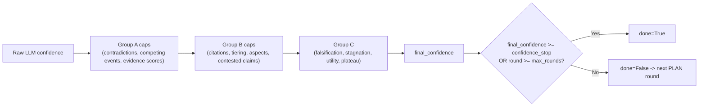

# Confidence

> File: `strategies/_stop_criteria.py`, `nodes.py` (`evaluate`)

## Scope

How the final confidence score is computed, where it can be capped or raised, and how to reason about the value when reviewing a run log.

## Range and semantics

- Integer scale **1–10**, where 10 is "fully answered with strong evidence" and 1 is "no meaningful signal".
- Produced by the evaluate-node LLM call, then threaded through the heuristic cascade (see [Stop criteria](stop-criteria.md)).
- Recorded in the iteration log via the marker `_confidence_parsed` with the raw LLM-reported value, and again as `final_confidence` after caps.

## Lifecycle per round



### Where confidence can change

- **Capped down** in Group A by contradictions (−1 or −2), competing events (to `confidence_stop - 1`), and evidence-score sanity checks.
- **Capped down** in Group B by no citations (max 6), low-quality dominance (max 7), missing primary sources (max 8), uncovered aspects (max 8), and 2+ contested claims (max 7).
- **Raised** only by `check_stagnation`, which raises to the stop threshold when search has been exhaustive but confidence stayed below 4 for two rounds.

### What the iteration log records

Every evaluate-node entry in testing mode includes:

- `_confidence_parsed` — the raw integer the LLM returned.
- `_evidence_consistency_parsed` / `_evidence_sufficiency_parsed` — the sanity-check signals.
- `final_confidence` — the value after all caps.
- Per-cap reasons when a cap triggers (e.g. `"cap_reason": "uncovered_aspects"`).

See [Iteration log](../observability/iteration-log.md) for consumers.

## Configuration knobs

| Setting | Default | Effect |
|---------|---------|--------|
| `confidence_stop` | 8 | Final stop threshold; lower to tolerate earlier termination. |
| `max_rounds` | 4 | Hard cap on the number of research rounds regardless of confidence. |

Both live on `AgentSettings`/`AgentConfig` (see [Agent config](../configuration/agent-config.md)) and can be overridden per request via `agent_overrides` on the HTTP API (see [Web server mode](../deployment/webserver-mode.md)).

## Reading a run log

Typical confidence trajectory on a healthy run:

```
round=0  _confidence_parsed=4  final_confidence=4  (aspect coverage cap at 8, not binding)
round=1  _confidence_parsed=6  final_confidence=6  (no caps binding)
round=2  _confidence_parsed=8  final_confidence=8  (stop: confidence_stop reached)
```

Typical low-confidence path that terminates via falsification/stagnation:

```
round=0  _confidence_parsed=3  final_confidence=3
round=1  _confidence_parsed=3  final_confidence=3  (falsification armed)
round=2  _confidence_parsed=3  final_confidence=8  (stagnation raise + stop)
```

If a run finishes with `final_confidence < confidence_stop` but `done=True`, the stop reason is always one of: max rounds, confidence plateau, utility plateau, stagnation-raise, cancelled. The reason is stored in `state["_stop_reason"]` and surfaced in the iteration log.

## Related docs

- [Stop criteria](stop-criteria.md)
- [Falsification](falsification.md)
- [Aspect coverage](aspect-coverage.md)
- [Iteration log](../observability/iteration-log.md)
