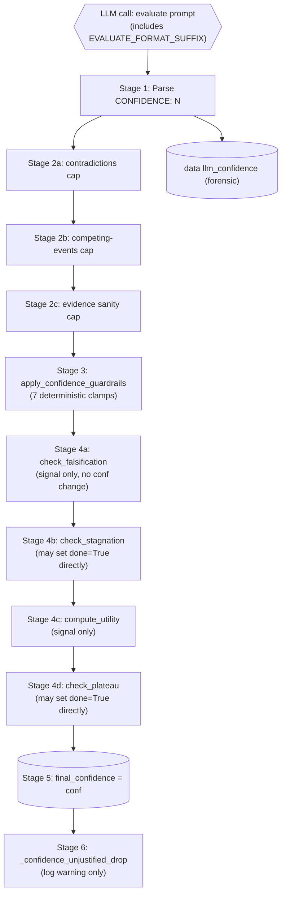

# Confidence

> Files: `nodes.py` (`evaluate()`, `apply_confidence_guardrails()`), `prompts.py` (`EVALUATE_FORMAT_SUFFIX`), `strategies/_stop_criteria.py` (`MultiSignalStopCriteria`)

## Scope

How `final_confidence` is computed. The LLM produces a raw integer; nine
documented stages of caps, sanity checks, guardrails, and post-LLM stop
hooks adjust it before it is stored. This page is the single canonical
reference for the full chain. The complementary
[stop-criteria.md](stop-criteria.md) page documents how `final_confidence`
combines with utility/plateau/min-rounds vetoes to set `done=True`.

The value is an integer **0-10**:

- `1..10`: evaluator-produced confidence after every cap.
- `0`: evaluator pass never completed (failure before parsing).

The primary effect of `final_confidence` is the threshold check
`conf >= confidence_stop` in the final stop gate (default `confidence_stop
= 8`).

## Pipeline overview


```mermaid
flowchart TD
    LLM{{"LLM call: evaluate prompt<br/>(includes EVALUATE_FORMAT_SUFFIX)"}}
    Parse["Stage 1: Parse CONFIDENCE: N"]
    A1["Stage 2a: contradictions cap"]
    A2["Stage 2b: competing-events cap"]
    A3["Stage 2c: evidence sanity cap"]
    Guard["Stage 3: apply_confidence_guardrails<br/>(7 deterministic clamps)"]
    Hook1["Stage 4a: check_falsification<br/>(signal only, no conf change)"]
    Hook2["Stage 4b: check_stagnation<br/>(may set done=True directly)"]
    Hook3["Stage 4c: compute_utility<br/>(signal only)"]
    Hook4["Stage 4d: check_plateau<br/>(may set done=True directly)"]
    Final[("Stage 5: final_confidence = conf")]
    Diag["Stage 6: _confidence_unjustified_drop<br/>(log warning only)"]
    LogLLM[("data llm_confidence (forensic)")]

    LLM --> Parse --> A1 --> A2 --> A3 --> Guard
    Parse --> LogLLM
    Guard --> Hook1 --> Hook2 --> Hook3 --> Hook4 --> Final
    Final --> Diag
```

Each stage can lower `conf` but never raise it. Stages 4a-4d primarily
**signal** decisions (`done=True`, `falsification_triggered=True`) without
modifying `conf` directly -- with two exceptions: `check_stagnation` and
`check_plateau` can set `done=True` outright.

## Stage 1 -- LLM raw value

Provider call in `evaluate()`:

```python
# nodes.py — model + reasoning effort come from the central tier router
evaluate_model, evaluate_effort = _resolve_node_llm(s, settings, providers, "evaluate")
text = providers.llm.complete(
    prompt, model=evaluate_model, reasoning_effort=evaluate_effort, ...
)
```

The evaluate node maps to the **mid** tier by default; configure
`tier_mid_model` (and optionally `tier_mid_effort`) or pin `evaluate_model` to
change it. See [LLM calls](../architecture/llm-calls.md).

The prompt is built inline in `nodes.py` and ends with
`EVALUATE_FORMAT_SUFFIX` from `prompts.py` (~lines 83-96). Quoted
verbatim:

```text
STATUS: SUFFICIENT oder INSUFFICIENT
CONFIDENCE: 1-10
- Vergleiche bewusst mit der Vorrunde, falls vorhanden.
- Wenn neue Evidenz hinzugekommen ist UND keine neuen Widersprueche oder
  konkurrierenden Ereignisse auftauchen, sollte CONFIDENCE NICHT unter den
  Vorrunden-Wert sinken. Wenn doch, begruende kurz.
GAPS: kurze Liste
CONTRADICTIONS: ja|nein, plus Severity-Hinweis falls ja
COMPETING_EVENTS: kurze Liste, leer wenn keine
EVIDENCE_CONSISTENCY: 0-10
EVIDENCE_SUFFICIENCY: 0-10
```

The "should NOT decrease unless …" rule is an **instruction to the LLM**,
not a hard floor enforced in code. Stage 6 (`_confidence_unjustified_drop`)
detects when the LLM violates that rule, but it only logs a warning -- the
drop is accepted as-is. This is documented as a
[surfaced-complexity item](calculation-overview.md#surfaced-complexity-candidates-for-code-simplification).

Parsing in `nodes.py` (~lines 4057-4068):

```python
m_conf = re.search(r"CONFIDENCE:\s*(\d+)", a)
if m_conf:
    conf = int(m_conf.group(1))
else:
    conf = 5
    _confidence_parsed = False        # iteration-log marker
```

A parse failure defaults to `5` and emits the `_confidence_parsed=False`
marker -- a No-Silent-Fallback signal that lands in `iteration_log` and the
forensic event stream.

`llm_confidence` (the raw parsed value) is recorded in the iteration log
alongside `final_confidence` so the cumulative impact of the cap chain is
auditable run-to-run.

## Stage 2 -- Three immediate LLM-signal caps

Applied **after** parsing, **before** the deterministic guardrails. Each
cap can lower `conf` but cannot raise it.

### Stage 2a -- Contradictions cap

Source: `MultiSignalStopCriteria.check_contradictions()` in
`_stop_criteria.py` (~lines 304-337).

Regex: `r"CONTRADICTIONS:\s*(.+?)(?:\n|$)"`.

If the LLM said "nein" or did not return the block: no cap.

If it said "ja":

- **Severe** keywords (`grundlegend`, `fundamental`, `gegenteil`,
  `widerspricht`, `unvereinbar`, ...) → `conf = min(conf,
  confidence_stop - 2)`.
- Otherwise (light contradiction): `conf = min(conf, confidence_stop - 1)`.

**Example.** `confidence_stop = 8`, LLM said `CONFIDENCE: 9`,
`CONTRADICTIONS: ja, grundlegend widerspricht` → cap to `min(9, 8 - 2) = 6`.

### Stage 2b -- Competing-events cap

Source: `extract_competing_events()` (~lines 357-393).

Regex: `r"COMPETING_EVENTS:\s*(.+?)(?:\n|$)"`. The text is compared against
the previous round's `competing_events` to decide novelty.

Trigger: only when `conf >= confidence_stop` **AND** (text is new OR
`round < 3`).

Effect: `conf = confidence_stop - 1`.

**Leniency from round 3 onward.** If the round is ≥ 3 and the competing
text is the same as the previous round, the cap is **skipped** -- the loop
already had two rounds to disambiguate and would otherwise thrash.

### Stage 2c -- Evidence-score sanity cap

Source: `extract_evidence_scores()` (~lines 447-457).

Parses `EVIDENCE_CONSISTENCY: 0-10` and `EVIDENCE_SUFFICIENCY: 0-10` into
state. The sanity cap fires only in this exact combination:

```python
if (s["evidence_consistency"] == 0 and s["evidence_sufficiency"] == 0
    and conf >= self._confidence_stop):
    conf = self._confidence_stop - 1
```

Defensive: a model claiming `CONFIDENCE: 9` while reporting both
consistency and sufficiency as `0` is almost certainly a parse glitch or a
hallucinated answer. The cap acknowledges the contradiction quietly. Parse
failures of either score fall back to `5` (with `_evidence_consistency_parsed`
/ `_evidence_sufficiency_parsed=False` markers).

## Stage 3 -- Deterministic guardrails

Source: `apply_confidence_guardrails()` in `nodes.py` (~lines 3705-3806).
Seven sequential clamps, no LLM involved. Each runs on the post-Stage-2
`conf` and reads only `AgentState` counts.

| Guardrail | Trigger | Cap (or effect) |
|---|---|---|
| **No citations** | `not has_citations` (`len(all_citations) == 0`) | `conf = min(conf, 6)` |
| **No claims** | `has_citations` AND `has_evidence_records` AND `not has_claims` | `conf = min(conf, 5)` |
| **Empty claim ledger** | `has_citations` AND `has_evidence_records` AND `not consolidated_claims` | `evidence_sufficiency = min(sufficiency, 3)` (does **not** cap `conf` directly; lowers a metric that may feed Stage 2c on the next round) |
| **Low-tier majority** | `low_n > (primary_n + mainstream_n)` AND `conf > 7` | `conf = 7` |
| **Needs-primary missing** | any claim with `needs_primary=True` AND `primary_n == 0` AND `conf > 8` | `conf = 8` |
| **Uncovered aspects** | `len(uncovered_aspects) > 0` AND `conf > 8` | `conf = 8` |
| **2+ contested claims** | `contested_claims >= 2` AND `conf > 7` | `conf = 7` |

### Hidden coupling -- first-writer-wins for gap hints

Every guardrail that fires also wants to publish a "gap hint" that the
next `plan()` will use to write a targeted query. The current
implementation lets only the **first** firing rule set the primary hint;
later guardrails still cap `conf` but their gap suggestion is ignored.

That means if both "Low-tier majority" and "Uncovered aspects" fire in the
same round, the gap text reflects only the low-tier-majority concern. The
next-round plan therefore favours quality-source queries over aspect-
coverage queries, even when both gaps exist. This is documented as a
[surfaced-complexity item](calculation-overview.md#surfaced-complexity-candidates-for-code-simplification).

### Hidden coupling -- empty-claim-ledger special case

The "Empty claim ledger" guardrail does not cap `conf` directly. Instead
it lowers `evidence_sufficiency` to at most `3`, which feeds Stage 2c on
the next round and can also reduce the utility score. The route is
deliberate -- it punishes the missing claims structurally rather than via
a single confidence ceiling -- but it makes the chain non-obvious to a
reader who scans only for `conf = min(...)` statements.

## Stage 4 -- Post-LLM stop-cascade hooks

These run **after** the guardrails. They mostly emit signals rather than
modify `conf`.

### Stage 4a -- Falsification toggle

Source: `check_falsification()` (~lines 468-524).

Trigger to **arm** falsification mode:

- `round >= 2`
- `0 < prev_conf <= 4`
- `conf <= 4`
- `falsification_triggered` currently `False`

Trigger to **release** falsification (when previously armed):

- `falsification_triggered=True` AND `conf >= confidence_stop - 2`

Falsification does not modify `conf`. It sets
`s["falsification_triggered"] = True/False`, which the next `plan()` reads
to inject "debunked" / "refuted" / "evidence against" queries. See
[falsification.md](falsification.md).

### Stage 4b -- Stagnation check

Source: `check_stagnation()` (~lines 543-560).

Trigger:

- `round >= 2`
- `prev_conf <= 4` AND `conf <= 4`
- `|conf - prev_conf| <= 1`
- (`n_citations >= 30` OR `falsification_triggered=True`)

Effect: sets `s["done"] = True` with `_stop_reason =
"stagnation_low_evidence"`. The low confidence is **not** raised -- it
remains the low value as a "we searched broadly and found little, treat
the absence as a signal" finding.

### Stage 4c -- Utility score

Source: `compute_utility()` (~lines 604-671).

```python
_delta_conf       = (conf - prev_conf) / 10.0 if prev_conf > 0 else 0.5
_delta_cit_norm   = min(1.0, _new_cit / 10.0)
_sufficiency_norm = s["evidence_sufficiency"] / 10.0
_evidence_gain    = min(1.0, max(0, _new_verified_claims) / 3.0)
utility = (
    0.3 * _delta_conf
    + 0.2 * _delta_cit_norm
    + 0.2 * _sufficiency_norm
    + 0.3 * _evidence_gain
)
```

Stop condition: if two consecutive rounds both have `utility < 0.15`,
`done=True` is set with `_stop_reason = "utility_stop"`. The utility stop
applies uniformly; there is no domain-specific suppression.

Does not modify `conf`.

### Stage 4d -- Plateau check

Source: `check_plateau()` (~lines 676-746).

```python
_conf_stable_rounds = s.get("_conf_stable_rounds", 0)
if prev_conf > 0 and conf == prev_conf:
    _conf_stable_rounds += 1
else:
    _conf_stable_rounds = 0
s["_conf_stable_rounds"] = _conf_stable_rounds
```

Stop condition (sets `done=True`, `_stop_reason="plateau_stop"`):

- `round >= 2`
- `conf == prev_conf` (this round)
- `conf >= 6`
- `competing_events` not actively changing
- `stagnation_detected=False`
- **Suppression**: `evidence_depth_gap["active"] != True`

In short: if confidence has been flat for two rounds at 6+ AND there is no
remaining cross-check work, stop. The depth-gap suppression is the bridge
between this stage and the answer-prompt EVIDENZTIEFE block -- both react
to the same diagnostic (see [stop-criteria.md](stop-criteria.md#evidence-depth-gap)).

Does not modify `conf`.

## Stage 5 -- Final assignment

```python
s["final_confidence"] = conf       # nodes.py ~line 4157
```

This is the only place the adjusted `conf` is persisted. The forensic raw
value `llm_confidence` was stored back in Stage 1.

## Stage 6 -- Unjustified-drop diagnostic

Source: `nodes.py` (~lines 4187-4199):

```python
_confidence_unjustified_drop = bool(
    not _evaluate_fallback
    and int(_prev_conf or 0) > 0
    and int(conf) < int(_prev_conf)
    and _competing_unchanged_for_marker
    and not _contradictions_present_for_marker
)
if _confidence_unjustified_drop:
    log.warning("confidence drop without new contradictions...")
```

Triggers when the LLM produced a strictly lower CONFIDENCE than the
previous round, yet no new competing events appeared and no contradictions
were reported -- a violation of the `EVALUATE_FORMAT_SUFFIX` instruction
in Stage 1.

**Currently log-only.** The drop is **not** auto-reverted to `prev_conf`,
and the marker is **not** added to the iteration log or score ledger. It
shows up only in the application log.

This is **intentional, not an oversight**: the marker was introduced as
an **observer** so that real-run data can inform a separate, open design
question -- whether to add a confidence-regression stop heuristic, make
the utility formula more sensitive, loosen the plateau check, or keep
the status quo. Until that question is decided, the code accepts the
drop verbatim and only logs the warning.

The narrow follow-on task that is *not* design-affecting: surface the marker
in `iteration_log` and `score_snapshot` so the observation accumulates
across runs. That is listed as a
[surfaced-complexity item](calculation-overview.md#surfaced-complexity-candidates-for-code-simplification).
Any auto-revert or new stop heuristic on top is a separate decision and
belongs in its own ADR.

## Worked example -- 4-round run

Assume `confidence_stop = 8`, weak evidence scenario (no primary sources,
2 contested claims, depth-gap inactive yet).

| Round | LLM `CONFIDENCE:` | Stage 2 caps | Stage 3 guardrails | Stage 4 hooks | `final_confidence` | Notes |
|---|---|---|---|---|---|---|
| **0** | 9 | none | Contested ≥ 2: `conf > 7` → 7 | none | **7** | `_conf_stable_rounds=0` |
| **1** | 7 | Contradictions "leichte" → `min(7, 8-1)=7` (unchanged); Competing events new + `conf >= 8`? no → skip | unchanged | `check_falsification`: not armed (`conf > 4`) | **7** | `_conf_stable_rounds=1` (equals round 0) |
| **2** | 5 | Contradictions "ja, grundlegend" → `min(5, 8-2)=5` (unchanged) | unchanged | `check_falsification`: trigger (round ≥ 2, prev=7? no -- skip; trigger only if `prev_conf <= 4`); `check_stagnation`: skip (`conf > 4`) | **5** | `_conf_stable_rounds=0` (reset, value changed) |
| **3** | 6 | none | unchanged | `_conf_stable_rounds=0`; utility `0.18 + 0.12` last two? evaluate; plateau: no (`conf != prev_conf`) | **6** | Loop continues if `round < max_rounds` |

At round 3 the diagnostic `_confidence_unjustified_drop` would have
already fired in round 2 (5 < 7, no new competing events, but
contradictions were reported, so condition `_contradictions_present_for_marker`
was True → marker stays False).

## Configuration knobs

| Setting | Default | Effect |
|---|---|---|
| `confidence_stop` | 8 | Final stop threshold. Lower to tolerate earlier termination. |
| `max_rounds` | 4 (COMPACT) / 5 (DEEP) | Hard cap on research rounds. |
| `min_rounds` | 1 (COMPACT) / 2 (DEEP) | Global floor that can suppress an already-triggered stop until reached. |
| `tier_mid_model` (provider) | `""` | Model for the evaluate node's tier. Put evaluate on a stronger model here (or via `evaluate_model`) for better structured-output / `CONFIDENCE` calibration. See [LLM calls](../architecture/llm-calls.md). |

`confidence_stop`, `max_rounds`, and `min_rounds` live on
`AgentSettings`/`AgentConfig` (see
[agent-config.md](../configuration/agent-config.md)) and can be overridden per
request via `agent_overrides` on the HTTP API (see
[webserver-mode.md](../deployment/webserver-mode.md)). The tier model is
configured on the provider — see [LLM calls](../architecture/llm-calls.md).

## How it is calculated

| Stage | LLM-driven? | Inputs | Output |
|---|---|---|---|
| 1 LLM raw value | **LLM-parsed** (evaluator) | Question, aspects, evidence overview excerpt, previous-round context | `conf` int 0-10 (parsed via regex) |
| 2a contradictions cap | Deterministic | LLM `CONTRADICTIONS:` text | Lowered `conf` |
| 2b competing-events cap | Deterministic | LLM `COMPETING_EVENTS:` text + previous round | Lowered `conf` |
| 2c evidence-sanity cap | Deterministic | LLM `EVIDENCE_CONSISTENCY:` + `EVIDENCE_SUFFICIENCY:` | Lowered `conf` (only `0/0 + high conf` case) |
| 3 guardrails | Deterministic | `all_citations`, `evidence_ledger`, `consolidated_claims`, tier counts, `uncovered_aspects` | Lowered `conf` (multiple caps) |
| 4a falsification | Deterministic | `round`, `conf`, `prev_conf` | `falsification_triggered` flag |
| 4b stagnation | Deterministic | `round`, `conf`, `prev_conf`, `n_citations`, falsification flag | `done=True` (no `conf` change) |
| 4c utility | Deterministic | `Δconf`, `Δcit`, `evidence_sufficiency`, `Δverified_claims` | `utility_score`, may set `done=True` |
| 4d plateau | Deterministic | `conf`, `prev_conf`, `_conf_stable_rounds`, `evidence_depth_gap` | May set `done=True` |
| 5 final assign | Deterministic | `conf` | `final_confidence` persisted |
| 6 unjustified-drop diagnostic | Deterministic | `conf`, `prev_conf`, contradictions/competing markers | Log warning only |

## Related docs

- [Stop criteria](stop-criteria.md) -- how `final_confidence` combines with utility/plateau/min-rounds vetoes.
- [Falsification](falsification.md) -- the trigger conditions for Stage 4a.
- [Aspect coverage](aspect-coverage.md) -- one of the Stage 3 guardrail inputs.
- [Claims](claims.md) -- how `claim_quality_score` and `contested_claims` (Stage 3 inputs) are computed.
- [Calculation overview](calculation-overview.md) -- every metric and threshold in one place.
- [Iteration log](../observability/iteration-log.md) -- where `_confidence_parsed`, `llm_confidence`, `final_confidence`, and the per-round cap markers land.
