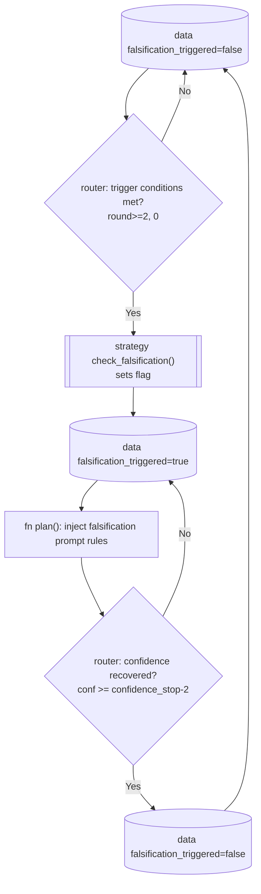

# Falsification mode

> Files: `strategies/_stop_criteria.py` (`MultiSignalStopCriteria.check_falsification`), `nodes.py` (`plan`)

## Scope

What falsification mode means in Inqtrix, when it is armed, how it changes query generation, and how it is released once confidence recovers.

## Motivation

Naive search loops keep asking the same question in slightly different words when confidence stays low. That behaviour is expensive and sycophantic — models tend to over-assert a premise they cannot disprove. Falsification mode inverts the search strategy after a few low-confidence rounds: the loop actively looks for disproof instead of looking for more supporting evidence.

The idea is inspired by the FVA-RAG line of work (*Falsification-Verification Alignment for Mitigating Sycophantic Hallucinations*).

## Trigger conditions

All of the following must be true:

- `round >= 2` (we have tried at least twice).
- `0 < prev_conf <= 4` (prior round had meaningful but low confidence).
- `conf <= 4` (current round also low).
- NOT already triggered (`falsification_triggered` is false).

The strategy records the new state by setting `falsification_triggered = True`.

Release rule in the same method:

- if `falsification_triggered` is true **and** `conf >= confidence_stop - 2`, the flag is cleared.

This means falsification is not permanently sticky. It can be armed, released, and later armed again if low-confidence trigger conditions return.

Minimal state transition:

```json
{
  "round": 2,
  "prev_conf": 4,
  "confidence": 3,
  "falsification_triggered": true
}
```

## Effect on the plan node

When `falsification_triggered` is true, the plan node generates queries in a different distribution:

- At least two new queries are **debunk-style** — they explicitly search for disproof, counter-examples, retractions, or absence of the claimed fact.
- Another query is **nearest-explanation** — it searches for the actual fact that has been confused with the user's premise.

The LLM prompt for plan acknowledges the switch explicitly, so that a reasoning model does not silently revert to confirmation-seeking queries.

Example query distribution after the trigger:

```text
2 debunk-style queries:
- "<claim> counter evidence retraction"
- "<claim> no evidence official source"

1 nearest-explanation query:
- "<confused term> actual policy status official source"
```

## Interaction with stagnation

Falsification is followed shortly afterwards by `check_stagnation`. If falsification has been armed (or broad search reached 30+ citations), round-count is sufficient, and confidence remains low, stagnation sets `done=True` with `_stop_reason="stagnation_low_evidence"` while leaving the low confidence unchanged. The reasoning: active disproof search failed to find support, so negative evidence is treated as informative without pretending the evaluator became highly confident.

## Interaction with negative-evidence hinting

The evaluate-prompt hint that treats absence of evidence as a legitimate signal (see [Stop criteria](stop-criteria.md)) is injected whenever `round >= 2`. When `prev_conf > 0 AND prev_conf <= 4`, the hint is stronger, which lines up with the falsification pre-conditions. The two mechanisms are complementary: falsification changes the questions, negative-evidence hinting changes how the LLM scores the accumulated answer.

## What falsification does not do

- It does not reset the EvidenceLedger or the consolidated claims. Accumulated evidence remains available and continues to be consolidated.
- It does not lower the stop threshold. `confidence_stop` stays at its configured value; termination still requires either stagnation, plateau, max-rounds, or a confidence trajectory that crosses the threshold.
- It is not a standalone stop reason. It changes planning behavior; stop decisions still occur in the normal evaluate gate + stop cascade.

## Lifecycle diagram

This diagram answers: "How does one low-confidence state flag change the next
planning prompt?" The flag itself is written in `evaluate()` through
`StopCriteriaStrategy.check_falsification()`; the query distribution changes
later in `plan()`.



The diagram spans two nodes: `evaluate()` writes the flag, and the next
`plan()` call reads it. No evidence is deleted when the flag changes.

## Configuration

No dedicated configuration knob exists; the feature is fully driven by `confidence_stop`, `max_rounds`, and the internal trigger conditions. Custom `StopCriteriaStrategy` implementations that want to disable falsification should override `check_falsification` to always return `False` (or equivalently, return the incoming flag unchanged).

## Related docs

- [Stop criteria](stop-criteria.md)
- [Confidence](confidence.md) -- Stage 4a is where the falsification flag is set/cleared.
- [Calculation overview](calculation-overview.md) -- every metric and threshold in one place.
- [Nodes](../architecture/nodes.md) (plan node behaviour)
- [Research foundations](../reference/research-foundations.md) (FVA-RAG reference)
