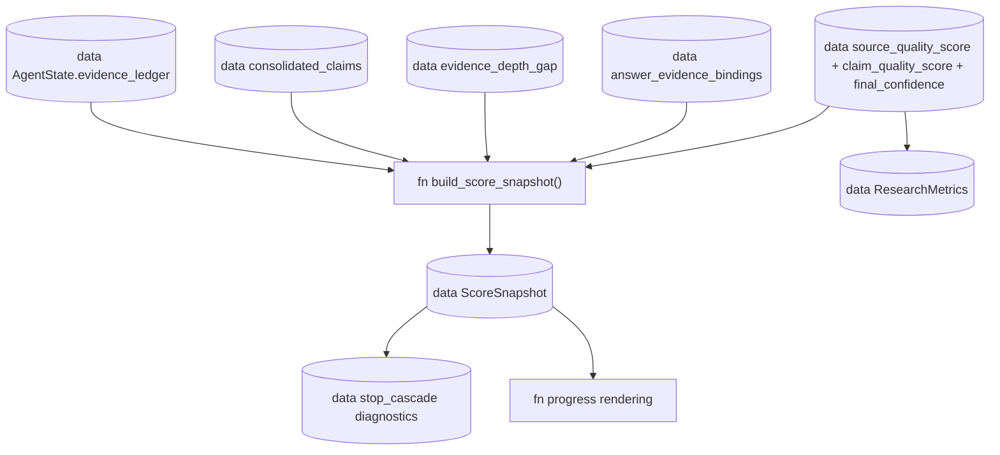

# Score ledger

## Scope

How Inqtrix records per-phase scoring snapshots from the current state for progress messages, stop diagnostics, and audit review. Read this when changing `source_quality_score`, `claim_quality_score`, `final_confidence`, utility stopping, or answer-evidence audit metrics.

## Why it exists

Earlier versions kept scoring values as independent state fields. That made a run hard to reason about: `source_quality_score` could look healthy because many URLs were found, while only one verified report bundle existed. The score ledger keeps those views together in one chronological structure.

`state["score_ledger"]` (`AgentState` key, `list[dict[str, Any]]`) is not a second truth source. It is a chronological diagnostic history built from the latest state fields. Compatibility fields such as `source_quality_score`, `claim_quality_score`, and `final_confidence` remain the values consumed by result projection and stop gates; the ledger records them together with evidence and answer-audit context.

## Flow

This diagram answers: "Which evidence and audit data feeds the chronological
score snapshots?" The score ledger is a diagnostic history, not a primary truth
source.



The graph shows one direction of authority: evidence, claims, bundles, answer audit, and compatibility score fields feed a `ScoreSnapshot`. Public `ResearchMetrics` reads the compatibility fields directly from `result_state`; it does not read back from `score_ledger`. Stop criteria should not infer answer readiness from raw URL counts.

## `ScoreSnapshot`

One snapshot is appended after search, evaluate, and answer phases when the corresponding data is available.

```python
ScoreSnapshot = {
    "round": 2,
    "phase": "search|evaluate|answer",
    "source": {
        "total_citations": 68,
        "tier_counts_all": {
            "primary": 12,
            "mainstream": 13,
            "unknown": 43,
            "low": 0,
            "stakeholder": 0,
        },
        "quality_score_all": 0.551,
    },
    "evidence": {
        "evidence_record_count": 68,
        "report_eligible_evidence_count": 8,
        "rendered_record_count": 7,
        "omitted_record_count": 1,
        "evidence_depth_gap": {
            "active": False,
            "verified_count": 6,
            "cross_checked_count": 3,
            "single_source_verified_count": 2,
            "single_source_ratio": 0.333,
            "verified_quality_source_single_count": 2,
            "central_quality_source_single_count": 0,
            "reason": "",
        },
    },
    "claims": {
        "consolidated_claim_count": 6,
        "verified": 1,
        "contested": 0,
        "unverified": 5,
        "quality_score": 0.167,
        "cross_checked_count": 1,
        "single_source_verified_count": 0,
        "needs_primary_total": 2,
        "needs_primary_verified": 1,
    },
    "coverage": {
        "aspect_coverage_context": 0.667,
    },
    "evaluate": {
        "llm_confidence": 4,
        "final_confidence": 4,
        "evidence_consistency": 8,
        "evidence_sufficiency": 4,
    },
    "stop": {
        "utility_score": 0.43,
        "stop_reason": "stagnation_low_evidence",
        "done": True,
    },
    "answer": {
        "answer_bound_claims_count": 3,
        "unbound_answer_citations_count": 3,
        "evidence_contract_status": "needs_review",
    },
}
```

## Which scores drive decisions

These fields are diagnostic and should not by themselves decide whether a report can make hard factual claims:

- `source.quality_score_all`: all found citations, not selected report evidence.
- `source.tier_counts_all`: useful for source mix, but still URL inventory.
- `coverage.aspect_coverage_context`: context coverage, not verified report coverage.

These fields are the high-signal fields to inspect when reviewing stop and answer readiness. They are recorded together in snapshots, but most decisions still read the current `AgentState` fields directly:

- `evidence.report_eligible_evidence_count` -- gates the report-evidence floor stop suppression.
- `evidence.rendered_record_count` / `evidence.omitted_record_count` -- how many records made it into the answer prompt's evidence overview vs how many were dropped by the char budget. Non-zero `omitted_record_count` means evidence was lost to budget; it is also visible to the LLM as a "HINWEIS: …" footer in the overview.
- `evidence.evidence_depth_gap` -- the full dict, see [stop-criteria.md](stop-criteria.md#evidence-depth-gap) for fields and triggers.
- `claims.quality_score`, `claims.cross_checked_count`, `claims.single_source_verified_count` -- claim-quality view.
- `evaluate.evidence_sufficiency`
- `answer.evidence_contract_status` -- one of `clean` / `needs_review` / `source_context_only` / `algorithm_failed` / `unknown` (see [evidence-pipeline.md](../architecture/evidence-pipeline.md#answerevidencebinding)).

For the **complete** list of every scoring value plus its provenance (LLM
or deterministic), see [calculation-overview.md](calculation-overview.md).

## Progress and footer

The user-facing progress stream should report found references separately
from report-eligible evidence. A good progress line says:

```text
5 search answers processed, 31 references collected, 12 evidence records (8 report-eligible).
Claims: 1 verified (cross-checked), 5 unverified.
```

It should not imply that 68 references were all read as independent
evidence or that high source quality means answer readiness.

## Related docs

- [Evidence pipeline](../architecture/evidence-pipeline.md)
- [Stop criteria](stop-criteria.md)
- [Confidence](confidence.md)
- [Calculation overview](calculation-overview.md) -- every metric in one place.
- [Iteration log](../observability/iteration-log.md)
