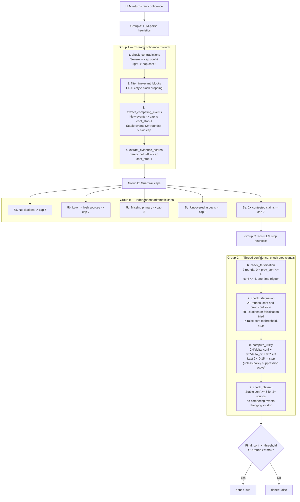

# Stop criteria

> Files: `strategies/_stop_criteria.py` (`MultiSignalStopCriteria`), `nodes.py` (`evaluate`)

## Scope

The nine-step heuristic cascade that decides whether the research loop should continue. This page is the canonical reference — the evaluate node and every derived `StopCriteriaStrategy` implementation must respect these semantics.

## Why multiple signals

A single confidence threshold is easy to game: an LLM can hallucinate certainty, or the loop can stagnate at a high-but-unwarranted score. Inqtrix defends against both by combining LLM-reported confidence with structural signals (contradictions, competing events, source quality, aspect coverage, utility delta, plateau detection) and by treating them as independent caps rather than a single linear pipeline.

## Cascade structure

The heuristics are grouped into three phases. Confidence is threaded through each phase and can be reduced but not increased by caps, except in `check_stagnation`, which can raise confidence to the stop threshold when search has been exhaustive.

## Key heuristic details

### Competing-events suppression

If competing events stay unchanged into round 3+ (same text as the previous round), the cap in step 3 is skipped. This prevents thrashing on the same competing explanations while still forcing at least one explicit disambiguation round.

### Falsification trigger

All conditions must be true to arm falsification: `round >= 2`, `0 < prev_conf`, `prev_conf <= 4`, `conf <= 4`, and NOT already triggered. The flag is set once and never re-triggers. Subsequent plan rounds emit debunk-style queries (see [Falsification](falsification.md)).

### Negative-evidence hinting

Injected into the evaluate prompt when `round >= 2`. If additionally `prev_conf > 0` and `prev_conf <= 4`, a stronger hint is added: after N rounds with 30+ citations and confidence still at or below 4, absence of evidence is treated as a strong signal that the premise is false (suggested confidence 7–9).

### Utility suppression for policy questions

`should_suppress_utility_stop()` prevents utility-based stopping when the question matches the policy regex AND any of the following hold:

- Uncovered aspects remain.
- Claims flagged `needs_primary` still lack primary verification.
- No quality sources found AND (unverified > verified OR `claim_quality_score < 0.35`).

This ensures policy-critical questions are not prematurely abandoned due to low marginal utility.

## Stopping rules summary

| Rule | Condition | Effect |
|------|-----------|--------|
| **Confidence** | `conf >= confidence_stop` (default 8) | Stop |
| **Max rounds** | `round >= max_rounds` (default 4) | Stop |
| **Contradictions** | Severe conflicting sources | Cap conf by −1 or −2 |
| **Competing events** | Multiple explanations (new) | Cap to threshold−1; force disambiguation |
| **Falsification** | 2+ rounds, `prev_conf` and `conf` both <= 4, one-time | Switch to debunk-style queries |
| **Stagnation** | No improvement + broad search done (30+ citations) | Raise conf to threshold, stop |
| **Utility plateau** | Last two rounds both utility < 0.15 | Stop (unless policy suppression) |
| **Confidence plateau** | Same conf >= 6 for 2+ rounds, no competing events changing | Stop |
| **Negative evidence** | Round >= 2, searched broadly, found little | Prompt hint: infer absence as evidence |

## `StopCriteriaStrategy` ABC — full method list

| Method | Signature | Returns |
|--------|-----------|---------|
| `check_contradictions` | `(s, eval_text, conf) -> int` | Modified confidence |
| `filter_irrelevant_blocks` | `(s, eval_text) -> None` | Modifies state in place |
| `extract_competing_events` | `(s, eval_text, conf) -> int` | Modified confidence |
| `extract_evidence_scores` | `(s, eval_text, conf) -> int` | Modified confidence |
| `check_falsification` | `(s, conf, prev_conf) -> bool` | Triggered flag |
| `check_stagnation` | `(s, conf, prev_conf, n_citations, falsification_just_triggered) -> tuple[int, bool]` | (conf, detected) |
| `should_suppress_utility_stop` | `(s) -> bool` | Suppress flag |
| `compute_utility` | `(s, conf, prev_conf, n_citations) -> tuple[float, bool]` | (utility, stop) |
| `check_plateau` | `(s, conf, prev_conf, stagnation_detected) -> bool` | Stop flag |
| `should_stop` | `(state) -> tuple[bool, str]` | (stop, reason) |

## Implementing your own stop strategy

Subclass `MultiSignalStopCriteria` rather than `StopCriteriaStrategy` so you inherit the default cascade and only override the specific checks you want to change. The most common overrides in practice are `compute_utility` (tighter or looser plateau) and `should_suppress_utility_stop` (domain-specific protection list).

## Related docs

- [Confidence](confidence.md)
- [Falsification](falsification.md)
- [Aspect coverage](aspect-coverage.md)
- [Claims](claims.md)
- [Source tiering](source-tiering.md)
