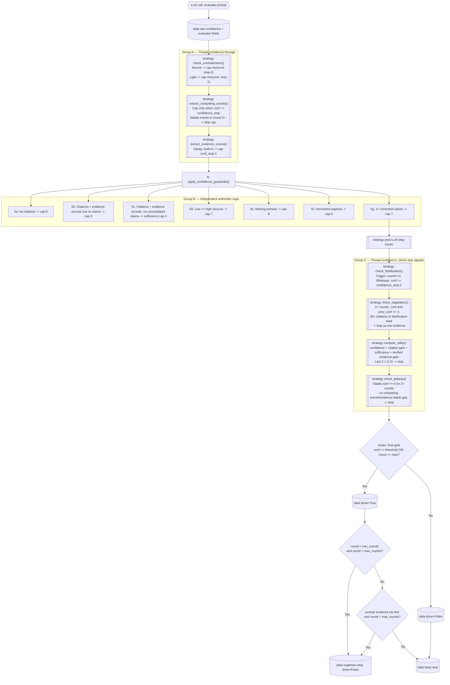

# Stop criteria

> Files: `strategies/_stop_criteria.py` (`MultiSignalStopCriteria`), `nodes.py` (`evaluate`)

## Scope

The stop cascade that decides whether the research loop should continue. This page is the canonical reference for how `evaluate` threads confidence through strategy heuristics, deterministic guardrails, and final stop gates.

## Why multiple signals

A single confidence threshold is easy to game: an LLM can hallucinate certainty, or the loop can stagnate at a high-but-unwarranted score. Inqtrix defends against both by combining LLM-reported confidence with structural signals (contradictions, competing events, source quality, aspect coverage, utility delta, plateau detection) and by treating them as independent caps rather than a single linear pipeline.

## Cascade structure

The heuristics are grouped into three phases. Confidence is threaded through each phase and can be reduced but not increased by caps. `check_stagnation` may stop the loop when evidence has stalled, but it must not raise weak-evidence confidence to the stop threshold.
This diagram answers: "Which code path can cap confidence or set `done=True`
inside `evaluate()`?" Strategy hooks are shown as strategy nodes; arithmetic
guardrails and final gates are owned by `nodes.py`.


```mermaid
flowchart TD
    A{{"LLM call: evaluate prompt"}} --> B[("data raw confidence + evaluator fields")]
    subgraph GA["Group A — Thread confidence through"]
        B1[["strategy check_contradictions()<br/>Severe -> cap min(conf, stop-2)<br/>Light -> cap min(conf, stop-1)"]]
        B3[["strategy extract_competing_events()<br/>Cap only when conf >= confidence_stop<br/>Stable events in round 3+ -> skip cap"]]
        B4[["strategy extract_evidence_scores()<br/>Sanity: both=0 -> cap conf_stop-1"]]
        B1 --> B3 --> B4
    end
    B --> B1
    B4 --> C["fn apply_confidence_guardrails()"]
    subgraph GB["Group B — Independent arithmetic caps"]
        C1["5a. No citations -> cap 6"]
        C2["5b. Citations + evidence records but no claims -> cap 5"]
        C3["5c. Citations + evidence records, no consolidated claims -> sufficiency cap 3"]
        C4["5d. Low >> high sources -> cap 7"]
        C5["5e. Missing primary -> cap 8"]
        C6["5f. Uncovered aspects -> cap 8"]
        C7["5g. 2+ contested claims -> cap 7"]
    end
    C --> C1
    C --> C2
    C --> C3
    C --> C4
    C --> C5
    C --> C6
    C --> C7
    C7 --> D[["strategy post-LLM stop hooks"]]
    subgraph GC["Group C — Thread confidence, check stop signals"]
        D1[["strategy check_falsification()<br/>Trigger: round>=2, 0<prev<=4, conf<=4<br/>Release: conf >= confidence_stop-2"]]
        D2[["strategy check_stagnation()<br/>2+ rounds, conf and prev_conf <= 4,<br/>30+ citations or falsification tried<br/>-> stop as low evidence"]]
        D3[["strategy compute_utility()<br/>confidence + citation gain + sufficiency + verified evidence gain<br/>Last 2 < 0.15 -> stop"]]
        D4[["strategy check_plateau()<br/>Stable conf >= 6 for 2+ rounds<br/>no competing events/evidence-depth gap -> stop"]]
        D1 --> D2 --> D3 --> D4
    end
    D --> D1
    D4 --> E{"router: final gate<br/>conf >= threshold OR round >= max?"}
    E -->|Yes| F[("data done=True")]
    E -->|No| G[("data done=False")]
    F --> H{"round < min_rounds<br/>and round < max_rounds?"}
    H -->|Yes| I[("data suppress stop: done=False")]
    H -->|No| K{"prompt evidence too thin<br/>and round < max_rounds?"}
    K -->|Yes| I
    K -->|No| J[("data keep stop")]
    G --> J
```

The final stop decision is not a single strategy method in the current code.
`evaluate()` calls individual strategy hooks, then owns the final gate and the
global `min_rounds` suppression.

## Signal map (where metrics are produced and consumed)

| Signal | Produced in | Updated in | Consumed by |
|--------|-------------|------------|-------------|
| working `conf` / `final_confidence` | `evaluate` parses `CONFIDENCE` into working `conf`; stores `final_confidence` after Group C | Group A + guardrails + Group C in `evaluate` | final stop gate (`confidence_stop`), plateau/stagnation/utility, answer metrics |
| `evidence_consistency` | `extract_evidence_scores` | same | evidence sanity cap (only `0/0` + high confidence case), diagnostics |
| `evidence_depth_gap` | `search` and recomputed in `evaluate` from `consolidated_claims` (see [_evidence_depth_gap()](#evidence-depth-gap)) | same | evaluate prompt, next-round query slots, plateau suppression, answer-prompt `EVIDENZTIEFE` block trigger |
| `evidence_sufficiency` | `extract_evidence_scores` | same | utility formula and weak-evidence confidence cap |
| `competing_events` | `extract_competing_events` | same | competing-events cap and plateau suppression logic |
| `falsification_triggered` | `check_falsification` | trigger/release in same method | plan-mode query distribution; stagnation precondition |
| `utility_scores` | `compute_utility` | append per round | utility stop (`last two < 0.15`) |
| `score_ledger` | search/evaluate/answer snapshots built from current state | append per phase | progress report and stop diagnostics; `ResearchMetrics` reads `result_state` fields directly |
| `uncovered_aspects` | risk strategy (`estimate_aspect_coverage`) after search | classify/search refresh | guardrail cap (`conf <= 8`) |
| `report_eligible_evidence_count` | `evaluate` reads it from the current `evidence_ledger` (records with `report_eligible=True` and a primary URL) | same | suppresses early stopping when the final answer prompt would still be too thin (`min_report_eligible_evidence` profile knob, 3 COMPACT / 8 DEEP) |

## Key heuristic details

### Competing-events suppression

If competing events stay unchanged into round 3+ (same text as the previous round), the cap in step 3 is skipped. The cap also only applies when confidence is already at or above `confidence_stop`. This prevents thrashing on repeated ambiguity while still forcing at least one explicit disambiguation round.

### Falsification trigger and release

Trigger conditions to arm falsification:

- `round >= 2`
- `0 < prev_conf <= 4`
- `conf <= 4`
- `falsification_triggered` currently false

Release condition:

- if `falsification_triggered` is true and `conf >= confidence_stop - 2`, the flag is cleared.

Because release exists, falsification can trigger again later if the low-confidence trigger conditions reappear. See [Falsification](falsification.md) for the planning impact.

### Negative-evidence hinting

Injected into the evaluate prompt when `round >= 2`. If additionally `prev_conf > 0` and `prev_conf <= 4`, a stronger hint is added: after N rounds with 30+ citations and confidence still at or below 4, absence of evidence is treated as a strong signal that the premise is false (suggested confidence 7–9).

### Evidence-depth gap

Source: `_evidence_depth_gap()` in `src/inqtrix/nodes.py` (~line 207).
Inputs: the current `consolidated_claims` list -- the bundle list it used
to read no longer exists.

Threshold constant: `_EVIDENCE_DEPTH_MIN_VERIFIED_BUNDLES = 3` (the
historical name -- it now counts verified consolidated claims, not bundles).

The diagnostic is **active** when **any** of:

| Reason | Trigger |
|---|---|
| `no_cross_checked_claims` | `verified_count >= 3` AND `cross_checked_count == 0` |
| `majority_single_source_claims` | `verified_count >= 3` AND `single_source_verified_count / verified_count > 0.5` |
| `central_claim_single_quality_source` | at least one claim with `verification_basis == "verified_quality_source"`, only one citation URL, and a claim text that matches the central-claim regex (numeric / benchmark / regulatory keyword) |

The returned dict carries `active`, `reason` (comma-joined), `gap`
(human-readable explanation when active), and the per-trigger counts
(`verified_count`, `cross_checked_count`, `single_source_verified_count`,
`single_source_ratio`, `verified_quality_source_single_count`,
`central_quality_source_single_count`).

**Worked example.** 4 verified consolidated claims, all
`verification_basis="verified_quality_source"`, all with one citation, one
of them containing a percentage:
- `verified_count=4`, `cross_checked_count=0` → `no_cross_checked_claims`
- `single_source_verified_count=4`, ratio `1.0 > 0.5` → `majority_single_source_claims`
- `central_quality_source_single_count=1` → `central_claim_single_quality_source`
- `active=True`, `reason="no_cross_checked_claims,majority_single_source_claims,central_claim_single_quality_source"`.

The gap has three downstream effects:

1. The next `plan()` round receives a cross-check query slot via
   `_select_crosscheck_targets()` (see [calculation-overview.md](calculation-overview.md)).
2. `check_plateau()` suppresses a plateau stop while the gap is active
   (search continues even if confidence has been flat for two rounds).
3. The answer-node system prompt emits the **EVIDENZTIEFE** block, which
   tells the LLM to inline-attribute single-source-verified claims and to
   mention the limited evidence depth in the report (see
   [Evidence pipeline — Final answer system prompt](../architecture/evidence-pipeline.md#final-answer-system-prompt)).

The gap does not override `confidence_stop` or `max_rounds`.

### `min_rounds` suppression (global post-gate)

After all stop checks, `evaluate` applies a global floor:

- if `done=True` but `round < min_rounds` and still `round < max_rounds`,
- then the stop is suppressed (`done=False`) and the loop continues.

This applies uniformly to confidence, utility, plateau, and other stop reasons. `max_rounds` still wins as the hard cap.

### Report-eligible evidence floor

After `min_rounds`, `evaluate` checks whether the current evidence can
produce enough report-facing material for the answer composer:

- `report_eligible_evidence_count` (count of EvidenceRecords with
  `report_eligible=True` and a primary URL) must reach
  `ReportProfileTuning.min_report_eligible_evidence` (3 COMPACT / 8 DEEP).

If a stop was accepted but the threshold is not met, and `round <
max_rounds`, the stop is suppressed and the next `plan()` call gets another
chance to fill the evidence. This guard is provider-neutral: it only reads
the persisted EvidenceLedger; there is no separate prompt-evidence-unit
list anymore. `max_rounds` remains the hard cap.

## Stopping rules summary

| Rule | Condition | Effect |
|------|-----------|--------|
| **Confidence** | `conf >= confidence_stop` (default 8) | Stop |
| **Max rounds** | `round >= max_rounds` (default 4) | Stop |
| **Contradictions** | Severe or light conflicting sources | Cap to `confidence_stop - 2` or `confidence_stop - 1` |
| **Competing events** | Multiple explanations (new) and `conf >= confidence_stop` | Cap to `confidence_stop - 1`; force disambiguation |
| **Falsification** | 2+ rounds, `0 < prev_conf <= 4` and `conf <= 4` | Arm debunk-style planning mode |
| **Falsification release** | `falsification_triggered` and `conf >= confidence_stop - 2` | Return to normal planning mode |
| **Stagnation** | No improvement + broad search done (30+ citations) | Stop as low-evidence exhaustion; do not raise confidence |
| **Utility plateau** | Last two rounds both utility < 0.15 | Stop (unless policy suppression) |
| **Confidence plateau** | Same conf >= 6 for 2+ rounds, no competing events changing and no active evidence-depth gap while rounds remain | Stop |
| **Negative evidence** | Round >= 2, searched broadly, found little | Prompt hint: infer absence as evidence |
| **min_rounds floor** | `done=True` but `round < min_rounds` and `< max_rounds` | Suppress stop and continue |
| **Report-eligible evidence floor** | `done=True`, evidence exists, `report_eligible_evidence_count < min_report_eligible_evidence`, and `< max_rounds` | Suppress stop and continue |

## Worked stop-cascade example

```text
round=2
raw CONFIDENCE: 9
extract_competing_events: competing_events found, conf>=stop -> cap to 7
guardrails: uncovered_aspects present, conf already <=8 -> no further cap
check_falsification: no trigger (conf>4)
compute_utility: 0.11 and previous 0.12 -> utility_stop would set done=True
final gate: done=True
min_rounds check: min_rounds=3 and round=2 -> suppress stop, done=False
result: loop continues to next PLAN round
```

## `StopCriteriaStrategy` ABC — full method list

| Method | Signature | Returns |
|--------|-----------|---------|
| `check_contradictions` | `(s, eval_text, conf) -> int` | Modified confidence |
| `extract_competing_events` | `(s, eval_text, conf) -> int` | Modified confidence |
| `extract_evidence_scores` | `(s, eval_text, conf) -> int` | Modified confidence |
| `check_falsification` | `(s, conf, prev_conf) -> bool` | Triggered flag |
| `check_stagnation` | `(s, conf, prev_conf, n_citations, falsification_just_triggered) -> tuple[int, bool]` | (conf, detected) |
| `compute_utility` | `(s, conf, prev_conf, n_citations) -> tuple[float, bool]` | (utility, stop) |
| `check_plateau` | `(s, conf, prev_conf, stagnation_detected) -> bool` | Stop flag |
| `should_stop` | `(state) -> tuple[bool, str]` | (stop, reason) |

## Implementing your own stop strategy

Subclass `MultiSignalStopCriteria` rather than `StopCriteriaStrategy` so you inherit the default cascade and only override the specific checks you want to change. The most common override in practice is `compute_utility` (tighter or looser plateau).

## Related docs

- [Confidence](confidence.md)
- [Score ledger](score-ledger.md)
- [Falsification](falsification.md)
- [Aspect coverage](aspect-coverage.md)
- [Claims](claims.md)
- [Source tiering](source-tiering.md)
