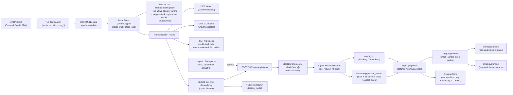

# Webserver Stacks

Production-shaped FastAPI examples that mount the OpenAI-compatible
Inqtrix HTTP server on top of explicit Baukasten provider stacks.
Every script in this folder mirrors a sibling under
[`examples/provider_stacks/`](../provider_stacks/) — same providers,
same defaults, same model names — but exposes the agent over HTTP
instead of running it once in-process.

> See also [`docs/deployment/webserver-mode.md`](../../docs/deployment/webserver-mode.md)
> for the conceptual overview (endpoints, lifespan, concurrency,
> cancel-on-disconnect, sessions, per-request overrides). This README
> remains the authoritative reference for operational details, the full
> env-variable matrix, and per-stack run commands.

> Inqtrix remains explicitly experimental. These examples ship
> minimum-viable hardening options (TLS, Bearer API key, CORS) as
> opt-in features, but they are not a substitute for a production-
> hardened deployment with reverse proxy, auditing, rate limiting and
> secrets management. See the repo `README.md` header for the full
> disclaimer.

## Relationship to `provider_stacks/`

| Aspect | `provider_stacks/` | `webserver_stacks/` |
|---|---|---|
| Mode | Library — `agent.research(...)` | Server — OpenAI-compatible HTTP API |
| Lifetime | Per script run | Long-running daemon |
| Provider construction | identical | identical (1:1, single source of truth) |
| Settings / tuning values | inside the `AgentConfig` block | inside `AgentSettings(...)` (same defaults) |
| Output | `print(result.answer)` | SSE stream / JSON response |
| Multi-client capable | no (one question per run) | yes (see Concurrency section below) |
| Multiple provider stacks per process | no | yes via `multi_stack.py` (see [Multi-stack server](#multi-stack-server)) |
| Per-request tuning | no | yes, via `agent_overrides` (see below) |
| Per-request provider switch | no | yes, via `body["stack"]` in `multi_stack.py` |
| Implicit cancel on client disconnect | n/a | yes (see [Cancel on disconnect](#cancel-on-disconnect)) |

Whenever `provider_stacks/` is refactored the matching
`webserver_stacks/` script must be updated in lockstep (and vice
versa) — the diff between the two families is intentionally limited
to the run block.

## Available stacks

| Script | LLM | Search |
|---|---|---|
| [`litellm_perplexity.py`](litellm_perplexity.py) | LiteLLM | PerplexitySearch |
| [`anthropic_perplexity.py`](anthropic_perplexity.py) | AnthropicLLM | PerplexitySearch |
| [`bedrock_perplexity.py`](bedrock_perplexity.py) | BedrockLLM | PerplexitySearch |
| [`azure_openai_perplexity.py`](azure_openai_perplexity.py) | AzureOpenAILLM | PerplexitySearch |
| [`azure_openai_web_search.py`](azure_openai_web_search.py) | AzureOpenAILLM | AzureOpenAIWebSearch |
| [`azure_openai_bing.py`](azure_openai_bing.py) | AzureOpenAILLM | AzureFoundryBingSearch |
| [`azure_foundry_web_search.py`](azure_foundry_web_search.py) | AzureOpenAILLM | AzureFoundryWebSearch |
| [`multi_stack.py`](multi_stack.py) | mix of all above | mix of all above |

The `multi_stack.py` example mounts every stack from the table above
into a single FastAPI process. Each stack is opt-in: only stacks
whose env vars are present at startup are registered. Clients pick
the stack per request via a new `body["stack"]` field; a
`GET /v1/stacks` discovery endpoint exposes the active list. See the
[Multi-stack server](#multi-stack-server) section below.

## Server topology

Two app factories share the same routes, lifespan, security helpers
and session store. Single-stack apps (the seven provider-specific
scripts) use `create_app(...)`; the `multi_stack.py` example uses
`create_multi_stack_app(...)` and additionally exposes the
`GET /v1/stacks` discovery endpoint plus per-request stack
resolution. The dotted box highlights the multi-stack-only branch.



## Environment variables

General rule: only the variables listed below are read; everything
else is hard-coded inside the script. This narrow surface makes
configuration deterministic and matches the env-var contract from
the task brief.

### Per stack

The `multi_stack` script reads every variable in this table — each
stack is registered only when its required vars are present, so
`multi_stack.py` can run with a partial subset and skip the others.

| Variable | Stacks | Required | Default |
|---|---|---|---|
| `LITELLM_API_KEY` | litellm_perplexity, multi_stack | yes (for litellm) | – |
| `LITELLM_BASE_URL` | litellm_perplexity, multi_stack | no | `http://localhost:4000/v1` |
| `ANTHROPIC_API_KEY` | anthropic_perplexity, multi_stack | yes (for anthropic) | – |
| `PERPLEXITY_API_KEY` | anthropic_/bedrock_/azure_openai_perplexity, multi_stack | yes (for any perplexity stack) | – |
| `AWS_PROFILE` | bedrock_perplexity, multi_stack | no | AWS default |
| `AWS_REGION` | bedrock_perplexity, multi_stack | no | `eu-central-1` |
| `AZURE_OPENAI_API_KEY` | every azure_* script, multi_stack | yes (Option A, for any azure stack) | – |
| `AZURE_OPENAI_ENDPOINT` | every azure_* script, multi_stack | yes (for any azure stack) | – |
| `AZURE_OPENAI_DEPLOYMENT_NAME` | every azure_* script, multi_stack | yes (for any azure stack) | – |
| `AZURE_OPENAI_SUMMARIZE_DEPLOYMENT_NAME` | every azure_* script, multi_stack | no | `""` (falls back to default deployment) |
| `AZURE_OPENAI_WEB_SEARCH_USER_COUNTRY` | azure_openai_web_search, multi_stack | no | `DE` |
| `AZURE_AI_PROJECT_ENDPOINT` | azure_openai_bing, azure_foundry_web_search, multi_stack | yes (for those stacks) | – |
| `AZURE_AI_PROJECT_API_KEY` | azure_openai_bing, azure_foundry_web_search, multi_stack | no | – |
| `BING_AGENT_NAME` | azure_openai_bing, multi_stack | yes (or `BING_AGENT_ID`) | – |
| `BING_AGENT_VERSION` | azure_openai_bing, multi_stack | no | latest/default |
| `BING_AGENT_ID` | azure_openai_bing, multi_stack | no (legacy fallback) | – |
| `BING_PROJECT_CONNECTION_ID` | azure_openai_bing (Option B `create_agent`) | no | – |
| `WEB_SEARCH_AGENT_NAME` | azure_foundry_web_search, multi_stack | yes (for foundry stack) | – |
| `WEB_SEARCH_AGENT_VERSION` | azure_foundry_web_search, multi_stack | no | latest/default |
| `AZURE_TENANT_ID` / `AZURE_CLIENT_ID` / `AZURE_CLIENT_SECRET` | every azure_* script (Option B/C), multi_stack | no | – |

### Cross-cutting (all stacks)

| Variable | Required | Default | Effect |
|---|---|---|---|
| `INQTRIX_LOG_ENABLED` | no | `false` | Activates file logging with secret redaction in `logs/inqtrix_<timestamp>.log`. One file per server process. When `false`, the inqtrix logger stays silent (only `INQTRIX_LOG_CONSOLE` may surface output). |
| `INQTRIX_LOG_LEVEL` | no | `INFO` | Level for the **inqtrix** logger (`DEBUG` / `INFO` / `WARNING`). Controls how verbose the agent algorithm trace (`RUN start`, `TRACE plan: round=N`, `_classify_fallback`, ...) is. |
| `INQTRIX_LOG_CONSOLE` | no | `false` | Independently mirrors WARNING+ records of the inqtrix logger to stderr. Useful for live monitoring during tests; orthogonal to `INQTRIX_LOG_ENABLED`. |
| `INQTRIX_LOG_INCLUDE_WEB` | no | `true` | When file logging is enabled, also routes uvicorn (`Started server process`, `Application startup complete`, access lines `127.0.0.1 - "GET /health" 200`) and FastAPI logs into the same file via uvicorn's `log_config` parameter. Set to `false` when uvicorn already streams to a structured-logging sink and the duplication would be noise. |
| `INQTRIX_LOG_WEB_LEVEL` | no | `INFO` | Level for the uvicorn / FastAPI loggers in the generated `log_config` (`DEBUG` / `INFO` / `WARNING`). Independent from `INQTRIX_LOG_LEVEL` because uvicorn-DEBUG is network-verbose (HTTP frames, ASGI receive events) while inqtrix-DEBUG is algorithm-oriented — different debugging scenarios. |
| `INQTRIX_SERVER_HOST` | no | `0.0.0.0` | uvicorn bind address |
| `INQTRIX_SERVER_PORT` | no | `5100` | uvicorn port |
| `MAX_CONCURRENT` | no | `3` | Maximum parallel research runs (see Concurrency section) |
| `INQTRIX_SERVER_TLS_KEYFILE` | no | `""` | PEM private key; mandatory pair with `_TLS_CERTFILE` |
| `INQTRIX_SERVER_TLS_CERTFILE` | no | `""` | PEM certificate; mandatory pair with `_TLS_KEYFILE` |
| `INQTRIX_SERVER_API_KEY` | no | `""` | Bearer protection on `/v1/chat/completions` and `/v1/test/run` |
| `INQTRIX_SERVER_CORS_ORIGINS` | no | `""` | Comma-separated origin whitelist; activates `CORSMiddleware` |
| `INQTRIX_DEFAULT_STACK` | no (multi-stack only) | first registered stack | Picks which stack `multi_stack.py` uses when a request omits the `"stack"` body field. Must match a registered stack name. |

### Logging behaviour matrix

The four logging variables are intentionally orthogonal so that
"file vs. terminal" and "inqtrix vs. uvicorn" can be steered
independently. The matrix below covers the relevant combinations:

| `INQTRIX_LOG_ENABLED` | `INQTRIX_LOG_CONSOLE` | `INQTRIX_LOG_INCLUDE_WEB` | inqtrix records | uvicorn / FastAPI records |
|---|---|---|---|---|
| `false` | `false` | any | silent (NullHandler) | terminal only (uvicorn defaults — stderr/stdout) |
| `false` | `true`  | any | stderr WARNING+ only | terminal only |
| `true`  | `false` | `true` (default) | file (`logs/inqtrix_<ts>.log`) | file + terminal (single file, unified format) |
| `true`  | `false` | `false` | file only | terminal only |
| `true`  | `true`  | `true` (default) | file + stderr WARNING+ | file + terminal |

A few practical consequences:

- One server process produces exactly one `logs/inqtrix_<timestamp>.log`.
  Multiple chat-completion calls during the same process lifetime all
  append to that file — that is by design and makes per-run
  correlation trivial.
- When `INQTRIX_LOG_ENABLED=false`, `INQTRIX_LOG_INCLUDE_WEB` becomes
  effectively a no-op (there is no file to mirror into) — uvicorn
  keeps its own stderr/stdout defaults.
- `INQTRIX_LOG_LEVEL=DEBUG` floods the file with the agent's
  iteration trace (per-round plan/search/evaluate JSON dumps). Use
  for algorithm debugging, not for routine operation.
- `INQTRIX_LOG_WEB_LEVEL=DEBUG` adds uvicorn HTTP-level diagnostics
  (frame parsing, connection-pool decisions, ASGI receive events)
  — useful when investigating SSE-disconnect oddities or reverse-proxy
  buffering, less useful for steady-state operation.
- File records use a unified format
  (`asctime | levelname | thread | logger | message`) regardless of
  origin (inqtrix / uvicorn.error / uvicorn.access / fastapi), so a
  single `grep` / `tail -f` over the file reads cleanly.

Recipe — debug a sticky algorithmic run with full trace:

```bash
INQTRIX_LOG_ENABLED=true \
INQTRIX_LOG_LEVEL=DEBUG \
INQTRIX_LOG_WEB_LEVEL=INFO \
uv run python examples/webserver_stacks/anthropic_perplexity.py
```

Recipe — investigate a reverse-proxy / disconnect issue:

```bash
INQTRIX_LOG_ENABLED=true \
INQTRIX_LOG_LEVEL=INFO \
INQTRIX_LOG_WEB_LEVEL=DEBUG \
uv run python examples/webserver_stacks/anthropic_perplexity.py
```

Recipe — silent mode (only WARNING+ to terminal, no file):

```bash
INQTRIX_LOG_CONSOLE=true \
uv run python examples/webserver_stacks/anthropic_perplexity.py
```

## Run instructions

Pick a single-stack script when you want one provider combination per
process, or `multi_stack.py` when one server should host every
provider combination available in your environment.

```bash
uv sync

# Single-stack (one provider combination)
uv run python examples/webserver_stacks/litellm_perplexity.py

# Multi-stack (every combination whose env vars are present)
uv run python examples/webserver_stacks/multi_stack.py
```

By default the server listens on `http://0.0.0.0:5100` (HTTP).
Example calls:

```bash
# Health probe (always unauthenticated)
curl http://localhost:5100/health

# Plain chat-completion call (blocking)
curl -X POST http://localhost:5100/v1/chat/completions \
  -H 'Content-Type: application/json' \
  -d '{"messages":[{"role":"user","content":"Was ist der Stand der GKV-Reform?"}]}'

# With per-request override (Streamlit UI pattern)
curl -X POST http://localhost:5100/v1/chat/completions \
  -H 'Content-Type: application/json' \
  -d '{"messages":[{"role":"user","content":"..."}],
       "agent_overrides":{"report_profile":"deep","max_rounds":5}}'

# Multi-stack only — list available stacks
curl http://localhost:5100/v1/stacks

# Multi-stack only — pick a stack per request
curl -X POST http://localhost:5100/v1/chat/completions \
  -H 'Content-Type: application/json' \
  -d '{"messages":[{"role":"user","content":"..."}],
       "stack":"bedrock_perplexity",
       "agent_overrides":{"report_profile":"deep"}}'

# With the API-key gate enabled (set INQTRIX_SERVER_API_KEY=secret-token)
curl -X POST http://localhost:5100/v1/chat/completions \
  -H 'Authorization: Bearer secret-token' \
  -H 'Content-Type: application/json' \
  -d '{"messages":[{"role":"user","content":"..."}]}'

# With TLS (HTTPS) enabled
curl https://localhost:5100/health --cacert /path/to/cert.pem
```

### Per-request overrides

The JSON body of `/v1/chat/completions` accepts an optional
`agent_overrides` object. Whitelist (any other key triggers
`400 invalid_request_error`):

| Field | Range | Effect |
|---|---|---|
| `max_rounds` | 1–10 | Maximum number of research rounds |
| `min_rounds` | 1–10 | Minimum number of research rounds |
| `confidence_stop` | 1–10 | Confidence threshold for early stop |
| `report_profile` | `compact` / `deep` | Switch between compact and deep answers. Profile defaults are mirrored onto non-explicit fields; explicit operator/user values win. |
| `max_total_seconds` | 30–1800 | Wall-clock deadline per run |
| `first_round_queries` | 1–20 | Round-0 query breadth |
| `max_context` | 1–50 | Max context blocks retained between rounds |
| `skip_search` | boolean | Direct-chat mode: bypass plan/search/evaluate, return an uncited LLM answer with `round=0`. |
| `enable_de_policy_bias` | boolean | Toggle German health- and social-policy heuristics for this request. |

Adding a new field is a one-line change to `AgentOverridesRequest`
(`src/inqtrix/server/overrides.py`) plus a single test. The full
recipe — including the deliberate forbidden list — lives in the
module docstring of that same file.

## Parallel requests (concurrency)

The server serves multiple clients (e.g. several Streamlit UIs) in
parallel through an `asyncio.Semaphore`. The default cap is
`MAX_CONCURRENT=3`. The fourth concurrent request receives an
immediate `429 rate_limit_error` (no queueing).

Reproducible with bash and four background calls:

```bash
# Setup: start the server in one terminal
uv run python examples/webserver_stacks/litellm_perplexity.py

# In a second terminal, fire four calls in parallel
for i in 1 2 3 4; do
  curl -s -X POST http://localhost:5100/v1/chat/completions \
    -H 'Content-Type: application/json' \
    -d "{\"messages\":[{\"role\":\"user\",\"content\":\"Frage $i\"}]}" \
    -o "/tmp/resp_$i.json" \
    -w "%{http_code}\n" &
done
wait
```

Expected: three `200`, one `429`. Bump the cap when you need more
parallelism:

```bash
MAX_CONCURRENT=10 uv run python examples/webserver_stacks/litellm_perplexity.py
```

Scaling notes:

- The `SessionStore` is in-memory and not shared across `uvicorn` workers. The server therefore intentionally runs with `workers=1`.
- Real horizontal scaling requires container replicas behind a load balancer plus an external session store (Redis or similar). That is out of scope for this example family.
- The LLM/search providers are I/O-bound; even with `MAX_CONCURRENT=10` a single worker does not block the event loop.

## Lifecycle

- **Provider singleton**: `_build_providers()` runs exactly once per server process (inside `build_app()`); the LLM/search providers are then reused process-wide. This matches the caching behaviour of the OpenAI / boto3 / Azure SDKs. In `multi_stack.py` the same applies per stack — every registered stack constructs its providers once and keeps them for the process lifetime.
- **Lazy SDK init**: Some providers (notably `BedrockLLM`) materialise their boto3 session only on the first call. The `/health` probe does not necessarily trigger that path.
- **Foundry token caveat**: `AzureFoundryBingSearch` and `AzureFoundryWebSearch` mint their bearer in the constructor (~60–75 min lifetime, auto-refresh through `azure.identity`). Edge case: within the last 10 s before expiry the cache may hand out a stale token and the next call sees a transient 401 — restart the process to mitigate. Multi-key rotation and a refresh endpoint are explicitly out of scope.
- **Graceful shutdown**: The ASGI `lifespan` handler emits an `Inqtrix server stopping` log line on stop. Uvicorn drains in-flight streams on `SIGTERM`; `--timeout-graceful-shutdown` controls how long uvicorn waits for in-flight responses.
- **Health probe**: `GET /health` calls `is_available()` on both providers and returns `200` (all ready) or `503` (degraded). Suitable for a Kubernetes liveness probe; splitting liveness from readiness is a follow-up task.
- **Multi-stack discovery cache**: `GET /v1/stacks` caches its rendered payload for ~5 seconds before re-probing each stack's `is_available()`. A Streamlit poll loop calling the endpoint every second therefore triggers at most one provider-readiness probe per 5 s.
- **Per-stack strategy defaults**: When a `StackBundle` is registered without an explicit `strategies=...`, `create_multi_stack_app` derives them from `bundle.providers.llm` via `create_default_strategies(...)`. Per-stack `agent_settings` (when supplied) override the global `settings.agent` for requests routed to that stack, but per-request `agent_overrides` always win on top.
- **Cancel on disconnect**: Both factories install the SSE-disconnect probe described in [Cancel on disconnect](#cancel-on-disconnect). Token spend is bounded by the in-flight provider call when the client goes away.

## What you see when you start the server

`uv run python examples/webserver_stacks/<script>.py` is a plain
`uvicorn.run(app, ...)` invocation. The terminal output looks
exactly like a regular FastAPI/uvicorn boot, with one extra
Inqtrix-specific log line up front from the lifespan handler.

Single-stack scripts emit one provider line:

```
Inqtrix server starting | llm=LiteLLM ready=True | search=PerplexitySearch ready=True
| report_profile=deep | max_concurrent=3 | session_ttl_seconds=1800
| api_key_gate=off | cors=off
INFO:     Started server process [12345]
INFO:     Waiting for application startup.
INFO:     Application startup complete.
INFO:     Uvicorn running on http://0.0.0.0:5100 (Press CTRL+C to quit)
```

`multi_stack.py` emits one summary line plus one entry per
registered stack:

```
Inqtrix multi-stack server starting | stacks=3 | default=anthropic_perplexity
| max_concurrent=3 | api_key_gate=off | cors=off
  stack=anthropic_perplexity | llm=AnthropicLLM | search=PerplexitySearch
    | description=Direct Anthropic Opus 4.6 (adaptive thinking) + Perplexity Sonar Pro
  stack=bedrock_perplexity | llm=BedrockLLM | search=PerplexitySearch
    | description=AWS Bedrock Opus 4.6 (eu region) + Perplexity Sonar Pro
  stack=azure_openai_web_search | llm=AzureOpenAILLM | search=AzureOpenAIWebSearch
    | description=Azure OpenAI deployment + native Responses-API web_search tool
INFO:     Started server process [12345]
INFO:     Uvicorn running on http://0.0.0.0:5100 (Press CTRL+C to quit)
```

Stacks whose env vars are missing get an INFO line up front
(`Multi-stack: skipped _build_<name> (env vars missing)`) and are
omitted from the registered list.

Press `Ctrl+C` once to trigger uvicorn's graceful shutdown sequence;
the lifespan handler then emits the matching shutdown log line. A
second `Ctrl+C` forces immediate termination.

### Outbound connections and telemetry

By design the server only opens connections to the providers you
configured:

- **FastAPI / Starlette**: do not phone home; the OpenAPI docs UI is
  disabled by setting `docs_url=None`, `redoc_url=None` and
  `openapi_url=None`.
- **uvicorn**: emits the standard `Server: uvicorn` response header
  but contacts no external services.
- **Pydantic / Pydantic-Settings**: do not phone home.
- **openai SDK**: only contacts the `base_url` you set (e.g. the
  Azure endpoint or the Perplexity API). Optional usage data
  uploads to `api.openai.com` are off unless you opt in.
- **Anthropic / Bedrock / Azure Identity**: only the documented
  service endpoints, no telemetry.
- **LangGraph**: stays local. The optional **LangSmith** trace
  uploader is only active when `LANGCHAIN_TRACING_V2=true` and
  `LANGCHAIN_API_KEY` are set in the environment — leave both
  unset to keep traces local.

If you need a hard guarantee, run the server inside a network
namespace that only allows outbound connections to your
LLM/search endpoints.

## Multi-stack server

`multi_stack.py` boots a single FastAPI process that hosts every
provider combination that has its env vars set. It exposes the same
`/v1/chat/completions` surface as the single-stack scripts plus one
new endpoint:

```bash
GET /v1/stacks
```

Response shape:

```json
{
  "default": "anthropic_perplexity",
  "stacks": [
    {
      "name": "anthropic_perplexity",
      "llm": "AnthropicLLM",
      "search": "PerplexitySearch",
      "ready": true,
      "description": "Direct Anthropic Opus 4.6 (adaptive thinking) + Perplexity Sonar Pro"
    },
    ...
  ]
}
```

Discovery is **unauthenticated** even when `INQTRIX_SERVER_API_KEY` is
set, so a UI can render its stack-selection box before prompting for
credentials. The endpoint is cached in-memory for ~5 seconds so a
Streamlit poll loop does not turn into a provider-call storm.

### Picking a stack per request

Add a top-level `"stack"` field to the JSON body. OpenAI-SDK clients
use `extra_body={"stack": "..."}`:

```bash
curl -X POST http://localhost:5100/v1/chat/completions \
  -H 'Content-Type: application/json' \
  -d '{
        "messages": [{"role":"user","content":"Was ist der Stand der GKV-Reform?"}],
        "stack": "bedrock_perplexity",
        "agent_overrides": {"report_profile": "deep"}
      }'
```

If the field is omitted, the request goes to the configured default
stack (first registered, or `INQTRIX_DEFAULT_STACK`). Unknown stack
names return `400` with an `available_stacks` hint:

```json
{
  "error": {
    "message": "Unknown stack 'does_not_exist'",
    "type": "invalid_request_error",
    "available_stacks": ["anthropic_perplexity", "bedrock_perplexity", ...]
  }
}
```

### Session isolation

Every session id derived from the conversation history is suffixed
with the resolved stack name. This means the same conversation sent
to two different stacks produces two distinct in-memory sessions —
a follow-up to a `bedrock_perplexity` answer will never accidentally
build on a previous `anthropic_perplexity` snapshot.

Practical UX consequence: switching the stack mid-conversation in
the UI starts a fresh research session rather than re-using the old
one. Surface that to your users when you build the selection box.

## Cancel on disconnect

Both the single-stack and multi-stack servers implicitly cancel a
streaming run when the client disconnects (browser tab closed,
Streamlit "Stop" pressed and SSE connection torn down). Detection
runs in a dedicated background watcher task that blocks on
`await request.receive()` and acts on the first `http.disconnect`
ASGI message. Polling `request.is_disconnected()` was insufficient:
a live test in 2026-04 showed a deep run completing despite a short
`curl --max-time` abort under the polling implementation.

The cancel takes effect at LangGraph node boundaries — a probe at
the entry of `classify`, `plan`, `search`, `evaluate` and `answer`
raises `AgentCancelled`, the graph returns a result marked
`cancelled=True` and the streaming generator stops emitting chunks.

What this means in practice:

- **No client signal needed** beyond closing the SSE stream — there
  is no separate `/cancel` endpoint.
- **Token budget is bounded** by the in-flight provider call when
  the disconnect happens. Latency from the disconnect to the actual
  agent stop equals the remaining duration of that call (typically
  5-60 s); in-flight LLM/search HTTP calls are not interrupted.
- **Server log** emits `INFO  Run cancelled by client disconnect` so
  operators can correlate dropped UI sessions with backend cost.
- **No session save** happens for cancelled runs.

If you need true sub-second cancellation (interrupt provider calls
mid-flight, expose an explicit `/v1/runs/<id>/cancel` endpoint),
that is a separate follow-up task.

## Search engine identifier in /health and /v1/stacks

Both endpoints surface a `search_model` field that mirrors the
constructor-supplied identifier of the active search backend so
operators (and UIs rendering stack chips) can verify which engine a
request actually routes through. Examples:

| Stack | `search_model` value |
|---|---|
| `litellm_perplexity`, `anthropic_perplexity`, `bedrock_perplexity`, `azure_openai_perplexity` | `sonar-pro` |
| `azure_openai_web_search` | `gpt-4.1+web_search_tool` (deployment + Responses-API tool) |
| `azure_foundry_web_search` | `foundry-web:<agent_name>@<version_or_latest>` |
| `azure_openai_bing` (Foundry-Bing-Grounding) | `foundry-bing:<agent_name>@<version_or_latest>` |
| `BraveSearch` (custom stacks) | `brave-search-api` |
| Any custom `SearchProvider` subclass without override | `<ClassName>(unknown)` (intentional loud default) |

The standardized [`SearchProvider.search_model`](../../src/inqtrix/providers/base.py)
property makes this identifier provider-controlled instead of
heuristic-guessed; previously the multi-stack discovery showed the
global `Settings.models.search_model` LiteLLM default
(`perplexity-sonar-pro-agent`) on Azure-only stacks, which was
misleading for operators.

## Test coverage

The test-suite block for this family:

- [`tests/test_webserver_examples.py`](../../tests/test_webserver_examples.py) — 35 parametrised tests (5 per stack) plus 5 tests for `multi_stack.py`.
- [`tests/test_server_overrides.py`](../../tests/test_server_overrides.py) — 16 tests for the per-request override logic.
- [`tests/test_server_security.py`](../../tests/test_server_security.py) — 17 tests for the TLS resolver, API-key dependency and CORS middleware.
- [`tests/test_server_multi_stack.py`](../../tests/test_server_multi_stack.py) — 12 tests for `StackBundle`, `create_multi_stack_app`, discovery and per-stack routing.
- [`tests/test_server_cancel_on_disconnect.py`](../../tests/test_server_cancel_on_disconnect.py) — 13 tests for `AgentCancelled`, node-boundary probes, the SSE disconnect watcher task and its cleanup on normal completion.
- [`tests/test_search_provider_metadata.py`](../../tests/test_search_provider_metadata.py) — 9 tests pinning the `SearchProvider.search_model` property for every in-tree provider.
- Extended [`tests/test_routes.py`](../../tests/test_routes.py) — 2 additional tests covering provider injection and lifespan logging.
- Extended [`tests/test_session.py`](../../tests/test_session.py) — 2 additional tests for the stack-aware session-id hash.

Run the webserver-related slice locally:

```bash
uv run pytest \
  tests/test_webserver_examples.py \
  tests/test_server_overrides.py \
  tests/test_server_security.py \
  tests/test_server_multi_stack.py \
  tests/test_server_cancel_on_disconnect.py \
  tests/test_routes.py \
  tests/test_session.py \
  -v
```
